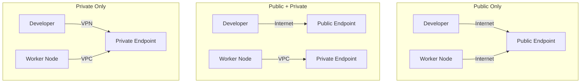

# How to Configure EKS Control Plane Endpoint Access

Author: [nawazdhandala](https://github.com/nawazdhandala)

Tags: AWS, EKS, Kubernetes, Security, Networking

Description: Understand and configure the different EKS API server endpoint access modes - public, private, and mixed - to balance security and accessibility.

---

Every EKS cluster has a Kubernetes API server endpoint that kubectl and other tools use to communicate with the cluster. How you configure access to this endpoint is one of the most important security decisions you'll make. Too open, and you're exposing your cluster's control plane to the internet. Too locked down, and your developers can't get work done.

EKS gives you three endpoint access modes, and understanding when to use each one is crucial for both security and usability.

## The Three Access Modes

EKS supports three combinations of public and private endpoint access:

### 1. Public Only (Default)

The API server is accessible from the internet. All traffic from nodes to the API server goes through the public endpoint.

```
Public Access:  Enabled
Private Access: Disabled
```

This is the default when you create an EKS cluster. It's fine for testing and development, but not recommended for production. Anyone who discovers your API endpoint URL can attempt to authenticate against it.

### 2. Public and Private (Recommended for Most Teams)

The API server is accessible both from the internet and from within the VPC. Node-to-API traffic stays within the VPC through the private endpoint, while developers can access it from anywhere.

```
Public Access:  Enabled (optionally with CIDR restrictions)
Private Access: Enabled
```

This is the sweet spot for most organizations. You get the convenience of external access with the performance benefit of private networking for nodes.

### 3. Private Only

The API server is only accessible from within the VPC. No internet access at all.

```
Public Access:  Disabled
Private Access: Enabled
```

Maximum security, but requires VPN, Direct Connect, or a bastion host to access the cluster. See our [private cluster guide](https://oneuptime.com/blog/post/set-up-private-eks-clusters/view) for the full setup.



## Configuring Endpoint Access

### Using the AWS CLI

Check your current configuration:

```bash
# View current endpoint access settings
aws eks describe-cluster --name my-cluster \
  --query "cluster.resourcesVpcConfig.{PublicAccess:endpointPublicAccess,PrivateAccess:endpointPrivateAccess,PublicCIDRs:publicAccessCidrs}"
```

Enable both public and private access:

```bash
# Enable both public and private access
aws eks update-cluster-config \
  --name my-cluster \
  --resources-vpc-config endpointPublicAccess=true,endpointPrivateAccess=true
```

Switch to private only:

```bash
# Switch to private-only endpoint access
aws eks update-cluster-config \
  --name my-cluster \
  --resources-vpc-config endpointPublicAccess=false,endpointPrivateAccess=true
```

These changes take a few minutes to propagate. Monitor the update:

```bash
# Check update status
aws eks describe-update --name my-cluster --update-id UPDATE_ID
```

### Using eksctl

In your cluster configuration file:

```yaml
# eksctl cluster config with endpoint access
apiVersion: eksctl.io/v1alpha5
kind: ClusterConfig

metadata:
  name: my-cluster
  region: us-west-2

vpc:
  clusterEndpoints:
    publicAccess: true
    privateAccess: true
  publicAccessCIDRs:
    - "203.0.113.0/24"     # Office network
    - "198.51.100.0/24"    # VPN exit IPs
```

Apply the configuration:

```bash
# Update endpoint access with eksctl
eksctl utils update-cluster-endpoints \
  --cluster my-cluster \
  --public-access=true \
  --private-access=true \
  --approve
```

## Restricting Public Access with CIDRs

If you enable public access, restrict it to known IP ranges. This is the most practical security improvement you can make:

```bash
# Restrict public API access to specific CIDRs
aws eks update-cluster-config \
  --name my-cluster \
  --resources-vpc-config publicAccessCidrs="203.0.113.0/24","198.51.100.0/24"
```

Common CIDRs to include:
- Your office network's external IP range
- VPN server exit IPs
- CI/CD runner IP ranges (GitHub Actions, GitLab, etc.)

To find your current public IP:

```bash
# Check your current public IP
curl -s https://checkip.amazonaws.com
```

You can have up to 40 CIDR blocks. If you need more, consider switching to private-only access.

## How Private Endpoint DNS Works

When you enable private access, EKS creates a private hosted zone in Route 53 that's associated with your VPC. This means:

- From inside the VPC, the cluster endpoint DNS name resolves to private IP addresses
- From outside the VPC, it resolves to public IP addresses (if public access is enabled)

This is why node-to-API traffic automatically uses the private path when private access is enabled - DNS resolution handles the routing.

Verify the DNS resolution from a node:

```bash
# From inside the VPC - should return private IPs
nslookup ABCDEF1234.gr7.us-west-2.eks.amazonaws.com

# From outside the VPC - returns public IPs (if public access enabled)
nslookup ABCDEF1234.gr7.us-west-2.eks.amazonaws.com
```

## Impact on Node Communication

The endpoint access configuration affects how worker nodes communicate with the API server:

| Configuration | Node-to-API Path | Impact |
|---|---|---|
| Public only | Through internet/NAT | Higher latency, NAT costs |
| Public + Private | Through VPC (private) | Lower latency, no NAT costs for API traffic |
| Private only | Through VPC (private) | Lowest latency, no NAT needed for API traffic |

Enabling private access reduces NAT gateway costs because node-to-API traffic no longer goes through the NAT. For clusters with many nodes making frequent API calls, this can save meaningful money. See our [cost optimization guide](https://oneuptime.com/blog/post/monitor-eks-costs-and-optimize-spending/view).

## Security Considerations

**Enable private access** even if you keep public access on. This keeps node traffic within the VPC and reduces your exposure.

**Always restrict public CIDRs** if public access is enabled. Leaving it open to 0.0.0.0/0 means anyone can attempt to authenticate against your API server.

**Use VPC Flow Logs** to monitor traffic to the API endpoint:

```bash
# Enable VPC Flow Logs for the cluster VPC
aws ec2 create-flow-logs \
  --resource-type VPC \
  --resource-ids vpc-0abc123 \
  --traffic-type ALL \
  --log-destination-type cloud-watch-logs \
  --log-group-name /vpc/eks-cluster-flow-logs
```

**Audit API access** by enabling the [audit log type in control plane logging](https://oneuptime.com/blog/post/configure-eks-cluster-logging/view).

## Transitioning Between Modes

You can change endpoint access at any time without downtime. However, plan transitions carefully:

**Going from public to private-only**: Make sure you have VPN/Direct Connect access first. If you switch and don't have private network access, you'll lock yourself out of the cluster.

**Adding public access to a private cluster**: This is safe and can be done as a quick fix if private access methods aren't working.

```bash
# Emergency: re-enable public access if locked out
aws eks update-cluster-config \
  --name my-cluster \
  --resources-vpc-config endpointPublicAccess=true,endpointPrivateAccess=true
```

## Recommendations by Environment

- **Development** - Public + Private with CIDR restrictions. Convenient for developers, reasonably secure.
- **Staging** - Public + Private with tight CIDR restrictions. Matches production access patterns.
- **Production** - Private only with VPN/Direct Connect, or Public + Private with very tight CIDRs.

The right endpoint access configuration depends on your organization's security requirements and network setup. Start with public + private with CIDR restrictions - it gives you the best balance of security and usability - and tighten further as your network infrastructure matures.
