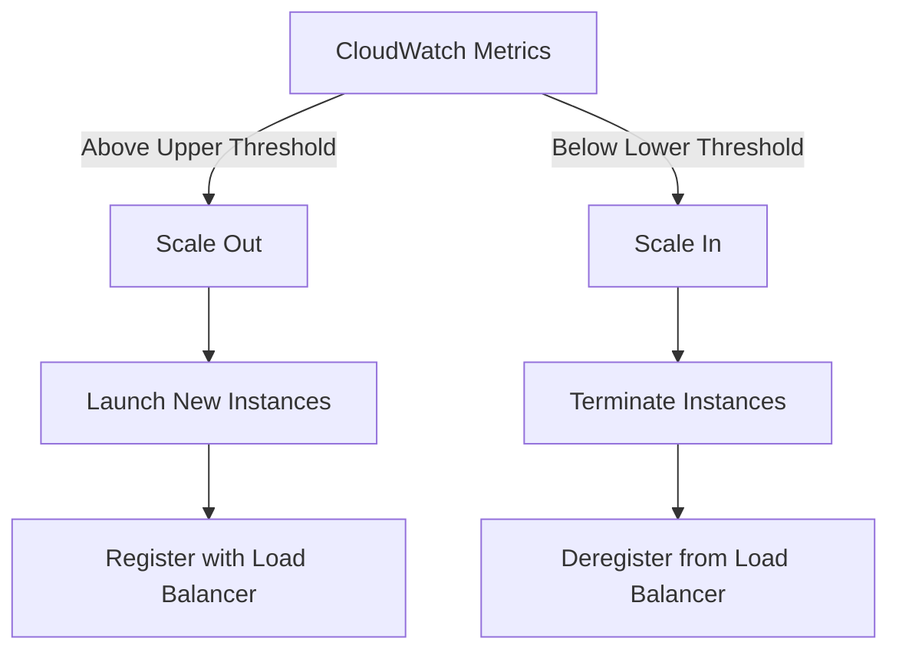

# How to Configure Elastic Beanstalk Auto Scaling

Author: [nawazdhandala](https://github.com/nawazdhandala)

Tags: AWS, Elastic Beanstalk, Auto Scaling, Performance

Description: Comprehensive guide to configuring auto scaling in AWS Elastic Beanstalk, covering scaling triggers, instance types, cooldown periods, and cost optimization strategies.

---

Auto scaling is one of the primary reasons teams choose Elastic Beanstalk over manually managed EC2 instances. Your application scales out during traffic spikes and scales back in when things calm down, all without manual intervention. But the default settings are rarely optimal. Getting auto scaling right means understanding your application's resource patterns and tuning the triggers accordingly.

This guide walks through every aspect of Elastic Beanstalk auto scaling - from basic configuration to advanced strategies that balance performance and cost.

## How Auto Scaling Works in Elastic Beanstalk

Elastic Beanstalk uses Auto Scaling Groups (ASGs) under the hood. The ASG monitors CloudWatch metrics and adjusts the number of EC2 instances based on rules you define. When a metric crosses an upper threshold, instances are added. When it drops below a lower threshold, instances are removed.



## Basic Auto Scaling Configuration

Start with the fundamentals - minimum and maximum instance counts and the scaling trigger.

```yaml
# .ebextensions/autoscaling.config - Basic auto scaling setup
option_settings:
  # Instance count boundaries
  aws:autoscaling:asg:
    MinSize: 2
    MaxSize: 8
    Cooldown: 300

  # Scaling trigger based on CPU utilization
  aws:autoscaling:trigger:
    MeasureName: CPUUtilization
    Statistic: Average
    Unit: Percent
    Period: 5
    BreachDuration: 5
    UpperThreshold: 70
    UpperBreachScaleIncrement: 2
    LowerThreshold: 30
    LowerBreachScaleIncrement: -1
```

Let's break down what each setting does:

- **MinSize/MaxSize**: The bounds for instance count. Set MinSize to at least 2 for high availability.
- **Cooldown**: Seconds to wait after a scaling activity before starting another. Prevents rapid oscillation.
- **Period**: How frequently to evaluate the metric (in minutes).
- **BreachDuration**: How long the metric must exceed the threshold before triggering a scale event (in minutes).
- **UpperThreshold**: The metric value that triggers scale-out.
- **LowerThreshold**: The metric value that triggers scale-in.
- **UpperBreachScaleIncrement**: How many instances to add (positive) or remove (negative) when scaling.

## Choosing the Right Metric

CPU utilization is the default trigger, and it works well for compute-bound applications. But it's not always the best choice.

### Network-Based Scaling

For applications that are I/O bound rather than CPU bound, scale on network traffic.

```yaml
# .ebextensions/network-scaling.config - Scale based on network traffic
option_settings:
  aws:autoscaling:trigger:
    MeasureName: NetworkOut
    Statistic: Average
    Unit: Bytes
    Period: 5
    BreachDuration: 5
    UpperThreshold: 100000000
    UpperBreachScaleIncrement: 1
    LowerThreshold: 20000000
    LowerBreachScaleIncrement: -1
```

### Latency-Based Scaling

For web applications where response time matters most, scale on latency.

```yaml
# .ebextensions/latency-scaling.config - Scale based on response latency
option_settings:
  aws:autoscaling:trigger:
    MeasureName: Latency
    Statistic: Average
    Unit: Seconds
    Period: 5
    BreachDuration: 5
    UpperThreshold: 2
    UpperBreachScaleIncrement: 2
    LowerThreshold: 0.5
    LowerBreachScaleIncrement: -1
```

### Request Count Scaling

If you know your application's capacity per instance, scale on request count.

```yaml
# .ebextensions/request-scaling.config - Scale based on request count
option_settings:
  aws:autoscaling:trigger:
    MeasureName: RequestCount
    Statistic: Sum
    Unit: Count
    Period: 5
    BreachDuration: 5
    UpperThreshold: 5000
    UpperBreachScaleIncrement: 1
    LowerThreshold: 1000
    LowerBreachScaleIncrement: -1
```

## Instance Type Configuration

The instance type you choose directly affects your scaling behavior. Larger instances handle more load per instance, meaning fewer instances but higher per-unit cost.

```yaml
# .ebextensions/instances.config - Instance type and launch configuration
option_settings:
  aws:autoscaling:launchconfiguration:
    InstanceType: t3.medium
    RootVolumeType: gp3
    RootVolumeSize: 20
    RootVolumeIOPS: 3000
    RootVolumeThroughput: 125

  aws:ec2:instances:
    InstanceTypes: t3.medium,t3.large,t3a.medium
    EnableSpot: true
    SpotMaxPrice: 0.05
```

Using multiple instance types with Spot instances can reduce costs significantly. Elastic Beanstalk tries the first type and falls back to alternatives if capacity is unavailable.

## Scheduled Scaling

If you know your traffic patterns (like a business application that peaks during work hours), use scheduled scaling to pre-provision capacity.

```yaml
# .ebextensions/scheduled-scaling.config - Time-based scaling
Resources:
  ScheduledScaleUp:
    Type: AWS::AutoScaling::ScheduledAction
    Properties:
      AutoScalingGroupName:
        Ref: AWSEBAutoScalingGroup
      MinSize: 4
      MaxSize: 10
      DesiredCapacity: 4
      Recurrence: "0 8 * * MON-FRI"

  ScheduledScaleDown:
    Type: AWS::AutoScaling::ScheduledAction
    Properties:
      AutoScalingGroupName:
        Ref: AWSEBAutoScalingGroup
      MinSize: 2
      MaxSize: 4
      DesiredCapacity: 2
      Recurrence: "0 20 * * MON-FRI"
```

This scales up to 4 instances at 8 AM on weekdays and back down to 2 at 8 PM.

## Target Tracking Scaling

Target tracking is simpler than step scaling - you specify a target value for a metric and AWS handles the math.

```yaml
# .ebextensions/target-tracking.config - Target tracking auto scaling
Resources:
  CPUTargetTrackingPolicy:
    Type: AWS::AutoScaling::ScalingPolicy
    Properties:
      AutoScalingGroupName:
        Ref: AWSEBAutoScalingGroup
      PolicyType: TargetTrackingScaling
      TargetTrackingConfiguration:
        PredefinedMetricSpecification:
          PredefinedMetricType: ASGAverageCPUUtilization
        TargetValue: 60.0
        ScaleInCooldown: 300
        ScaleOutCooldown: 60
```

Target tracking automatically adjusts the number of instances to keep CPU utilization around 60%. It's less granular than step scaling but easier to maintain.

## Cooldown Periods

Cooldowns prevent the auto scaler from launching or terminating instances too quickly. Without adequate cooldowns, you get "flapping" - instances launching and terminating in rapid cycles.

```yaml
option_settings:
  aws:autoscaling:asg:
    # Default cooldown after any scaling activity
    Cooldown: 300
```

A 5-minute cooldown (300 seconds) works for most applications. If your instances take a long time to warm up (Java apps, for example), increase it.

For target tracking policies, you can set separate cooldowns for scale-in and scale-out:

- **Scale-out cooldown**: Keep short (60-120 seconds) so you respond quickly to load spikes
- **Scale-in cooldown**: Keep longer (300-600 seconds) to avoid premature termination

## Health Check Grace Period

New instances need time to start up and become healthy. The health check grace period tells the auto scaler not to terminate an instance that appears unhealthy during its startup phase.

```yaml
option_settings:
  aws:autoscaling:asg:
    # Wait 5 minutes before checking health of new instances
    Cooldown: 300
  aws:elasticbeanstalk:environment:
    # Don't mark new instances unhealthy during startup
    ServiceRole: aws-elasticbeanstalk-service-role
```

## Monitoring Auto Scaling

Keep tabs on your scaling behavior to tune it over time.

```bash
# View current auto scaling group details
aws autoscaling describe-auto-scaling-groups \
    --query "AutoScalingGroups[?contains(Tags[?Key=='elasticbeanstalk:environment-name'].Value, 'production')]"

# View recent scaling activities
aws autoscaling describe-scaling-activities \
    --auto-scaling-group-name <asg-name> \
    --max-items 10
```

Watch for these patterns:

- **Frequent scale-out/scale-in cycles**: Increase cooldown periods or widen the threshold gap
- **Slow response to traffic spikes**: Decrease BreachDuration or scale-out cooldown
- **Running at max capacity**: Consider larger instance types or increasing MaxSize
- **Running at minimum during low traffic**: Your LowerThreshold might be too high

## Cost Optimization Tips

Auto scaling saves money only if you configure it thoughtfully.

**Use Spot instances for non-critical workloads.** You can save 60-90% compared to on-demand pricing. Mix on-demand for your minimum capacity with Spot for the scaling headroom.

**Right-size your instances.** Running 4 x t3.small is often more cost-effective than 2 x t3.large because you have finer-grained scaling granularity.

**Set aggressive scale-in policies.** Don't keep instances around that aren't needed. A lower threshold of 20-30% CPU is usually safe.

**Use scheduled scaling for predictable patterns.** Pre-warming is cheaper than reactive scaling because you avoid the latency of cold starts during the spike.

## Wrapping Up

The default auto scaling configuration in Elastic Beanstalk works, but it's generic. Tuning it for your specific workload - choosing the right metric, setting appropriate thresholds, configuring cooldowns, and combining with scheduled scaling - makes the difference between an application that handles traffic gracefully and one that either overspends or falls over during peaks.

Start with CPU-based scaling, monitor the behavior for a week, then adjust. Most applications settle into a stable configuration after a few rounds of tuning.
