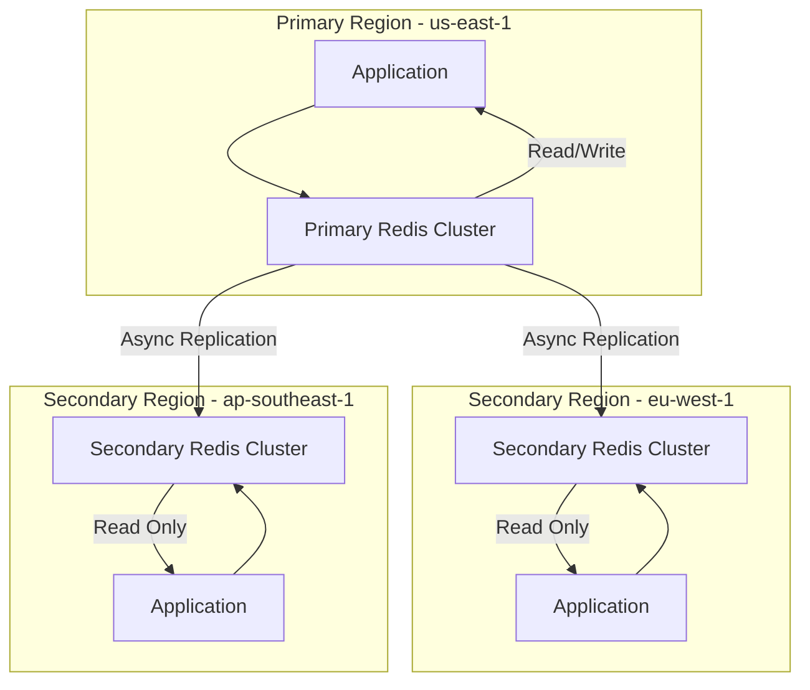

# How to Configure ElastiCache Global Datastore for Multi-Region

Author: [nawazdhandala](https://github.com/nawazdhandala)

Tags: AWS, ElastiCache, Redis, Multi-Region, Caching, Global Datastore

Description: Set up ElastiCache Global Datastore to replicate your Redis cache across multiple AWS Regions for low-latency reads and disaster recovery.

---

When your application serves users across multiple continents, having your cache in a single AWS Region creates a performance bottleneck. Users far from that Region experience higher latency on every cache miss that has to travel across the globe. And if that Region goes down, your cache is gone entirely.

ElastiCache Global Datastore solves both problems. It replicates your Redis data across up to two additional AWS Regions with sub-second replication lag. Users in each Region read from a local cache, and writes are replicated automatically from the primary Region.

## Architecture Overview



The primary cluster in one Region handles all writes. Secondary clusters in other Regions are read-only replicas. Replication is asynchronous, with typical lag under one second.

## Prerequisites

Global Datastore requires:

- ElastiCache for Redis 5.0.6 or later
- Redis cluster mode enabled (required)
- At least one Redis cluster with encryption in transit enabled
- r5 or r6g node types (t-series nodes are not supported)

## Step 1: Create the Primary Cluster

If you already have a Redis cluster that meets the requirements, you can use it as the primary. Otherwise, create one.

```bash
# Create a Redis cluster with cluster mode enabled in the primary Region
aws elasticache create-replication-group \
  --replication-group-id my-global-redis-primary \
  --replication-group-description "Primary cluster for Global Datastore" \
  --engine redis \
  --engine-version 7.1 \
  --cache-node-type cache.r6g.large \
  --num-node-groups 3 \
  --replicas-per-node-group 1 \
  --automatic-failover-enabled \
  --multi-az-enabled \
  --transit-encryption-enabled \
  --at-rest-encryption-enabled \
  --cache-parameter-group-name default.redis7.cluster.on \
  --region us-east-1
```

Wait for the cluster to reach "available" status.

```bash
# Check the status of the primary cluster
aws elasticache describe-replication-groups \
  --replication-group-id my-global-redis-primary \
  --query 'ReplicationGroups[0].Status' \
  --region us-east-1
```

## Step 2: Create the Global Datastore

```bash
# Create a Global Datastore using the primary cluster
aws elasticache create-global-replication-group \
  --global-replication-group-id-suffix my-global-redis \
  --primary-replication-group-id my-global-redis-primary \
  --region us-east-1
```

This creates a Global Datastore with the primary Region. The global replication group ID will be prefixed with a service-generated string.

```bash
# Get the full Global Datastore ID
aws elasticache describe-global-replication-groups \
  --query 'GlobalReplicationGroups[?contains(GlobalReplicationGroupId, `my-global-redis`)].GlobalReplicationGroupId' \
  --region us-east-1
```

## Step 3: Add Secondary Regions

Add a secondary cluster in EU.

```bash
# Create a secondary cluster in eu-west-1
aws elasticache create-replication-group \
  --replication-group-id my-global-redis-eu \
  --replication-group-description "EU secondary for Global Datastore" \
  --global-replication-group-id ldgnf-my-global-redis \
  --cache-node-type cache.r6g.large \
  --num-node-groups 3 \
  --replicas-per-node-group 1 \
  --automatic-failover-enabled \
  --multi-az-enabled \
  --region eu-west-1
```

Add another secondary in Asia Pacific.

```bash
# Create a secondary cluster in ap-southeast-1
aws elasticache create-replication-group \
  --replication-group-id my-global-redis-apac \
  --replication-group-description "APAC secondary for Global Datastore" \
  --global-replication-group-id ldgnf-my-global-redis \
  --cache-node-type cache.r6g.large \
  --num-node-groups 3 \
  --replicas-per-node-group 1 \
  --automatic-failover-enabled \
  --multi-az-enabled \
  --region ap-southeast-1
```

## Step 4: Connect Your Application

Each Region's application connects to its local cluster endpoint.

```python
# Python application connecting to the local Redis cluster
import redis
import os

# Each Region's deployment uses its local cluster endpoint
REDIS_CONFIG = {
    'us-east-1': {
        'host': 'my-global-redis-primary.xxxxx.clustercfg.use1.cache.amazonaws.com',
        'port': 6379,
        'read_only': False  # Primary - reads and writes
    },
    'eu-west-1': {
        'host': 'my-global-redis-eu.xxxxx.clustercfg.euw1.cache.amazonaws.com',
        'port': 6379,
        'read_only': True   # Secondary - reads only
    },
    'ap-southeast-1': {
        'host': 'my-global-redis-apac.xxxxx.clustercfg.apse1.cache.amazonaws.com',
        'port': 6379,
        'read_only': True   # Secondary - reads only
    }
}

region = os.environ.get('AWS_REGION', 'us-east-1')
config = REDIS_CONFIG[region]

# Connect to the local cluster
client = redis.RedisCluster(
    host=config['host'],
    port=config['port'],
    ssl=True,
    decode_responses=True
)

def get_user_session(user_id):
    """Read from local cache - fast regardless of Region."""
    return client.get(f"session:{user_id}")

def set_user_session(user_id, session_data):
    """Write to primary - may have higher latency from non-primary Regions."""
    if config['read_only']:
        # Route writes to the primary Region via your API layer
        raise Exception("Writes must go through the primary Region")
    client.set(f"session:{user_id}", session_data, ex=3600)
```

## Handling Writes from Secondary Regions

Since secondary clusters are read-only, you need a strategy for writes from non-primary Regions.

### Option 1: Route Writes to the Primary Region

Use an API gateway or service mesh to route write operations to the primary Region.

```python
# Route writes through an API that directs them to the primary Region
import requests

PRIMARY_API = "https://api-us-east-1.example.com"

def write_to_cache(key, value, ttl=3600):
    """Send writes to the primary Region's API."""
    response = requests.post(f"{PRIMARY_API}/cache", json={
        'key': key,
        'value': value,
        'ttl': ttl
    })
    return response.status_code == 200
```

### Option 2: Write Locally and Accept Eventual Consistency

For some use cases, you can write to a local data store and let the primary sync later. This works for things like view counters or non-critical metadata.

## Failover to a Secondary Region

If the primary Region becomes unavailable, you can promote a secondary Region.

```bash
# Promote the EU secondary to become the new primary
aws elasticache failover-global-replication-group \
  --global-replication-group-id ldgnf-my-global-redis \
  --primary-region eu-west-1 \
  --primary-replication-group-id my-global-redis-eu \
  --region us-east-1
```

After failover:
- The promoted cluster becomes read/write
- The old primary becomes read-only (when it recovers)
- Other secondaries automatically replicate from the new primary

## Monitoring Global Datastore

### Check Replication Lag

```bash
# Monitor replication lag to secondary Regions
aws cloudwatch get-metric-statistics \
  --namespace AWS/ElastiCache \
  --metric-name GlobalDatastoreReplicationLag \
  --dimensions Name=GlobalReplicationGroupId,Value=ldgnf-my-global-redis \
  --start-time $(date -u -d '1 hour ago' +%Y-%m-%dT%H:%M:%S) \
  --end-time $(date -u +%Y-%m-%dT%H:%M:%S) \
  --period 60 \
  --statistics Average,Maximum \
  --region us-east-1
```

### Set Up Lag Alerts

```bash
# Alert when replication lag exceeds 5 seconds
aws cloudwatch put-metric-alarm \
  --alarm-name global-redis-lag-high \
  --namespace AWS/ElastiCache \
  --metric-name GlobalDatastoreReplicationLag \
  --dimensions Name=GlobalReplicationGroupId,Value=ldgnf-my-global-redis \
  --statistic Maximum \
  --period 60 \
  --threshold 5000 \
  --comparison-operator GreaterThanThreshold \
  --evaluation-periods 3 \
  --alarm-actions arn:aws:sns:us-east-1:123456789012:CacheAlerts \
  --region us-east-1
```

## Cost Considerations

Global Datastore costs include:

- **Node costs** in each Region (same as regular ElastiCache pricing)
- **Cross-Region data transfer** for replication traffic
- **No additional charge** for the Global Datastore feature itself

The biggest cost driver is the cross-Region data transfer. For write-heavy workloads, this can add up. Monitor your replication traffic and consider whether all Regions truly need all the data.

## Best Practices

1. **Put the primary in the Region closest to your write traffic.** Writes always go to the primary, so minimize that latency.

2. **Use cluster mode enabled.** It is required for Global Datastore and gives you horizontal scaling within each Region.

3. **Monitor replication lag continuously.** Lag spikes can indicate network issues or that your secondary clusters need more capacity.

4. **Test failover regularly.** Do not wait for a real outage to discover that your failover process has issues.

5. **Consider data locality requirements.** Some data may not be allowed to cross certain regional boundaries due to compliance requirements.

## Summary

ElastiCache Global Datastore gives you multi-Region Redis with minimal effort. Local reads are fast, replication lag is typically sub-second, and failover to a secondary Region takes minutes. The main consideration is handling writes, since they must go to the primary Region. For read-heavy caching workloads serving a global user base, Global Datastore is one of the simplest ways to improve performance and add disaster recovery capability.

For more on ElastiCache, see our guides on [setting up ElastiCache Serverless](https://oneuptime.com/blog/post/2026-02-12-set-up-elasticache-serverless/view) and [configuring Redis data tiering](https://oneuptime.com/blog/post/2026-02-12-configure-elasticache-redis-data-tiering/view).
