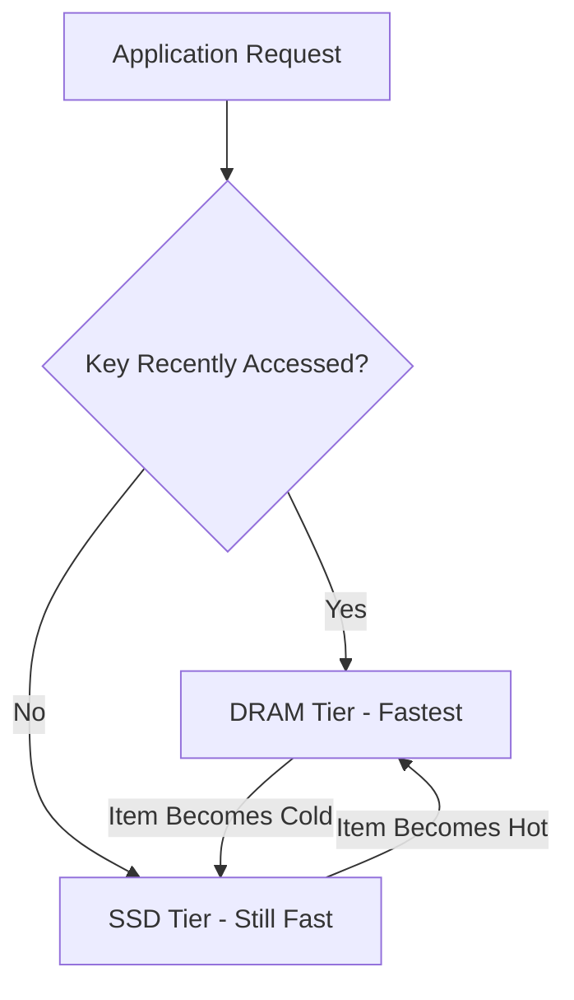

# How to Configure ElastiCache Redis Data Tiering

Author: [nawazdhandala](https://github.com/nawazdhandala)

Tags: AWS, ElastiCache, Redis, Data Tiering, Cost Optimization, Caching

Description: Learn how to use ElastiCache Redis data tiering to store up to 20 times more data per node by automatically moving less-accessed data to SSD storage.

---

Redis is fast because it stores everything in memory. But memory is expensive. If your Redis dataset has grown to hundreds of gigabytes, the cost of r6g instances with enough RAM to hold it all can be staggering. And the reality is that most applications follow the 80/20 rule - 80% of requests hit 20% of the data.

ElastiCache data tiering takes advantage of this pattern. It stores frequently accessed data in memory (DRAM) and automatically moves less-accessed data to local NVMe SSD storage. You get up to 20 times more storage capacity per node at a fraction of the cost of pure in-memory storage.

## How Data Tiering Works

When data tiering is enabled, ElastiCache uses r6gd instance types that have both DRAM and local NVMe SSDs. Redis tracks access patterns and automatically moves items between tiers.



Key characteristics:

- **DRAM tier**: Sub-millisecond latency, stores hot data
- **SSD tier**: Single-digit millisecond latency, stores warm/cold data
- **Automatic**: Redis manages which tier data lives in based on access patterns
- **Transparent**: Your application code does not need to change

The SSD tier is not as fast as DRAM, but it is still orders of magnitude faster than hitting a database. For most cache use cases, the small increase in latency for cold data is imperceptible to end users.

## When to Use Data Tiering

Data tiering makes sense when:

- Your Redis dataset exceeds 100 GB
- A significant portion of your data is accessed infrequently
- You want to reduce costs without splitting your cache across multiple clusters
- Your application can tolerate single-digit millisecond latency for cold data

It does not make sense when:

- All your data is accessed uniformly (no hot/cold pattern)
- Sub-millisecond latency is required for every single key
- Your dataset is small enough to fit in DRAM affordably

## Cost Savings Example

Let's compare the cost of storing 500 GB of cache data with and without data tiering.

Without data tiering (r6g.4xlarge, 105 GB DRAM):
- You need 5 nodes to hold 500 GB (with some headroom)
- 5 x r6g.4xlarge = approximately $4,900/month

With data tiering (r6gd.4xlarge, 105 GB DRAM + 1 TB SSD):
- You need 1 node to hold 500 GB (100 GB hot in DRAM, 400 GB cold on SSD)
- 1 x r6gd.4xlarge = approximately $1,400/month

**Savings: approximately $3,500/month (71%)**

The actual savings depend on your data distribution and access patterns, but the potential is significant.

## Setting Up Data Tiering

### Step 1: Create a Parameter Group

Data tiering uses r6gd node types. Create a cluster with the appropriate settings.

```bash
# Create a parameter group optimized for data tiering
aws elasticache create-cache-parameter-group \
  --cache-parameter-group-name redis-data-tiering \
  --cache-parameter-group-family redis7 \
  --description "Parameter group for Redis with data tiering"
```

Tune the maxmemory policy. The `allkeys-lru` policy works well with data tiering because it ensures the hottest data stays in DRAM.

```bash
# Set eviction policy to work well with data tiering
aws elasticache modify-cache-parameter-group \
  --cache-parameter-group-name redis-data-tiering \
  --parameter-name-values \
    "ParameterName=maxmemory-policy,ParameterValue=allkeys-lru"
```

### Step 2: Create the Cluster with Data Tiering

```bash
# Create a Redis cluster with data tiering enabled using r6gd nodes
aws elasticache create-replication-group \
  --replication-group-id my-tiered-cache \
  --replication-group-description "Redis with data tiering" \
  --engine redis \
  --engine-version 7.1 \
  --cache-node-type cache.r6gd.xlarge \
  --data-tiering-enabled \
  --num-node-groups 2 \
  --replicas-per-node-group 1 \
  --automatic-failover-enabled \
  --multi-az-enabled \
  --transit-encryption-enabled \
  --cache-parameter-group-name redis-data-tiering \
  --cache-subnet-group-name my-subnet-group \
  --security-group-ids sg-0abc123
```

The `--data-tiering-enabled` flag activates data tiering. This only works with r6gd node types.

### Step 3: Verify Data Tiering is Active

```bash
# Verify the cluster has data tiering enabled
aws elasticache describe-replication-groups \
  --replication-group-id my-tiered-cache \
  --query 'ReplicationGroups[0].{ID:ReplicationGroupId,DataTiering:DataTiering,NodeType:CacheNodeType}'
```

## Monitoring Data Tiering

### DRAM vs SSD Utilization

Track how much data is in each tier to understand your access patterns.

```bash
# Monitor memory usage (DRAM tier)
aws cloudwatch get-metric-statistics \
  --namespace AWS/ElastiCache \
  --metric-name DatabaseMemoryUsagePercentage \
  --dimensions Name=ReplicationGroupId,Value=my-tiered-cache \
  --start-time $(date -u -d '24 hours ago' +%Y-%m-%dT%H:%M:%S) \
  --end-time $(date -u +%Y-%m-%dT%H:%M:%S) \
  --period 3600 \
  --statistics Average
```

```bash
# Monitor SSD utilization
aws cloudwatch get-metric-statistics \
  --namespace AWS/ElastiCache \
  --metric-name DataTieringDiskUsagePercentage \
  --dimensions Name=ReplicationGroupId,Value=my-tiered-cache \
  --start-time $(date -u -d '24 hours ago' +%Y-%m-%dT%H:%M:%S) \
  --end-time $(date -u +%Y-%m-%dT%H:%M:%S) \
  --period 3600 \
  --statistics Average,Maximum
```

### Latency Impact

Monitor p99 latency to see if SSD reads are affecting your application.

```bash
# Check command latency to detect SSD read impact
aws cloudwatch get-metric-statistics \
  --namespace AWS/ElastiCache \
  --metric-name GetTypeCmdsLatency \
  --dimensions Name=ReplicationGroupId,Value=my-tiered-cache \
  --start-time $(date -u -d '1 hour ago' +%Y-%m-%dT%H:%M:%S) \
  --end-time $(date -u +%Y-%m-%dT%H:%M:%S) \
  --period 60 \
  --statistics p99
```

### Set Up Alerts

```bash
# Alert when SSD storage is getting full
aws cloudwatch put-metric-alarm \
  --alarm-name tiered-cache-ssd-full \
  --namespace AWS/ElastiCache \
  --metric-name DataTieringDiskUsagePercentage \
  --dimensions Name=ReplicationGroupId,Value=my-tiered-cache \
  --statistic Maximum \
  --period 300 \
  --threshold 80 \
  --comparison-operator GreaterThanThreshold \
  --evaluation-periods 3 \
  --alarm-actions arn:aws:sns:us-east-1:123456789012:CacheAlerts

# Alert when latency spikes (might indicate too much cold data access)
aws cloudwatch put-metric-alarm \
  --alarm-name tiered-cache-latency-high \
  --namespace AWS/ElastiCache \
  --metric-name GetTypeCmdsLatency \
  --dimensions Name=ReplicationGroupId,Value=my-tiered-cache \
  --extended-statistic p99 \
  --period 60 \
  --threshold 5 \
  --comparison-operator GreaterThanThreshold \
  --evaluation-periods 5 \
  --alarm-actions arn:aws:sns:us-east-1:123456789012:CacheAlerts
```

## Application Patterns That Work Well with Data Tiering

### Session Storage

User sessions are perfect for data tiering. Active sessions are hot and live in DRAM. Sessions from users who have not visited recently move to SSD and are still accessible if they return.

```python
# Session storage pattern - hot sessions in DRAM, cold sessions on SSD
import redis
import json

r = redis.Redis(host='my-tiered-cache.xxx.cache.amazonaws.com', port=6379, ssl=True)

def get_session(session_id):
    """Hot sessions served from DRAM, cold sessions from SSD."""
    data = r.get(f"session:{session_id}")
    if data:
        # Touch the key to keep it hot
        r.expire(f"session:{session_id}", 86400)
        return json.loads(data)
    return None

def set_session(session_id, session_data):
    """New sessions start in DRAM, migrate to SSD if unused."""
    r.setex(f"session:{session_id}", 86400, json.dumps(session_data))
```

### Product Catalog

Popular products stay in DRAM for fast access. Long-tail products move to SSD but are still cached.

```python
# Product catalog with natural hot/cold access patterns
def get_product(product_id):
    """Popular products in DRAM, long-tail products on SSD."""
    cached = r.get(f"product:{product_id}")
    if cached:
        return json.loads(cached)

    # Cache miss - fetch from database
    product = database.get_product(product_id)
    if product:
        r.setex(f"product:{product_id}", 3600, json.dumps(product))
    return product
```

## Limitations and Considerations

- Data tiering is only available with r6gd node types
- Minimum node type is cache.r6gd.xlarge
- Not available with ElastiCache Serverless (as of early 2026)
- The SSD tier adds a few milliseconds of latency for cold reads
- Cluster mode must be enabled
- Cannot convert an existing non-tiered cluster to tiered (must create new)

## Migration from Non-Tiered to Tiered

Since you cannot enable data tiering on an existing cluster, migrate using a snapshot.

```bash
# Snapshot your existing cluster
aws elasticache create-snapshot \
  --replication-group-id my-existing-cache \
  --snapshot-name pre-tiering-migration

# Create a new tiered cluster from the snapshot
aws elasticache create-replication-group \
  --replication-group-id my-tiered-cache \
  --replication-group-description "Migrated to data tiering" \
  --engine redis \
  --engine-version 7.1 \
  --cache-node-type cache.r6gd.xlarge \
  --data-tiering-enabled \
  --snapshot-name pre-tiering-migration \
  --num-node-groups 2 \
  --replicas-per-node-group 1 \
  --automatic-failover-enabled
```

## Summary

ElastiCache Redis data tiering is a straightforward way to cut your Redis costs when your dataset has grown large but not all data is accessed equally. By automatically moving cold data to SSD storage, you can store up to 20 times more data per node at a fraction of the cost. The key is understanding your access patterns - if you have a clear hot/cold split, the savings can be dramatic.

For more on ElastiCache, see our guides on [ElastiCache Serverless](https://oneuptime.com/blog/post/2026-02-12-set-up-elasticache-serverless/view) and [Global Datastore for multi-Region caching](https://oneuptime.com/blog/post/2026-02-12-configure-elasticache-global-datastore-for-multi-region/view).
