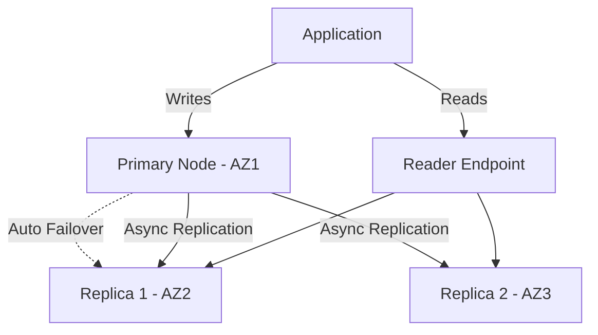

# How to Configure ElastiCache Redis Replication

Author: [nawazdhandala](https://github.com/nawazdhandala)

Tags: AWS, ElastiCache, Redis, Replication, High Availability

Description: Learn how to configure ElastiCache Redis replication with read replicas and Multi-AZ for high availability, including cluster mode disabled and enabled configurations.

---

A single Redis node is a single point of failure. If it goes down, your cache is gone and your application takes the hit. ElastiCache Redis replication solves this by maintaining copies of your data across multiple nodes and multiple Availability Zones.

Let's look at how to set up replication for both cluster mode disabled and cluster mode enabled configurations.

## Replication Architecture

ElastiCache Redis uses asynchronous replication. The primary node handles all writes and replicates changes to up to 5 read replicas. If the primary fails, ElastiCache automatically promotes a replica to become the new primary (when Multi-AZ is enabled).



## Cluster Mode Disabled - Replication Group

In cluster mode disabled, all your data lives in a single shard with one primary and up to 5 replicas. This is the simpler setup and works for most use cases.

### Creating a Replication Group via CLI

```bash
# Create a Redis replication group with 2 replicas
aws elasticache create-replication-group \
  --replication-group-id my-redis-repl \
  --replication-group-description "Production Redis with replication" \
  --engine redis \
  --engine-version 7.0 \
  --cache-node-type cache.r6g.large \
  --num-cache-clusters 3 \
  --automatic-failover-enabled \
  --multi-az-enabled \
  --cache-subnet-group-name my-cache-subnet-group \
  --security-group-ids sg-cache123 \
  --at-rest-encryption-enabled \
  --transit-encryption-enabled \
  --preferred-cache-cluster-a-zs us-east-1a us-east-1b us-east-1c
```

Key parameters:
- **num-cache-clusters**: Total nodes (1 primary + N replicas). So 3 means 1 primary and 2 replicas.
- **automatic-failover-enabled**: Automatically promote a replica if primary fails
- **multi-az-enabled**: Spread nodes across AZs for availability

Wait for the replication group to be available:

```bash
# Check replication group status
aws elasticache describe-replication-groups \
  --replication-group-id my-redis-repl \
  --query 'ReplicationGroups[0].{
    Status:Status,
    PrimaryEndpoint:NodeGroups[0].PrimaryEndpoint,
    ReaderEndpoint:NodeGroups[0].ReaderEndpoint,
    Nodes:NodeGroups[0].NodeGroupMembers[*].{
      Id:CacheClusterId,
      Role:CurrentRole,
      AZ:PreferredAvailabilityZone
    }
  }'
```

### Terraform Configuration

```hcl
# Redis replication group with automatic failover
resource "aws_elasticache_replication_group" "redis" {
  replication_group_id = "my-redis-repl"
  description          = "Production Redis with replication"

  engine               = "redis"
  engine_version       = "7.0"
  node_type            = "cache.r6g.large"
  num_cache_clusters   = 3  # 1 primary + 2 replicas

  automatic_failover_enabled = true
  multi_az_enabled           = true

  subnet_group_name    = aws_elasticache_subnet_group.main.name
  security_group_ids   = [aws_security_group.redis.id]

  at_rest_encryption_enabled = true
  transit_encryption_enabled = true

  # Maintenance and backup windows
  maintenance_window       = "sun:05:00-sun:06:00"
  snapshot_window          = "03:00-04:00"
  snapshot_retention_limit = 7

  parameter_group_name = aws_elasticache_parameter_group.redis.name

  tags = {
    Environment = "production"
  }
}

resource "aws_elasticache_parameter_group" "redis" {
  name   = "my-redis-params"
  family = "redis7"

  parameter {
    name  = "maxmemory-policy"
    value = "allkeys-lru"
  }
}
```

## Cluster Mode Enabled - Multiple Shards

When your data is too large for a single node or you need more write throughput, cluster mode enabled distributes data across multiple shards. Each shard has its own primary and replicas.

### Creating a Cluster Mode Enabled Replication Group

```bash
# Create a Redis cluster with 3 shards, each with 1 replica
aws elasticache create-replication-group \
  --replication-group-id my-redis-cluster \
  --replication-group-description "Clustered Redis" \
  --engine redis \
  --engine-version 7.0 \
  --cache-node-type cache.r6g.large \
  --num-node-groups 3 \
  --replicas-per-node-group 1 \
  --automatic-failover-enabled \
  --multi-az-enabled \
  --cache-subnet-group-name my-cache-subnet-group \
  --security-group-ids sg-cache123 \
  --at-rest-encryption-enabled \
  --transit-encryption-enabled
```

This creates 3 shards with 2 nodes each (1 primary + 1 replica per shard) for a total of 6 nodes.

### Terraform for Cluster Mode Enabled

```hcl
# Redis cluster mode enabled
resource "aws_elasticache_replication_group" "redis_cluster" {
  replication_group_id = "my-redis-cluster"
  description          = "Clustered Redis with sharding"

  engine         = "redis"
  engine_version = "7.0"
  node_type      = "cache.r6g.large"

  # Cluster mode configuration
  num_node_groups         = 3  # Number of shards
  replicas_per_node_group = 1  # Replicas per shard

  automatic_failover_enabled = true
  multi_az_enabled           = true

  subnet_group_name    = aws_elasticache_subnet_group.main.name
  security_group_ids   = [aws_security_group.redis.id]

  at_rest_encryption_enabled = true
  transit_encryption_enabled = true

  parameter_group_name = aws_elasticache_parameter_group.redis_cluster.name
}

resource "aws_elasticache_parameter_group" "redis_cluster" {
  name   = "my-redis-cluster-params"
  family = "redis7"

  parameter {
    name  = "cluster-enabled"
    value = "yes"
  }
}
```

## Adding Replicas to an Existing Group

You can add replicas to a running replication group without downtime:

```bash
# Add a replica to an existing replication group (cluster mode disabled)
aws elasticache increase-replica-count \
  --replication-group-id my-redis-repl \
  --new-replica-count 3 \
  --apply-immediately
```

For cluster mode enabled, you can add replicas to specific shards:

```bash
# Add a replica to each shard in a cluster mode enabled group
aws elasticache increase-replica-count \
  --replication-group-id my-redis-cluster \
  --new-replica-count 2 \
  --apply-immediately
```

## Testing Failover

Always test failover before you need it in production:

```bash
# Trigger a manual failover to test
aws elasticache test-failover \
  --replication-group-id my-redis-repl \
  --node-group-id 0001
```

Monitor the failover:

```bash
# Watch for failover events
aws elasticache describe-events \
  --source-type replication-group \
  --source-identifier my-redis-repl \
  --duration 30
```

Failover typically completes within 15-30 seconds. During that time, writes will fail. Your application should have retry logic to handle this. See the guide on [connecting to ElastiCache Redis from an application](https://oneuptime.com/blog/post/connect-to-elasticache-redis-from-an-application/view) for retry patterns.

## Monitoring Replication

Keep an eye on replication health:

```bash
# Check replication lag across all replicas
aws cloudwatch get-metric-statistics \
  --namespace AWS/ElastiCache \
  --metric-name ReplicationLag \
  --dimensions Name=CacheClusterId,Value=my-redis-repl-002 \
  --start-time $(date -u -d '1 hour ago' +%Y-%m-%dT%H:%M:%S) \
  --end-time $(date -u +%Y-%m-%dT%H:%M:%S) \
  --period 60 \
  --statistics Average Maximum
```

Create an alarm for replication lag:

```bash
# Alert when replication lag exceeds 1 second
aws cloudwatch put-metric-alarm \
  --alarm-name redis-replication-lag \
  --metric-name ReplicationLag \
  --namespace AWS/ElastiCache \
  --statistic Maximum \
  --period 60 \
  --threshold 1 \
  --comparison-operator GreaterThanThreshold \
  --dimensions Name=CacheClusterId,Value=my-redis-repl-002 \
  --evaluation-periods 3 \
  --alarm-actions arn:aws:sns:us-east-1:123456789012:redis-alerts
```

## Best Practices

**Always enable Multi-AZ with automatic failover.** Running without it means manual intervention during failures.

**Match replica instance types to primary.** If a smaller replica gets promoted, you'll have degraded performance.

**Use reader endpoints for reads.** The reader endpoint load-balances across replicas, spreading read traffic. Don't point everything at the primary.

**Set appropriate maxmemory-policy.** `allkeys-lru` is a safe default that evicts the least recently used keys when memory is full.

**Plan for maintenance.** During maintenance, replicas are updated one at a time. With Multi-AZ, failover happens automatically if the primary needs maintenance.

## Wrapping Up

ElastiCache Redis replication gives you both high availability (automatic failover) and read scalability (replica reader endpoints). For most production workloads, start with cluster mode disabled and 2 replicas across 3 AZs. Only move to cluster mode enabled when you need more than one node's worth of memory or write throughput.

For securing your replication setup, check out the guide on [enabling ElastiCache Redis encryption](https://oneuptime.com/blog/post/enable-elasticache-redis-encryption/view), and for backup strategies, see the guide on [setting up ElastiCache Redis backups](https://oneuptime.com/blog/post/set-up-elasticache-redis-backups/view).
