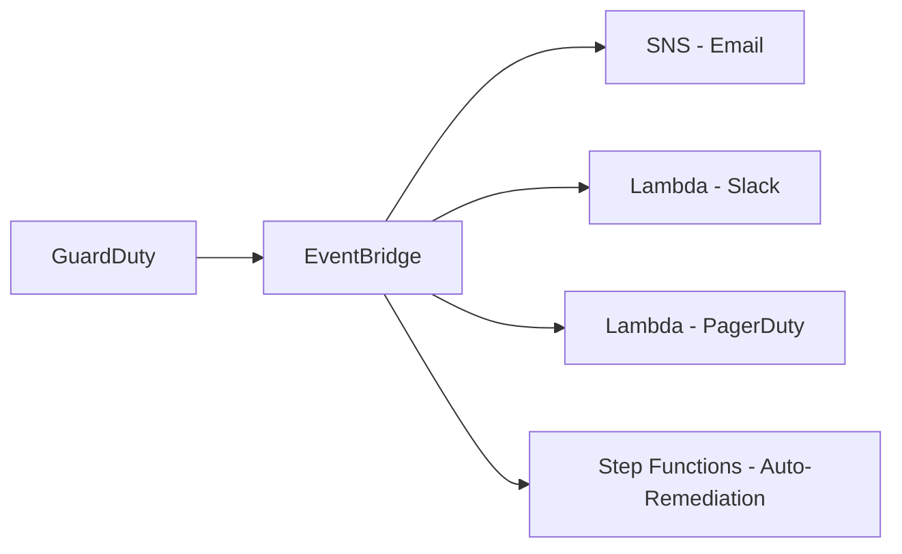

# How to Configure GuardDuty Findings Notifications

Author: [nawazdhandala](https://github.com/nawazdhandala)

Tags: AWS, GuardDuty, Notifications, Security, EventBridge

Description: Learn how to set up automated notifications for Amazon GuardDuty findings using EventBridge, SNS, Lambda, and chat integrations like Slack.

---

GuardDuty is detecting threats in your AWS environment, but those findings are useless if nobody sees them. The GuardDuty console is fine for browsing, but you need proactive notifications that reach your security team the moment something is found. Nobody's refreshing the GuardDuty console at 3 AM waiting for a finding to appear.

The notification pipeline is straightforward: GuardDuty publishes findings to EventBridge, and from there you route them to SNS, Lambda, Slack, PagerDuty, or whatever your team uses. Let me show you how to set up each approach.

## The Notification Architecture



EventBridge is the hub. Every GuardDuty finding automatically goes to EventBridge, and you create rules to route findings based on severity, type, or other criteria.

## Basic Email Notifications with SNS

The simplest setup sends all findings to an email address via SNS.

First, create an SNS topic and subscribe your team.

```bash
# Create the SNS topic
aws sns create-topic --name guardduty-findings

# Subscribe email addresses
aws sns subscribe \
  --topic-arn arn:aws:sns:us-east-1:111111111111:guardduty-findings \
  --protocol email \
  --notification-endpoint security@example.com

# Subscribe a second address for redundancy
aws sns subscribe \
  --topic-arn arn:aws:sns:us-east-1:111111111111:guardduty-findings \
  --protocol email \
  --notification-endpoint oncall@example.com
```

Now create the EventBridge rule to route findings to SNS.

```bash
# Route all GuardDuty findings to SNS
aws events put-rule \
  --name guardduty-all-findings \
  --event-pattern '{
    "source": ["aws.guardduty"],
    "detail-type": ["GuardDuty Finding"]
  }' \
  --description "Send all GuardDuty findings to SNS"

# Add the SNS topic as a target
aws events put-targets \
  --rule guardduty-all-findings \
  --targets "Id"="1","Arn"="arn:aws:sns:us-east-1:111111111111:guardduty-findings"
```

## Severity-Based Routing

You probably don't want an email for every low-severity finding. Set up different notification channels based on severity.

```bash
# High severity (7+) - goes to PagerDuty/immediate alerting
aws events put-rule \
  --name guardduty-high-severity \
  --event-pattern '{
    "source": ["aws.guardduty"],
    "detail-type": ["GuardDuty Finding"],
    "detail": {
      "severity": [{"numeric": [">=", 7]}]
    }
  }'

# Medium severity (4-6.9) - goes to Slack
aws events put-rule \
  --name guardduty-medium-severity \
  --event-pattern '{
    "source": ["aws.guardduty"],
    "detail-type": ["GuardDuty Finding"],
    "detail": {
      "severity": [
        {"numeric": [">=", 4]},
        {"numeric": ["<", 7]}
      ]
    }
  }'

# Low severity (0-3.9) - goes to a log or daily digest
aws events put-rule \
  --name guardduty-low-severity \
  --event-pattern '{
    "source": ["aws.guardduty"],
    "detail-type": ["GuardDuty Finding"],
    "detail": {
      "severity": [{"numeric": ["<", 4]}]
    }
  }'
```

## Slack Notifications

Slack is where most teams actually notice alerts. Here's a Lambda function that formats GuardDuty findings into a clean Slack message.

```python
import json
import os
import urllib.request

SLACK_WEBHOOK_URL = os.environ['SLACK_WEBHOOK_URL']

def get_severity_color(severity):
    """Return a color based on finding severity."""
    if severity >= 7:
        return '#FF0000'  # Red
    elif severity >= 4:
        return '#FFA500'  # Orange
    else:
        return '#FFFF00'  # Yellow

def get_severity_label(severity):
    if severity >= 7:
        return 'HIGH'
    elif severity >= 4:
        return 'MEDIUM'
    return 'LOW'

def handler(event, context):
    finding = event['detail']

    severity = finding['severity']
    finding_type = finding['type']
    title = finding['title']
    description = finding['description']
    account_id = finding['accountId']
    region = finding['region']

    # Get resource info
    resource = finding.get('resource', {})
    resource_type = resource.get('resourceType', 'Unknown')

    # Build resource details string
    resource_details = f"Type: {resource_type}"
    if resource_type == 'Instance':
        instance = resource.get('instanceDetails', {})
        resource_details += f"\nInstance: {instance.get('instanceId', 'N/A')}"
        resource_details += f"\nInstance Type: {instance.get('instanceType', 'N/A')}"
    elif resource_type == 'AccessKey':
        access_key = resource.get('accessKeyDetails', {})
        resource_details += f"\nUser: {access_key.get('userName', 'N/A')}"
        resource_details += f"\nPrincipal: {access_key.get('principalId', 'N/A')}"

    # Build the Slack message
    slack_message = {
        'attachments': [{
            'color': get_severity_color(severity),
            'title': f':shield: GuardDuty Finding - {get_severity_label(severity)}',
            'fields': [
                {'title': 'Finding Type', 'value': finding_type, 'short': False},
                {'title': 'Title', 'value': title, 'short': False},
                {'title': 'Severity', 'value': str(severity), 'short': True},
                {'title': 'Account', 'value': account_id, 'short': True},
                {'title': 'Region', 'value': region, 'short': True},
                {'title': 'Resource', 'value': resource_details, 'short': False},
                {'title': 'Description', 'value': description[:500], 'short': False},
            ],
            'footer': 'Amazon GuardDuty',
            'ts': int(event['time'].replace('T', ' ').replace('Z', '').split('.')[0].replace('-', '').replace(' ', '').replace(':', ''))
        }]
    }

    # Post to Slack
    data = json.dumps(slack_message).encode('utf-8')
    req = urllib.request.Request(
        SLACK_WEBHOOK_URL,
        data=data,
        headers={'Content-Type': 'application/json'}
    )
    urllib.request.urlopen(req)

    return {'statusCode': 200}
```

Deploy this Lambda and set the Slack webhook URL as an environment variable.

```bash
# Create the Lambda function
aws lambda create-function \
  --function-name guardduty-slack-notifier \
  --runtime python3.12 \
  --handler lambda_function.handler \
  --role arn:aws:iam::111111111111:role/GuardDutyNotifierRole \
  --zip-file fileb://function.zip \
  --environment "Variables={SLACK_WEBHOOK_URL=https://hooks.slack.com/services/YOUR/WEBHOOK/URL}" \
  --timeout 30

# Allow EventBridge to invoke it
aws lambda add-permission \
  --function-name guardduty-slack-notifier \
  --statement-id AllowEventBridge \
  --action lambda:InvokeFunction \
  --principal events.amazonaws.com \
  --source-arn arn:aws:events:us-east-1:111111111111:rule/guardduty-medium-severity

# Add it as the target for medium-severity findings
aws events put-targets \
  --rule guardduty-medium-severity \
  --targets "Id"="1","Arn"="arn:aws:lambda:us-east-1:111111111111:function:guardduty-slack-notifier"
```

## Finding-Type Specific Notifications

You can also route based on finding type. For example, alert differently on cryptocurrency mining vs. port scanning.

```bash
# Crypto mining findings - immediate pager
aws events put-rule \
  --name guardduty-crypto-mining \
  --event-pattern '{
    "source": ["aws.guardduty"],
    "detail-type": ["GuardDuty Finding"],
    "detail": {
      "type": [
        {"prefix": "CryptoCurrency:"}
      ]
    }
  }'

# Unauthorized access findings
aws events put-rule \
  --name guardduty-unauthorized-access \
  --event-pattern '{
    "source": ["aws.guardduty"],
    "detail-type": ["GuardDuty Finding"],
    "detail": {
      "type": [
        {"prefix": "UnauthorizedAccess:"}
      ]
    }
  }'

# Reconnaissance findings
aws events put-rule \
  --name guardduty-recon \
  --event-pattern '{
    "source": ["aws.guardduty"],
    "detail-type": ["GuardDuty Finding"],
    "detail": {
      "type": [
        {"prefix": "Recon:"}
      ]
    }
  }'
```

## Terraform Setup

Here's the complete Terraform configuration for severity-based routing.

```hcl
# SNS Topic for high-severity findings
resource "aws_sns_topic" "guardduty_critical" {
  name = "guardduty-critical-findings"
}

resource "aws_sns_topic_subscription" "email" {
  topic_arn = aws_sns_topic.guardduty_critical.arn
  protocol  = "email"
  endpoint  = "security@example.com"
}

# EventBridge rule for high severity
resource "aws_cloudwatch_event_rule" "guardduty_high" {
  name        = "guardduty-high-severity"
  description = "Capture high severity GuardDuty findings"

  event_pattern = jsonencode({
    source      = ["aws.guardduty"]
    detail-type = ["GuardDuty Finding"]
    detail = {
      severity = [{ numeric = [">=", 7] }]
    }
  })
}

resource "aws_cloudwatch_event_target" "sns" {
  rule      = aws_cloudwatch_event_rule.guardduty_high.name
  target_id = "SendToSNS"
  arn       = aws_sns_topic.guardduty_critical.arn
}

# SNS topic policy to allow EventBridge
resource "aws_sns_topic_policy" "default" {
  arn = aws_sns_topic.guardduty_critical.arn

  policy = jsonencode({
    Version = "2012-10-17"
    Statement = [{
      Effect    = "Allow"
      Principal = { Service = "events.amazonaws.com" }
      Action    = "sns:Publish"
      Resource  = aws_sns_topic.guardduty_critical.arn
    }]
  })
}

# EventBridge rule for medium severity to Slack Lambda
resource "aws_cloudwatch_event_rule" "guardduty_medium" {
  name        = "guardduty-medium-severity"
  description = "Capture medium severity GuardDuty findings"

  event_pattern = jsonencode({
    source      = ["aws.guardduty"]
    detail-type = ["GuardDuty Finding"]
    detail = {
      severity = [
        { numeric = [">=", 4] },
        { numeric = ["<", 7] }
      ]
    }
  })
}

resource "aws_cloudwatch_event_target" "lambda" {
  rule      = aws_cloudwatch_event_rule.guardduty_medium.name
  target_id = "SendToSlack"
  arn       = aws_lambda_function.slack_notifier.arn
}
```

## Multi-Region Considerations

GuardDuty findings are regional. If you've got GuardDuty enabled in multiple regions (which you should), you need EventBridge rules in each region, or you can forward events to a central region.

```bash
# In each non-primary region, forward GuardDuty events to the primary region
aws events put-rule \
  --name forward-guardduty-to-primary \
  --event-pattern '{
    "source": ["aws.guardduty"],
    "detail-type": ["GuardDuty Finding"]
  }' \
  --region us-west-2

aws events put-targets \
  --rule forward-guardduty-to-primary \
  --targets "Id"="1","Arn"="arn:aws:events:us-east-1:111111111111:event-bus/default" \
  --region us-west-2
```

This requires a cross-region EventBridge setup, which needs the appropriate permissions on the target event bus.

## Testing Your Notifications

GuardDuty provides sample findings so you can test your notification pipeline.

```bash
DETECTOR_ID=$(aws guardduty list-detectors --query 'DetectorIds[0]' --output text)

# Generate sample findings
aws guardduty create-sample-findings \
  --detector-id $DETECTOR_ID \
  --finding-types '["UnauthorizedAccess:EC2/MaliciousIPCaller.Custom", "CryptoCurrency:EC2/BitcoinTool.B!DNS"]'
```

This creates sample findings that flow through your entire notification pipeline, letting you verify that emails arrive, Slack messages look right, and PagerDuty incidents get created.

For more on managing GuardDuty at scale, see [suppressing false positives](https://oneuptime.com/blog/post/2026-02-12-suppress-guardduty-false-positives/view) and [setting up GuardDuty across multiple accounts](https://oneuptime.com/blog/post/2026-02-12-guardduty-multiple-aws-accounts/view).
