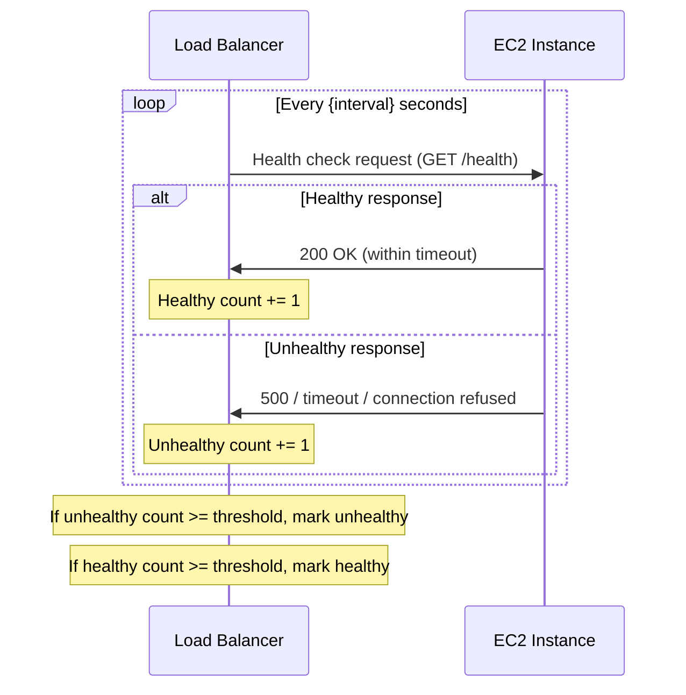

# How to Configure Health Checks for EC2 Behind a Load Balancer

Author: [nawazdhandala](https://github.com/nawazdhandala)

Tags: AWS, EC2, Load Balancing, Health Checks, Monitoring, ALB

Description: Learn how to configure and optimize health checks for EC2 instances behind AWS load balancers to ensure reliable traffic routing and quick failure detection.

---

Health checks are the load balancer's way of knowing which EC2 instances are ready to receive traffic. Get them right, and unhealthy instances are removed from rotation within seconds. Get them wrong, and you'll either route traffic to broken instances or pull healthy instances out of rotation due to false positives.

Let's cover how to configure health checks properly for both ALB and NLB, including the common pitfalls.

## How Health Checks Work

The load balancer periodically sends a request to each registered target. If the target responds correctly within the timeout, it's "healthy." If it fails a configured number of consecutive checks, it's marked "unhealthy" and removed from rotation.



## Health Check Parameters

Every health check has these configurable parameters:

| Parameter | Description | ALB Default | NLB Default |
|-----------|-------------|-------------|-------------|
| Protocol | HTTP, HTTPS, or TCP | HTTP | TCP |
| Port | Port to check | traffic-port | traffic-port |
| Path | URL path (HTTP/HTTPS only) | / | N/A |
| Interval | Seconds between checks | 30 | 30 |
| Timeout | Seconds to wait for response | 5 | 10 |
| Healthy threshold | Consecutive successes to mark healthy | 5 | 5 |
| Unhealthy threshold | Consecutive failures to mark unhealthy | 2 | 2 |
| Matcher | HTTP status codes for success | 200 | N/A |

## Configuring ALB Health Checks

ALB health checks are HTTP-based and the most configurable.

This creates a target group with optimized health check settings:

```bash
# Create target group with tuned health checks
aws elbv2 create-target-group \
  --name web-targets \
  --protocol HTTP \
  --port 80 \
  --vpc-id vpc-0123456789abcdef0 \
  --health-check-protocol HTTP \
  --health-check-path /health \
  --health-check-interval-seconds 15 \
  --health-check-timeout-seconds 5 \
  --healthy-threshold-count 2 \
  --unhealthy-threshold-count 3 \
  --matcher HttpCode=200
```

To modify health checks on an existing target group:

```bash
# Update health check settings
aws elbv2 modify-target-group \
  --target-group-arn arn:aws:elasticloadbalancing:us-east-1:123456789012:targetgroup/web-targets/1234567890 \
  --health-check-path /health \
  --health-check-interval-seconds 10 \
  --health-check-timeout-seconds 3 \
  --healthy-threshold-count 2 \
  --unhealthy-threshold-count 2 \
  --matcher HttpCode=200-299
```

## Building a Good Health Check Endpoint

A basic health check endpoint that just returns 200 OK isn't enough. Your health check should verify that the application is actually ready to serve traffic.

Here's a well-designed health check endpoint in Node.js:

```javascript
// health-check.js - Express health check endpoint
const express = require('express');
const app = express();

let isReady = false;

// Readiness check - verify all dependencies
app.get('/health', async (req, res) => {
  try {
    const checks = {
      database: await checkDatabase(),
      cache: await checkCache(),
      diskSpace: checkDiskSpace(),
      memory: checkMemory()
    };

    const allHealthy = Object.values(checks).every(c => c.status === 'ok');

    if (allHealthy && isReady) {
      res.status(200).json({
        status: 'healthy',
        checks: checks,
        uptime: process.uptime()
      });
    } else {
      res.status(503).json({
        status: 'unhealthy',
        checks: checks
      });
    }
  } catch (error) {
    res.status(503).json({
      status: 'error',
      message: error.message
    });
  }
});

// Liveness check - simpler, just "is the process alive?"
app.get('/alive', (req, res) => {
  res.status(200).send('ok');
});

async function checkDatabase() {
  try {
    await db.query('SELECT 1');
    return { status: 'ok' };
  } catch (e) {
    return { status: 'error', message: e.message };
  }
}

async function checkCache() {
  try {
    await redis.ping();
    return { status: 'ok' };
  } catch (e) {
    return { status: 'error', message: e.message };
  }
}

function checkDiskSpace() {
  // Check if disk usage is below 90%
  const usage = getDiskUsagePercent();
  return usage < 90
    ? { status: 'ok', usage: `${usage}%` }
    : { status: 'error', usage: `${usage}%` };
}

function checkMemory() {
  const used = process.memoryUsage();
  const heapPercent = (used.heapUsed / used.heapTotal) * 100;
  return heapPercent < 90
    ? { status: 'ok', heapPercent: `${heapPercent.toFixed(1)}%` }
    : { status: 'error', heapPercent: `${heapPercent.toFixed(1)}%` };
}
```

And here's a Python Flask equivalent:

```python
from flask import Flask, jsonify
import psycopg2
import redis
import shutil

app = Flask(__name__)

@app.route('/health')
def health_check():
    checks = {}

    # Database check
    try:
        conn = psycopg2.connect(DATABASE_URL)
        cur = conn.cursor()
        cur.execute('SELECT 1')
        cur.close()
        conn.close()
        checks['database'] = {'status': 'ok'}
    except Exception as e:
        checks['database'] = {'status': 'error', 'message': str(e)}

    # Redis check
    try:
        r = redis.Redis(host=REDIS_HOST)
        r.ping()
        checks['cache'] = {'status': 'ok'}
    except Exception as e:
        checks['cache'] = {'status': 'error', 'message': str(e)}

    # Disk check
    usage = shutil.disk_usage('/')
    disk_percent = (usage.used / usage.total) * 100
    checks['disk'] = {
        'status': 'ok' if disk_percent < 90 else 'error',
        'usage': f'{disk_percent:.1f}%'
    }

    all_ok = all(c['status'] == 'ok' for c in checks.values())

    if all_ok:
        return jsonify({'status': 'healthy', 'checks': checks}), 200
    else:
        return jsonify({'status': 'unhealthy', 'checks': checks}), 503
```

## Tuning Health Check Timing

The timing parameters determine how quickly the load balancer detects failures and how quickly recovered instances return to service.

**Fast failure detection** (aggressive):
- Interval: 5 seconds
- Timeout: 2 seconds
- Unhealthy threshold: 2
- Time to detect failure: 10 seconds

**Standard detection** (balanced):
- Interval: 15 seconds
- Timeout: 5 seconds
- Unhealthy threshold: 3
- Time to detect failure: 45 seconds

**Conservative detection** (avoid false positives):
- Interval: 30 seconds
- Timeout: 10 seconds
- Unhealthy threshold: 5
- Time to detect failure: 150 seconds

The formula for failure detection time: `interval * unhealthy_threshold`

Choose based on your tolerance for routing traffic to failed instances vs the risk of false positives pulling healthy instances out.

## NLB Health Check Configuration

NLB health checks can be TCP (port open?) or HTTP (status code check).

TCP health checks for NLB targets:

```bash
# TCP health check - just checks if port accepts connections
aws elbv2 create-target-group \
  --name tcp-targets \
  --protocol TCP \
  --port 8080 \
  --vpc-id vpc-0123456789abcdef0 \
  --health-check-protocol TCP \
  --health-check-port traffic-port \
  --health-check-interval-seconds 10 \
  --healthy-threshold-count 3 \
  --unhealthy-threshold-count 3
```

HTTP health check for NLB targets (more thorough):

```bash
# HTTP health check on NLB target group
aws elbv2 create-target-group \
  --name tcp-targets-http-hc \
  --protocol TCP \
  --port 8080 \
  --vpc-id vpc-0123456789abcdef0 \
  --health-check-protocol HTTP \
  --health-check-path /health \
  --health-check-port 8080 \
  --health-check-interval-seconds 10 \
  --healthy-threshold-count 3 \
  --unhealthy-threshold-count 3 \
  --matcher HttpCode=200-399
```

## Debugging Health Check Failures

When targets are unhealthy, here's how to diagnose the issue.

Check the health check status and reason:

```bash
# Get detailed health status
aws elbv2 describe-target-health \
  --target-group-arn $TG_ARN \
  --query 'TargetHealthDescriptions[].{
    ID:Target.Id,
    Port:Target.Port,
    State:TargetHealth.State,
    Reason:TargetHealth.Reason,
    Description:TargetHealth.Description
  }' --output table
```

Common failure reasons and fixes:

| Reason | Meaning | Fix |
|--------|---------|-----|
| Elb.InitialHealthChecking | Still running initial checks | Wait |
| Target.ResponseCodeMismatch | Wrong HTTP status code | Check matcher or fix app |
| Target.Timeout | Response too slow | Increase timeout or fix app |
| Target.FailedHealthChecks | Generic failure | Check security groups, app status |
| Elb.InternalError | ALB problem | Check ALB configuration |

Test the health check manually from within the VPC:

```bash
# SSH to an instance in the same VPC and test
curl -v http://<instance-private-ip>:80/health

# Check if the port is listening
nc -zv <instance-private-ip> 80
```

## Auto Scaling Integration

When using ELB health checks with Auto Scaling, set the health check grace period to allow enough time for instances to boot and become healthy:

```bash
# Update ASG health check settings
aws autoscaling update-auto-scaling-group \
  --auto-scaling-group-name my-asg \
  --health-check-type ELB \
  --health-check-grace-period 300
```

The grace period should be longer than your instance's startup time. If your application takes 3 minutes to boot, set the grace period to at least 4-5 minutes. Otherwise, the ASG will terminate instances that are still starting up.

## Terraform Example

```hcl
resource "aws_lb_target_group" "app" {
  name     = "app-targets"
  port     = 80
  protocol = "HTTP"
  vpc_id   = var.vpc_id

  health_check {
    enabled             = true
    path                = "/health"
    port                = "traffic-port"
    protocol            = "HTTP"
    healthy_threshold   = 2
    unhealthy_threshold = 3
    timeout             = 5
    interval            = 15
    matcher             = "200"
  }

  # Important: set deregistration delay for graceful shutdown
  deregistration_delay = 60
}
```

## Summary

Health checks are the foundation of reliable load balancing. Design your health check endpoint to verify actual application readiness - not just that the process is running. Tune the timing parameters based on your tolerance for failure detection speed vs false positives. Use HTTP health checks when possible for more meaningful validation, and always test your health check endpoints manually when debugging issues. A well-configured health check ensures that only healthy instances receive traffic and failed instances are replaced quickly by Auto Scaling.
