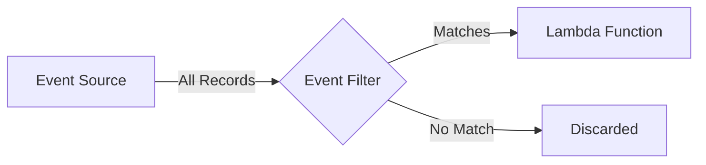

# How to Configure Lambda Event Source Mapping Filters

Author: [nawazdhandala](https://github.com/nawazdhandala)

Tags: AWS, Lambda, Event Filtering, SQS, Kinesis, DynamoDB, Serverless

Description: Learn how to use Lambda event source mapping filters to reduce invocations and costs by processing only the events you care about

---

Every Lambda invocation costs money. When your function is consuming from a busy SQS queue, Kinesis stream, or DynamoDB stream, a large percentage of those events might be irrelevant to your function's purpose. Maybe you only care about order events above $100, or only insert operations on a DynamoDB table, or only messages with a specific attribute.

Lambda event source mapping filters let you define criteria that records must match before Lambda even invokes your function. Records that do not match are silently discarded. This means fewer invocations, lower costs, and simpler function code because you do not need to write filtering logic inside your handler.

## How Event Filtering Works

Without filters, Lambda receives every record from the event source and your function decides what to process and what to ignore. With filters, the filtering happens at the event source mapping level before your function runs.



Filters use a JSON-based pattern syntax similar to EventBridge rules. You can filter on any field in the event record, including nested fields, and use comparison operators for numeric values.

## Supported Event Sources

Event filtering works with these Lambda event sources:

- Amazon SQS (standard and FIFO queues)
- Amazon Kinesis Data Streams
- Amazon DynamoDB Streams
- Amazon MSK (Kafka)
- Self-managed Apache Kafka
- Amazon MQ (ActiveMQ and RabbitMQ)
- Amazon DocumentDB change streams

The filter syntax is the same across all sources, but the event structure varies. You need to know the event payload format for your specific source to write correct filters.

## Basic Filter Syntax

A filter criteria contains one or more filter patterns. Each pattern is a JSON object that specifies which fields to match and what values to accept.

```json
{
  "Filters": [
    {
      "Pattern": "{ \"body\": { \"eventType\": [\"ORDER_PLACED\"] } }"
    }
  ]
}
```

This filter only invokes Lambda when the SQS message body contains `"eventType": "ORDER_PLACED"`. Everything else is dropped.

## Filtering SQS Messages

SQS is one of the most common event sources for Lambda. Here is how to filter based on message body content.

```bash
# Create an event source mapping with a filter for SQS
aws lambda create-event-source-mapping \
  --function-name order-processor \
  --event-source-arn arn:aws:sqs:us-east-1:123456789012:all-events \
  --batch-size 10 \
  --filter-criteria '{
    "Filters": [
      {
        "Pattern": "{\"body\":{\"eventType\":[\"ORDER_PLACED\",\"ORDER_UPDATED\"],\"amount\":[{\"numeric\":[\">\",100]}]}}"
      }
    ]
  }'
```

This filter matches messages where:
- The `eventType` field is either "ORDER_PLACED" or "ORDER_UPDATED"
- The `amount` field is greater than 100

Both conditions must be true (AND logic). For OR logic between different patterns, add multiple entries to the Filters array.

### SQS Message Body Filtering

When filtering SQS messages, your message body must be valid JSON. If the body is a plain string, you can only filter on message attributes, not the body itself.

```python
# Example: Sending properly structured SQS messages
import boto3
import json

sqs = boto3.client('sqs')

# This message WILL match the filter
sqs.send_message(
    QueueUrl='https://sqs.us-east-1.amazonaws.com/123456789012/all-events',
    MessageBody=json.dumps({
        'eventType': 'ORDER_PLACED',
        'amount': 150,
        'customerId': 'cust-123',
        'items': ['widget-a', 'widget-b']
    })
)

# This message will NOT match (amount too low)
sqs.send_message(
    QueueUrl='https://sqs.us-east-1.amazonaws.com/123456789012/all-events',
    MessageBody=json.dumps({
        'eventType': 'ORDER_PLACED',
        'amount': 50,
        'customerId': 'cust-456',
        'items': ['widget-c']
    })
)
```

## Filtering DynamoDB Streams

DynamoDB stream events have a specific structure with `dynamodb.NewImage` and `dynamodb.OldImage` fields. Filtering on these lets you react only to specific types of changes.

```bash
# Filter DynamoDB stream for only INSERT events on premium users
aws lambda create-event-source-mapping \
  --function-name premium-user-handler \
  --event-source-arn arn:aws:dynamodb:us-east-1:123456789012:table/Users/stream/2024-01-01T00:00:00.000 \
  --starting-position LATEST \
  --filter-criteria '{
    "Filters": [
      {
        "Pattern": "{\"eventName\":[\"INSERT\"],\"dynamodb\":{\"NewImage\":{\"accountType\":{\"S\":[\"premium\"]}}}}"
      }
    ]
  }'
```

This filter only fires when a new item is inserted AND the `accountType` attribute is "premium". Regular account insertions are ignored.

### Filtering on Old and New Image

You can also filter based on what changed by comparing old and new images.

```json
{
  "Filters": [
    {
      "Pattern": "{\"eventName\":[\"MODIFY\"],\"dynamodb\":{\"NewImage\":{\"status\":{\"S\":[\"shipped\"]}},\"OldImage\":{\"status\":{\"S\":[\"processing\"]}}}}"
    }
  ]
}
```

This matches only when a status field changes from "processing" to "shipped". Very useful for triggering specific workflows based on state transitions.

## Filtering Kinesis Records

Kinesis records have their data in a base64-encoded `data` field. Lambda automatically decodes this before applying filters.

```bash
# Filter Kinesis records for error events only
aws lambda create-event-source-mapping \
  --function-name error-handler \
  --event-source-arn arn:aws:kinesis:us-east-1:123456789012:stream/app-events \
  --starting-position LATEST \
  --filter-criteria '{
    "Filters": [
      {
        "Pattern": "{\"data\":{\"level\":[\"ERROR\",\"FATAL\"]}}"
      }
    ]
  }'
```

## Advanced Filter Patterns

Lambda supports several comparison operators in filter patterns.

### Numeric Comparisons

```json
{
  "Pattern": "{\"body\":{\"temperature\":[{\"numeric\":[\">\",30,\"<\",100]}]}}"
}
```

This matches when temperature is between 30 and 100 (exclusive on both ends).

Available numeric operators: `=`, `>`, `>=`, `<`, `<=`, and range combinations.

### Prefix Matching

```json
{
  "Pattern": "{\"body\":{\"region\":[{\"prefix\":\"us-\"}]}}"
}
```

Matches any region starting with "us-" (like "us-east-1", "us-west-2").

### Exists and Null Checks

```json
{
  "Pattern": "{\"body\":{\"errorCode\":[{\"exists\":true}]}}"
}
```

Matches when the `errorCode` field exists in the message, regardless of its value.

```json
{
  "Pattern": "{\"body\":{\"errorCode\":[null]}}"
}
```

Matches when `errorCode` is explicitly null.

### NOT Matching

```json
{
  "Pattern": "{\"body\":{\"status\":[{\"anything-but\":[\"draft\",\"archived\"]}]}}"
}
```

Matches any status except "draft" or "archived".

## Multiple Filters (OR Logic)

When you provide multiple filter patterns, Lambda uses OR logic between them. A record matches if it satisfies ANY of the patterns.

```bash
# Match either high-value orders OR VIP customer orders
aws lambda create-event-source-mapping \
  --function-name priority-handler \
  --event-source-arn arn:aws:sqs:us-east-1:123456789012:orders \
  --filter-criteria '{
    "Filters": [
      {
        "Pattern": "{\"body\":{\"amount\":[{\"numeric\":[\">\",1000]}]}}"
      },
      {
        "Pattern": "{\"body\":{\"customerTier\":[\"vip\"]}}"
      }
    ]
  }'
```

You can have up to 5 filter patterns per event source mapping.

## Cost Impact

The cost savings from filtering can be substantial. Consider a DynamoDB stream generating 1 million change events per day, but you only care about 10% of them. Without filtering, Lambda runs 1 million times. With filtering, it runs 100,000 times. That is a 90% reduction in Lambda invocations.

Filtered-out records are still read from the event source (you still pay for Kinesis shard reads or DynamoDB stream reads), but you avoid the Lambda invocation cost and duration charges entirely.

## Updating Filters

You can update filters on an existing event source mapping without recreating it.

```bash
# Update the filter on an existing mapping
aws lambda update-event-source-mapping \
  --uuid "your-mapping-uuid" \
  --filter-criteria '{
    "Filters": [
      {
        "Pattern": "{\"body\":{\"eventType\":[\"ORDER_PLACED\"]}}"
      }
    ]
  }'

# Remove all filters
aws lambda update-event-source-mapping \
  --uuid "your-mapping-uuid" \
  --filter-criteria '{}'
```

## Debugging Filters

If your filter is not matching records you expect it to match, check these common issues:

1. **JSON structure mismatch**: The filter must match the exact event structure, including nesting. For SQS, the body is inside a `body` key. For Kinesis, it is inside `data`.
2. **Data types**: A filter for `[100]` (number) will not match `["100"]` (string). Make sure types match.
3. **Missing fields**: If the record does not contain the filtered field, it does not match. Use the `exists` operator to handle optional fields.

For monitoring your filtered Lambda functions, check out our guide on [setting up Amazon Managed Grafana](https://oneuptime.com/blog/post/set-up-amazon-managed-grafana/view).

## Wrapping Up

Event source mapping filters are one of those features that every Lambda developer should know about. They reduce costs, simplify function code, and make event-driven architectures cleaner. Instead of having a single function process everything and filter internally, you can use infrastructure-level filtering to route events precisely where they need to go. Start by auditing your existing Lambda functions for any "if event type is not X, return early" patterns - those are prime candidates for event filtering.
