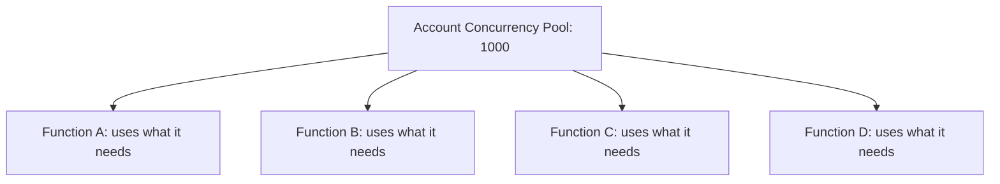
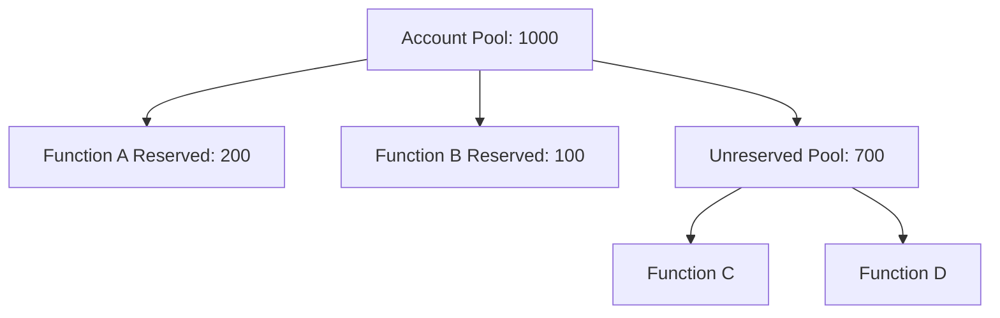

# How to Configure Lambda Reserved Concurrency

Author: [nawazdhandala](https://github.com/nawazdhandala)

Tags: AWS, Lambda, Concurrency, Serverless

Description: Learn how to use Lambda reserved concurrency to control function scaling, protect downstream resources, and isolate workloads from concurrency pool competition.

---

Every AWS account has a default concurrent execution limit of 1,000 Lambda invocations per region. All your Lambda functions share this pool. If one function gets a traffic spike and uses 900 of those 1,000 slots, every other function in the account fights over the remaining 100. Reserved concurrency lets you carve out dedicated slots for specific functions so this doesn't happen.

It's one of those settings you don't think about until something breaks at 3 AM.

## Understanding the Concurrency Pool

Think of your account's concurrency limit as a pool of 1,000 slots (the default). Without any reserved concurrency configured, all functions compete for these slots equally:



If Function A suddenly needs 800 concurrent executions, Functions B, C, and D are limited to sharing the remaining 200. If they need more, they get throttled.

Reserved concurrency changes this:



Now Function A is guaranteed 200 slots (and can't exceed 200), Function B gets 100, and the remaining 700 are shared among all other functions.

## Setting Reserved Concurrency

It's a single CLI command:

```bash
# Reserve 100 concurrent executions for a function
aws lambda put-function-concurrency \
  --function-name order-processor \
  --reserved-concurrent-executions 100
```

Check the current setting:

```bash
# View reserved concurrency for a function
aws lambda get-function-concurrency \
  --function-name order-processor
```

Remove reserved concurrency:

```bash
# Remove reserved concurrency (function returns to unreserved pool)
aws lambda delete-function-concurrency \
  --function-name order-processor
```

## Two Purposes of Reserved Concurrency

Reserved concurrency serves two distinct purposes, and it's important to understand both:

### 1. Guarantee Minimum Capacity

By reserving concurrency for a critical function, you guarantee it will always have execution slots available, regardless of what other functions are doing. If your payment processing function has 50 reserved slots, it can always handle 50 concurrent requests.

### 2. Limit Maximum Concurrency

Reserved concurrency is also a cap. A function with 100 reserved concurrent executions can never exceed 100 concurrent executions. This is useful for protecting downstream resources.

If your function writes to an RDS database that can handle 100 connections, setting reserved concurrency to 100 prevents Lambda from creating more connections than the database can handle.

## Protecting Downstream Resources

This is the most practical use case. Consider a function that queries a database:

```python
# Without concurrency control, this can overwhelm the database
import pymysql
import os

connection = pymysql.connect(
    host=os.environ['DB_HOST'],
    user=os.environ['DB_USER'],
    password=os.environ['DB_PASSWORD'],
    database=os.environ['DB_NAME']
)


def lambda_handler(event, context):
    with connection.cursor() as cursor:
        cursor.execute("SELECT * FROM orders WHERE id = %s", (event['order_id'],))
        result = cursor.fetchone()
    return result
```

If this function scales to 500 concurrent executions, that's 500 database connections. Most databases can't handle that.

Set reserved concurrency to match your database's connection limit:

```bash
# Limit to 50 concurrent executions to protect the database
aws lambda put-function-concurrency \
  --function-name db-query-function \
  --reserved-concurrent-executions 50
```

Now pair this with SQS for overflow handling:

```python
# Use SQS as a buffer when the function is at capacity
import json
import boto3

sqs = boto3.client('sqs')
QUEUE_URL = os.environ['OVERFLOW_QUEUE_URL']


def lambda_handler(event, context):
    try:
        # Try to process directly
        result = process_order(event['order_id'])
        return {'statusCode': 200, 'body': json.dumps(result)}
    except Exception as e:
        # If overwhelmed, queue for retry
        sqs.send_message(
            QueueUrl=QUEUE_URL,
            MessageBody=json.dumps(event)
        )
        return {'statusCode': 202, 'body': json.dumps({'status': 'queued'})}
```

## Isolating Workloads

In a multi-tenant application, you might have functions for different tenants or different priority levels. Reserved concurrency ensures critical functions aren't affected by less important ones.

```bash
# Critical functions get guaranteed capacity
aws lambda put-function-concurrency \
  --function-name payment-processor \
  --reserved-concurrent-executions 200

aws lambda put-function-concurrency \
  --function-name auth-service \
  --reserved-concurrent-executions 100

# Non-critical functions get limited capacity to prevent runaway scaling
aws lambda put-function-concurrency \
  --function-name report-generator \
  --reserved-concurrent-executions 20

aws lambda put-function-concurrency \
  --function-name thumbnail-creator \
  --reserved-concurrent-executions 30
```

## Disabling a Function (Reserved = 0)

Setting reserved concurrency to 0 effectively disables a function. No invocations can run:

```bash
# Disable a function (all invocations will be throttled)
aws lambda put-function-concurrency \
  --function-name broken-function \
  --reserved-concurrent-executions 0
```

This is useful when:
- A function has a bug and you need to stop it immediately
- You want to prevent a function from running during maintenance
- You need an emergency kill switch

It's faster than deleting the function or removing its trigger, and it's easily reversible.

## Monitoring Concurrency

Track how your functions use their concurrency allocation:

```bash
# Check concurrent executions for a specific function
aws cloudwatch get-metric-statistics \
  --namespace AWS/Lambda \
  --metric-name ConcurrentExecutions \
  --dimensions Name=FunctionName,Value=order-processor \
  --start-time $(date -u -v-1d +%Y-%m-%dT%H:%M:%S) \
  --end-time $(date -u +%Y-%m-%dT%H:%M:%S) \
  --period 300 \
  --statistics Maximum \
  --output table
```

Set up an alarm for when a function is close to its concurrency limit:

```bash
# Alert when concurrency reaches 80% of reserved capacity
aws cloudwatch put-metric-alarm \
  --alarm-name "OrderProcessorHighConcurrency" \
  --metric-name ConcurrentExecutions \
  --namespace AWS/Lambda \
  --dimensions Name=FunctionName,Value=order-processor \
  --statistic Maximum \
  --period 60 \
  --threshold 80 \
  --comparison-operator GreaterThanOrEqualToThreshold \
  --evaluation-periods 3 \
  --alarm-actions "arn:aws:sns:us-east-1:123456789012:alerts"
```

## Account-Level Concurrency

Check your account's overall concurrency usage and limits:

```bash
# Get account-level concurrency limits
aws lambda get-account-settings \
  --query "{TotalConcurrency:AccountLimit.ConcurrentExecutions,UnreservedConcurrency:AccountLimit.UnreservedConcurrentExecutions}"
```

If your account limit of 1,000 isn't enough, you can request an increase:

```bash
# Request a concurrency limit increase through Service Quotas
aws service-quotas request-service-quota-increase \
  --service-code lambda \
  --quota-code L-B99A9384 \
  --desired-value 3000
```

## CloudFormation and SAM

Configure reserved concurrency in your infrastructure code:

```yaml
# SAM template
Resources:
  OrderProcessor:
    Type: AWS::Serverless::Function
    Properties:
      Handler: app.handler
      Runtime: python3.12
      ReservedConcurrentExecutions: 100
```

```hcl
# Terraform
resource "aws_lambda_function" "order_processor" {
  function_name = "order-processor"
  handler       = "app.handler"
  runtime       = "python3.12"
  role          = aws_iam_role.lambda_role.arn
  filename      = "deployment.zip"

  reserved_concurrent_executions = 100
}
```

## Planning Your Concurrency Budget

When planning reserved concurrency across your functions, keep track of the math:

```
Total account limit:    1,000
Function A reserved:     -200
Function B reserved:     -100
Function C reserved:      -50
Function D reserved:      -30
                        ------
Unreserved pool:          620
```

That unreserved pool must be at least 100 (AWS enforces this). So the maximum you can reserve across all functions is your account limit minus 100.

A helpful script to see your current allocation:

```bash
# List all functions with reserved concurrency
aws lambda list-functions \
  --query "Functions[?ReservedConcurrentExecutions!=null].{Name:FunctionName,Reserved:ReservedConcurrentExecutions}" \
  --output table

# Get unreserved concurrency
aws lambda get-account-settings \
  --query "AccountLimit.UnreservedConcurrentExecutions" \
  --output text
```

## Reserved vs Provisioned Concurrency

These two features sound similar but do different things:

| Feature | Reserved Concurrency | Provisioned Concurrency |
|---------|---------------------|------------------------|
| Purpose | Limit/guarantee execution slots | Eliminate cold starts |
| Cost | Free | Costs money per GB-hour |
| Cold starts | Still happen | Eliminated (up to provisioned count) |
| Scaling | Up to reserved limit | Provisioned + on-demand spillover |
| Works with $LATEST | Yes | No (requires version/alias) |

You can use both together. Reserve 100 concurrent executions for a function and provision 20 of those to be warm. The function can scale to 100 concurrent, and the first 20 requests always get warm environments.

## Wrapping Up

Reserved concurrency is a free and powerful tool for managing Lambda scaling. Use it to protect downstream resources, isolate critical functions from noisy neighbors, and set hard limits on function scaling. Every production Lambda deployment should have a concurrency plan.

For handling what happens when functions hit their concurrency limits, see our guide on [handling Lambda throttling and concurrency limits](https://oneuptime.com/blog/post/handle-lambda-throttling-concurrency-limits/view). And for eliminating cold starts on your reserved capacity, check out [provisioned concurrency](https://oneuptime.com/blog/post/lambda-provisioned-concurrency-eliminate-cold-starts/view).
