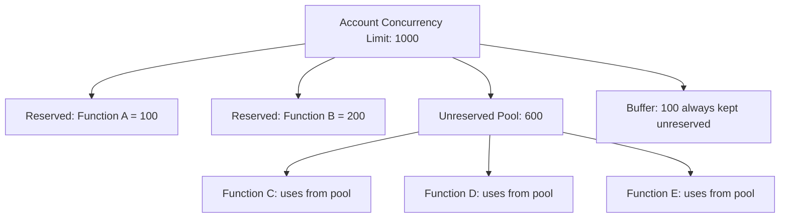

# How to Configure Lambda Reserved vs Unreserved Concurrency

Author: [nawazdhandala](https://github.com/nawazdhandala)

Tags: AWS, Lambda, Concurrency, Scaling, Serverless, Performance

Description: Understand the difference between reserved and unreserved Lambda concurrency and learn how to configure both for optimal scaling and cost control

---

Lambda concurrency is one of those settings that most teams ignore until something goes wrong. Your function starts throttling during a traffic spike, or worse, one runaway function consumes all available concurrency and starves every other function in your account. Understanding and configuring reserved versus unreserved concurrency prevents both scenarios.

In this guide, you will learn what each concurrency type means, when to use reserved concurrency, how it differs from provisioned concurrency, and practical strategies for managing concurrency across your Lambda fleet.

## Understanding Lambda Concurrency

Concurrency in Lambda is the number of function instances processing events simultaneously. Each concurrent invocation runs in its own execution environment.

Your AWS account has a regional concurrency limit, typically 1,000 by default (you can request an increase). This limit is shared across ALL Lambda functions in that region.



AWS always keeps 100 units of concurrency unreserved as a safety buffer. So from a 1,000 limit, only 900 are available for reservation.

## Reserved Concurrency

Reserved concurrency sets aside a fixed amount of concurrency for a specific function. It serves two purposes:

1. **Guarantees capacity**: Your function always has its reserved concurrency available, even if other functions are using the rest.
2. **Acts as a throttle**: Your function cannot exceed its reserved concurrency, protecting downstream systems from being overwhelmed.

```bash
# Reserve 100 concurrent executions for the order processor
aws lambda put-function-concurrency \
  --function-name order-processor \
  --reserved-concurrent-executions 100
```

With this configuration, `order-processor` can run up to 100 instances simultaneously. If it receives more requests, the excess gets throttled. Meanwhile, those 100 units are guaranteed even if every other function in your account is running at full capacity.

### When to Use Reserved Concurrency

**Protecting downstream systems**: If your Lambda function calls a database that can only handle 50 connections, set reserved concurrency to 50. This prevents Lambda from scaling beyond what the database can handle.

```bash
# Limit a function to match database connection capacity
aws lambda put-function-concurrency \
  --function-name db-writer \
  --reserved-concurrent-executions 50
```

**Guaranteeing capacity for critical functions**: If you have a payment processing function that absolutely must not be throttled by other workloads, reserve concurrency for it.

**Cost control**: Reserved concurrency caps how much a function can scale, which caps its cost. If a bug causes infinite loops or unexpected traffic, the function hits its concurrency ceiling instead of consuming your entire account limit.

## Unreserved Concurrency

Unreserved concurrency is the pool shared by all functions that do not have reserved concurrency configured. It equals your account limit minus the sum of all reserved concurrency minus the 100-unit buffer.

```
Unreserved Pool = Account Limit - Total Reserved - 100 (buffer)
```

For example, with a 1,000 account limit and 300 reserved across various functions:

```
Unreserved Pool = 1000 - 300 - 100 = 600
```

All functions without reserved concurrency share this 600. First come, first served. If Function C grabs 500 of them during a spike, Functions D and E only have 100 left to split.

This is why unreserved concurrency is risky for critical functions. Without reservation, there is no guarantee your function gets the concurrency it needs.

## Reserved vs Provisioned Concurrency

These are often confused, but they are very different.

| Feature | Reserved Concurrency | Provisioned Concurrency |
|---------|---------------------|------------------------|
| Purpose | Limit and guarantee maximum concurrency | Pre-warm execution environments |
| Cold starts | Does not prevent cold starts | Eliminates cold starts |
| Cost | Free to configure | Charges per provisioned instance |
| Effect | Caps scaling at the reserved number | Pre-initializes N environments |

Provisioned concurrency is a subset of reserved concurrency. If you reserve 100 and provision 50, you have 50 warm instances always ready and can burst up to 100 (with cold starts for the extra 50).

```bash
# First, reserve concurrency
aws lambda put-function-concurrency \
  --function-name payment-processor \
  --reserved-concurrent-executions 100

# Then, provision some of those for warm starts
aws lambda put-provisioned-concurrency-config \
  --function-name payment-processor \
  --qualifier prod \
  --provisioned-concurrent-executions 50
```

## Practical Configuration Strategies

### Strategy 1: Protect Critical Functions

Identify your most critical functions and reserve concurrency for them. Leave the rest on the shared pool.

```bash
# Critical functions get reserved concurrency
aws lambda put-function-concurrency \
  --function-name payment-api --reserved-concurrent-executions 200

aws lambda put-function-concurrency \
  --function-name auth-service --reserved-concurrent-executions 150

aws lambda put-function-concurrency \
  --function-name order-processor --reserved-concurrent-executions 100

# Everything else shares the unreserved pool
# With a 1000 limit: 1000 - 200 - 150 - 100 - 100(buffer) = 450 unreserved
```

### Strategy 2: Throttle Background Workloads

Use reserved concurrency to limit non-urgent functions so they do not crowd out interactive workloads.

```bash
# Background jobs get low reserved concurrency
aws lambda put-function-concurrency \
  --function-name report-generator --reserved-concurrent-executions 10

aws lambda put-function-concurrency \
  --function-name data-cleanup --reserved-concurrent-executions 5

aws lambda put-function-concurrency \
  --function-name email-sender --reserved-concurrent-executions 20
```

Even if the email queue backs up, the email sender will not consume more than 20 concurrent executions.

### Strategy 3: Database Connection Management

This is one of the most important uses. Lambda can scale faster than most databases can accept connections.

```python
# handler.py - Example with connection-aware concurrency
import os
import psycopg2
from psycopg2 import pool

# Connection pool sized to match reserved concurrency
# If reserved concurrency = 30, each instance gets 1 connection
# Total max connections = 30
connection_pool = psycopg2.pool.SimpleConnectionPool(
    minconn=1,
    maxconn=1,  # One connection per Lambda instance
    host=os.environ['DB_HOST'],
    database=os.environ['DB_NAME'],
    user=os.environ['DB_USER'],
    password=os.environ['DB_PASSWORD']
)

def lambda_handler(event, context):
    conn = connection_pool.getconn()
    try:
        cursor = conn.cursor()
        cursor.execute("SELECT * FROM orders WHERE id = %s", (event['order_id'],))
        result = cursor.fetchone()
        cursor.close()
        return {'statusCode': 200, 'body': str(result)}
    finally:
        connection_pool.putconn(conn)
```

```bash
# Match concurrency to database connection limit
# If your database supports 100 connections and 3 services use it:
# Reserve ~30 for this function, leaving room for other services
aws lambda put-function-concurrency \
  --function-name order-api \
  --reserved-concurrent-executions 30
```

## Monitoring Concurrency

Track these CloudWatch metrics to understand your concurrency usage:

- **ConcurrentExecutions**: Current number of concurrent invocations across all functions.
- **UnreservedConcurrentExecutions**: Current number from the unreserved pool.
- **Throttles**: Number of invocations that were throttled.
- **ProvisionedConcurrencySpilloverInvocations**: Invocations that exceeded provisioned concurrency and used on-demand.

```bash
# Set up a CloudWatch alarm for throttling
aws cloudwatch put-metric-alarm \
  --alarm-name lambda-throttles \
  --metric-name Throttles \
  --namespace AWS/Lambda \
  --statistic Sum \
  --period 60 \
  --threshold 10 \
  --comparison-operator GreaterThanThreshold \
  --evaluation-periods 1 \
  --alarm-actions arn:aws:sns:us-east-1:123456789012:ops-alerts
```

For a full monitoring dashboard setup, see our guide on [setting up Amazon Managed Grafana](https://oneuptime.com/blog/post/2026-02-12-set-up-amazon-managed-grafana/view).

## Common Mistakes

**Over-reserving**: Reserving too much concurrency for individual functions starves the unreserved pool. If your unreserved pool hits zero, any function without a reservation cannot run at all.

**Setting reserved concurrency to zero**: This effectively disables the function. Lambda will throttle every single invocation. This can be useful for emergency shutoffs, but it is a sharp tool.

```bash
# Emergency: disable a function without deleting it
aws lambda put-function-concurrency \
  --function-name broken-function \
  --reserved-concurrent-executions 0
```

**Forgetting the 100-unit buffer**: AWS reserves 100 units that you cannot allocate. If your account limit is 1,000, you can only reserve 900 across all functions.

**Not requesting limit increases**: The default 1,000 is low for production workloads. Request an increase proactively before you need it.

```bash
# Request a concurrency limit increase through AWS Support
# or use Service Quotas
aws service-quotas request-service-quota-increase \
  --service-code lambda \
  --quota-code L-B99A9384 \
  --desired-value 5000
```

## Wrapping Up

Reserved concurrency is a free guardrail that every Lambda deployment should consider. It protects critical functions from being starved, throttles runaway workloads, and prevents your Lambda functions from overwhelming downstream systems. The configuration is simple - a single API call per function. The tricky part is deciding the right numbers, which requires understanding your traffic patterns, downstream capacity, and which functions are truly critical.

Start by reserving concurrency for your most important functions and any function that connects to a capacity-constrained resource like a database. Monitor throttle metrics, and adjust as you learn your actual concurrency patterns.
