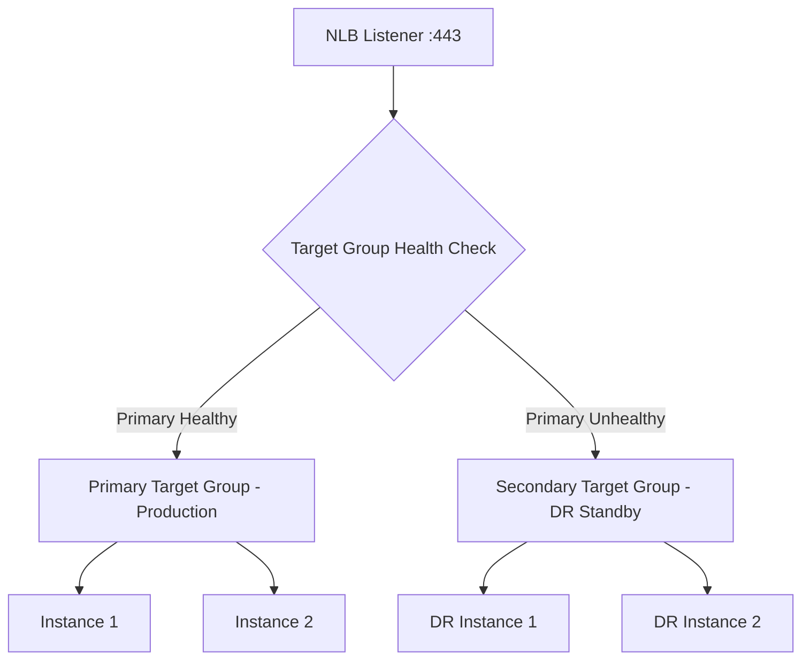

# How to Configure NLB Target Group Failover

Author: [nawazdhandala](https://github.com/nawazdhandala)

Tags: AWS, NLB, Load Balancing, Failover, High Availability, Target Groups

Description: Learn how to configure Network Load Balancer target group failover for high availability including primary and secondary target groups with health checks.

---

When your primary backend goes down, traffic needs to go somewhere else - fast. NLB target group failover lets you define primary and secondary target groups so that traffic automatically shifts when health checks fail. This is critical for architectures where you need a hot standby or disaster recovery backend.

## How NLB Target Group Failover Works

NLB target group failover uses a simple concept: you define multiple target groups for a listener, with one marked as primary and another as secondary. The NLB sends all traffic to the primary target group. If the primary becomes unhealthy (based on health check thresholds), traffic automatically fails over to the secondary.



When the primary target group recovers, traffic automatically fails back. This behavior is controlled by the failover configuration on the target group.

## Step 1: Create the Primary Target Group

```bash
# Create the primary target group
aws elbv2 create-target-group \
    --name primary-app-tg \
    --protocol TCP \
    --port 443 \
    --vpc-id vpc-0123456789abcdef0 \
    --target-type instance \
    --health-check-protocol TCP \
    --health-check-port 443 \
    --health-check-interval-seconds 10 \
    --healthy-threshold-count 2 \
    --unhealthy-threshold-count 2 \
    --tags 'Key=Role,Value=primary'
```

Health check configuration matters a lot for failover. Faster intervals and lower thresholds mean quicker failover, but also more sensitivity to brief hiccups.

Recommended settings for fast failover:

| Setting | Value | Reason |
|---------|-------|--------|
| Interval | 10 seconds | Fast detection |
| Healthy threshold | 2 | Quick recovery confirmation |
| Unhealthy threshold | 2 | Two consecutive failures triggers failover |

With these settings, failover triggers in approximately 20 seconds (2 failed checks at 10-second intervals).

## Step 2: Create the Secondary Target Group

```bash
# Create the secondary (failover) target group
aws elbv2 create-target-group \
    --name secondary-app-tg \
    --protocol TCP \
    --port 443 \
    --vpc-id vpc-0123456789abcdef0 \
    --target-type instance \
    --health-check-protocol TCP \
    --health-check-port 443 \
    --health-check-interval-seconds 10 \
    --healthy-threshold-count 2 \
    --unhealthy-threshold-count 2 \
    --tags 'Key=Role,Value=secondary'
```

## Step 3: Register Targets

```bash
# Register instances in the primary target group
aws elbv2 register-targets \
    --target-group-arn arn:aws:elasticloadbalancing:us-east-1:123456789012:targetgroup/primary-app-tg/abc123 \
    --targets Id=i-0123456789abcdef0 Id=i-0123456789abcdef1

# Register instances in the secondary target group
aws elbv2 register-targets \
    --target-group-arn arn:aws:elasticloadbalancing:us-east-1:123456789012:targetgroup/secondary-app-tg/def456 \
    --targets Id=i-0987654321fedcba0 Id=i-0987654321fedcba1
```

## Step 4: Create the NLB with Failover Configuration

```bash
# Create the NLB
aws elbv2 create-load-balancer \
    --name app-nlb \
    --type network \
    --subnets subnet-1a subnet-1b \
    --scheme internet-facing \
    --tags 'Key=Application,Value=webapp'

# Create a listener with primary target group as default
aws elbv2 create-listener \
    --load-balancer-arn arn:aws:elasticloadbalancing:us-east-1:123456789012:loadbalancer/net/app-nlb/abc123 \
    --protocol TCP \
    --port 443 \
    --default-actions '[
        {
            "Type": "forward",
            "ForwardConfig": {
                "TargetGroups": [
                    {
                        "TargetGroupArn": "arn:aws:elasticloadbalancing:us-east-1:123456789012:targetgroup/primary-app-tg/abc123",
                        "Weight": 1
                    },
                    {
                        "TargetGroupArn": "arn:aws:elasticloadbalancing:us-east-1:123456789012:targetgroup/secondary-app-tg/def456",
                        "Weight": 0
                    }
                ],
                "TargetGroupStickinessConfig": {
                    "Enabled": false
                }
            }
        }
    ]'
```

## Step 5: Configure Target Group Failover Settings

This is the key configuration. The `TargetFailover` attribute controls what happens when targets in the primary group become unhealthy.

```bash
# Enable failover on the primary target group
aws elbv2 modify-target-group-attributes \
    --target-group-arn arn:aws:elasticloadbalancing:us-east-1:123456789012:targetgroup/primary-app-tg/abc123 \
    --attributes \
        'Key=target_group_health.dns_failover.minimum_healthy_targets.count,Value=1' \
        'Key=target_group_health.dns_failover.minimum_healthy_targets.percentage,Value=off' \
        'Key=target_group_health.unhealthy_state_routing.minimum_healthy_targets.count,Value=1' \
        'Key=target_group_health.unhealthy_state_routing.minimum_healthy_targets.percentage,Value=off'
```

These attributes control:

- **dns_failover.minimum_healthy_targets.count**: If the number of healthy targets drops below this count, Route 53 DNS failover is triggered (if using Route 53 health checks)
- **unhealthy_state_routing.minimum_healthy_targets.count**: If healthy targets drop below this count, the NLB routes traffic to all targets (including unhealthy ones) rather than dropping it

## Using Terraform for the Complete Setup

For infrastructure as code, here is the complete Terraform configuration:

```hcl
resource "aws_lb" "app" {
  name               = "app-nlb"
  internal           = false
  load_balancer_type = "network"
  subnets            = [aws_subnet.public_1a.id, aws_subnet.public_1b.id]

  enable_cross_zone_load_balancing = true
}

resource "aws_lb_target_group" "primary" {
  name     = "primary-app-tg"
  port     = 443
  protocol = "TCP"
  vpc_id   = aws_vpc.main.id

  health_check {
    protocol            = "TCP"
    port                = 443
    interval            = 10
    healthy_threshold   = 2
    unhealthy_threshold = 2
  }

  tags = {
    Role = "primary"
  }
}

resource "aws_lb_target_group" "secondary" {
  name     = "secondary-app-tg"
  port     = 443
  protocol = "TCP"
  vpc_id   = aws_vpc.main.id

  health_check {
    protocol            = "TCP"
    port                = 443
    interval            = 10
    healthy_threshold   = 2
    unhealthy_threshold = 2
  }

  tags = {
    Role = "secondary"
  }
}

resource "aws_lb_listener" "app" {
  load_balancer_arn = aws_lb.app.arn
  port              = 443
  protocol          = "TCP"

  default_action {
    type = "forward"

    forward {
      target_group {
        arn    = aws_lb_target_group.primary.arn
        weight = 1
      }
      target_group {
        arn    = aws_lb_target_group.secondary.arn
        weight = 0
      }
    }
  }
}
```

## Monitoring Failover Events

Set up CloudWatch alarms to detect when failover occurs:

```bash
# Alarm when primary target group has no healthy targets
aws cloudwatch put-metric-alarm \
    --alarm-name "primary-tg-no-healthy-targets" \
    --metric-name HealthyHostCount \
    --namespace AWS/NetworkELB \
    --statistic Minimum \
    --period 60 \
    --threshold 1 \
    --comparison-operator LessThanThreshold \
    --dimensions \
        "Name=TargetGroup,Value=targetgroup/primary-app-tg/abc123" \
        "Name=LoadBalancer,Value=net/app-nlb/abc123" \
    --evaluation-periods 1 \
    --alarm-actions arn:aws:sns:us-east-1:123456789012:ops-alerts \
    --alarm-description "Primary target group failover - no healthy targets"
```

```bash
# Alarm when secondary target group starts receiving traffic
aws cloudwatch put-metric-alarm \
    --alarm-name "secondary-tg-active" \
    --metric-name ActiveFlowCount \
    --namespace AWS/NetworkELB \
    --statistic Sum \
    --period 60 \
    --threshold 0 \
    --comparison-operator GreaterThanThreshold \
    --dimensions \
        "Name=TargetGroup,Value=targetgroup/secondary-app-tg/def456" \
        "Name=LoadBalancer,Value=net/app-nlb/abc123" \
    --evaluation-periods 1 \
    --alarm-actions arn:aws:sns:us-east-1:123456789012:ops-alerts \
    --alarm-description "Secondary target group is now receiving traffic - failover in progress"
```

## Testing Failover

Never assume failover works - test it.

```bash
# Simulate primary failure by deregistering all targets
aws elbv2 deregister-targets \
    --target-group-arn arn:aws:elasticloadbalancing:us-east-1:123456789012:targetgroup/primary-app-tg/abc123 \
    --targets Id=i-0123456789abcdef0 Id=i-0123456789abcdef1

# Monitor health status
watch -n 5 'aws elbv2 describe-target-health \
    --target-group-arn arn:aws:elasticloadbalancing:us-east-1:123456789012:targetgroup/secondary-app-tg/def456'

# Verify traffic is reaching secondary targets
curl -v https://app.example.com/health

# Re-register primary targets to test failback
aws elbv2 register-targets \
    --target-group-arn arn:aws:elasticloadbalancing:us-east-1:123456789012:targetgroup/primary-app-tg/abc123 \
    --targets Id=i-0123456789abcdef0 Id=i-0123456789abcdef1
```

## Failover Patterns

### Active-Passive

Primary handles all traffic. Secondary is a warm standby that only receives traffic during failover. This is the most common pattern and what we have configured above.

### Cross-AZ Failover

Primary targets are in AZ-a, secondary in AZ-b. Provides availability zone-level resilience.

### Cross-Region Failover

For cross-region failover, combine NLB target group failover with Route 53 health checks. See our guide on [configuring Route 53 CIDR-based routing](https://oneuptime.com/blog/post/configure-route-53-cidr-based-routing/view) for complementary routing strategies.

## Conclusion

NLB target group failover gives you automatic, fast, and reliable traffic redirection when your primary backend becomes unavailable. The key to a good setup is aggressive health check configuration (fast intervals, low thresholds), proper monitoring with CloudWatch alarms, and regular testing. Do not wait for a real outage to discover that your failover does not work as expected.
