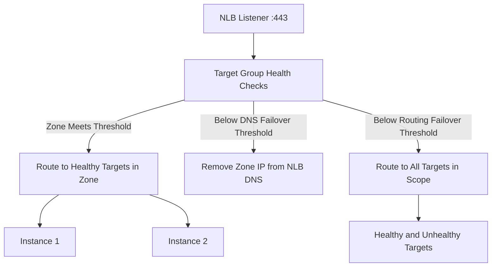

# How to Configure NLB Target Group Failover

Author: [nawazdhandala](https://github.com/nawazdhandala)

Tags: AWS, NLB, Load Balancing, Failover, High Availability, Target Groups

Description: Learn how to configure Network Load Balancer target group failover for high availability including primary and secondary target groups with health checks.

---

When your backend loses healthy targets in an Availability Zone, traffic needs to go somewhere else - fast. NLB target group health settings let you define DNS failover and routing failover thresholds so that traffic is directed away from unhealthy zones, or intentionally routed to all targets during a fail-open condition.

## How NLB Target Group Failover Works

NLB target group failover is based on target group health thresholds, not primary and secondary target groups on the same listener. The NLB normally sends traffic to healthy targets in enabled Availability Zones. If the number or percentage of healthy targets in a zone drops below your DNS failover threshold, the load balancer marks the load balancer node IP address for that zone as unhealthy in DNS so new clients resolve to healthy zones. If the healthy target count drops below your routing failover threshold, the NLB sends traffic to all targets available to the load balancer node, including unhealthy targets, instead of only the remaining healthy targets.


```mermaid
graph TD
    A[NLB Listener :443] --> B[Target Group Health Checks]
    B -->|Zone Meets Threshold| C[Route to Healthy Targets in Zone]
    B -->|Below DNS Failover Threshold| D[Remove Zone IP from NLB DNS]
    B -->|Below Routing Failover Threshold| E[Route to All Targets in Scope]
    C --> F[Instance 1]
    C --> G[Instance 2]
    E --> H[Healthy and Unhealthy Targets]
```

When the target group health recovers above the configured threshold, the zone can become healthy again in DNS. Cross-region or active-passive failover requires Route 53 failover records that point to separate load balancers or other backup resources.

## Step 1: Create the Target Group

```bash
# Create the target group

aws elbv2 create-target-group \
    --name app-tg \
    --protocol TCP \
    --port 443 \
    --vpc-id vpc-0123456789abcdef0 \
    --target-type instance \
    --health-check-protocol TCP \
    --health-check-port 443 \
    --health-check-interval-seconds 10 \
    --healthy-threshold-count 2 \
    --unhealthy-threshold-count 2 \
    --tags 'Key=Role,Value=app'
```

Health check configuration matters a lot for failover. Faster intervals and lower thresholds mean quicker health-state changes, but also more sensitivity to brief hiccups.

Recommended settings for fast failover:

| Setting | Value | Reason |
|---------|-------|--------|
| Interval | 10 seconds | Fast detection |
| Healthy threshold | 2 | Quick recovery confirmation |
| Unhealthy threshold | 2 | Two consecutive failures marks a target unhealthy |

With these settings, a target can be marked unhealthy after approximately 20 seconds (2 failed checks at 10-second intervals), plus any propagation time.

## Step 2: Register Targets

Register targets in multiple Availability Zones so DNS failover has healthy zones to route to when one zone falls below the threshold.

```bash
# Register instances in the target group
aws elbv2 register-targets \
    --target-group-arn arn:aws:elasticloadbalancing:us-east-1:123456789012:targetgroup/app-tg/abc123 \
    --targets Id=i-0123456789abcdef0 Id=i-0123456789abcdef1 Id=i-0987654321fedcba0 Id=i-0987654321fedcba1
```

## Step 3: Create the NLB and Listener

```bash
# Create the NLB
aws elbv2 create-load-balancer \
    --name app-nlb \
    --type network \
    --subnets subnet-1a subnet-1b \
    --scheme internet-facing \
    --tags 'Key=Application,Value=webapp'

# Create a listener that forwards to the target group
aws elbv2 create-listener \
    --load-balancer-arn arn:aws:elasticloadbalancing:us-east-1:123456789012:loadbalancer/net/app-nlb/abc123 \
    --protocol TCP \
    --port 443 \
    --default-actions Type=forward,TargetGroupArn=arn:aws:elasticloadbalancing:us-east-1:123456789012:targetgroup/app-tg/abc123
```

## Step 4: Configure Target Group Failover Settings

This is the key configuration. The target group health attributes control DNS failover and routing failover when healthy targets fall below your thresholds.

```bash
# Configure target group health failover thresholds
aws elbv2 modify-target-group-attributes \
    --target-group-arn arn:aws:elasticloadbalancing:us-east-1:123456789012:targetgroup/app-tg/abc123 \
    --attributes \
        'Key=target_group_health.dns_failover.minimum_healthy_targets.count,Value=1' \
        'Key=target_group_health.dns_failover.minimum_healthy_targets.percentage,Value=off' \
        'Key=target_group_health.unhealthy_state_routing.minimum_healthy_targets.count,Value=1' \
        'Key=target_group_health.unhealthy_state_routing.minimum_healthy_targets.percentage,Value=off'
```

These attributes control:

- **dns_failover.minimum_healthy_targets.count**: If the number of healthy targets in scope drops below this count, the load balancer marks the affected zone as unhealthy in DNS so traffic is routed only to healthy zones
- **unhealthy_state_routing.minimum_healthy_targets.count**: If healthy targets drop below this count, the NLB routes traffic to all targets in scope, including unhealthy targets

## Using Terraform for the Complete Setup

For infrastructure as code, here is the complete Terraform configuration:

```hcl
resource "aws_lb" "app" {
  name               = "app-nlb"
  internal           = false
  load_balancer_type = "network"
  subnets            = [aws_subnet.public_1a.id, aws_subnet.public_1b.id]
}

resource "aws_lb_target_group" "app" {
  name        = "app-tg"
  port        = 443
  protocol    = "TCP"
  target_type = "instance"
  vpc_id      = aws_vpc.main.id

  health_check {
    protocol            = "TCP"
    port                = "443"
    interval            = 10
    healthy_threshold   = 2
    unhealthy_threshold = 2
  }

  target_group_health {
    dns_failover {
      minimum_healthy_targets_count      = "1"
      minimum_healthy_targets_percentage = "off"
    }

    unhealthy_state_routing {
      minimum_healthy_targets_count      = "1"
      minimum_healthy_targets_percentage = "off"
    }
  }

  tags = {
    Role = "app"
  }
}

resource "aws_lb_listener" "app" {
  load_balancer_arn = aws_lb.app.arn
  port              = 443
  protocol          = "TCP"

  default_action {
    type             = "forward"
    target_group_arn = aws_lb_target_group.app.arn
  }
}
```

## Monitoring Failover Events

Set up CloudWatch alarms to detect when target group health drops below your expected threshold:

```bash
# Alarm when the target group has fewer than two healthy targets
aws cloudwatch put-metric-alarm \
    --alarm-name "app-tg-low-healthy-targets" \
    --metric-name HealthyHostCount \
    --namespace AWS/NetworkELB \
    --statistic Minimum \
    --period 60 \
    --threshold 2 \
    --comparison-operator LessThanThreshold \
    --dimensions \
        "Name=TargetGroup,Value=targetgroup/app-tg/abc123" \
        "Name=LoadBalancer,Value=net/app-nlb/abc123" \
    --evaluation-periods 1 \
    --alarm-actions arn:aws:sns:us-east-1:123456789012:ops-alerts \
    --alarm-description "NLB target group has fewer healthy targets than expected"
```

```bash
# Alarm when unhealthy targets are present
aws cloudwatch put-metric-alarm \
    --alarm-name "app-tg-unhealthy-targets" \
    --metric-name UnHealthyHostCount \
    --namespace AWS/NetworkELB \
    --statistic Maximum \
    --period 60 \
    --threshold 0 \
    --comparison-operator GreaterThanThreshold \
    --dimensions \
        "Name=TargetGroup,Value=targetgroup/app-tg/abc123" \
        "Name=LoadBalancer,Value=net/app-nlb/abc123" \
    --evaluation-periods 1 \
    --alarm-actions arn:aws:sns:us-east-1:123456789012:ops-alerts \
    --alarm-description "NLB target group has unhealthy targets"
```

## Testing Failover

Never assume failover works - test it.

```bash
# Simulate target failure by deregistering targets in one Availability Zone
aws elbv2 deregister-targets \
    --target-group-arn arn:aws:elasticloadbalancing:us-east-1:123456789012:targetgroup/app-tg/abc123 \
    --targets Id=i-0123456789abcdef0 Id=i-0123456789abcdef1

# Monitor health status
watch -n 5 'aws elbv2 describe-target-health \
    --target-group-arn arn:aws:elasticloadbalancing:us-east-1:123456789012:targetgroup/app-tg/abc123'

# Verify traffic is still reaching healthy targets
curl -v https://app.example.com/health

# Re-register the targets to test recovery
aws elbv2 register-targets \
    --target-group-arn arn:aws:elasticloadbalancing:us-east-1:123456789012:targetgroup/app-tg/abc123 \
    --targets Id=i-0123456789abcdef0 Id=i-0123456789abcdef1
```

## Failover Patterns

### Active-Passive

For active-passive failover, use Route 53 failover records with evaluate target health enabled and point them to separate primary and secondary load balancers or other backup resources. NLB listener configuration does not provide automatic primary-to-secondary target group switching.

### Cross-AZ Failover

Register targets in multiple Availability Zones and configure target group health thresholds. When DNS failover is triggered for an unhealthy zone, clients resolving the NLB DNS name receive IP addresses for healthy zones.

### Cross-Region Failover

For cross-region failover, combine NLB target group health checks with Route 53 failover records. See our guide on [configuring Route 53 CIDR-based routing](https://oneuptime.com/blog/post/2026-02-12-configure-route-53-cidr-based-routing/view) for complementary routing strategies.

## Conclusion

NLB target group health settings give you automatic, fast, and reliable traffic redirection away from unhealthy zones when your backend becomes unavailable. The key to a good setup is aggressive but realistic health check configuration, proper monitoring with CloudWatch alarms, and regular testing. Do not wait for a real outage to discover that your failover does not work as expected.
