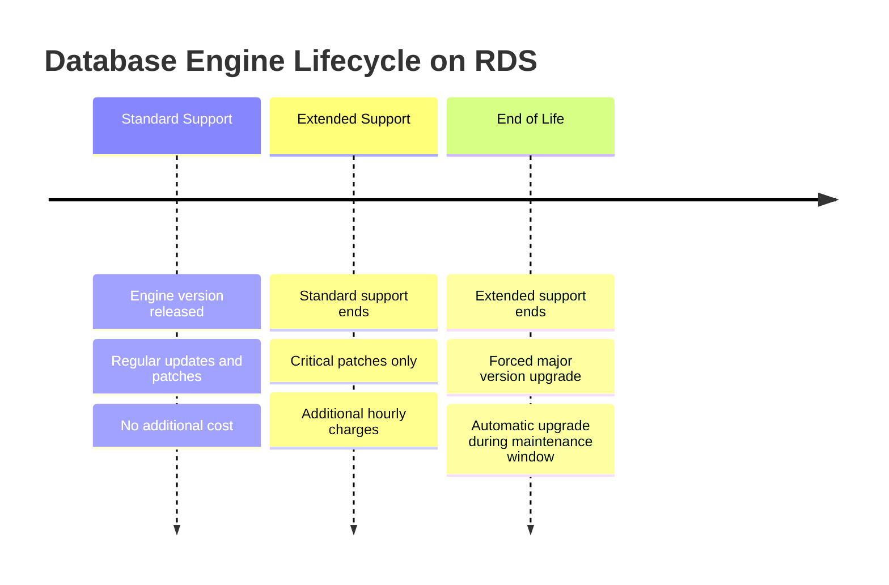

# How to Configure RDS Extended Support for Legacy Engine Versions

Author: [nawazdhandala](https://github.com/nawazdhandala)

Tags: AWS, RDS, Database, Migration, Extended Support, MySQL, PostgreSQL

Description: Understand how AWS RDS Extended Support works for end-of-life database engine versions and how to plan your migration timeline.

---

Every database engine has a lifecycle. When MySQL 5.7 or PostgreSQL 11 reaches end of standard support in AWS RDS, you have a decision to make: upgrade immediately or pay for Extended Support to buy yourself more time. Neither option is fun, but understanding how Extended Support works will help you make the right call for your situation.

RDS Extended Support is an AWS program that lets you continue running major database engine versions past their standard support end date. You keep getting critical security patches and bug fixes, but at an additional hourly cost. Think of it as paying rent on borrowed time while you plan your upgrade.

## How Extended Support Works

When a database engine version reaches its RDS end of standard support date, AWS does not immediately force you to upgrade. Instead, your instances automatically enter the Extended Support period. If you do nothing, you start paying the Extended Support charges.



## Which Engines Support Extended Support?

As of early 2026, RDS Extended Support is available for:

- **MySQL 5.7** - Standard support ended, Extended Support active
- **PostgreSQL 11** - Standard support ended, Extended Support active
- **MySQL 8.0** - Will need Extended Support when it reaches end of standard support
- **PostgreSQL 12, 13, 14** - Future candidates as they reach end of standard support
- **Aurora MySQL 2 (MySQL 5.7 compatible)** - Extended Support active
- **Aurora PostgreSQL (compatible with PostgreSQL 11)** - Extended Support active

## Checking Your Current Engine Versions

First, find out which of your instances might be affected.

```bash
# List all RDS instances with their engine versions
aws rds describe-db-instances \
  --query 'DBInstances[*].{ID:DBInstanceIdentifier,Engine:Engine,Version:EngineVersion,Class:DBInstanceClass}' \
  --output table
```

For Aurora clusters:

```bash
# List Aurora clusters and their engine versions
aws rds describe-db-clusters \
  --query 'DBClusters[*].{Cluster:DBClusterIdentifier,Engine:Engine,Version:EngineVersion}' \
  --output table
```

## Understanding the Costs

Extended Support pricing is straightforward but can add up quickly. The charges are per vCPU-hour on top of your normal RDS instance costs.

For a rough estimate of what Extended Support costs for your fleet:

```python
# Calculate estimated Extended Support costs for your RDS instances
import boto3

rds = boto3.client('rds')

# Extended Support rate per vCPU-hour (check current pricing)
EXTENDED_SUPPORT_RATE = 0.10  # Example rate, check AWS pricing page

# Instance type to vCPU mapping (partial list)
VCPU_MAP = {
    'db.t3.micro': 2,
    'db.t3.small': 2,
    'db.t3.medium': 2,
    'db.m5.large': 2,
    'db.m5.xlarge': 4,
    'db.m5.2xlarge': 8,
    'db.m5.4xlarge': 16,
    'db.r5.large': 2,
    'db.r5.xlarge': 4,
    'db.r5.2xlarge': 8,
}

# Engines and versions in Extended Support
EXTENDED_SUPPORT_VERSIONS = {
    'mysql': ['5.7'],
    'postgres': ['11'],
}

response = rds.describe_db_instances()
total_monthly_cost = 0

for instance in response['DBInstances']:
    engine = instance['Engine']
    version = instance['EngineVersion']
    major_version = version.rsplit('.', 1)[0] if '.' in version else version

    if engine in EXTENDED_SUPPORT_VERSIONS:
        for es_version in EXTENDED_SUPPORT_VERSIONS[engine]:
            if version.startswith(es_version):
                instance_class = instance['DBInstanceClass']
                vcpus = VCPU_MAP.get(instance_class, 2)
                monthly_cost = vcpus * EXTENDED_SUPPORT_RATE * 730
                total_monthly_cost += monthly_cost
                print(f"{instance['DBInstanceIdentifier']}: {engine} {version} "
                      f"on {instance_class} ({vcpus} vCPUs) = ${monthly_cost:.2f}/month")

print(f"\nTotal estimated Extended Support cost: ${total_monthly_cost:.2f}/month")
```

## Opting Out of Extended Support

If you are creating a new instance and want to make sure it does not accidentally use an Extended Support version, you can check available versions.

```bash
# List available MySQL versions and their support status
aws rds describe-db-engine-versions \
  --engine mysql \
  --query 'DBEngineVersions[*].{Version:EngineVersion,Status:Status,SupportedFeatures:SupportedFeatureNames}' \
  --output table
```

When creating new instances, always specify a version that is in standard support.

```bash
# Create a new instance with a supported engine version
aws rds create-db-instance \
  --db-instance-identifier my-new-mysql \
  --engine mysql \
  --engine-version 8.0.36 \
  --db-instance-class db.m5.large \
  --master-username admin \
  --master-user-password 'SecureP@ss123!' \
  --allocated-storage 100
```

## Planning Your Upgrade

The whole point of Extended Support is to give you time to plan a proper upgrade. Here is a practical timeline.

### Phase 1: Assessment (Weeks 1-2)

Identify all instances on Extended Support versions and catalog their dependencies.

```bash
# Find all parameter groups used by Extended Support instances
aws rds describe-db-instances \
  --query 'DBInstances[?starts_with(EngineVersion, `5.7`)].{Instance:DBInstanceIdentifier,ParamGroup:DBParameterGroups[0].DBParameterGroupName}' \
  --output table
```

### Phase 2: Testing (Weeks 3-6)

Create a snapshot of your production database and restore it as a test instance with the new engine version.

```bash
# Create a snapshot of the current instance
aws rds create-db-snapshot \
  --db-instance-identifier my-legacy-mysql \
  --db-snapshot-identifier pre-upgrade-snapshot

# Restore the snapshot with the new engine version
aws rds restore-db-instance-from-db-snapshot \
  --db-instance-identifier my-legacy-mysql-test-upgrade \
  --db-snapshot-identifier pre-upgrade-snapshot \
  --db-instance-class db.m5.large \
  --engine-version 8.0.36
```

Run your application test suite against the upgraded test instance and look for:
- Query compatibility issues
- Performance regressions
- Deprecated feature usage
- Character set and collation changes (especially MySQL 5.7 to 8.0)

### Phase 3: Pre-Upgrade Preparation (Week 7)

Check for upgrade compatibility issues.

```bash
# For MySQL, run the pre-upgrade check
aws rds describe-db-instances \
  --db-instance-identifier my-legacy-mysql \
  --query 'DBInstances[0].PendingModifiedValues'
```

For MySQL 5.7 to 8.0 specifically, watch out for:
- Reserved words that became keywords in 8.0
- utf8mb3 vs utf8mb4 default changes
- GROUP BY implicit sorting removal
- Removed query cache

### Phase 4: Execute the Upgrade (Week 8)

```bash
# Perform the major version upgrade during a maintenance window
aws rds modify-db-instance \
  --db-instance-identifier my-legacy-mysql \
  --engine-version 8.0.36 \
  --allow-major-version-upgrade \
  --apply-immediately
```

For Aurora clusters:

```bash
# Upgrade Aurora cluster engine version
aws rds modify-db-cluster \
  --db-cluster-identifier my-aurora-cluster \
  --engine-version 8.0.mysql_aurora.3.07.0 \
  --allow-major-version-upgrade \
  --apply-immediately
```

## Monitoring Extended Support Charges

You can track Extended Support costs in AWS Cost Explorer.

```bash
# Check Extended Support charges in Cost Explorer
aws ce get-cost-and-usage \
  --time-period Start=2026-01-01,End=2026-02-01 \
  --granularity MONTHLY \
  --metrics BlendedCost \
  --filter '{
    "Dimensions": {
      "Key": "SERVICE",
      "Values": ["Amazon Relational Database Service"]
    }
  }' \
  --group-by Type=DIMENSION,Key=USAGE_TYPE
```

Look for usage types containing "ExtendedSupport" in the results.

## Setting Up Upgrade Reminders

Create a CloudWatch alarm to remind you about instances on Extended Support.

```bash
# Create an EventBridge rule to check for Extended Support instances weekly
aws events put-rule \
  --name check-rds-extended-support \
  --schedule-expression "rate(7 days)" \
  --description "Weekly check for RDS instances on Extended Support"

aws events put-targets \
  --rule check-rds-extended-support \
  --targets '[{"Id":"1","Arn":"arn:aws:lambda:us-east-1:123456789012:function:check-extended-support"}]'
```

## Summary

RDS Extended Support is a safety net, not a long-term strategy. It keeps your databases running and patched while you plan and execute an upgrade, but the additional per-vCPU-hour charges add up. The best approach is to start planning your upgrade before standard support ends, use Extended Support only as a buffer for the transition, and track the costs to keep stakeholders motivated to complete the migration.

For related database topics, check out our guide on [setting up DMS for MySQL to Aurora migration](https://oneuptime.com/blog/post/set-up-dms-for-mysql-to-aurora-migration/view) which covers how to use AWS Database Migration Service during your upgrade process.
