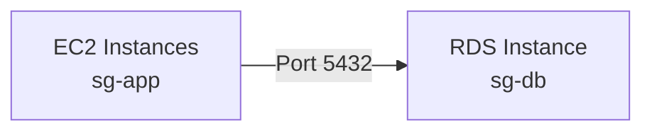

# How to Configure RDS Security Groups for Database Access

Author: [nawazdhandala](https://github.com/nawazdhandala)

Tags: AWS, RDS, Security Groups, Networking, Security

Description: Learn how to properly configure AWS security groups for RDS database access with least-privilege rules for different access patterns.

---

Security groups are the primary firewall for your RDS instances. Get them wrong and either nobody can connect, or worse, everyone can. This guide covers how to set up security groups properly for common RDS access patterns, from single-application setups to complex multi-tier architectures.

## How Security Groups Work with RDS

A quick refresher on security groups:

- They're stateful - if you allow inbound traffic, the response is automatically allowed outbound
- Rules are allow-only - you can't create deny rules
- All inbound traffic is denied by default
- All outbound traffic is allowed by default
- You can reference other security groups as sources, which is the recommended approach

When you create an RDS instance, you assign one or more security groups to it. These groups control what traffic can reach the database port (3306 for MySQL, 5432 for PostgreSQL, 1433 for SQL Server, 1521 for Oracle).

## Basic Setup: Single Application to RDS

The simplest pattern is one application tier connecting to one database.



Create two security groups and set up the rule.

These commands create the security groups and configure access from the app tier to the database tier.

```bash
# Create security group for the application
APP_SG=$(aws ec2 create-security-group \
  --group-name app-sg \
  --description "Application servers" \
  --vpc-id vpc-0abc123 \
  --query 'GroupId' --output text)

# Create security group for the database
DB_SG=$(aws ec2 create-security-group \
  --group-name db-sg \
  --description "RDS database instances" \
  --vpc-id vpc-0abc123 \
  --query 'GroupId' --output text)

# Allow the app security group to access PostgreSQL
aws ec2 authorize-security-group-ingress \
  --group-id $DB_SG \
  --protocol tcp \
  --port 5432 \
  --source-group $APP_SG
```

Why reference the security group instead of IP addresses? Because EC2 instances come and go (especially with auto scaling). When you reference a security group, any instance attached to that group automatically gets access. No need to update rules when instances are replaced.

## Multi-Application Access

When multiple applications need database access, add an inbound rule for each application's security group.

This configuration allows three different application tiers to access the database.

```bash
# Allow web tier
aws ec2 authorize-security-group-ingress \
  --group-id $DB_SG \
  --protocol tcp \
  --port 5432 \
  --source-group sg-web-tier

# Allow API tier
aws ec2 authorize-security-group-ingress \
  --group-id $DB_SG \
  --protocol tcp \
  --port 5432 \
  --source-group sg-api-tier

# Allow worker tier
aws ec2 authorize-security-group-ingress \
  --group-id $DB_SG \
  --protocol tcp \
  --port 5432 \
  --source-group sg-worker-tier
```

Each application tier has its own security group, making it clear who has database access. If you need to revoke access for the worker tier, you remove one rule without affecting the others.

## Lambda Function Access

Lambda functions running in a VPC get their own security group. The pattern is the same.

```bash
# Allow Lambda to access RDS
aws ec2 authorize-security-group-ingress \
  --group-id $DB_SG \
  --protocol tcp \
  --port 5432 \
  --source-group sg-lambda-functions
```

For a deep dive on Lambda and RDS connectivity, check out [connecting to RDS from Lambda](https://oneuptime.com/blog/post/connect-rds-instance-from-lambda-function/view).

## Bastion Host Access

For developer access through a bastion host, add a rule from the bastion's security group.

```bash
# Allow bastion to access RDS
aws ec2 authorize-security-group-ingress \
  --group-id $DB_SG \
  --protocol tcp \
  --port 5432 \
  --source-group sg-bastion-host
```

## Cross-VPC Access Through VPC Peering

When your application is in a different VPC connected through peering, you need to use CIDR blocks instead of security group references (security group references don't work across VPCs by default).

This rule allows access from the application VPC's CIDR range.

```bash
# Allow from peered VPC CIDR
aws ec2 authorize-security-group-ingress \
  --group-id $DB_SG \
  --protocol tcp \
  --port 5432 \
  --cidr 10.1.0.0/16
```

Be as specific as possible with the CIDR. If your application is in subnet 10.1.2.0/24, use that instead of the whole VPC CIDR.

```bash
# Better - use specific subnet CIDR
aws ec2 authorize-security-group-ingress \
  --group-id $DB_SG \
  --protocol tcp \
  --port 5432 \
  --cidr 10.1.2.0/24
```

## Multiple Database Engines

If you run multiple database engines, create separate security groups for each.

```bash
# Security group for PostgreSQL databases
PG_SG=$(aws ec2 create-security-group \
  --group-name pg-db-sg \
  --description "PostgreSQL RDS instances" \
  --vpc-id vpc-0abc123 \
  --query 'GroupId' --output text)

aws ec2 authorize-security-group-ingress \
  --group-id $PG_SG \
  --protocol tcp \
  --port 5432 \
  --source-group $APP_SG

# Security group for MySQL databases
MYSQL_SG=$(aws ec2 create-security-group \
  --group-name mysql-db-sg \
  --description "MySQL RDS instances" \
  --vpc-id vpc-0abc123 \
  --query 'GroupId' --output text)

aws ec2 authorize-security-group-ingress \
  --group-id $MYSQL_SG \
  --protocol tcp \
  --port 3306 \
  --source-group $APP_SG
```

## Terraform Example

If you're using Terraform, here's how to define security groups for RDS.

This Terraform configuration creates application and database security groups with proper references.

```hcl
# Application security group
resource "aws_security_group" "app" {
  name_prefix = "app-"
  vpc_id      = aws_vpc.main.id
  description = "Application servers"

  # Allow outbound to database
  egress {
    from_port       = 5432
    to_port         = 5432
    protocol        = "tcp"
    security_groups = [aws_security_group.db.id]
  }

  tags = {
    Name = "app-sg"
  }
}

# Database security group
resource "aws_security_group" "db" {
  name_prefix = "db-"
  vpc_id      = aws_vpc.main.id
  description = "RDS database instances"

  # Allow inbound from application
  ingress {
    from_port       = 5432
    to_port         = 5432
    protocol        = "tcp"
    security_groups = [aws_security_group.app.id]
  }

  tags = {
    Name = "db-sg"
  }
}

# Apply to RDS instance
resource "aws_db_instance" "main" {
  # ... other config ...
  vpc_security_group_ids = [aws_security_group.db.id]
}
```

Note: Terraform has a chicken-and-egg problem when two security groups reference each other. Use `aws_security_group_rule` resources instead of inline rules to avoid circular dependencies.

This approach avoids circular dependency issues in Terraform.

```hcl
resource "aws_security_group" "app" {
  name_prefix = "app-"
  vpc_id      = aws_vpc.main.id
  description = "Application servers"
}

resource "aws_security_group" "db" {
  name_prefix = "db-"
  vpc_id      = aws_vpc.main.id
  description = "RDS database instances"
}

resource "aws_security_group_rule" "db_from_app" {
  type                     = "ingress"
  from_port                = 5432
  to_port                  = 5432
  protocol                 = "tcp"
  security_group_id        = aws_security_group.db.id
  source_security_group_id = aws_security_group.app.id
}

resource "aws_security_group_rule" "app_to_db" {
  type                     = "egress"
  from_port                = 5432
  to_port                  = 5432
  protocol                 = "tcp"
  security_group_id        = aws_security_group.app.id
  source_security_group_id = aws_security_group.db.id
}
```

## Auditing Security Groups

Regularly review your RDS security groups to ensure they follow least privilege.

This script lists all inbound rules for your RDS security groups.

```bash
# Get security groups attached to RDS instances
aws rds describe-db-instances \
  --query 'DBInstances[*].[DBInstanceIdentifier,VpcSecurityGroups[*].VpcSecurityGroupId]' \
  --output table

# For each security group, list its rules
aws ec2 describe-security-groups \
  --group-ids sg-db-123 \
  --query 'SecurityGroups[*].IpPermissions[*].{Port:FromPort,Source:IpRanges[*].CidrIp,SourceSG:UserIdGroupPairs[*].GroupId}' \
  --output json
```

Look for these red flags:
- Rules with `0.0.0.0/0` (open to the world)
- Rules with wide port ranges instead of specific database ports
- Rules referencing security groups that no longer exist
- More rules than expected (indicates access creep)

For automated network access auditing, check out [Network Access Analyzer](https://oneuptime.com/blog/post/use-network-access-analyzer-identify-network-access-issues/view).

## Common Mistakes

1. **Using 0.0.0.0/0 for database access**: Never do this in production. Even in dev, use your specific IP or a VPN.
2. **Using IP addresses instead of security groups**: IPs change when instances are replaced. Security group references are dynamic.
3. **One giant security group for everything**: Separate your database security groups by environment and engine.
4. **Forgetting to restrict outbound**: The default allows all outbound, which is fine for most cases, but for compliance you might need to restrict it.
5. **Not cleaning up old rules**: When you decommission an application, remove its security group rule from the database.

## Security Group Limits

AWS has limits on security groups:
- 5 security groups per network interface (RDS uses one)
- 60 inbound rules per security group (can be increased)
- 60 outbound rules per security group (can be increased)

If you hit the 60-rule limit, consider consolidating applications into fewer security groups or using prefix lists for CIDR blocks.

## Wrapping Up

Security groups are your first and most important line of defense for RDS. The golden rule is simple: use security group references instead of IP addresses, be specific about ports, and regularly audit your rules. A well-configured security group setup makes your database accessible to exactly who needs it and nobody else.
