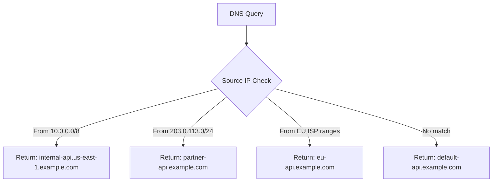

# How to Configure Route 53 CIDR-Based Routing

Author: [nawazdhandala](https://github.com/nawazdhandala)

Tags: AWS, Route 53, DNS, CIDR Routing, Networking, Traffic Management

Description: Learn how to configure Route 53 CIDR-based routing to direct DNS queries to specific endpoints based on the source IP address CIDR block of the requester.

---

Sometimes you need more control over DNS routing than geolocation provides. Your enterprise customers come from known IP ranges. Your partner networks have specific CIDR blocks. Your internal services live in predictable subnets. Route 53 CIDR-based routing lets you map source IP ranges directly to DNS responses, giving you precise control over where traffic goes.

## What is CIDR-Based Routing?

CIDR-based routing resolves DNS queries to different endpoints based on the source IP address of the DNS resolver making the query. You define CIDR blocks (IP ranges), group them into collections, and then create routing rules that return specific DNS records for queries originating from those ranges.



This is different from geolocation routing in important ways:
- Geolocation uses the geographic location associated with the resolver's IP
- CIDR-based routing uses the exact IP range of the resolver
- CIDR-based routing is more precise when you know your clients' IP ranges

## When to Use CIDR-Based Routing

**Enterprise customers with known IP ranges**: Route enterprise traffic to dedicated infrastructure.

**Partner network integration**: Different partners get routed to different API endpoints based on their network ranges.

**Internal vs. external traffic split**: Route internal company traffic to internal endpoints and external traffic to public endpoints.

**ISP-specific routing**: Route traffic from specific ISPs to the closest or best-performing endpoint for that ISP's network.

**Migration**: Gradually move traffic from specific networks to new infrastructure.

## Step 1: Create a CIDR Collection

A CIDR collection is a container that holds your CIDR blocks organized into locations.

```bash
# Create a CIDR collection
aws route53 create-cidr-collection \
    --name "traffic-routing-cidrs" \
    --caller-reference "cidr-collection-2026-02-12"

# Note the collection ID from the response
# Example: collection-id-0123456789abcdef0
```

## Step 2: Add CIDR Blocks to the Collection

Each CIDR block is associated with a location name. The location name is what you reference in your routing policy.

```bash
# Add CIDR blocks for different locations/purposes
aws route53 change-cidr-collection \
    --id collection-id-0123456789abcdef0 \
    --changes '[
        {
            "Action": "PUT",
            "LocationName": "internal-network",
            "CidrList": [
                "10.0.0.0/8",
                "172.16.0.0/12",
                "192.168.0.0/16"
            ]
        },
        {
            "Action": "PUT",
            "LocationName": "partner-acme",
            "CidrList": [
                "203.0.113.0/24",
                "198.51.100.0/24"
            ]
        },
        {
            "Action": "PUT",
            "LocationName": "partner-globex",
            "CidrList": [
                "192.0.2.0/24",
                "198.18.0.0/16"
            ]
        },
        {
            "Action": "PUT",
            "LocationName": "us-isp-comcast",
            "CidrList": [
                "73.0.0.0/8",
                "98.192.0.0/10"
            ]
        },
        {
            "Action": "PUT",
            "LocationName": "eu-networks",
            "CidrList": [
                "185.0.0.0/8",
                "195.0.0.0/8"
            ]
        }
    ]'
```

## Step 3: Create CIDR-Based Routing Records

Now create DNS records that use the CIDR collection for routing decisions.

```bash
# Create CIDR-based routing records in Route 53
aws route53 change-resource-record-sets \
    --hosted-zone-id Z1234567890 \
    --change-batch '{
        "Changes": [
            {
                "Action": "UPSERT",
                "ResourceRecordSet": {
                    "Name": "api.example.com",
                    "Type": "A",
                    "SetIdentifier": "internal",
                    "CidrRoutingConfig": {
                        "CollectionId": "collection-id-0123456789abcdef0",
                        "LocationName": "internal-network"
                    },
                    "TTL": 60,
                    "ResourceRecords": [
                        {"Value": "10.1.1.100"}
                    ]
                }
            },
            {
                "Action": "UPSERT",
                "ResourceRecordSet": {
                    "Name": "api.example.com",
                    "Type": "A",
                    "SetIdentifier": "partner-acme",
                    "CidrRoutingConfig": {
                        "CollectionId": "collection-id-0123456789abcdef0",
                        "LocationName": "partner-acme"
                    },
                    "TTL": 60,
                    "ResourceRecords": [
                        {"Value": "52.1.1.100"}
                    ]
                }
            },
            {
                "Action": "UPSERT",
                "ResourceRecordSet": {
                    "Name": "api.example.com",
                    "Type": "A",
                    "SetIdentifier": "partner-globex",
                    "CidrRoutingConfig": {
                        "CollectionId": "collection-id-0123456789abcdef0",
                        "LocationName": "partner-globex"
                    },
                    "TTL": 60,
                    "ResourceRecords": [
                        {"Value": "52.2.2.200"}
                    ]
                }
            },
            {
                "Action": "UPSERT",
                "ResourceRecordSet": {
                    "Name": "api.example.com",
                    "Type": "A",
                    "SetIdentifier": "default",
                    "CidrRoutingConfig": {
                        "CollectionId": "collection-id-0123456789abcdef0",
                        "LocationName": "*"
                    },
                    "TTL": 60,
                    "ResourceRecords": [
                        {"Value": "52.0.0.100"}
                    ]
                }
            }
        ]
    }'
```

The `"LocationName": "*"` acts as a catch-all for queries that do not match any defined CIDR block.

## Step 4: Verify the Configuration

```bash
# List CIDR blocks in the collection
aws route53 list-cidr-blocks \
    --collection-id collection-id-0123456789abcdef0

# List all locations in the collection
aws route53 list-cidr-locations \
    --collection-id collection-id-0123456789abcdef0

# Test DNS resolution (from different source IPs)
# Use dig with a specific source to test
dig api.example.com @ns-1234.awsdns-12.org

# Use Route 53 test DNS answer
aws route53 test-dns-answer \
    --hosted-zone-id Z1234567890 \
    --record-name api.example.com \
    --record-type A \
    --resolver-ip 203.0.113.50
```

The `test-dns-answer` command is extremely useful for validating CIDR-based routing. Provide different resolver IPs to verify that each CIDR block returns the correct record.

## Managing CIDR Collections

### Updating CIDR Blocks

```bash
# Add new CIDR blocks to an existing location
aws route53 change-cidr-collection \
    --id collection-id-0123456789abcdef0 \
    --changes '[
        {
            "Action": "PUT",
            "LocationName": "partner-acme",
            "CidrList": [
                "203.0.113.0/24",
                "198.51.100.0/24",
                "100.64.0.0/16"
            ]
        }
    ]'
```

Note: PUT replaces the entire CIDR list for that location. Always include all CIDR blocks you want to keep.

### Removing CIDR Blocks

```bash
# Delete a location from the collection
aws route53 change-cidr-collection \
    --id collection-id-0123456789abcdef0 \
    --changes '[
        {
            "Action": "DELETE_IF_EXISTS",
            "LocationName": "us-isp-comcast",
            "CidrList": [
                "73.0.0.0/8",
                "98.192.0.0/10"
            ]
        }
    ]'
```

## Using Terraform

```hcl
resource "aws_route53_cidr_collection" "main" {
  name = "traffic-routing-cidrs"
}

resource "aws_route53_cidr_location" "internal" {
  cidr_collection_id = aws_route53_cidr_collection.main.id
  name               = "internal-network"
  cidr_blocks        = ["10.0.0.0/8", "172.16.0.0/12"]
}

resource "aws_route53_cidr_location" "partner" {
  cidr_collection_id = aws_route53_cidr_collection.main.id
  name               = "partner-acme"
  cidr_blocks        = ["203.0.113.0/24"]
}

resource "aws_route53_record" "api_internal" {
  zone_id        = aws_route53_zone.main.zone_id
  name           = "api.example.com"
  type           = "A"
  ttl            = 60
  set_identifier = "internal"

  cidr_routing_policy {
    collection_id = aws_route53_cidr_collection.main.id
    location_name = "internal-network"
  }

  records = ["10.1.1.100"]
}

resource "aws_route53_record" "api_default" {
  zone_id        = aws_route53_zone.main.zone_id
  name           = "api.example.com"
  type           = "A"
  ttl            = 60
  set_identifier = "default"

  cidr_routing_policy {
    collection_id = aws_route53_cidr_collection.main.id
    location_name = "*"
  }

  records = ["52.0.0.100"]
}
```

## Combining with Health Checks

Add Route 53 health checks to your CIDR-based routing records for automatic failover:

```bash
# Create a health check for the internal endpoint
aws route53 create-health-check \
    --caller-reference "internal-api-health-2026" \
    --health-check-config '{
        "IPAddress": "10.1.1.100",
        "Port": 443,
        "Type": "HTTPS",
        "ResourcePath": "/health",
        "RequestInterval": 10,
        "FailureThreshold": 3
    }'

# Associate health check with the CIDR routing record
# Include HealthCheckId in your record set configuration
```

## Monitoring CIDR-Based Routing

Track how your CIDR-based routing is performing using Route 53 query logging. See our guide on [monitoring Route 53 DNS query logging](https://oneuptime.com/blog/post/monitor-route-53-dns-query-logging/view) for setting up comprehensive DNS monitoring.

```bash
# Query CloudWatch for DNS query metrics
aws cloudwatch get-metric-statistics \
    --namespace AWS/Route53 \
    --metric-name DNSQueries \
    --dimensions Name=HostedZoneId,Value=Z1234567890 \
    --start-time "2026-02-12T00:00:00Z" \
    --end-time "2026-02-13T00:00:00Z" \
    --period 3600 \
    --statistics Sum
```

## Limitations

- Maximum of 5,000 CIDR blocks per collection
- Maximum of 100 locations per collection
- CIDR blocks must be IPv4 (/0 to /24) or IPv6 (/0 to /48)
- The source IP used for routing is the resolver's IP, not the end-user's IP (unless EDNS Client Subnet is supported)
- CIDR collections are global but hosted zones are regional in terms of management

## EDNS Client Subnet Considerations

Route 53 CIDR-based routing uses the source IP of the DNS resolver, not the end user's IP. However, if the resolver supports EDNS Client Subnet (ECS), Route 53 can use the truncated client subnet from the query to make routing decisions.

Most public DNS resolvers (Google 8.8.8.8, Cloudflare 1.1.1.1) support ECS. This means CIDR-based routing can often match on the actual end-user network, not just the resolver network.

## Conclusion

CIDR-based routing gives you IP-level precision in DNS routing that geolocation and latency-based routing cannot match. It is the right tool when you have known client IP ranges and need deterministic routing behavior. Start by mapping your clients' IP ranges into a CIDR collection, create routing records for each location, and always include a default catch-all. Test thoroughly with `test-dns-answer` before relying on it for production traffic.
