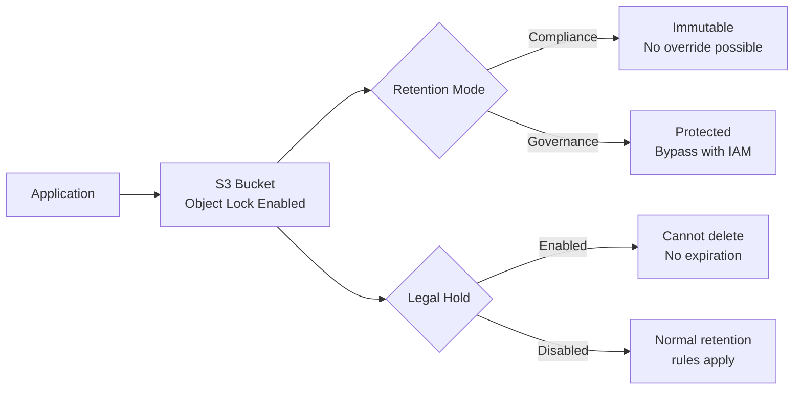

# How to Configure S3 Object Lock for WORM Compliance

Author: [nawazdhandala](https://github.com/nawazdhandala)

Tags: AWS, S3, Compliance, Security, Data Protection

Description: A complete guide to configuring S3 Object Lock for Write Once Read Many (WORM) compliance, covering governance and compliance modes with practical examples.

---

Regulatory frameworks like SEC 17a-4, HIPAA, and FINRA require that certain records can't be modified or deleted for a specified period. That's WORM storage - Write Once, Read Many. AWS S3 Object Lock lets you enforce this at the bucket level, making sure nobody (not even root account users in some cases) can tamper with your data.

Let's walk through how to set it up, what the different modes mean, and how to avoid the common mistakes that trip people up.

## What Is S3 Object Lock?

S3 Object Lock prevents objects from being deleted or overwritten for a fixed retention period or indefinitely. It works on top of versioning - every object version gets its own lock status. There's no way to shorten a retention period once it's been set in compliance mode, which is exactly what auditors want to hear.

There are two main concepts:

- **Retention period**: A fixed window during which an object version can't be modified or deleted
- **Legal hold**: A flag that prevents deletion regardless of retention settings, with no expiration date

And two retention modes:

- **Governance mode**: Most users can't delete or overwrite, but users with specific IAM permissions can bypass the lock
- **Compliance mode**: Nobody can delete or overwrite the object, not even the root user. The retention period can't be shortened. Period.

## When to Use Each Mode

**Governance mode** is great for:
- Internal data protection policies
- Preventing accidental deletions
- Testing before switching to compliance mode

**Compliance mode** is for:
- Regulated industries (finance, healthcare, legal)
- Audit requirements where you need to prove immutability
- Any scenario where "nobody can delete this" actually means nobody

## Step 1: Create a Bucket with Object Lock Enabled

Object Lock must be enabled at bucket creation time. You can't enable it on an existing bucket.

```bash
# Create a bucket with Object Lock enabled
# Note: Object Lock automatically enables versioning
aws s3api create-bucket \
  --bucket my-compliance-bucket \
  --region us-east-1 \
  --object-lock-enabled-for-object-configuration '{"ObjectLockEnabled": "Enabled"}'
```

Important: once Object Lock is enabled, you can't disable it. And versioning can't be suspended on a bucket with Object Lock. Plan accordingly.

## Step 2: Set a Default Retention Policy

You can set a default retention configuration on the bucket so every new object automatically gets locked.

This example sets a 365-day compliance mode retention on all new objects.

```bash
# Set default retention - Compliance mode, 365 days
aws s3api put-object-lock-configuration \
  --bucket my-compliance-bucket \
  --object-lock-configuration '{
    "ObjectLockEnabled": "Enabled",
    "Rule": {
      "DefaultRetention": {
        "Mode": "COMPLIANCE",
        "Days": 365
      }
    }
  }'
```

You can also use `Years` instead of `Days`.

```bash
# Set default retention using years
aws s3api put-object-lock-configuration \
  --bucket my-compliance-bucket \
  --object-lock-configuration '{
    "ObjectLockEnabled": "Enabled",
    "Rule": {
      "DefaultRetention": {
        "Mode": "GOVERNANCE",
        "Years": 7
      }
    }
  }'
```

## Step 3: Upload Objects with Retention

When uploading objects, you can specify retention settings per object, overriding the bucket default.

```bash
# Upload with specific retention date
aws s3api put-object \
  --bucket my-compliance-bucket \
  --key financial-records/2025-q4-report.pdf \
  --body ./2025-q4-report.pdf \
  --object-lock-mode COMPLIANCE \
  --object-lock-retain-until-date "2032-12-31T00:00:00Z"
```

Here's how to do it with the Python SDK.

```python
import boto3
from datetime import datetime, timedelta

s3 = boto3.client('s3')

# Calculate retention date - 7 years from now
retain_until = datetime.utcnow() + timedelta(days=2555)

# Upload with COMPLIANCE retention
s3.put_object(
    Bucket='my-compliance-bucket',
    Key='audit-logs/2025-audit.log',
    Body=open('2025-audit.log', 'rb'),
    ObjectLockMode='COMPLIANCE',
    ObjectLockRetainUntilDate=retain_until
)

print(f"Object locked until {retain_until.isoformat()}")
```

## Step 4: Check Retention Status

You can verify the lock status of any object version.

```bash
# Check retention status of an object
aws s3api head-object \
  --bucket my-compliance-bucket \
  --key financial-records/2025-q4-report.pdf
```

The response includes `ObjectLockMode`, `ObjectLockRetainUntilDate`, and `ObjectLockLegalHoldStatus` fields.

For a more detailed view using Python:

```python
import boto3

s3 = boto3.client('s3')

# Get object retention details
retention = s3.get_object_retention(
    Bucket='my-compliance-bucket',
    Key='financial-records/2025-q4-report.pdf'
)

mode = retention['Retention']['Mode']
until = retention['Retention']['RetainUntilDate']
print(f"Lock mode: {mode}")
print(f"Retained until: {until}")
```

## Step 5: Working with Governance Mode Bypass

In governance mode, privileged users can bypass the lock. This requires the `s3:BypassGovernanceRetention` permission.

```bash
# Delete an object in governance mode (requires bypass permission)
aws s3api delete-object \
  --bucket my-governance-bucket \
  --key test-data/sample.csv \
  --version-id "abc123" \
  --bypass-governance-retention
```

Here's the IAM policy that grants bypass permission.

```json
{
  "Version": "2012-10-17",
  "Statement": [
    {
      "Sid": "AllowGovernanceBypass",
      "Effect": "Allow",
      "Action": [
        "s3:BypassGovernanceRetention"
      ],
      "Resource": "arn:aws:s3:::my-governance-bucket/*"
    }
  ]
}
```

## Step 6: Extending Retention Periods

You can always extend a retention period, but you can never shorten it in compliance mode.

```bash
# Extend retention on an existing object
aws s3api put-object-retention \
  --bucket my-compliance-bucket \
  --key financial-records/2025-q4-report.pdf \
  --retention '{
    "Mode": "COMPLIANCE",
    "RetainUntilDate": "2035-12-31T00:00:00Z"
  }'
```

## How Object Lock Fits Into Your Compliance Architecture



## Common Mistakes to Avoid

**1. Trying to enable Object Lock on existing buckets**

You can't. Object Lock must be set at bucket creation. If you need to migrate existing data, create a new bucket with Object Lock enabled and copy objects over with the appropriate retention settings.

**2. Setting compliance mode during testing**

Don't use compliance mode in development. Once set, you literally cannot delete those objects until the retention period expires. Use governance mode for testing, switch to compliance for production.

**3. Forgetting about storage costs**

Objects under retention can't be deleted. If you set a 7-year compliance retention on terabytes of data, you're paying for 7 years of storage. Budget for it.

**4. Not using legal holds alongside retention**

Legal holds and retention serve different purposes. Retention has an expiration date. Legal holds don't. For litigation purposes, you often need both. For more on this, see our post on [using S3 Legal Hold for compliance](https://oneuptime.com/blog/post/2026-02-12-s3-legal-hold-compliance/view).

## Monitoring Object Lock

Set up CloudWatch alarms and S3 event notifications to track lock-related activities. You'll want to know when someone tries (and fails) to delete a locked object.

```python
import boto3

# Enable CloudTrail logging for S3 data events
# This captures all Object Lock API calls
cloudtrail = boto3.client('cloudtrail')

cloudtrail.put_event_selectors(
    TrailName='my-compliance-trail',
    EventSelectors=[
        {
            'ReadWriteType': 'WriteOnly',
            'IncludeManagementEvents': True,
            'DataResources': [
                {
                    'Type': 'AWS::S3::Object',
                    'Values': ['arn:aws:s3:::my-compliance-bucket/']
                }
            ]
        }
    ]
)
```

For comprehensive monitoring of your compliance infrastructure, consider integrating with [OneUptime's monitoring platform](https://oneuptime.com/blog/post/2026-02-13-aws-cloudwatch-infrastructure-monitoring/view) to get alerts when something goes wrong.

## Wrapping Up

S3 Object Lock is the real deal for WORM compliance. Compliance mode gives you the strongest guarantee - genuinely immutable storage that even AWS support can't override. Governance mode offers flexibility for internal policies where you still want an escape hatch.

The key decisions are: which mode do you need, how long should retention last, and do you need legal holds on top of retention? Get those right, and you've got a storage layer that satisfies even the most demanding auditors.
