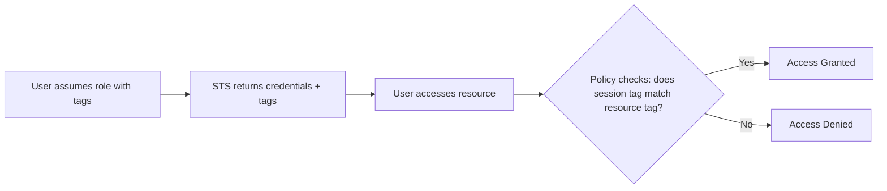

# How to Configure Session Tags for Attribute-Based Access Control

Author: [nawazdhandala](https://github.com/nawazdhandala)

Tags: AWS, IAM, ABAC, Security

Description: Learn how to use session tags with AWS STS for attribute-based access control, enabling dynamic permissions based on user attributes like department or project.

---

Traditional IAM policies are role-based: you create a role, attach policies, and assign users. That works fine until you have 50 teams, 200 projects, and hundreds of resources that each need different access patterns. Creating a unique role for every combination doesn't scale.

Attribute-based access control (ABAC) with session tags changes the game. Instead of creating roles for "team-alpha-project-x-s3-access" and "team-beta-project-y-dynamodb-access," you create one policy that references tags. When users assume a role, they pass in tags that describe who they are, and the policy dynamically grants access to matching resources.

## How Session Tags Work

When you call `sts:AssumeRole`, you can include tags. These tags become available as condition keys in IAM policies. If your resources are also tagged, you can write policies like "allow access to any resource tagged with the same project as the user's session."



## Setting Up ABAC

### Step 1: Tag Your Resources

First, make sure your AWS resources have consistent tags:

```bash
# Tag S3 buckets with project and department
aws s3api put-bucket-tagging \
  --bucket project-alpha-data \
  --tagging '{
    "TagSet": [
      {"Key": "Project", "Value": "alpha"},
      {"Key": "Department", "Value": "engineering"}
    ]
  }'

aws s3api put-bucket-tagging \
  --bucket project-beta-data \
  --tagging '{
    "TagSet": [
      {"Key": "Project", "Value": "beta"},
      {"Key": "Department", "Value": "engineering"}
    ]
  }'

# Tag EC2 instances
aws ec2 create-tags \
  --resources i-1234567890abcdef0 \
  --tags Key=Project,Value=alpha Key=Department,Value=engineering

# Tag DynamoDB tables
aws dynamodb tag-resource \
  --resource-arn arn:aws:dynamodb:us-east-1:123456789012:table/alpha-users \
  --tags Key=Project,Value=alpha Key=Department,Value=engineering
```

### Step 2: Create an ABAC Role

The role's trust policy must allow session tags:

```json
{
  "Version": "2012-10-17",
  "Statement": [
    {
      "Effect": "Allow",
      "Principal": {
        "AWS": "arn:aws:iam::123456789012:root"
      },
      "Action": "sts:AssumeRole",
      "Condition": {
        "StringEquals": {
          "aws:RequestTag/Department": [
            "engineering",
            "data-science",
            "security"
          ]
        }
      }
    },
    {
      "Effect": "Allow",
      "Principal": {
        "AWS": "arn:aws:iam::123456789012:root"
      },
      "Action": "sts:TagSession",
      "Condition": {
        "StringLike": {
          "aws:RequestTag/Project": "*"
        }
      }
    }
  ]
}
```

Create the role:

```bash
# Create the ABAC-enabled role
aws iam create-role \
  --role-name ABAC-ProjectAccess \
  --assume-role-policy-document file://abac-trust-policy.json
```

### Step 3: Create Tag-Aware Policies

Here's where ABAC gets powerful. This single policy handles access for every project:

```json
{
  "Version": "2012-10-17",
  "Statement": [
    {
      "Sid": "S3AccessMatchingProject",
      "Effect": "Allow",
      "Action": [
        "s3:GetObject",
        "s3:PutObject",
        "s3:ListBucket"
      ],
      "Resource": "*",
      "Condition": {
        "StringEquals": {
          "s3:ResourceTag/Project": "${aws:PrincipalTag/Project}"
        }
      }
    },
    {
      "Sid": "EC2AccessMatchingProject",
      "Effect": "Allow",
      "Action": [
        "ec2:DescribeInstances",
        "ec2:StartInstances",
        "ec2:StopInstances"
      ],
      "Resource": "*",
      "Condition": {
        "StringEquals": {
          "ec2:ResourceTag/Project": "${aws:PrincipalTag/Project}"
        }
      }
    },
    {
      "Sid": "DynamoDBAccessMatchingProject",
      "Effect": "Allow",
      "Action": [
        "dynamodb:GetItem",
        "dynamodb:PutItem",
        "dynamodb:UpdateItem",
        "dynamodb:Query",
        "dynamodb:Scan"
      ],
      "Resource": "*",
      "Condition": {
        "StringEquals": {
          "dynamodb:ResourceTag/Project": "${aws:PrincipalTag/Project}"
        }
      }
    },
    {
      "Sid": "ReadOnlyForDepartment",
      "Effect": "Allow",
      "Action": [
        "s3:ListAllMyBuckets",
        "ec2:DescribeInstances",
        "dynamodb:ListTables"
      ],
      "Resource": "*",
      "Condition": {
        "StringEquals": {
          "aws:PrincipalTag/Department": "${aws:PrincipalTag/Department}"
        }
      }
    }
  ]
}
```

The magic is `${aws:PrincipalTag/Project}`. This resolves to whatever value the session tag "Project" holds. If the user assumed the role with `Project=alpha`, they can only access resources tagged with `Project=alpha`.

### Step 4: Assume the Role with Tags

```python
import boto3

def assume_role_with_tags(project, department, team):
    """
    Assume the ABAC role with session tags that control access scope.
    """
    sts = boto3.client("sts")

    response = sts.assume_role(
        RoleArn="arn:aws:iam::123456789012:role/ABAC-ProjectAccess",
        RoleSessionName=f"{project}-session",
        Tags=[
            {"Key": "Project", "Value": project},
            {"Key": "Department", "Value": department},
            {"Key": "Team", "Value": team}
        ],
        DurationSeconds=3600
    )

    creds = response["Credentials"]

    # Create a session with the tagged credentials
    session = boto3.Session(
        aws_access_key_id=creds["AccessKeyId"],
        aws_secret_access_key=creds["SecretAccessKey"],
        aws_session_token=creds["SessionToken"]
    )

    return session


# Developer on project alpha can only access alpha resources
alpha_session = assume_role_with_tags("alpha", "engineering", "backend")
s3 = alpha_session.client("s3")

# This works - bucket is tagged Project=alpha
s3.list_objects_v2(Bucket="project-alpha-data")

# This fails - bucket is tagged Project=beta
# s3.list_objects_v2(Bucket="project-beta-data")  # AccessDenied
```

## ABAC with SAML Federation

When using SAML-based federation, your IdP can pass session tags as SAML attributes. This means the IdP controls what project/team a user belongs to:

```
# SAML attribute mapping in your IdP
https://aws.amazon.com/SAML/Attributes/PrincipalTag:Project    -> user.project
https://aws.amazon.com/SAML/Attributes/PrincipalTag:Department -> user.department
https://aws.amazon.com/SAML/Attributes/PrincipalTag:Team       -> user.team
```

The trust policy needs to allow the transitive tag keys:

```json
{
  "Version": "2012-10-17",
  "Statement": [
    {
      "Effect": "Allow",
      "Principal": {
        "Federated": "arn:aws:iam::123456789012:saml-provider/CompanyIdP"
      },
      "Action": [
        "sts:AssumeRoleWithSAML",
        "sts:TagSession"
      ],
      "Condition": {
        "StringEquals": {
          "SAML:aud": "https://signin.aws.amazon.com/saml"
        }
      }
    }
  ]
}
```

## ABAC with IAM Identity Center

IAM Identity Center supports ABAC natively. You can map user attributes to session tags in your permission set:

```bash
SSO_INSTANCE_ARN=$(aws sso-admin list-instances \
  --query 'Instances[0].InstanceArn' --output text)

# Enable attributes for access control in Identity Center
aws sso-admin create-instance-access-control-attribute-configuration \
  --instance-arn "$SSO_INSTANCE_ARN" \
  --instance-access-control-attribute-configuration '{
    "AccessControlAttributes": [
      {
        "Key": "Project",
        "Value": {"Source": ["${path:enterprise.project}"]}
      },
      {
        "Key": "Department",
        "Value": {"Source": ["${path:enterprise.department}"]}
      }
    ]
  }'
```

## Transitive Session Tags

When a role is assumed with session tags, those tags can be made "transitive" so they carry forward when the role chains to another role:

```python
# Assume role with transitive tags
response = sts.assume_role(
    RoleArn="arn:aws:iam::123456789012:role/ABAC-ProjectAccess",
    RoleSessionName="chain-session",
    Tags=[
        {"Key": "Project", "Value": "alpha"},
        {"Key": "Department", "Value": "engineering"}
    ],
    TransitiveTagKeys=["Project", "Department"]
)

# When this session assumes another role, Project and Department tags carry forward
```

## Cost Tag Enforcement

ABAC is great for cost management too. Require that users tag resources they create with their project tag:

```json
{
  "Sid": "RequireProjectTagOnCreate",
  "Effect": "Deny",
  "Action": [
    "ec2:RunInstances",
    "s3:CreateBucket",
    "dynamodb:CreateTable"
  ],
  "Resource": "*",
  "Condition": {
    "StringNotEquals": {
      "aws:RequestTag/Project": "${aws:PrincipalTag/Project}"
    }
  }
}
```

This ensures that any resource a user creates is automatically tagged with their project, keeping costs attributable.

## Limitations

- Not all AWS services support resource tags in condition keys (check the service documentation)
- S3 bucket-level tagging works differently than object-level tagging
- Tag propagation can have eventual consistency delays
- Maximum 50 session tags per `AssumeRole` call
- Tag keys are case-sensitive

## ABAC vs RBAC

| Aspect | RBAC (Traditional) | ABAC (Tag-Based) |
|--------|---------------------|---------------------|
| Number of roles | One per access pattern | One per access level |
| New project setup | Create new role | Tag resources, done |
| Policy changes | Per-role updates | Single policy update |
| Scalability | O(teams x projects) | O(1) |
| Complexity | Simple to understand | More abstract |

ABAC shines when you have many teams and projects with similar access patterns. If you only have 3 teams and 2 accounts, RBAC is simpler and perfectly fine.

For more on IAM policies in general, check out our guide on [resource-based vs identity-based policies](https://oneuptime.com/blog/post/resource-based-policies-vs-identity-based-policies/view).
