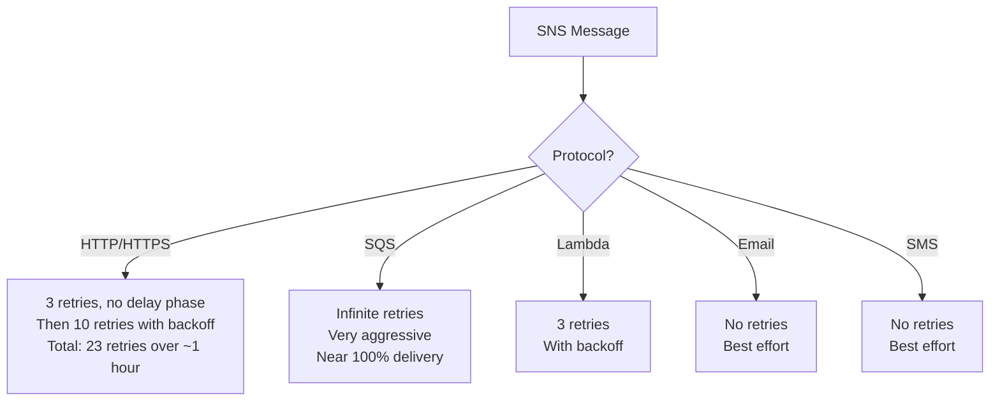

# How to Configure SNS Message Delivery Policies

Author: [nawazdhandala](https://github.com/nawazdhandala)

Tags: AWS, SNS, Messaging, Reliability

Description: Learn how to configure SNS delivery policies including retry strategies, backoff functions, dead letter queues, and delivery status logging for reliable messaging.

---

When SNS delivers a message to a subscriber and the delivery fails, it doesn't just give up. It retries according to a delivery policy - a set of rules that control how many times SNS retries, how long it waits between retries, and what happens when all retries are exhausted.

The default policies work fine for most cases, but for production systems you'll want to tune them for your specific reliability requirements.

## Default Delivery Policies by Protocol

Each subscription protocol has different default retry behavior.



HTTP/HTTPS endpoints have the most configurable retry policies since they're the most likely to experience transient failures.

## Configuring HTTP/HTTPS Delivery Policies

The delivery policy for HTTP endpoints has four retry phases.

```bash
# Set a custom delivery policy on an HTTP/HTTPS subscription
aws sns set-subscription-attributes \
  --subscription-arn arn:aws:sns:us-east-1:123456789012:alerts:abc123 \
  --attribute-name DeliveryPolicy \
  --attribute-value '{
    "healthyRetryPolicy": {
      "numRetries": 15,
      "numNoDelayRetries": 2,
      "minDelayTarget": 5,
      "maxDelayTarget": 600,
      "numMinDelayRetries": 3,
      "numMaxDelayRetries": 5,
      "backoffFunction": "exponential"
    },
    "throttlePolicy": {
      "maxReceivesPerSecond": 10
    }
  }'
```

Let's break down each setting.

**numNoDelayRetries** (2): The first 2 retries happen immediately with no delay. Good for transient network glitches.

**numMinDelayRetries** (3): The next 3 retries wait `minDelayTarget` seconds (5 seconds) between attempts.

**numMaxDelayRetries** (5): The last 5 retries wait `maxDelayTarget` seconds (600 seconds) between attempts.

**Remaining retries**: The retries between min and max delay phases use the backoff function to gradually increase the delay.

**backoffFunction**: Controls how delay increases. Options are `linear`, `arithmetic`, `geometric`, and `exponential`.

```python
import json
import boto3

sns = boto3.client('sns')

def set_delivery_policy(subscription_arn, config):
    """Set a custom delivery policy for an HTTP subscription.

    Config options:
    - aggressive: Fast retries for time-critical messages
    - balanced: Good default for most use cases
    - patient: Long backoff for endpoints that may be down for a while
    """
    policies = {
        'aggressive': {
            'healthyRetryPolicy': {
                'numRetries': 10,
                'numNoDelayRetries': 3,
                'minDelayTarget': 1,
                'maxDelayTarget': 30,
                'numMinDelayRetries': 4,
                'numMaxDelayRetries': 2,
                'backoffFunction': 'linear',
            }
        },
        'balanced': {
            'healthyRetryPolicy': {
                'numRetries': 15,
                'numNoDelayRetries': 2,
                'minDelayTarget': 5,
                'maxDelayTarget': 300,
                'numMinDelayRetries': 3,
                'numMaxDelayRetries': 5,
                'backoffFunction': 'exponential',
            }
        },
        'patient': {
            'healthyRetryPolicy': {
                'numRetries': 50,
                'numNoDelayRetries': 0,
                'minDelayTarget': 20,
                'maxDelayTarget': 3600,
                'numMinDelayRetries': 5,
                'numMaxDelayRetries': 25,
                'backoffFunction': 'exponential',
            }
        },
    }

    policy = policies.get(config, policies['balanced'])

    sns.set_subscription_attributes(
        SubscriptionArn=subscription_arn,
        AttributeName='DeliveryPolicy',
        AttributeValue=json.dumps(policy),
    )
    print(f'Set {config} delivery policy on {subscription_arn}')

# Set a patient policy for a webhook that might be down during maintenance
set_delivery_policy(
    'arn:aws:sns:us-east-1:123456789012:alerts:abc123',
    'patient'
)
```

## Topic-Level Default Policy

You can set a default delivery policy at the topic level that applies to all HTTP/HTTPS subscriptions unless overridden.

```bash
# Set a default delivery policy for all HTTP subscriptions on this topic
aws sns set-topic-attributes \
  --topic-arn arn:aws:sns:us-east-1:123456789012:order-notifications \
  --attribute-name DeliveryPolicy \
  --attribute-value '{
    "http": {
      "defaultHealthyRetryPolicy": {
        "numRetries": 15,
        "numNoDelayRetries": 2,
        "minDelayTarget": 5,
        "maxDelayTarget": 300,
        "numMinDelayRetries": 3,
        "numMaxDelayRetries": 5,
        "backoffFunction": "exponential"
      },
      "defaultThrottlePolicy": {
        "maxReceivesPerSecond": 10
      }
    }
  }'
```

## Setting Up Dead Letter Queues

When all retries are exhausted, the message is lost by default. A dead letter queue (DLQ) captures these failed messages so you can investigate and reprocess them.

```bash
# Create an SQS queue for failed SNS deliveries
aws sqs create-queue --queue-name sns-delivery-failures

# Get the queue ARN
QUEUE_ARN=$(aws sqs get-queue-attributes \
  --queue-url https://sqs.us-east-1.amazonaws.com/123456789012/sns-delivery-failures \
  --attribute-names QueueArn \
  --query 'Attributes.QueueArn' \
  --output text)

# Allow SNS to send messages to the DLQ
aws sqs set-queue-attributes \
  --queue-url https://sqs.us-east-1.amazonaws.com/123456789012/sns-delivery-failures \
  --attributes "{
    \"Policy\": \"{\\\"Version\\\":\\\"2012-10-17\\\",\\\"Statement\\\":[{\\\"Effect\\\":\\\"Allow\\\",\\\"Principal\\\":{\\\"Service\\\":\\\"sns.amazonaws.com\\\"},\\\"Action\\\":\\\"sqs:SendMessage\\\",\\\"Resource\\\":\\\"${QUEUE_ARN}\\\"}]}\"
  }"

# Attach the DLQ to the subscription
aws sns set-subscription-attributes \
  --subscription-arn arn:aws:sns:us-east-1:123456789012:alerts:abc123 \
  --attribute-name RedrivePolicy \
  --attribute-value "{\"deadLetterTargetArn\": \"${QUEUE_ARN}\"}"
```

## Delivery Status Logging

SNS can log delivery status to CloudWatch Logs for debugging. This is incredibly useful for diagnosing why messages aren't reaching subscribers.

```bash
# Enable delivery status logging for a topic
# First, create an IAM role that SNS can use to write to CloudWatch Logs

# Set the topic attributes for delivery logging
aws sns set-topic-attributes \
  --topic-arn arn:aws:sns:us-east-1:123456789012:order-notifications \
  --attribute-name HTTPSuccessFeedbackRoleArn \
  --attribute-value arn:aws:iam::123456789012:role/SNSDeliveryLoggingRole

aws sns set-topic-attributes \
  --topic-arn arn:aws:sns:us-east-1:123456789012:order-notifications \
  --attribute-name HTTPFailureFeedbackRoleArn \
  --attribute-value arn:aws:iam::123456789012:role/SNSDeliveryLoggingRole

# Set the sampling rate (0-100, percentage of successful deliveries to log)
aws sns set-topic-attributes \
  --topic-arn arn:aws:sns:us-east-1:123456789012:order-notifications \
  --attribute-name HTTPSuccessFeedbackSampleRate \
  --attribute-value "10"
```

You can enable logging for each protocol type.

```python
import boto3

sns = boto3.client('sns')

def enable_delivery_logging(topic_arn, role_arn, protocols=None):
    """Enable delivery status logging for specified protocols.

    Protocols: HTTP, SQS, Lambda, Application (push)
    """
    if protocols is None:
        protocols = ['HTTP', 'SQS', 'Lambda', 'Application']

    for protocol in protocols:
        # Enable success logging
        sns.set_topic_attributes(
            TopicArn=topic_arn,
            AttributeName=f'{protocol}SuccessFeedbackRoleArn',
            AttributeValue=role_arn,
        )
        # Log 10% of successful deliveries
        sns.set_topic_attributes(
            TopicArn=topic_arn,
            AttributeName=f'{protocol}SuccessFeedbackSampleRate',
            AttributeValue='10',
        )
        # Enable failure logging (100% of failures)
        sns.set_topic_attributes(
            TopicArn=topic_arn,
            AttributeName=f'{protocol}FailureFeedbackRoleArn',
            AttributeValue=role_arn,
        )

    print(f'Enabled delivery logging for {protocols} on {topic_arn}')

enable_delivery_logging(
    'arn:aws:sns:us-east-1:123456789012:order-notifications',
    'arn:aws:iam::123456789012:role/SNSDeliveryLoggingRole'
)
```

## Setting Up with CDK

CDK makes delivery policies and DLQs clean to configure.

```typescript
import * as cdk from 'aws-cdk-lib';
import * as sns from 'aws-cdk-lib/aws-sns';
import * as sqs from 'aws-cdk-lib/aws-sqs';
import * as snsSubscriptions from 'aws-cdk-lib/aws-sns-subscriptions';

const topic = new sns.Topic(this, 'OrderNotifications', {
  topicName: 'order-notifications',
});

// Create a DLQ for failed deliveries
const dlq = new sqs.Queue(this, 'DeliveryDLQ', {
  queueName: 'sns-delivery-failures',
  retentionPeriod: cdk.Duration.days(14),
});

// Subscribe an HTTP endpoint with a DLQ
topic.addSubscription(
  new snsSubscriptions.UrlSubscription(
    'https://api.example.com/webhooks/orders',
    {
      protocol: sns.SubscriptionProtocol.HTTPS,
      deadLetterQueue: dlq,
    }
  )
);
```

## Reprocessing Failed Messages

Here's a script to read messages from the DLQ and attempt redelivery.

```python
import json
import boto3

sqs = boto3.client('sqs')
sns = boto3.client('sns')

DLQ_URL = 'https://sqs.us-east-1.amazonaws.com/123456789012/sns-delivery-failures'

def reprocess_failed_messages(topic_arn, max_messages=10):
    """Read failed messages from the DLQ and republish them."""
    reprocessed = 0

    while reprocessed < max_messages:
        response = sqs.receive_message(
            QueueUrl=DLQ_URL,
            MaxNumberOfMessages=10,
            WaitTimeSeconds=5,
        )

        messages = response.get('Messages', [])
        if not messages:
            break

        for msg in messages:
            try:
                body = json.loads(msg['Body'])
                original_message = body.get('Message', msg['Body'])

                # Republish to the topic
                sns.publish(
                    TopicArn=topic_arn,
                    Message=original_message,
                )

                # Delete from DLQ after successful republish
                sqs.delete_message(
                    QueueUrl=DLQ_URL,
                    ReceiptHandle=msg['ReceiptHandle'],
                )
                reprocessed += 1

            except Exception as e:
                print(f'Error reprocessing: {e}')

    print(f'Reprocessed {reprocessed} messages')

reprocess_failed_messages(
    'arn:aws:sns:us-east-1:123456789012:order-notifications'
)
```

Delivery policies are about matching your retry strategy to your system's reliability requirements. Aggressive retries for critical real-time integrations, patient retries for endpoints with maintenance windows, and always a DLQ to catch what falls through.

For monitoring delivery health, see [using SNS with CloudWatch alarms](https://oneuptime.com/blog/post/use-sns-with-cloudwatch-alarms/view).
