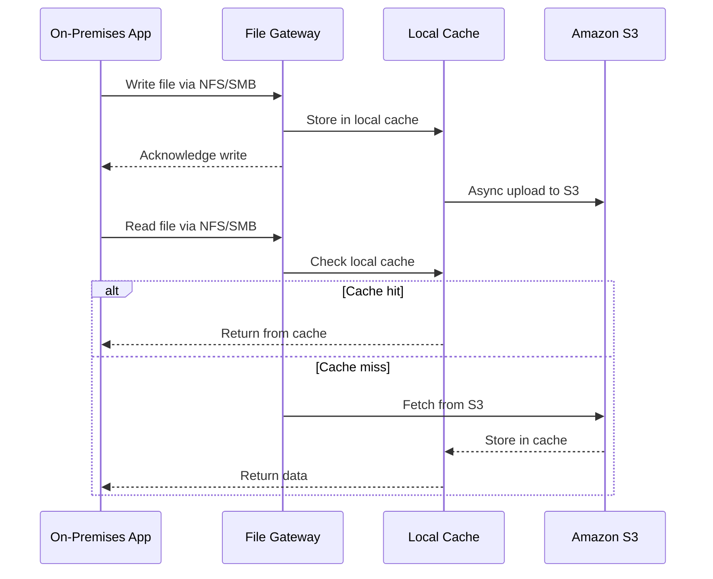

# How to Configure Storage Gateway File Gateway for S3 Access

Author: [nawazdhandala](https://github.com/nawazdhandala)

Tags: AWS, Storage Gateway, S3, File Gateway, Hybrid Cloud

Description: Configure AWS Storage Gateway File Gateway to present Amazon S3 objects as files via NFS or SMB, enabling seamless cloud storage integration for on-premises applications.

---

File Gateway is arguably the most popular type of AWS Storage Gateway. It lets your on-premises applications access Amazon S3 objects through standard file protocols - NFS and SMB - as if they were local files. Behind the scenes, everything gets stored as objects in S3, which means you get all the benefits of cloud storage: durability, scalability, lifecycle management, and more.

Let's walk through configuring a File Gateway from scratch, including creating file shares and connecting clients.

## How File Gateway Works

When you write a file through the File Gateway, it gets uploaded to S3 as an object. The file path becomes the S3 object key. For example, writing `/mnt/share/reports/quarterly.pdf` would create an S3 object at `reports/quarterly.pdf` in your configured bucket.

The gateway maintains a local cache of recently accessed data, so reads are fast for your working set. Writes are acknowledged locally first and then asynchronously uploaded to S3.



## Prerequisites

Before configuring file shares, you need:

- An activated Storage Gateway (see our guide on [setting up Storage Gateway](https://oneuptime.com/blog/post/set-up-aws-storage-gateway-hybrid-storage/view))
- An S3 bucket for storing your files
- An IAM role that grants the gateway access to the bucket
- Client machines with NFS or SMB support

## Step 1: Create the S3 Bucket

If you don't already have a bucket, create one:

```bash
# Create an S3 bucket for the file gateway
aws s3api create-bucket \
  --bucket my-file-gateway-data \
  --region us-east-1

# Enable versioning for data protection
aws s3api put-bucket-versioning \
  --bucket my-file-gateway-data \
  --versioning-configuration Status=Enabled

# Add a lifecycle rule to manage storage costs
aws s3api put-bucket-lifecycle-configuration \
  --bucket my-file-gateway-data \
  --lifecycle-configuration '{
    "Rules": [{
      "ID": "TransitionToIA",
      "Status": "Enabled",
      "Filter": {"Prefix": ""},
      "Transitions": [{
        "Days": 30,
        "StorageClass": "STANDARD_IA"
      }, {
        "Days": 90,
        "StorageClass": "GLACIER_IR"
      }]
    }]
  }'
```

The lifecycle rules help manage costs. Data older than 30 days moves to Infrequent Access (cheaper but same retrieval speed), and after 90 days to Glacier Instant Retrieval (even cheaper, still fast to access).

## Step 2: Create an IAM Role for the File Share

The gateway needs an IAM role to read and write to your S3 bucket:

```bash
# Create the trust policy for the gateway
aws iam create-role \
  --role-name FileGatewayS3Role \
  --assume-role-policy-document '{
    "Version": "2012-10-17",
    "Statement": [{
      "Effect": "Allow",
      "Principal": {"Service": "storagegateway.amazonaws.com"},
      "Action": "sts:AssumeRole"
    }]
  }'

# Create and attach a scoped-down policy for the specific bucket
aws iam put-role-policy \
  --role-name FileGatewayS3Role \
  --policy-name S3BucketAccess \
  --policy-document '{
    "Version": "2012-10-17",
    "Statement": [
      {
        "Effect": "Allow",
        "Action": [
          "s3:GetObject",
          "s3:PutObject",
          "s3:DeleteObject",
          "s3:ListBucket",
          "s3:GetBucketLocation"
        ],
        "Resource": [
          "arn:aws:s3:::my-file-gateway-data",
          "arn:aws:s3:::my-file-gateway-data/*"
        ]
      }
    ]
  }'
```

## Step 3: Create an NFS File Share

Now let's create the actual file share. Here's how to set up an NFS share:

```bash
# Create an NFS file share
aws storagegateway create-nfs-file-share \
  --client-token "unique-token-123" \
  --gateway-arn arn:aws:storagegateway:us-east-1:123456789012:gateway/sgw-12345678 \
  --role arn:aws:iam::123456789012:role/FileGatewayS3Role \
  --location-arn arn:aws:s3:::my-file-gateway-data \
  --default-storage-class S3_STANDARD \
  --client-list '["10.0.0.0/16"]' \
  --squash "RootSquash" \
  --nfs-file-share-defaults '{
    "FileMode": "0666",
    "DirectoryMode": "0777",
    "GroupId": 65534,
    "OwnerId": 65534
  }'
```

Let me break down the important parameters:

- `client-list`: IP ranges allowed to access this share. Restrict this to your on-premises network CIDR.
- `squash`: Root squash maps root user to anonymous, which is a security best practice.
- `default-storage-class`: The S3 storage class for new objects. Start with STANDARD and let lifecycle policies handle transitions.
- `nfs-file-share-defaults`: Default Unix permissions for new files and directories.

## Step 4: Create an SMB File Share (Alternative)

If your clients are Windows machines, you'll want SMB instead of NFS:

```bash
# First, set the SMB settings on the gateway (AD or guest access)
aws storagegateway set-smb-guest-password \
  --gateway-arn arn:aws:storagegateway:us-east-1:123456789012:gateway/sgw-12345678 \
  --password "YourSecureGuestPassword123!"

# Create an SMB file share
aws storagegateway create-smb-file-share \
  --client-token "unique-smb-token-456" \
  --gateway-arn arn:aws:storagegateway:us-east-1:123456789012:gateway/sgw-12345678 \
  --role arn:aws:iam::123456789012:role/FileGatewayS3Role \
  --location-arn arn:aws:s3:::my-file-gateway-data \
  --default-storage-class S3_STANDARD \
  --authentication "GuestAccess" \
  --valid-user-list '[]' \
  --invalid-user-list '[]'
```

For production environments, use Active Directory authentication instead of guest access. You can join the gateway to your AD domain:

```bash
# Join the gateway to Active Directory
aws storagegateway join-domain \
  --gateway-arn arn:aws:storagegateway:us-east-1:123456789012:gateway/sgw-12345678 \
  --domain-name "corp.example.com" \
  --user-name "admin" \
  --password "AdminPassword123!" \
  --organizational-unit "OU=FileGateways,DC=corp,DC=example,DC=com"
```

## Step 5: Mount the Share on Clients

Once the file share is created, mount it on your client machines.

For Linux NFS clients:

```bash
# Install NFS utilities if not already present
sudo yum install -y nfs-utils

# Create the mount point
sudo mkdir -p /mnt/filegateway

# Mount the NFS share
# Replace the IP with your gateway's IP address
sudo mount -t nfs -o nolock,hard \
  192.168.1.100:/my-file-gateway-data \
  /mnt/filegateway

# Add to /etc/fstab for persistence across reboots
echo "192.168.1.100:/my-file-gateway-data /mnt/filegateway nfs nolock,hard 0 0" | \
  sudo tee -a /etc/fstab
```

For Windows SMB clients:

```powershell
# Map a network drive in PowerShell
New-PSDrive -Name Z -PSProvider FileSystem `
  -Root "\\192.168.1.100\my-file-gateway-data" `
  -Persist -Credential (Get-Credential)

# Or use net use from command prompt
net use Z: \\192.168.1.100\my-file-gateway-data /persistent:yes
```

## Step 6: Configure Cache Refresh

By default, the File Gateway doesn't automatically detect changes made directly to S3 (for example, via the S3 console or another application). If external processes write to the same bucket, you'll need to refresh the cache:

```bash
# Manually refresh the file share cache
aws storagegateway refresh-cache \
  --file-share-arn arn:aws:storagegateway:us-east-1:123456789012:share/share-12345678

# For automated refresh, set up a CloudWatch Events rule
# that triggers a Lambda function to call refresh-cache
aws events put-rule \
  --name "RefreshFileGatewayCache" \
  --schedule-expression "rate(1 hour)" \
  --state ENABLED
```

## Monitoring Your File Gateway

Keep tabs on how your gateway is performing:

```bash
# Check the file share details
aws storagegateway describe-nfs-file-shares \
  --file-share-arn-list \
    arn:aws:storagegateway:us-east-1:123456789012:share/share-12345678

# Monitor key CloudWatch metrics
aws cloudwatch get-metric-data \
  --metric-data-queries '[
    {
      "Id": "cacheHit",
      "MetricStat": {
        "Metric": {
          "Namespace": "AWS/StorageGateway",
          "MetricName": "CacheHitPercent",
          "Dimensions": [{"Name": "GatewayId", "Value": "sgw-12345678"}]
        },
        "Period": 3600,
        "Stat": "Average"
      }
    }
  ]' \
  --start-time 2026-02-11T00:00:00Z \
  --end-time 2026-02-12T00:00:00Z
```

Watch for cache hit percentages below 80% - that's usually a sign you need a bigger cache disk or your working set has grown beyond expectations.

## Tips for Production Use

A few things I've learned running File Gateways in production:

1. **Size your cache generously** - it's the single biggest factor in performance. Aim for 20% of your total dataset or 150% of your working set, whichever is larger.
2. **Use S3 bucket policies** to prevent accidental deletion from the S3 side.
3. **Enable S3 versioning** on your bucket - it's your safety net against accidental overwrites.
4. **Don't use the same S3 prefix** for multiple file shares unless you really know what you're doing.

File Gateway is a powerful tool for hybrid storage, and once it's configured properly, it runs quietly in the background doing its job. Your users won't even know they're using cloud storage.
