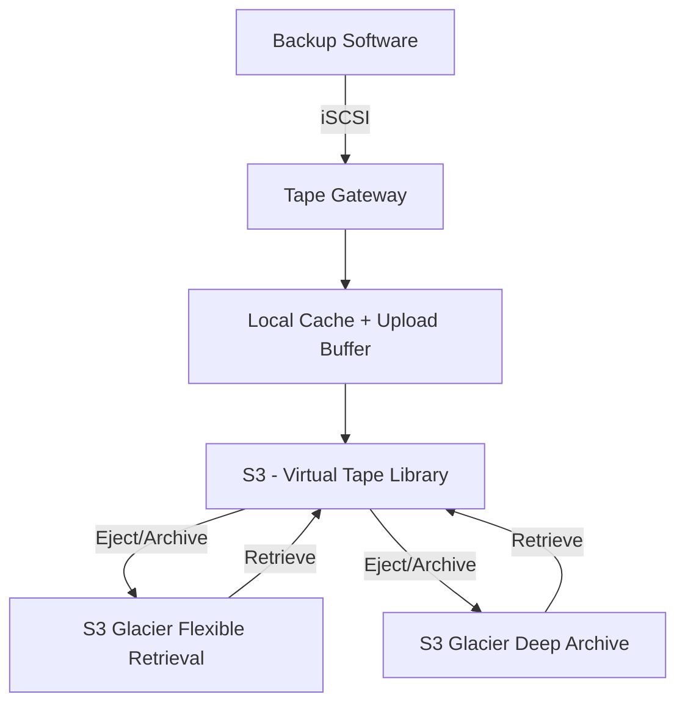

# How to Configure Storage Gateway Tape Gateway

Author: [nawazdhandala](https://github.com/nawazdhandala)

Tags: AWS, Storage Gateway, Tape Gateway, Backup, VTL

Description: Set up AWS Storage Gateway Tape Gateway as a virtual tape library for your existing backup software, replacing physical tapes with cloud storage in S3 and Glacier.

---

Physical tape libraries have been a backup staple for decades, and plenty of organizations still rely on tape-based backup software. The problem is that physical tapes are expensive to maintain, prone to failure, and a pain to manage for offsite storage. AWS Storage Gateway's Tape Gateway solves this by presenting a virtual tape library (VTL) that looks exactly like a physical tape library to your backup software, while storing everything in S3 and Glacier behind the scenes.

Your backup admins don't need to learn anything new. Veritas NetBackup, Veeam, Commvault, and other major backup applications work with Tape Gateway without modification.

## How Tape Gateway Works

Tape Gateway emulates a standard tape library with a media changer and tape drives. When your backup software writes to a virtual tape, the data goes to the gateway's local cache first and then uploads asynchronously to S3. When you "eject" a tape (archive it), it moves to either S3 Glacier Flexible Retrieval or S3 Glacier Deep Archive, depending on the pool you configure.



## Prerequisites

You'll need:
- An activated Storage Gateway of type VTL (see [setting up Storage Gateway](https://oneuptime.com/blog/post/set-up-aws-storage-gateway-hybrid-storage/view))
- Local disks for cache and upload buffer
- iSCSI initiator software on the backup server
- Compatible backup software (Veritas, Veeam, Commvault, DELL EMC NetWorker, etc.)

## Step 1: Configure Local Disks

Tape Gateway needs two types of local storage: cache and upload buffer.

```bash
# List available local disks
aws storagegateway list-local-disks \
  --gateway-arn arn:aws:storagegateway:us-east-1:123456789012:gateway/sgw-12345678

# Add the cache disk
aws storagegateway add-cache \
  --gateway-arn arn:aws:storagegateway:us-east-1:123456789012:gateway/sgw-12345678 \
  --disk-ids "disk-cache001"

# Add the upload buffer disk
aws storagegateway add-upload-buffer \
  --gateway-arn arn:aws:storagegateway:us-east-1:123456789012:gateway/sgw-12345678 \
  --disk-ids "disk-buffer001"
```

Size the cache disk to hold at least the amount of data in your largest backup job. The upload buffer should be at least 150 GB. If your backup jobs generate data faster than your network can upload, you'll need a larger upload buffer to avoid throttling.

## Step 2: Create Virtual Tapes

Now let's create some virtual tapes for your backup jobs to use:

```bash
# Create 10 virtual tapes of 100 GB each
aws storagegateway create-tapes \
  --gateway-arn arn:aws:storagegateway:us-east-1:123456789012:gateway/sgw-12345678 \
  --tape-size-in-bytes 107374182400 \
  --client-token "tape-batch-001" \
  --num-tapes-to-create 10 \
  --tape-barcode-prefix "TAPE" \
  --pool-id "GLACIER"
```

The `pool-id` determines where tapes go when archived:
- `GLACIER` - S3 Glacier Flexible Retrieval (retrieval in 3-5 hours)
- `DEEP_ARCHIVE` - S3 Glacier Deep Archive (retrieval in 12 hours, cheapest option)

You can also create tapes with custom barcodes:

```bash
# Create a tape with a specific barcode
aws storagegateway create-tape-with-barcode \
  --gateway-arn arn:aws:storagegateway:us-east-1:123456789012:gateway/sgw-12345678 \
  --tape-size-in-bytes 107374182400 \
  --tape-barcode "MYBACKUP001" \
  --pool-id "GLACIER"
```

Custom barcodes are handy when you want your virtual tape naming to match conventions your backup admins are already used to.

## Step 3: Connect Backup Server via iSCSI

The backup server needs to connect to the Tape Gateway's VTL devices over iSCSI. There are two types of targets: the media changer and the tape drives.

On Linux:

```bash
# Install iSCSI initiator
sudo yum install -y iscsi-initiator-utils
sudo systemctl start iscsid
sudo systemctl enable iscsid

# Discover targets on the gateway
sudo iscsiadm --mode discovery --type sendtargets \
  --portal 10.0.1.100:3260

# You'll see multiple targets - one for the media changer
# and multiple for tape drives. Connect to all of them.

# Connect to the media changer
sudo iscsiadm --mode node \
  --targetname iqn.1997-05.com.amazon:sgw-12345678-mediachanger \
  --portal 10.0.1.100:3260 \
  --login

# Connect to tape drive 1
sudo iscsiadm --mode node \
  --targetname iqn.1997-05.com.amazon:sgw-12345678-tapedrive-01 \
  --portal 10.0.1.100:3260 \
  --login

# Connect to tape drive 2
sudo iscsiadm --mode node \
  --targetname iqn.1997-05.com.amazon:sgw-12345678-tapedrive-02 \
  --portal 10.0.1.100:3260 \
  --login
```

On Windows:

```powershell
# Start iSCSI service
Start-Service MSiSCSI
Set-Service MSiSCSI -StartupType Automatic

# Add the gateway portal
New-IscsiTargetPortal -TargetPortalAddress 10.0.1.100

# Connect to all available targets
Get-IscsiTarget | Connect-IscsiTarget -IsPersistent $true
```

## Step 4: Configure Your Backup Software

After connecting via iSCSI, your backup software needs to discover the new tape library. The exact steps vary by software, but here's the general flow:

For **Veritas NetBackup**:
1. Open the NetBackup Administration Console
2. Go to Media and Device Management > Devices
3. Run the Device Configuration Wizard
4. Select the Tape Gateway media changer and drives
5. Inventory the library to see your virtual tapes

For **Veeam Backup & Replication**:
1. Go to Tape Infrastructure
2. Add a new tape server pointing to your backup server
3. Rescan the tape library
4. Create a media pool with the discovered tapes

The key thing is that your backup software sees this as a normal tape library. No special drivers or plugins needed.

## Step 5: Set Up Automatic Tape Creation

Running out of tapes during a backup job is annoying. You can enable automatic tape creation so the gateway creates new tapes as needed:

```bash
# Enable automatic tape creation
aws storagegateway create-tape-pool \
  --pool-name "AutoTapePool" \
  --storage-class "GLACIER" \
  --retention-lock-type "NONE"

# Configure automatic tape creation rules
aws storagegateway update-automatic-tape-creation-policy \
  --gateway-arn arn:aws:storagegateway:us-east-1:123456789012:gateway/sgw-12345678 \
  --automatic-tape-creation-rules '[{
    "TapeBarcodePrefix": "AUTO",
    "PoolId": "GLACIER",
    "TapeSizeInBytes": 107374182400,
    "MinimumNumTapes": 5
  }]'
```

This keeps a minimum of 5 tapes available at all times. When the count drops below 5 (because tapes are in use or archived), the gateway automatically creates new ones.

## Step 6: Archive and Retrieve Tapes

When your backup software ejects a tape, it gets archived to the configured Glacier pool. You can also manage this through the CLI:

```bash
# List available tapes in the VTL
aws storagegateway describe-tapes \
  --gateway-arn arn:aws:storagegateway:us-east-1:123456789012:gateway/sgw-12345678

# List archived tapes
aws storagegateway describe-tape-archives

# Retrieve an archived tape back to the VTL
aws storagegateway retrieve-tape-archive \
  --tape-arn arn:aws:storagegateway:us-east-1:123456789012:tape/TAPE000001 \
  --gateway-arn arn:aws:storagegateway:us-east-1:123456789012:gateway/sgw-12345678
```

Retrieval time depends on the archive tier: Glacier Flexible Retrieval takes 3-5 hours, and Deep Archive takes up to 12 hours. Plan accordingly for restore scenarios.

## Step 7: Enable WORM and Retention Policies

For compliance requirements, you can configure tape pools with write-once-read-many (WORM) protection:

```bash
# Create a WORM tape pool with governance-mode retention
aws storagegateway create-tape-pool \
  --pool-name "ComplianceTapePool" \
  --storage-class "GLACIER" \
  --retention-lock-type "GOVERNANCE" \
  --retention-lock-time-in-days 365
```

Governance mode prevents most users from deleting tapes before the retention period expires, but users with special IAM permissions can override it. For stricter requirements, use `COMPLIANCE` mode - nobody can delete tapes until the retention period ends, not even the root account.

## Monitoring Tape Gateway

Set up CloudWatch alarms to catch issues before they affect backups:

```bash
# Alert on high upload buffer usage
aws cloudwatch put-metric-alarm \
  --alarm-name "TapeGW-UploadBuffer-Critical" \
  --metric-name UploadBufferPercentUsed \
  --namespace "AWS/StorageGateway" \
  --statistic Average \
  --period 300 \
  --threshold 90 \
  --comparison-operator GreaterThanThreshold \
  --evaluation-periods 2 \
  --dimensions Name=GatewayId,Value=sgw-12345678 \
  --alarm-actions arn:aws:sns:us-east-1:123456789012:backup-alerts

# Alert on cache percent dirty (data not yet uploaded)
aws cloudwatch put-metric-alarm \
  --alarm-name "TapeGW-CacheDirty-Warning" \
  --metric-name CachePercentDirty \
  --namespace "AWS/StorageGateway" \
  --statistic Average \
  --period 300 \
  --threshold 80 \
  --comparison-operator GreaterThanThreshold \
  --evaluation-periods 6 \
  --dimensions Name=GatewayId,Value=sgw-12345678 \
  --alarm-actions arn:aws:sns:us-east-1:123456789012:backup-alerts
```

A high CachePercentDirty value means the gateway has a backlog of data waiting to upload. This could indicate network congestion or insufficient bandwidth.

## Cost Comparison

Here's why Tape Gateway often makes financial sense. A single physical tape drive costs $3,000-10,000. Media costs $20-50 per tape. Offsite storage fees add up quickly. With Tape Gateway, you pay S3 storage rates (around $0.023/GB for standard, $0.0036/GB for Glacier, and $0.00099/GB for Deep Archive) plus the cost of running the gateway VM. For most organizations, the break-even point comes within the first year.

Tape Gateway lets you modernize your backup infrastructure incrementally, without ripping and replacing your backup software or retraining your team. That's a pretty compelling value proposition.
