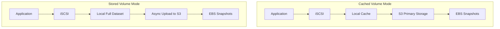

# How to Configure Storage Gateway Volume Gateway

Author: [nawazdhandala](https://github.com/nawazdhandala)

Tags: AWS, Storage Gateway, Volume Gateway, iSCSI, Block Storage

Description: Learn how to configure AWS Storage Gateway Volume Gateway for iSCSI block storage, including cached and stored volume modes with EBS snapshot integration.

---

Volume Gateway provides cloud-backed iSCSI block storage to your on-premises applications. Think of it as having a local SAN that quietly backs everything up to AWS. Your applications see standard iSCSI block devices, but the data is stored as Amazon EBS snapshots in the cloud. This gives you a solid disaster recovery story and the ability to spin up EBS volumes from those snapshots in minutes if you ever need to migrate workloads to AWS.

There are two modes: **Cached Volumes** and **Stored Volumes**. We'll cover both.

## Cached vs. Stored Volumes

The choice between cached and stored depends on your priorities:

**Cached Volumes**: Your primary data lives in S3, with a local cache holding frequently accessed data. You get up to 1 PB of storage per gateway with 32 volumes of up to 32 TB each. Best when you need lots of storage but can tolerate slightly higher latency for cache misses.

**Stored Volumes**: Your full dataset lives on-premises, with asynchronous snapshots uploaded to S3 as EBS snapshots. Each volume can be up to 16 TB with up to 32 volumes per gateway. Best when you need low-latency access to your entire dataset.



## Prerequisites

You'll need:
- An activated Storage Gateway configured as either CACHED or STORED type (see [setting up Storage Gateway](https://oneuptime.com/blog/post/2026-02-12-set-up-aws-storage-gateway-hybrid-storage/view))
- Local disks assigned for cache (cached mode) or both cache and upload buffer (both modes)
- iSCSI initiator software on your client machines
- Network connectivity between clients and the gateway VM

## Step 1: Add Local Disks

Volume Gateway requires local disks for different purposes depending on the mode. Let's configure them:

```bash
# List available local disks on the gateway
aws storagegateway list-local-disks \
  --gateway-arn arn:aws:storagegateway:us-east-1:123456789012:gateway/sgw-12345678

# For cached volumes, add a cache disk
aws storagegateway add-cache \
  --gateway-arn arn:aws:storagegateway:us-east-1:123456789012:gateway/sgw-12345678 \
  --disk-ids "disk-cache001"

# Add an upload buffer disk (required for both modes)
aws storagegateway add-upload-buffer \
  --gateway-arn arn:aws:storagegateway:us-east-1:123456789012:gateway/sgw-12345678 \
  --disk-ids "disk-buffer001"
```

For cached volumes, the cache should be sized at roughly 20% of your total volume sizes. The upload buffer should be at least 150 GB. For stored volumes, you need local disks large enough to hold your entire dataset plus an upload buffer.

## Step 2: Create a Cached Volume

Here's how to create a cached volume:

```bash
# Create a 500 GB cached volume
aws storagegateway create-cached-iscsi-volume \
  --gateway-arn arn:aws:storagegateway:us-east-1:123456789012:gateway/sgw-12345678 \
  --volume-size-in-bytes 536870912000 \
  --target-name "cached-vol-001" \
  --network-interface-id "10.0.1.100" \
  --client-token "cached-vol-token-001"
```

The `network-interface-id` is the IP address of the gateway that iSCSI initiators will connect to. The `target-name` becomes part of the iSCSI target IQN that clients use to discover the volume.

## Step 3: Create a Stored Volume

For stored volumes, the process is slightly different. You can either create a new empty volume or preserve existing data on a local disk:

```bash
# Create a new stored volume (empty)
aws storagegateway create-stored-iscsi-volume \
  --gateway-arn arn:aws:storagegateway:us-east-1:123456789012:gateway/sgw-12345678 \
  --disk-id "disk-data001" \
  --preserve-existing-data false \
  --target-name "stored-vol-001" \
  --network-interface-id "10.0.1.100"

# Or create from an existing EBS snapshot
aws storagegateway create-stored-iscsi-volume \
  --gateway-arn arn:aws:storagegateway:us-east-1:123456789012:gateway/sgw-12345678 \
  --disk-id "disk-data002" \
  --preserve-existing-data false \
  --target-name "stored-vol-002" \
  --network-interface-id "10.0.1.100" \
  --snapshot-id "snap-0123456789abcdef0"
```

Setting `preserve-existing-data` to true keeps whatever data is currently on that disk. Useful if you're migrating existing local storage behind a Volume Gateway.

## Step 4: Connect from Linux iSCSI Initiator

Now let's connect to the volume from a Linux client:

```bash
# Install the iSCSI initiator
sudo yum install -y iscsi-initiator-utils

# Start the iSCSI service
sudo systemctl start iscsid
sudo systemctl enable iscsid

# Discover available targets on the gateway
sudo iscsiadm --mode discovery --type sendtargets \
  --portal 10.0.1.100:3260

# Connect to the target
sudo iscsiadm --mode node \
  --targetname iqn.1997-05.com.amazon:cached-vol-001 \
  --portal 10.0.1.100:3260 \
  --login

# Verify the new block device appeared
lsblk

# Create a filesystem and mount it
sudo mkfs.ext4 /dev/sdb
sudo mkdir -p /mnt/sgw-volume
sudo mount /dev/sdb /mnt/sgw-volume

# Make the mount persistent
echo "/dev/sdb /mnt/sgw-volume ext4 _netdev 0 0" | sudo tee -a /etc/fstab
```

The `_netdev` mount option tells the system this is a network device, so it waits for the network to be available before trying to mount.

## Step 5: Connect from Windows iSCSI Initiator

On Windows, use the built-in iSCSI Initiator:

```powershell
# Start the iSCSI service
Start-Service MSiSCSI
Set-Service MSiSCSI -StartupType Automatic

# Add the gateway as a target portal
New-IscsiTargetPortal -TargetPortalAddress 10.0.1.100 -TargetPortalPortNumber 3260

# Discover and connect to the target
$target = Get-IscsiTarget | Where-Object { $_.NodeAddress -like "*cached-vol-001*" }
Connect-IscsiTarget -NodeAddress $target.NodeAddress -IsPersistent $true

# Initialize the disk
Get-Disk | Where-Object PartitionStyle -eq 'RAW' |
  Initialize-Disk -PartitionStyle GPT -PassThru |
  New-Partition -AssignDriveLetter -UseMaximumSize |
  Format-Volume -FileSystem NTFS -NewFileSystemLabel "SGW-Volume"
```

## Step 6: Configure Snapshot Schedules

One of Volume Gateway's best features is automated EBS snapshots. Set up a schedule to protect your data:

```bash
# Describe the volume to get the volume ARN
aws storagegateway describe-cached-iscsi-volumes \
  --volume-arns arn:aws:storagegateway:us-east-1:123456789012:gateway/sgw-12345678/volume/vol-12345678

# Create a snapshot schedule (daily at 3 AM UTC)
aws storagegateway update-snapshot-schedule \
  --volume-arn arn:aws:storagegateway:us-east-1:123456789012:gateway/sgw-12345678/volume/vol-12345678 \
  --start-at 3 \
  --recurrence-in-hours 24 \
  --description "Daily backup snapshot"

# Take an immediate manual snapshot
aws storagegateway create-snapshot \
  --volume-arn arn:aws:storagegateway:us-east-1:123456789012:gateway/sgw-12345678/volume/vol-12345678 \
  --snapshot-description "Pre-migration snapshot"
```

These snapshots appear as regular EBS snapshots in your AWS account. You can create EBS volumes from them, which is incredibly useful for disaster recovery or cloud migration.

## Step 7: Configure CHAP Authentication

For security, enable CHAP authentication on your iSCSI targets:

```bash
# Set CHAP credentials for the target
aws storagegateway update-chap-credentials \
  --target-arn arn:aws:storagegateway:us-east-1:123456789012:gateway/sgw-12345678/target/iqn.1997-05.com.amazon:cached-vol-001 \
  --secret-to-authenticate-initiator "SecretKey12345678" \
  --initiator-name "iqn.1991-05.com.microsoft:myhost" \
  --secret-to-authenticate-target "TargetSecret12345"
```

CHAP provides mutual authentication between the initiator (client) and target (gateway). Both secrets must be at least 12 characters and no more than 16 characters.

## Monitoring Volume Gateway

Keep an eye on these key metrics:

```bash
# Check cache and upload buffer utilization
aws cloudwatch get-metric-statistics \
  --namespace "AWS/StorageGateway" \
  --metric-name CachePercentUsed \
  --dimensions Name=GatewayId,Value=sgw-12345678 \
  --start-time 2026-02-11T00:00:00Z \
  --end-time 2026-02-12T00:00:00Z \
  --period 3600 \
  --statistics Average

# Set up an alarm for upload buffer getting full
aws cloudwatch put-metric-alarm \
  --alarm-name "VolumeGW-UploadBuffer-High" \
  --metric-name UploadBufferPercentUsed \
  --namespace "AWS/StorageGateway" \
  --statistic Average \
  --period 300 \
  --threshold 80 \
  --comparison-operator GreaterThanThreshold \
  --evaluation-periods 3 \
  --dimensions Name=GatewayId,Value=sgw-12345678 \
  --alarm-actions arn:aws:sns:us-east-1:123456789012:storage-alerts
```

If your upload buffer consistently hits high utilization, it means data is being written faster than it can be uploaded to AWS. Consider increasing your network bandwidth or adding more upload buffer disk space.

## Recovery Scenarios

The real power of Volume Gateway shows up during disaster recovery. If your on-premises infrastructure goes down, you can restore volumes in AWS:

```bash
# List available snapshots for your volume
aws ec2 describe-snapshots \
  --filters "Name=description,Values=*sgw-12345678*" \
  --query 'Snapshots[*].{ID:SnapshotId,Time:StartTime,Size:VolumeSize}' \
  --output table

# Create an EBS volume from the latest snapshot
aws ec2 create-volume \
  --snapshot-id snap-0123456789abcdef0 \
  --availability-zone us-east-1a \
  --volume-type gp3
```

From there, you can attach the volume to an EC2 instance and be back in business. That's the beauty of having your data continuously replicated to AWS - recovery becomes a matter of minutes rather than hours or days.
