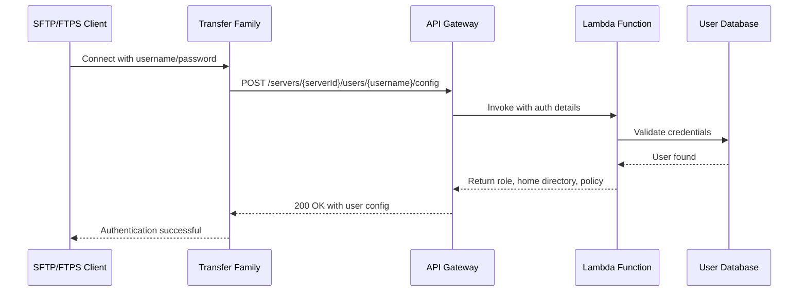

# How to Configure Transfer Family Custom Identity Providers

Author: [nawazdhandala](https://github.com/nawazdhandala)

Tags: AWS, Transfer Family, Authentication, Lambda, API Gateway

Description: Build a custom identity provider for AWS Transfer Family using API Gateway and Lambda, enabling password authentication, directory services integration, and dynamic user provisioning.

---

AWS Transfer Family's service-managed identity provider works well when you have a handful of users and can manage SSH keys manually. But what happens when you need password-based authentication, want to integrate with Active Directory or an existing user database, or need to dynamically provision users on the fly? That's where custom identity providers come in.

A custom identity provider lets you plug your own authentication logic into Transfer Family. You provide an API endpoint - either through API Gateway + Lambda or a direct Lambda function - and Transfer Family calls it every time a user tries to connect. Your code decides whether to allow access and what permissions to grant.

## How Custom Identity Providers Work

When a user connects to your Transfer Family server, the server sends the username and password (or SSH key) to your identity provider. Your provider validates the credentials and returns the user's role, home directory, and optional scope-down policy.



## Step 1: Create the Lambda Function

Let's build a Lambda function that authenticates users against a DynamoDB table:

```bash
# Create the DynamoDB table for storing user credentials
aws dynamodb create-table \
  --table-name TransferFamilyUsers \
  --attribute-definitions \
    AttributeName=username,AttributeType=S \
  --key-schema \
    AttributeName=username,KeyType=HASH \
  --billing-mode PAY_PER_REQUEST
```

Now create the Lambda function code. Here's a Python implementation:

```python
# lambda_function.py
import json
import os
import hashlib
import hmac
import boto3

dynamodb = boto3.resource('dynamodb')
table = dynamodb.Table(os.environ['USERS_TABLE'])

def lambda_handler(event, context):
    """
    Custom identity provider for AWS Transfer Family.
    Authenticates users against DynamoDB and returns
    their configuration.
    """
    username = event.get('username', '')
    password = event.get('password', '')
    server_id = event.get('serverId', '')
    source_ip = event.get('sourceIp', '')

    print(f"Auth request: user={username}, server={server_id}, ip={source_ip}")

    # Look up the user in DynamoDB
    try:
        response = table.get_item(Key={'username': username})
    except Exception as e:
        print(f"DynamoDB error: {e}")
        return {}

    if 'Item' not in response:
        print(f"User not found: {username}")
        return {}

    user = response['Item']

    # Verify password using stored hash
    stored_hash = user.get('password_hash', '')
    computed_hash = hashlib.sha256(password.encode()).hexdigest()

    if not hmac.compare_digest(stored_hash, computed_hash):
        print(f"Password mismatch for user: {username}")
        return {}

    # Check if the user is enabled
    if not user.get('enabled', True):
        print(f"User is disabled: {username}")
        return {}

    # Build the response
    response_data = {
        'Role': user['role_arn'],
        'HomeDirectoryType': 'LOGICAL',
        'HomeDirectoryDetails': json.dumps([
            {'Entry': '/', 'Target': f"/{user['bucket']}/{username}"}
        ])
    }

    # Add scope-down policy if defined
    if 'scope_down_policy' in user:
        response_data['Policy'] = user['scope_down_policy']

    print(f"Auth successful for user: {username}")
    return response_data
```

Deploy the Lambda function:

```bash
# Package the function
zip lambda_function.zip lambda_function.py

# Create the Lambda function
aws lambda create-function \
  --function-name TransferFamilyAuthenticator \
  --runtime python3.12 \
  --handler lambda_function.lambda_handler \
  --role arn:aws:iam::123456789012:role/LambdaExecutionRole \
  --zip-file fileb://lambda_function.zip \
  --environment '{
    "Variables": {
      "USERS_TABLE": "TransferFamilyUsers"
    }
  }' \
  --timeout 10
```

## Step 2: Create the API Gateway

Set up API Gateway as the interface between Transfer Family and your Lambda:

```bash
# Create the REST API
API_ID=$(aws apigateway create-rest-api \
  --name "TransferFamilyIdentityProvider" \
  --description "Custom identity provider for SFTP/FTPS" \
  --endpoint-configuration '{"types": ["REGIONAL"]}' \
  --query 'id' --output text)

# Get the root resource ID
ROOT_ID=$(aws apigateway get-resources \
  --rest-api-id "$API_ID" \
  --query 'items[0].id' --output text)

# Create resource path: /servers
SERVERS_ID=$(aws apigateway create-resource \
  --rest-api-id "$API_ID" \
  --parent-id "$ROOT_ID" \
  --path-part "servers" \
  --query 'id' --output text)

# Create resource: /servers/{serverId}
SERVER_ID_RES=$(aws apigateway create-resource \
  --rest-api-id "$API_ID" \
  --parent-id "$SERVERS_ID" \
  --path-part "{serverId}" \
  --query 'id' --output text)

# Create resource: /servers/{serverId}/users
USERS_RES=$(aws apigateway create-resource \
  --rest-api-id "$API_ID" \
  --parent-id "$SERVER_ID_RES" \
  --path-part "users" \
  --query 'id' --output text)

# Create resource: /servers/{serverId}/users/{username}
USERNAME_RES=$(aws apigateway create-resource \
  --rest-api-id "$API_ID" \
  --parent-id "$USERS_RES" \
  --path-part "{username}" \
  --query 'id' --output text)

# Create resource: /servers/{serverId}/users/{username}/config
CONFIG_RES=$(aws apigateway create-resource \
  --rest-api-id "$API_ID" \
  --parent-id "$USERNAME_RES" \
  --path-part "config" \
  --query 'id' --output text)
```

Now add the GET method and Lambda integration:

```bash
# Create GET method
aws apigateway put-method \
  --rest-api-id "$API_ID" \
  --resource-id "$CONFIG_RES" \
  --http-method GET \
  --authorization-type AWS_IAM \
  --request-parameters '{
    "method.request.header.Password": false,
    "method.request.querystring.protocol": false,
    "method.request.querystring.sourceIp": false
  }'

# Create Lambda integration
aws apigateway put-integration \
  --rest-api-id "$API_ID" \
  --resource-id "$CONFIG_RES" \
  --http-method GET \
  --type AWS \
  --integration-http-method POST \
  --uri "arn:aws:apigateway:us-east-1:lambda:path/2015-03-31/functions/arn:aws:lambda:us-east-1:123456789012:function:TransferFamilyAuthenticator/invocations" \
  --request-templates '{
    "application/json": "{\"username\": \"$input.params('"'"'username'"'"')\", \"password\": \"$util.urlDecode($input.params('"'"'Password'"'"'))\", \"serverId\": \"$input.params('"'"'serverId'"'"')\", \"sourceIp\": \"$input.params('"'"'sourceIp'"'"')\"}"
  }'

# Deploy the API
aws apigateway create-deployment \
  --rest-api-id "$API_ID" \
  --stage-name prod
```

## Step 3: Create the Transfer Family Server

Now create the server with the custom identity provider:

```bash
# Create server with API Gateway identity provider
aws transfer create-server \
  --protocols SFTP \
  --identity-provider-type API_GATEWAY \
  --identity-provider-details '{
    "Url": "https://API_ID.execute-api.us-east-1.amazonaws.com/prod",
    "InvocationRole": "arn:aws:iam::123456789012:role/TransferApiGatewayRole"
  }' \
  --endpoint-type PUBLIC \
  --logging-role "arn:aws:iam::123456789012:role/TransferFamilyLoggingRole"
```

Alternatively, for a simpler setup, you can use direct Lambda integration (no API Gateway needed):

```bash
# Create server with direct Lambda identity provider
aws transfer create-server \
  --protocols SFTP \
  --identity-provider-type AWS_LAMBDA \
  --identity-provider-details '{
    "Function": "arn:aws:lambda:us-east-1:123456789012:function:TransferFamilyAuthenticator"
  }' \
  --endpoint-type PUBLIC \
  --logging-role "arn:aws:iam::123456789012:role/TransferFamilyLoggingRole"
```

The Lambda option is simpler and has lower latency. Use API Gateway when you need request throttling, caching, or WAF integration.

## Step 4: Add Users to DynamoDB

Populate your user database:

```bash
# Add a user with a hashed password
PASSWORD_HASH=$(echo -n "SecurePass123!" | sha256sum | awk '{print $1}')

aws dynamodb put-item \
  --table-name TransferFamilyUsers \
  --item '{
    "username": {"S": "partner-acme"},
    "password_hash": {"S": "'$PASSWORD_HASH'"},
    "role_arn": {"S": "arn:aws:iam::123456789012:role/TransferFamilyUserRole"},
    "bucket": {"S": "sftp-files-bucket"},
    "enabled": {"BOOL": true}
  }'
```

## Step 5: Add Scope-Down Policies

Scope-down policies let you further restrict what a user can do beyond their IAM role:

```bash
# Add a user with a scope-down policy
POLICY=$(cat <<'POLICY_EOF'
{
  "Version": "2012-10-17",
  "Statement": [
    {
      "Sid": "AllowListingOfUserFolder",
      "Effect": "Allow",
      "Action": "s3:ListBucket",
      "Resource": "arn:aws:s3:::${transfer:HomeBucket}",
      "Condition": {
        "StringLike": {
          "s3:prefix": ["${transfer:HomeFolder}/*", "${transfer:HomeFolder}"]
        }
      }
    },
    {
      "Sid": "AllowReadWriteInUserFolder",
      "Effect": "Allow",
      "Action": ["s3:PutObject", "s3:GetObject"],
      "Resource": "arn:aws:s3:::${transfer:HomeBucket}/${transfer:HomeFolder}/*"
    }
  ]
}
POLICY_EOF
)

aws dynamodb put-item \
  --table-name TransferFamilyUsers \
  --item '{
    "username": {"S": "vendor-limited"},
    "password_hash": {"S": "'$PASSWORD_HASH'"},
    "role_arn": {"S": "arn:aws:iam::123456789012:role/TransferFamilyUserRole"},
    "bucket": {"S": "sftp-files-bucket"},
    "enabled": {"BOOL": true},
    "scope_down_policy": {"S": "'"$(echo $POLICY | tr -d '\n')"'"
  }'
```

## Testing the Setup

Test the custom identity provider end-to-end:

```bash
# Test the Lambda function directly
aws lambda invoke \
  --function-name TransferFamilyAuthenticator \
  --payload '{
    "username": "partner-acme",
    "password": "SecurePass123!",
    "serverId": "s-0123456789abcdef0",
    "sourceIp": "203.0.113.1"
  }' \
  output.json

cat output.json

# Test the actual SFTP connection
sftp -oPasswordAuthentication=yes \
  partner-acme@s-0123456789abcdef0.server.transfer.us-east-1.amazonaws.com
```

Custom identity providers give you complete control over who can access your Transfer Family servers and what they can do. Whether you're integrating with LDAP, a database, or building something entirely custom, the flexibility is there to match whatever authentication model your organization needs.
