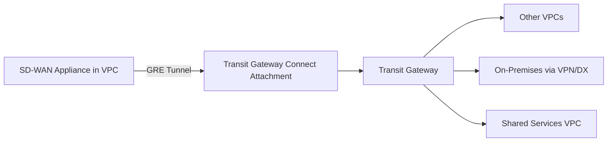
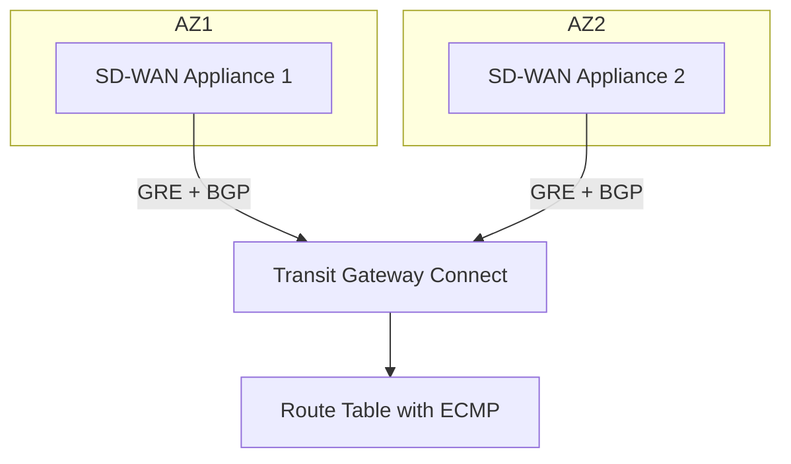

# How to Configure Transit Gateway Connect for SD-WAN Integration

Author: [nawazdhandala](https://github.com/nawazdhandala)

Tags: AWS, Transit Gateway, SD-WAN, Networking, VPC, Cloud Architecture

Description: Learn how to configure AWS Transit Gateway Connect attachments to integrate your SD-WAN appliances with AWS cloud networking infrastructure.

---

If you are running SD-WAN appliances and need them to talk natively with your AWS Transit Gateway, Transit Gateway Connect is the feature you have been waiting for. It gives you a way to create GRE tunnels and run BGP directly between your SD-WAN virtual appliance and the Transit Gateway, without the overhead of IPsec VPN tunnels.

This guide walks through the full setup process, from creating the Connect attachment to establishing BGP peering with your SD-WAN appliance.

## What Is Transit Gateway Connect?

Transit Gateway Connect is an attachment type that supports GRE (Generic Routing Encapsulation) tunnels between a Transit Gateway and third-party virtual appliances running in a VPC. On top of that GRE tunnel, you run BGP to exchange routes dynamically.

The typical use case is SD-WAN integration. Instead of routing traffic through traditional IPsec VPN tunnels (which top out around 1.25 Gbps per tunnel), Connect peers can push up to 5 Gbps per Connect peer and up to 20 Gbps per Connect attachment with multiple peers. That is a significant throughput improvement.



## Prerequisites

Before you start, make sure you have:

- An existing Transit Gateway in your region
- A VPC attachment already connected to the Transit Gateway (this serves as the "transport" attachment)
- An SD-WAN virtual appliance running in that VPC (Cisco SD-WAN, VMware SD-WAN, Aruba EdgeConnect, or similar)
- The appliance must support GRE tunneling and BGP

## Step 1: Create the Transit Gateway Connect Attachment

First, you need a VPC attachment that will act as the transport mechanism. If you do not already have one, create it now.

```bash
# Create a VPC attachment to serve as the transport
# Replace with your actual Transit Gateway ID and subnet IDs
aws ec2 create-transit-gateway-vpc-attachment \
  --transit-gateway-id tgw-0abc123def456 \
  --vpc-id vpc-0xyz789abc \
  --subnet-ids subnet-0aaa111bbb222 \
  --tag-specifications 'ResourceType=transit-gateway-attachment,Tags=[{Key=Name,Value=sdwan-transport}]'
```

Now create the Connect attachment, referencing that VPC attachment as the transport.

```bash
# Create the Transit Gateway Connect attachment
# The transport-attachment-id should be your VPC attachment from above
aws ec2 create-transit-gateway-connect \
  --transport-transit-gateway-attachment-id tgw-attach-0abc123transport \
  --options Protocol=gre \
  --tag-specifications 'ResourceType=transit-gateway-attachment,Tags=[{Key=Name,Value=sdwan-connect}]'
```

The output gives you a Connect attachment ID. Save it because you will need it for the next step.

## Step 2: Create a Connect Peer

A Connect peer defines the GRE tunnel endpoints and the BGP session parameters. Each Connect attachment supports up to four peers.

```bash
# Create a Connect peer with BGP configuration
# - peer-address: the IP of your SD-WAN appliance (inside the VPC)
# - transit-gateway-address: the IP Transit Gateway will use inside the GRE tunnel
# - bgp-options: your appliance's ASN
# - inside-cidr-blocks: /29 CIDR for the BGP peering inside the tunnel
aws ec2 create-transit-gateway-connect-peer \
  --transit-gateway-attachment-id tgw-attach-0abc123connect \
  --peer-address 10.0.1.50 \
  --transit-gateway-address 169.254.100.1 \
  --bgp-options PeerAsn=65000 \
  --inside-cidr-blocks "169.254.100.0/29" \
  --tag-specifications 'ResourceType=transit-gateway-connect-peer,Tags=[{Key=Name,Value=sdwan-peer-1}]'
```

A few things to note here:

- The `peer-address` is the private IP of your SD-WAN appliance in the VPC
- The `inside-cidr-blocks` must be a /29 from the 169.254.0.0/16 link-local range (excluding some reserved ranges)
- AWS assigns an ASN to the Transit Gateway side automatically, or you can set it when creating the Transit Gateway

## Step 3: Configure the SD-WAN Appliance

This part varies depending on your SD-WAN vendor, but the general configuration involves:

1. Creating a GRE tunnel interface pointing to the Transit Gateway Connect peer address
2. Configuring BGP peering over that tunnel

Here is an example for a generic Linux-based appliance.

```bash
# Create GRE tunnel interface
sudo ip tunnel add gre-tgw mode gre \
  remote 169.254.100.1 \
  local 10.0.1.50 \
  ttl 255

# Assign the BGP peering IP to the tunnel interface
# Use the peer IP from the inside-cidr-blocks range
sudo ip addr add 169.254.100.2/29 dev gre-tgw

# Bring up the tunnel interface
sudo ip link set gre-tgw up

# Add a route for the Transit Gateway tunnel endpoint through the VPC
sudo ip route add 169.254.100.1/32 dev gre-tgw
```

For BGP configuration using FRRouting (a common choice on Linux-based appliances):

```bash
# FRRouting BGP configuration
vtysh -c "configure terminal
router bgp 65000
 neighbor 169.254.100.1 remote-as 64512
 neighbor 169.254.100.1 timers 10 30
 address-family ipv4 unicast
  neighbor 169.254.100.1 activate
  network 10.0.0.0/16
  network 172.16.0.0/12
 exit-address-family
exit
exit
write memory"
```

Replace `64512` with the actual ASN of your Transit Gateway.

## Step 4: Verify the Connection

Check the Connect peer state from the AWS side.

```bash
# Verify the Connect peer status
aws ec2 describe-transit-gateway-connect-peers \
  --filters "Name=state,Values=available" \
  --query 'TransitGatewayConnectPeers[*].{PeerId:TransitGatewayConnectPeerId,State:State,BGPStatus:ConnectPeerConfiguration.BgpConfigurations[0].BgpStatus}'
```

You want to see `State: available` and `BgpStatus: up`. If BGP is not coming up, check your security groups and NACLs - the GRE protocol (IP protocol 47) needs to be allowed.

```bash
# Make sure the security group on your appliance allows GRE
aws ec2 authorize-security-group-ingress \
  --group-id sg-0abc123 \
  --ip-permissions IpProtocol=47,FromPort=-1,ToPort=-1,IpRanges='[{CidrIp=0.0.0.0/0,Description="Allow GRE from TGW"}]'
```

## Step 5: Configure Route Tables

With BGP up, routes should propagate automatically. But you still need to make sure propagation is enabled on the right route tables.

```bash
# Enable route propagation on the Transit Gateway route table
aws ec2 enable-transit-gateway-route-table-propagation \
  --transit-gateway-route-table-id tgw-rtb-0abc123 \
  --transit-gateway-attachment-id tgw-attach-0abc123connect
```

Verify the routes are showing up:

```bash
# Check the Transit Gateway route table for propagated routes
aws ec2 search-transit-gateway-routes \
  --transit-gateway-route-table-id tgw-rtb-0abc123 \
  --filters "Name=type,Values=propagated"
```

## High Availability Considerations

For production environments, you should create multiple Connect peers across different Availability Zones. Run your SD-WAN appliance in at least two AZs and create a Connect peer for each.



Transit Gateway supports ECMP (Equal Cost Multi-Path) routing across Connect peers, so traffic will be balanced across your appliances automatically when both advertise the same prefixes with equal AS path lengths.

## Throughput Planning

Each Connect peer supports up to 5 Gbps. With four peers on a single Connect attachment, you get up to 20 Gbps aggregate. If you need more, create additional Connect attachments. The theoretical max is quite high but plan according to your actual traffic patterns.

## Monitoring

You should monitor your Connect peers to catch issues before they affect traffic. Set up CloudWatch alarms for the Transit Gateway metrics and keep an eye on BGP session state. For more on monitoring AWS infrastructure, check out our guide on [monitoring AWS services with CloudWatch](https://oneuptime.com/blog/post/monitor-aws-batch-jobs-with-cloudwatch/view).

## Common Pitfalls

- Forgetting to allow GRE (protocol 47) in security groups and NACLs
- Using overlapping inside-cidr-blocks across multiple Connect peers
- Not enabling route propagation on the Transit Gateway route table
- Running the SD-WAN appliance on an instance type that does not support enhanced networking
- Mismatched BGP ASN configuration between the appliance and the Connect peer

## Wrapping Up

Transit Gateway Connect is the right choice when you need to integrate SD-WAN appliances with AWS networking at scale. The combination of GRE tunnels for transport and BGP for dynamic route exchange gives you a flexible, high-throughput connection that outperforms traditional VPN tunnels. Set it up once, and your SD-WAN appliance becomes a first-class citizen in your AWS network topology.
