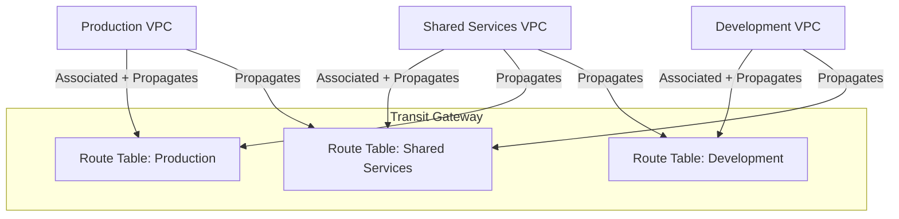

# How to Configure Transit Gateway Route Tables

Author: [nawazdhandala](https://github.com/nawazdhandala)

Tags: AWS, VPC, Networking, Transit Gateway

Description: Master transit gateway route tables to control traffic flow between VPCs, implement network segmentation, and build isolated routing domains in AWS.

---

The default transit gateway route table gives you full mesh connectivity - every attachment can talk to every other attachment. That's fine for getting started, but real-world networks need segmentation. Your dev environment shouldn't be able to reach production databases. Your third-party vendor VPC shouldn't see your internal services.

Transit gateway route tables let you control exactly which VPCs can communicate with each other. You create separate route tables for different routing domains, associate attachments with them, and control route propagation. It's like having multiple virtual routers inside your transit gateway.

## Understanding Route Tables, Associations, and Propagations

Three concepts matter:

**Route table**: A set of routes that determines where traffic goes. Each transit gateway can have multiple route tables.

**Association**: Links an attachment to a route table. When traffic enters the transit gateway through that attachment, this route table is used to decide where it goes. Each attachment can be associated with exactly one route table.

**Propagation**: Allows an attachment to advertise its routes to a route table. This is how other attachments learn about the networks behind an attachment.



In this setup, Production and Development can both reach Shared Services, but they can't reach each other. The shared services VPC can reach both.

## Disabling the Default Route Table

First, disable default associations and propagations so you have full control:

```bash
# Create a transit gateway without default route table behavior
TGW_ID=$(aws ec2 create-transit-gateway \
  --options '{
    "DefaultRouteTableAssociation": "disable",
    "DefaultRouteTablePropagation": "disable",
    "DnsSupport": "enable"
  }' \
  --tag-specifications 'ResourceType=transit-gateway,Tags=[{Key=Name,Value=segmented-tgw}]' \
  --query 'TransitGateway.TransitGatewayId' \
  --output text)
```

If you already have a transit gateway with defaults enabled, you can modify it:

```bash
# Disable default behavior on an existing transit gateway
aws ec2 modify-transit-gateway \
  --transit-gateway-id $TGW_ID \
  --options '{
    "DefaultRouteTableAssociation": "disable",
    "DefaultRouteTablePropagation": "disable"
  }'
```

## Creating Custom Route Tables

Create a route table for each routing domain:

```bash
# Route table for production workloads
RT_PROD=$(aws ec2 create-transit-gateway-route-table \
  --transit-gateway-id $TGW_ID \
  --tag-specifications 'ResourceType=transit-gateway-route-table,Tags=[{Key=Name,Value=production-rt}]' \
  --query 'TransitGatewayRouteTable.TransitGatewayRouteTableId' \
  --output text)

# Route table for development workloads
RT_DEV=$(aws ec2 create-transit-gateway-route-table \
  --transit-gateway-id $TGW_ID \
  --tag-specifications 'ResourceType=transit-gateway-route-table,Tags=[{Key=Name,Value=development-rt}]' \
  --query 'TransitGatewayRouteTable.TransitGatewayRouteTableId' \
  --output text)

# Route table for shared services
RT_SHARED=$(aws ec2 create-transit-gateway-route-table \
  --transit-gateway-id $TGW_ID \
  --tag-specifications 'ResourceType=transit-gateway-route-table,Tags=[{Key=Name,Value=shared-services-rt}]' \
  --query 'TransitGatewayRouteTable.TransitGatewayRouteTableId' \
  --output text)
```

## Setting Up Associations

Associate each VPC attachment with its route table. This controls which route table is consulted when traffic enters through that attachment:

```bash
# Production VPC uses the production route table
aws ec2 associate-transit-gateway-route-table \
  --transit-gateway-route-table-id $RT_PROD \
  --transit-gateway-attachment-id $ATTACH_PROD

# Development VPC uses the development route table
aws ec2 associate-transit-gateway-route-table \
  --transit-gateway-route-table-id $RT_DEV \
  --transit-gateway-attachment-id $ATTACH_DEV

# Shared services VPC uses the shared services route table
aws ec2 associate-transit-gateway-route-table \
  --transit-gateway-route-table-id $RT_SHARED \
  --transit-gateway-attachment-id $ATTACH_SHARED
```

## Configuring Route Propagation

This is where segmentation happens. By selectively propagating routes, you control visibility between domains:

```bash
# Shared services propagates its routes to all route tables
# (so everyone can reach shared services)
aws ec2 enable-transit-gateway-route-table-propagation \
  --transit-gateway-route-table-id $RT_PROD \
  --transit-gateway-attachment-id $ATTACH_SHARED

aws ec2 enable-transit-gateway-route-table-propagation \
  --transit-gateway-route-table-id $RT_DEV \
  --transit-gateway-attachment-id $ATTACH_SHARED

# Production propagates to shared services route table
# (so shared services can reach production)
aws ec2 enable-transit-gateway-route-table-propagation \
  --transit-gateway-route-table-id $RT_SHARED \
  --transit-gateway-attachment-id $ATTACH_PROD

# Development propagates to shared services route table
aws ec2 enable-transit-gateway-route-table-propagation \
  --transit-gateway-route-table-id $RT_SHARED \
  --transit-gateway-attachment-id $ATTACH_DEV

# NOTE: Production does NOT propagate to dev, and dev does NOT
# propagate to production. They're isolated from each other.
```

The result:
- Production VPC can reach Shared Services (and vice versa)
- Development VPC can reach Shared Services (and vice versa)
- Production and Development cannot reach each other

## Adding Static Routes

Sometimes you need routes that aren't propagated. For example, a default route to an inspection VPC:

```bash
# Send all internet-bound traffic through an inspection VPC
aws ec2 create-transit-gateway-route \
  --transit-gateway-route-table-id $RT_PROD \
  --destination-cidr-block 0.0.0.0/0 \
  --transit-gateway-attachment-id $ATTACH_INSPECTION

# Blackhole route to explicitly drop traffic
aws ec2 create-transit-gateway-route \
  --transit-gateway-route-table-id $RT_DEV \
  --destination-cidr-block 10.0.0.0/16 \
  --blackhole
```

Blackhole routes are useful for explicitly blocking communication to specific CIDRs, even if a propagated route would normally allow it.

## Viewing the Route Tables

Always verify your routing after making changes:

```bash
# View all routes in the production route table
aws ec2 search-transit-gateway-routes \
  --transit-gateway-route-table-id $RT_PROD \
  --filters "Name=type,Values=propagated,static" \
  --query 'Routes[].{CIDR:DestinationCidrBlock,Type:Type,State:State,Attachment:TransitGatewayAttachments[0].ResourceId}' \
  --output table
```

```bash
# View associations for a route table
aws ec2 get-transit-gateway-route-table-associations \
  --transit-gateway-route-table-id $RT_PROD \
  --query 'Associations[].{AttachmentId:TransitGatewayAttachmentId,ResourceId:ResourceId,State:State}' \
  --output table

# View propagations for a route table
aws ec2 get-transit-gateway-route-table-propagations \
  --transit-gateway-route-table-id $RT_PROD \
  --query 'TransitGatewayRouteTablePropagations[].{AttachmentId:TransitGatewayAttachmentId,ResourceId:ResourceId,State:State}' \
  --output table
```

## CloudFormation Template

Here's the segmented routing in CloudFormation:

```yaml
Resources:
  # Custom route tables
  ProductionRouteTable:
    Type: AWS::EC2::TransitGatewayRouteTable
    Properties:
      TransitGatewayId: !Ref TransitGateway
      Tags:
        - Key: Name
          Value: production-rt

  DevelopmentRouteTable:
    Type: AWS::EC2::TransitGatewayRouteTable
    Properties:
      TransitGatewayId: !Ref TransitGateway
      Tags:
        - Key: Name
          Value: development-rt

  SharedRouteTable:
    Type: AWS::EC2::TransitGatewayRouteTable
    Properties:
      TransitGatewayId: !Ref TransitGateway
      Tags:
        - Key: Name
          Value: shared-services-rt

  # Associations
  ProdAssociation:
    Type: AWS::EC2::TransitGatewayRouteTableAssociation
    Properties:
      TransitGatewayRouteTableId: !Ref ProductionRouteTable
      TransitGatewayAttachmentId: !Ref ProdAttachment

  # Propagations - shared services visible from production
  SharedToProdPropagation:
    Type: AWS::EC2::TransitGatewayRouteTablePropagation
    Properties:
      TransitGatewayRouteTableId: !Ref ProductionRouteTable
      TransitGatewayAttachmentId: !Ref SharedAttachment

  # Propagation - production visible from shared services
  ProdToSharedPropagation:
    Type: AWS::EC2::TransitGatewayRouteTablePropagation
    Properties:
      TransitGatewayRouteTableId: !Ref SharedRouteTable
      TransitGatewayAttachmentId: !Ref ProdAttachment

  # Blackhole route blocking dev from reaching prod
  BlockDevToProd:
    Type: AWS::EC2::TransitGatewayRoute
    Properties:
      TransitGatewayRouteTableId: !Ref DevelopmentRouteTable
      DestinationCidrBlock: 10.0.0.0/16
      Blackhole: true
```

## Common Patterns

**Hub and Spoke**: Shared services in the hub, environment VPCs as spokes. Spokes can reach the hub but not each other.

**Full Mesh with Exceptions**: Default propagation everywhere, then add blackhole routes to block specific paths.

**Inspection VPC**: All traffic routes through a central firewall VPC before reaching its destination. Use static `0.0.0.0/0` routes pointing to the inspection attachment.

For the foundational transit gateway setup, see [using AWS Transit Gateway for multi-VPC connectivity](https://oneuptime.com/blog/post/2026-02-12-aws-transit-gateway-multi-vpc-connectivity/view).

## Wrapping Up

Transit gateway route tables give you fine-grained control over network segmentation. The combination of associations, propagations, static routes, and blackhole routes lets you build any network topology you need. Start with the segmentation you need today, and know that you can evolve it as your network grows. Just remember to verify your routing after every change - a misconfigured propagation can silently open paths between environments that should be isolated.
