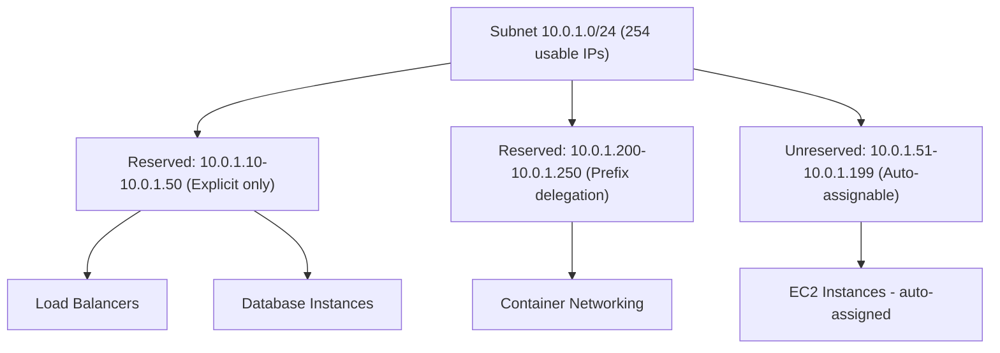

# How to Configure VPC Subnet CIDR Reservations

Author: [nawazdhandala](https://github.com/nawazdhandala)

Tags: AWS, VPC, Networking, CIDR, Subnet, IP Management

Description: Learn how to use VPC subnet CIDR reservations to control IP address allocation and prevent conflicts in your AWS networking infrastructure.

---

IP address management in AWS gets messy as your environment grows. You create a subnet, launch some instances, and then realize you need a block of contiguous IPs for a specific purpose - but they are already scattered across random allocations. Subnet CIDR reservations solve this by letting you reserve IP ranges within a subnet for specific use cases.

## What Are Subnet CIDR Reservations?

A subnet CIDR reservation carves out a portion of a subnet's IP range and restricts how those addresses can be allocated. You can reserve IP addresses so they are only assigned:

- **Explicitly**: Only when a resource specifically requests an IP from that range
- **Not at all**: The range is reserved and cannot be used by automatic allocation

This is useful when you need to guarantee IP ranges for specific workloads, integrate with on-premises systems that expect certain IP ranges, or prevent automatic allocation from consuming IPs you have plans for.



## When to Use CIDR Reservations

There are several scenarios where reservations become essential:

**Firewall rules with IP ranges**: If your on-premises firewall whitelists specific CIDR ranges, you need to guarantee that your AWS resources use IPs within those ranges.

**Container networking**: EKS pods get IPs from your VPC subnets. Without reservations, pod IPs can consume the entire subnet, leaving no room for other resources.

**Predictable infrastructure**: Some legacy applications or integrations require known IP addresses. Reservations prevent other resources from grabbing those IPs.

**Prefix delegation**: When using VPC prefix delegation for container networking, you want to reserve a range specifically for this purpose.

## Creating a CIDR Reservation

### Using the AWS CLI

```bash
# Reserve a range for explicit-only assignment
# Only resources that specifically request an IP in this range will get one
aws ec2 create-subnet-cidr-reservation \
    --subnet-id subnet-0123456789abcdef0 \
    --cidr 10.0.1.10/28 \
    --reservation-type explicit \
    --description "Reserved for database instances"
```

The `/28` gives you 16 IP addresses (10.0.1.0 through 10.0.1.15, with 10.0.1.10 through 10.0.1.25 in this case). These addresses will not be automatically assigned to new ENIs or instances unless explicitly requested.

```bash
# Reserve a range for prefix delegation (used by EKS/container networking)
aws ec2 create-subnet-cidr-reservation \
    --subnet-id subnet-0123456789abcdef0 \
    --cidr 10.0.1.200/26 \
    --reservation-type prefix \
    --description "Reserved for EKS pod networking"
```

### Using Terraform

```hcl
# Define subnet CIDR reservations in Terraform
resource "aws_ec2_subnet_cidr_reservation" "database_ips" {
  subnet_id    = aws_subnet.private_1a.id
  cidr_block   = "10.0.1.16/28"
  description  = "Reserved for RDS and ElastiCache"
  reservation_type = "explicit"
}

resource "aws_ec2_subnet_cidr_reservation" "container_ips" {
  subnet_id    = aws_subnet.private_1a.id
  cidr_block   = "10.0.1.192/26"
  description  = "Reserved for EKS prefix delegation"
  reservation_type = "prefix"
}
```

## Using Reserved IPs Explicitly

When you launch a resource and want it to use an IP from a reserved range, you specify the IP address directly.

```bash
# Launch an EC2 instance with a specific IP from the reserved range
aws ec2 run-instances \
    --image-id ami-0abcdef1234567890 \
    --instance-type m5.large \
    --subnet-id subnet-0123456789abcdef0 \
    --private-ip-address 10.0.1.10 \
    --security-group-ids sg-0123456789abcdef0 \
    --tag-specifications 'ResourceType=instance,Tags=[{Key=Name,Value=db-primary}]'
```

```bash
# Create an ENI with a specific IP from the reserved range
aws ec2 create-network-interface \
    --subnet-id subnet-0123456789abcdef0 \
    --private-ip-address 10.0.1.11 \
    --groups sg-0123456789abcdef0 \
    --description "Database secondary ENI"
```

## Managing Reservations

### List Existing Reservations

```bash
# View all CIDR reservations for a subnet
aws ec2 get-subnet-cidr-reservations \
    --subnet-id subnet-0123456789abcdef0

# Output shows reservation details
# {
#     "SubnetIpv4CidrReservations": [
#         {
#             "SubnetCidrReservationId": "scr-0123456789abcdef0",
#             "SubnetId": "subnet-0123456789abcdef0",
#             "Cidr": "10.0.1.16/28",
#             "ReservationType": "explicit",
#             "Description": "Reserved for RDS and ElastiCache"
#         }
#     ]
# }
```

### Delete a Reservation

```bash
# Remove a CIDR reservation when it is no longer needed
aws ec2 delete-subnet-cidr-reservation \
    --subnet-cidr-reservation-id scr-0123456789abcdef0
```

## Planning Your IP Address Layout

A well-planned subnet uses CIDR reservations to create a predictable IP layout.

```
Subnet: 10.0.1.0/24 (254 usable IPs)
========================================
10.0.1.0     - AWS reserved (network address)
10.0.1.1     - AWS reserved (VPC router)
10.0.1.2     - AWS reserved (DNS)
10.0.1.3     - AWS reserved (future use)
10.0.1.4-9   - Unreserved (auto-assign for misc)
10.0.1.10-25 - RESERVED: Database instances (explicit)
10.0.1.26-41 - RESERVED: Cache instances (explicit)
10.0.1.42-99 - Unreserved (auto-assign for app instances)
10.0.1.100-127 - RESERVED: Load balancer ENIs (explicit)
10.0.1.128-191 - Unreserved (auto-assign for future growth)
10.0.1.192-254 - RESERVED: Container networking (prefix)
10.0.1.255   - AWS reserved (broadcast)
```

This layout ensures that database IPs are always in a known range, container networking has dedicated space, and there is still room for general-purpose instances.

## CIDR Reservations with EKS

One of the most practical uses of CIDR reservations is managing IP space in EKS clusters. Without reservations, pods can consume your entire subnet's IP space.

```bash
# Reserve a /26 (64 IPs) in each subnet for EKS prefix delegation
for SUBNET_ID in subnet-1a subnet-1b subnet-1c; do
    # Get the subnet CIDR
    SUBNET_CIDR=$(aws ec2 describe-subnets \
        --subnet-ids $SUBNET_ID \
        --query 'Subnets[0].CidrBlock' --output text)

    # Reserve the upper quarter for EKS
    # Example: if subnet is 10.0.1.0/24, reserve 10.0.1.192/26
    BASE=$(echo $SUBNET_CIDR | cut -d'/' -f1 | cut -d'.' -f1-3)

    aws ec2 create-subnet-cidr-reservation \
        --subnet-id $SUBNET_ID \
        --cidr "${BASE}.192/26" \
        --reservation-type prefix \
        --description "EKS pod networking"

    echo "Reserved ${BASE}.192/26 in $SUBNET_ID for EKS"
done
```

## Best Practices

**Document your IP plan**: Keep a central document or spreadsheet that maps reserved ranges to their purpose. CIDR reservations have description fields - use them.

**Do not over-reserve**: Leave enough unreserved space for auto-assignment. If 80% of your subnet is reserved, new resources may fail to launch because there are no available IPs.

**Use consistent patterns across subnets**: If database IPs are in the .10-.25 range in subnet A, use the same range in subnet B. Consistency makes troubleshooting easier.

**Consider future growth**: Reserve slightly more than you need today. Adding reservations later is easy, but if the IPs you want are already allocated to running instances, you will have a harder time.

**Coordinate with VPC sharing**: If you use shared VPCs through AWS Resource Access Manager, coordinate CIDR reservations with participant accounts. See our guide on [setting up shared VPCs](https://oneuptime.com/blog/post/set-up-shared-vpcs-with-aws-resource-access-manager/view) for more context.

## Troubleshooting

**"InsufficientFreeAddressesInSubnet" error**: Your reserved ranges may be consuming too much space. Check reservation sizes with `get-subnet-cidr-reservations`.

**Instances getting IPs in reserved ranges**: This only happens with `prefix` type reservations if prefix delegation is in use. With `explicit` type, auto-assignment always avoids the reserved range.

**Overlapping reservations**: AWS prevents you from creating overlapping CIDR reservations in the same subnet. If you get an error, check existing reservations first.

## Conclusion

Subnet CIDR reservations are a simple but powerful tool for bringing order to your IP address management in AWS. They prevent the "IP address squatting" problem where auto-assigned resources consume IPs you had plans for, and they make your networking infrastructure more predictable and easier to troubleshoot. Use them as part of your standard VPC design, not as an afterthought when problems arise.
