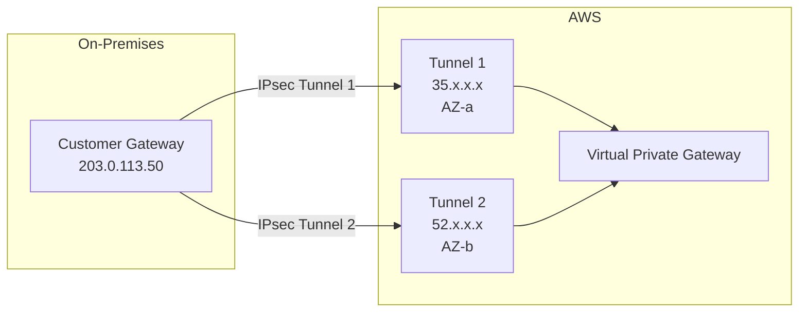
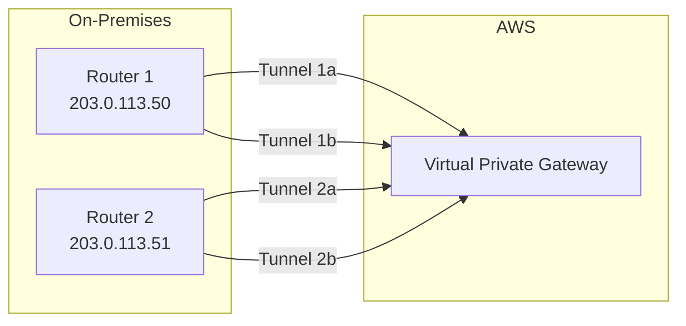

# How to Configure VPN Redundancy with Dual Tunnels

Author: [nawazdhandala](https://github.com/nawazdhandala)

Tags: AWS, VPN, Networking, High Availability

Description: Build a highly available VPN connection using dual tunnels, multiple customer gateways, and BGP failover for reliable hybrid cloud connectivity.

---

Every AWS site-to-site VPN connection comes with two tunnels. AWS does this automatically - you don't even have to ask. But having two tunnels and actually using both of them for redundancy are different things. Most VPN setups I've seen only have one tunnel active, which means you're one failure away from losing connectivity to AWS.

Let's fix that. We'll set up proper dual-tunnel redundancy, configure BGP for automatic failover, and then go further with multiple VPN connections for even higher availability.

## Understanding the Default Dual Tunnels

When you create a VPN connection, AWS provisions two tunnels to different endpoints in different facilities:



Both tunnels should be active simultaneously. If Tunnel 1 goes down for maintenance or due to a failure, Tunnel 2 handles all traffic.

## Configuring Both Tunnels

The key is configuring your on-premises router to establish both tunnels and use BGP to manage failover.

First, let's customize the tunnel options when creating the VPN:

```bash
# Create VPN with custom tunnel configurations
VPN_ID=$(aws ec2 create-vpn-connection \
  --type ipsec.1 \
  --customer-gateway-id $CGW_ID \
  --vpn-gateway-id $VGW_ID \
  --options '{
    "StaticRoutesOnly": false,
    "TunnelOptions": [
      {
        "TunnelInsideCidr": "169.254.10.0/30",
        "PreSharedKey": "your-strong-psk-tunnel1",
        "Phase1LifetimeSeconds": 28800,
        "Phase2LifetimeSeconds": 3600,
        "Phase1EncryptionAlgorithms": [{"Value": "AES256"}],
        "Phase1IntegrityAlgorithms": [{"Value": "SHA2-256"}],
        "Phase1DHGroupNumbers": [{"Value": 20}],
        "Phase2EncryptionAlgorithms": [{"Value": "AES256"}],
        "Phase2IntegrityAlgorithms": [{"Value": "SHA2-256"}],
        "Phase2DHGroupNumbers": [{"Value": 20}],
        "IKEVersions": [{"Value": "ikev2"}]
      },
      {
        "TunnelInsideCidr": "169.254.11.0/30",
        "PreSharedKey": "your-strong-psk-tunnel2",
        "Phase1LifetimeSeconds": 28800,
        "Phase2LifetimeSeconds": 3600,
        "Phase1EncryptionAlgorithms": [{"Value": "AES256"}],
        "Phase1IntegrityAlgorithms": [{"Value": "SHA2-256"}],
        "Phase1DHGroupNumbers": [{"Value": 20}],
        "Phase2EncryptionAlgorithms": [{"Value": "AES256"}],
        "Phase2IntegrityAlgorithms": [{"Value": "SHA2-256"}],
        "Phase2DHGroupNumbers": [{"Value": 20}],
        "IKEVersions": [{"Value": "ikev2"}]
      }
    ]
  }' \
  --query 'VpnConnection.VpnConnectionId' \
  --output text)
```

This gives you control over the tunnel inside CIDRs and IPsec parameters. Specifying `IKEVersions` as `ikev2` ensures you're using the modern, more secure protocol.

## BGP Configuration for Automatic Failover

BGP (Border Gateway Protocol) is what makes failover automatic. With BGP, your router and AWS exchange route information. When a tunnel goes down, BGP detects it and reroutes traffic through the surviving tunnel.

On the AWS side, BGP is configured automatically. You need to set it up on your router. Here's the concept:

```
BGP Neighbor 1 (Tunnel 1):
  Peer IP: 169.254.10.1 (AWS side)
  Local IP: 169.254.10.2 (your side)
  Remote ASN: 64512 (AWS)
  Local ASN: 65000 (yours)

BGP Neighbor 2 (Tunnel 2):
  Peer IP: 169.254.11.1 (AWS side)
  Local IP: 169.254.11.2 (your side)
  Remote ASN: 64512 (AWS)
  Local ASN: 65000 (yours)
```

Here's a sample BGP configuration for a Linux router using FRRouting:

```bash
# /etc/frr/frr.conf - FRRouting BGP configuration
router bgp 65000
  bgp router-id 203.0.113.50
  neighbor 169.254.10.1 remote-as 64512
  neighbor 169.254.11.1 remote-as 64512

  address-family ipv4 unicast
    # Advertise your on-premises network
    network 192.168.0.0/16
    # Accept routes from AWS
    neighbor 169.254.10.1 activate
    neighbor 169.254.11.1 activate
    # Set hold timer for faster failover (default is 90 seconds)
    neighbor 169.254.10.1 timers 10 30
    neighbor 169.254.11.1 timers 10 30
  exit-address-family
```

The `timers 10 30` setting means BGP sends keepalives every 10 seconds and declares a neighbor dead after 30 seconds of silence. The default (60/180) is too slow for most use cases.

## Active/Active vs. Active/Passive

**Active/Active**: Both tunnels carry traffic simultaneously. This gives you more bandwidth (up to 2.5 Gbps total with ECMP on transit gateway) and instant failover.

**Active/Passive**: One tunnel is preferred, the other is standby. Traffic only uses the backup when the primary fails.

To prefer one tunnel, use BGP AS path prepending:

```bash
# FRRouting - make Tunnel 2 less preferred by prepending AS path
route-map TUNNEL2-OUT permit 10
  set as-path prepend 65000 65000 65000

router bgp 65000
  neighbor 169.254.11.1 route-map TUNNEL2-OUT out
```

This makes Tunnel 2's routes look "longer" (more hops), so AWS prefers Tunnel 1. When Tunnel 1 goes down, Tunnel 2 takes over.

## Adding a Second VPN Connection

For even higher redundancy, create two VPN connections, each with their own customer gateway. This protects against customer gateway failures:

```bash
# Create a second customer gateway (different router or different WAN link)
CGW_2=$(aws ec2 create-customer-gateway \
  --type ipsec.1 \
  --public-ip 203.0.113.51 \
  --bgp-asn 65000 \
  --tag-specifications 'ResourceType=customer-gateway,Tags=[{Key=Name,Value=backup-router}]' \
  --query 'CustomerGateway.CustomerGatewayId' \
  --output text)

# Create second VPN connection
VPN_2=$(aws ec2 create-vpn-connection \
  --type ipsec.1 \
  --customer-gateway-id $CGW_2 \
  --vpn-gateway-id $VGW_ID \
  --options '{"StaticRoutesOnly": false}' \
  --query 'VpnConnection.VpnConnectionId' \
  --output text)
```

Now you have four tunnels total: two from each VPN connection. If one router fails entirely, the other router's tunnels are still active.



## Using Transit Gateway for ECMP

Virtual private gateways support active/passive across VPN connections. For true active/active with ECMP (Equal Cost Multi-Path), use a transit gateway instead:

```bash
# Create VPN attachment to transit gateway
VPN_TGW=$(aws ec2 create-vpn-connection \
  --type ipsec.1 \
  --customer-gateway-id $CGW_ID \
  --transit-gateway-id $TGW_ID \
  --options '{"StaticRoutesOnly": false}' \
  --query 'VpnConnection.VpnConnectionId' \
  --output text)
```

Transit gateway supports ECMP across multiple VPN tunnels, giving you aggregated bandwidth. Four tunnels at 1.25 Gbps each gives you 5 Gbps total.

## Monitoring Tunnel Health

Set up CloudWatch alarms to get notified when tunnels go down:

```bash
# Create alarm for tunnel state
aws cloudwatch put-metric-alarm \
  --alarm-name "vpn-tunnel1-down" \
  --metric-name TunnelState \
  --namespace AWS/VPN \
  --statistic Maximum \
  --period 60 \
  --evaluation-periods 2 \
  --threshold 0 \
  --comparison-operator LessThanOrEqualToThreshold \
  --dimensions Name=VpnId,Value=$VPN_ID Name=TunnelIpAddress,Value=35.x.x.x \
  --alarm-actions $SNS_TOPIC_ARN
```

Monitor both tunnels:

```bash
# Check tunnel status for all VPN connections
aws ec2 describe-vpn-connections \
  --filters "Name=vpn-gateway-id,Values=$VGW_ID" \
  --query 'VpnConnections[].{VPN:VpnConnectionId,Tunnels:VgwTelemetry[].{IP:OutsideIpAddress,Status:Status}}' \
  --output json
```

## Testing Failover

Don't wait for a real failure to discover your failover doesn't work. Test it:

1. Bring down Tunnel 1 on your router
2. Verify traffic shifts to Tunnel 2 (check flow logs or run traceroute)
3. Verify BGP reconverges within your expected timeframe
4. Bring Tunnel 1 back up
5. Verify traffic rebalances

```bash
# On your Linux router, bring down Tunnel 1 to test failover
sudo ip link set tunnel1 down

# Verify traffic is flowing through Tunnel 2
ping -c 10 10.0.1.15  # Target in AWS VPC

# Bring Tunnel 1 back up
sudo ip link set tunnel1 up
```

For more on the basic VPN setup, see [setting up a site-to-site VPN connection](https://oneuptime.com/blog/post/2026-02-12-set-up-site-to-site-vpn-connection/view). If you need more bandwidth than VPN can provide, look into [AWS Direct Connect](https://oneuptime.com/blog/post/2026-02-12-set-up-aws-direct-connect-dedicated-connectivity/view).

## Wrapping Up

VPN redundancy isn't optional for production hybrid connectivity. Use both tunnels, configure BGP for automatic failover, tune the timers for fast detection, and test your failover regularly. For critical workloads, add a second VPN connection with a separate customer gateway. The extra configuration effort is minor compared to the downtime cost of a single-tunnel failure.
