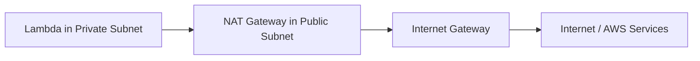

# How to Connect Lambda Functions to a VPC

Author: [nawazdhandala](https://github.com/nawazdhandala)

Tags: AWS, Lambda, VPC, Networking, Serverless

Description: Learn how to connect AWS Lambda functions to a VPC so they can access private resources like RDS databases, ElastiCache clusters, and internal services.

---

By default, AWS Lambda functions run in an AWS-managed VPC that has internet access but can't reach your private resources. If your Lambda needs to talk to an RDS database, an ElastiCache cluster, or any other resource sitting inside your VPC, you need to configure the function to run within that VPC.

This sounds straightforward, but there are a few gotchas that trip people up. Let's walk through the entire process - from the IAM permissions to the subnet configuration to dealing with the dreaded "no internet" problem.

## Why Would You Connect Lambda to a VPC?

The most common reason is database access. If your RDS instance is in a private subnet (as it should be), Lambda can't reach it unless the function is connected to the same VPC. Same goes for ElastiCache, Elasticsearch/OpenSearch domains, or any internal microservices running on EC2 or ECS.

Other reasons include:

- Accessing resources behind a private API Gateway endpoint
- Connecting to on-premises systems through a VPN or Direct Connect
- Meeting compliance requirements that mandate private networking
- Reaching internal services that aren't exposed to the internet

## The IAM Role Setup

Before you configure VPC access, your Lambda function's execution role needs the right permissions. Specifically, it needs the `AmazonVPCFullAccess` managed policy or, better yet, a minimal custom policy.

Here's a minimal IAM policy that grants just what Lambda needs to create and manage ENIs (Elastic Network Interfaces) in your VPC:

```json
{
  "Version": "2012-10-17",
  "Statement": [
    {
      "Effect": "Allow",
      "Action": [
        "ec2:CreateNetworkInterface",
        "ec2:DescribeNetworkInterfaces",
        "ec2:DeleteNetworkInterface",
        "ec2:AssignPrivateIpAddresses",
        "ec2:UnassignPrivateIpAddresses"
      ],
      "Resource": "*"
    }
  ]
}
```

Lambda creates ENIs in your subnets to establish network connectivity. Without these permissions, the deployment will fail with a cryptic error.

## Configuring VPC Access via the Console

In the Lambda console, navigate to your function and scroll to the VPC section under Configuration. Click Edit and you'll see three fields:

1. **VPC** - Select your target VPC
2. **Subnets** - Pick at least two subnets in different Availability Zones for high availability
3. **Security Groups** - Choose one or more security groups

For subnets, always select private subnets. Don't use public subnets - Lambda won't get a public IP even if the subnet has auto-assign public IP enabled.

## Configuring VPC Access with CloudFormation

If you're using Infrastructure as Code (and you should be), here's how to configure it in a CloudFormation template:

```yaml
# CloudFormation template for a VPC-connected Lambda function
Resources:
  MyLambdaFunction:
    Type: AWS::Lambda::Function
    Properties:
      FunctionName: my-vpc-lambda
      Runtime: nodejs20.x
      Handler: index.handler
      Role: !GetAtt LambdaExecutionRole.Arn
      Code:
        ZipFile: |
          exports.handler = async (event) => {
            return { statusCode: 200, body: 'Hello from VPC!' };
          };
      VpcConfig:
        # Always use at least 2 subnets for high availability
        SubnetIds:
          - !Ref PrivateSubnet1
          - !Ref PrivateSubnet2
        SecurityGroupIds:
          - !Ref LambdaSecurityGroup
      Timeout: 30

  # Security group that allows outbound traffic
  LambdaSecurityGroup:
    Type: AWS::EC2::SecurityGroup
    Properties:
      GroupDescription: Security group for Lambda function
      VpcId: !Ref MyVPC
      SecurityGroupEgress:
        - IpProtocol: tcp
          FromPort: 443
          ToPort: 443
          CidrIpBlock: 0.0.0.0/0
        - IpProtocol: tcp
          FromPort: 5432
          ToPort: 5432
          # Allow traffic to the database subnet
          CidrIpBlock: 10.0.0.0/16
```

## Configuring VPC Access with AWS CLI

You can also attach a Lambda function to a VPC using the AWS CLI:

```bash
# Update an existing Lambda function to connect to a VPC
aws lambda update-function-configuration \
  --function-name my-function \
  --vpc-config SubnetIds=subnet-0abc123,subnet-0def456,SecurityGroupIds=sg-0xyz789
```

To remove VPC access later:

```bash
# Remove VPC configuration from a Lambda function
aws lambda update-function-configuration \
  --function-name my-function \
  --vpc-config SubnetIds=[],SecurityGroupIds=[]
```

## The Internet Access Problem

Here's the biggest gotcha. Once your Lambda function is inside a VPC, it loses internet access. This means it can't call AWS APIs (like S3, DynamoDB, SQS), external APIs, or anything outside your VPC.

You have two options to restore internet access:

### Option 1: NAT Gateway

Place your Lambda in private subnets and route traffic through a NAT Gateway in a public subnet. This is the traditional approach.



The downside? NAT Gateways cost money - roughly $32/month plus data processing charges. For high-throughput Lambda functions, this can add up fast.

### Option 2: VPC Endpoints

VPC endpoints let your Lambda function reach AWS services without going through the internet. There are two types:

- **Gateway endpoints** (free) - Available for S3 and DynamoDB
- **Interface endpoints** (paid) - Available for most other AWS services

Here's how to create a gateway endpoint for S3:

```yaml
# VPC endpoint lets Lambda access S3 without internet
S3GatewayEndpoint:
  Type: AWS::EC2::VPCEndpoint
  Properties:
    VpcId: !Ref MyVPC
    ServiceName: !Sub "com.amazonaws.${AWS::Region}.s3"
    VpcEndpointType: Gateway
    RouteTableIds:
      - !Ref PrivateRouteTable
```

And an interface endpoint for Secrets Manager:

```yaml
# Interface endpoint for Secrets Manager access from VPC
SecretsManagerEndpoint:
  Type: AWS::EC2::VPCEndpoint
  Properties:
    VpcId: !Ref MyVPC
    ServiceName: !Sub "com.amazonaws.${AWS::Region}.secretsmanager"
    VpcEndpointType: Interface
    SubnetIds:
      - !Ref PrivateSubnet1
      - !Ref PrivateSubnet2
    SecurityGroupIds:
      - !Ref VpcEndpointSecurityGroup
    PrivateDnsEnabled: true
```

For most production setups, you'll want a combination of both - VPC endpoints for AWS services you use frequently, and a NAT Gateway as a fallback for external API calls.

## Security Group Configuration

Your Lambda function's security group needs to allow outbound traffic to whatever services it needs to reach. For example, if it connects to a PostgreSQL RDS instance:

```json
{
  "outbound_rules": [
    {
      "protocol": "tcp",
      "port": 5432,
      "destination": "sg-rds-security-group"
    }
  ]
}
```

On the RDS side, you need an inbound rule allowing traffic from the Lambda security group on port 5432. Referencing security groups rather than CIDR blocks is cleaner and more maintainable.

## Cold Start Considerations

VPC-connected Lambda functions used to have significantly longer cold starts - sometimes 10+ seconds while AWS provisioned ENIs. Since 2019, AWS improved this with Hyperplane ENIs that are created when you deploy or update the function, not at invocation time.

Today, VPC-connected Lambdas have cold starts that are only marginally longer than non-VPC ones. You'll see maybe 1-2 seconds of additional latency on a cold start. For most use cases, this is perfectly acceptable.

If cold starts matter a lot, consider using [Provisioned Concurrency](https://oneuptime.com/blog/post/implement-canary-deployments-for-lambda-functions/view) to keep warm instances ready.

## Monitoring VPC-Connected Lambdas

Once your Lambda is in a VPC, you should monitor ENI usage. Each Lambda execution environment uses an ENI, and there's a per-region limit. If you hit that limit, new invocations will fail.

Check your ENI usage with:

```bash
# Count ENIs created by Lambda in your VPC
aws ec2 describe-network-interfaces \
  --filters "Name=requester-id,Values=*lambda*" \
  --query "NetworkInterfaces[].NetworkInterfaceId" \
  --output text | wc -w
```

You can also set up CloudWatch alarms to track this. For more on Lambda monitoring, check out our post on [monitoring Lambda function performance with CloudWatch](https://oneuptime.com/blog/post/monitor-lambda-function-performance-with-cloudwatch/view).

## Common Mistakes to Avoid

1. **Using public subnets** - Lambda won't get a public IP, so public subnets don't help.
2. **Forgetting the IAM permissions** - The ENI permissions are required before deployment.
3. **Only selecting one subnet** - Always pick subnets in at least two AZs for resilience.
4. **Not configuring security group egress** - The default allows all outbound, but if you've customized it, make sure Lambda can reach what it needs.
5. **Ignoring the internet access issue** - Test that your function can still reach external services after connecting to the VPC.

## Wrapping Up

Connecting Lambda to a VPC is essential when your serverless functions need access to private resources. The setup itself is simple - pick your subnets and security groups - but the networking implications require careful planning. Make sure you handle internet access through NAT Gateways or VPC endpoints, choose the right subnets, and configure security groups properly. With those pieces in place, your Lambda functions can securely access anything in your private network.
