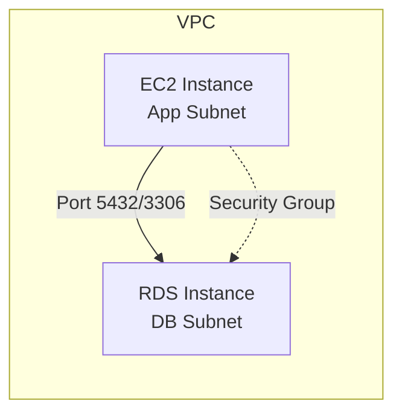

# How to Connect to an RDS Instance from an EC2 Instance

Author: [nawazdhandala](https://github.com/nawazdhandala)

Tags: AWS, RDS, EC2, Database, Networking

Description: Learn how to connect an EC2 instance to an RDS database, including security group configuration, IAM authentication, and connection pooling.

---

Connecting an EC2 instance to an RDS database is one of the most fundamental patterns in AWS architecture. Your application runs on EC2, your data lives in RDS, and you need them talking to each other reliably. While the concept is simple, getting the security groups, networking, and authentication right requires attention to detail. Let's cover everything from basic connectivity to production best practices.

## The Architecture

The typical setup looks like this:



Both the EC2 instance and RDS instance live in the same VPC. The EC2 instance is in an application subnet, and the RDS instance is in a database subnet. Security groups control which EC2 instances can reach the database.

## Step 1: Security Group Configuration

This is where most connection problems happen. You need two security groups:

1. **EC2 security group** (sg-app): Applied to your EC2 instance
2. **RDS security group** (sg-db): Applied to your RDS instance

The RDS security group needs an inbound rule that references the EC2 security group. This is more secure than using IP ranges because it automatically applies to any instance in that security group.

These commands create the security groups and configure the inbound rule.

```bash
# Create security group for EC2
aws ec2 create-security-group \
  --group-name app-sg \
  --description "Security group for application instances" \
  --vpc-id vpc-0abc123

# Create security group for RDS
aws ec2 create-security-group \
  --group-name db-sg \
  --description "Security group for RDS instances" \
  --vpc-id vpc-0abc123

# Allow EC2 to reach RDS on PostgreSQL port
aws ec2 authorize-security-group-ingress \
  --group-id sg-db-123 \
  --protocol tcp \
  --port 5432 \
  --source-group sg-app-456

# For MySQL, use port 3306 instead
aws ec2 authorize-security-group-ingress \
  --group-id sg-db-123 \
  --protocol tcp \
  --port 3306 \
  --source-group sg-app-456
```

## Step 2: Verify Network Connectivity

Before configuring your application, verify basic connectivity from the EC2 instance.

SSH into your EC2 instance and test the connection to the RDS endpoint.

```bash
# Test if the port is reachable (install nmap if needed)
nc -zv my-db.abc123.us-east-1.rds.amazonaws.com 5432

# Expected output:
# Connection to my-db.abc123.us-east-1.rds.amazonaws.com 5432 port [tcp/postgresql] succeeded!

# Or use telnet
telnet my-db.abc123.us-east-1.rds.amazonaws.com 5432
```

If the connection times out, check:
- Security group rules
- That both instances are in the same VPC (or connected VPCs)
- Route tables and NACLs

## Step 3: Install Database Clients

Install the appropriate client on your EC2 instance.

These commands install database clients on Amazon Linux 2023.

```bash
# PostgreSQL client
sudo dnf install postgresql15 -y

# MySQL client
sudo dnf install mariadb105 -y

# Or install specific MySQL client
sudo dnf install mysql-community-client -y
```

## Step 4: Connect and Test

Test the database connection from the EC2 instance.

```bash
# PostgreSQL
psql -h my-db.abc123.us-east-1.rds.amazonaws.com \
  -U admin -d myappdb -p 5432

# MySQL
mysql -h my-db.abc123.us-east-1.rds.amazonaws.com \
  -u admin -p -P 3306

# SQL Server (install mssql-tools first)
sqlcmd -S my-db.abc123.us-east-1.rds.amazonaws.com,1433 -U admin
```

## Using IAM Database Authentication

Instead of storing database passwords on your EC2 instance, you can use IAM authentication. The EC2 instance's IAM role generates a temporary authentication token that works as a password.

### Enable IAM Auth on RDS

This enables IAM authentication on an existing RDS instance.

```bash
aws rds modify-db-instance \
  --db-instance-identifier my-db \
  --enable-iam-database-authentication \
  --apply-immediately
```

### Create a Database User for IAM Auth

This SQL creates a user that authenticates through IAM instead of a password.

```sql
-- PostgreSQL
CREATE USER iam_user WITH LOGIN;
GRANT rds_iam TO iam_user;

-- MySQL
CREATE USER 'iam_user'@'%' IDENTIFIED WITH AWSAuthenticationPlugin AS 'RDS';
GRANT SELECT, INSERT, UPDATE, DELETE ON myappdb.* TO 'iam_user'@'%';
```

### Configure EC2 IAM Role

Attach this policy to the EC2 instance's IAM role.

```json
{
  "Version": "2012-10-17",
  "Statement": [
    {
      "Effect": "Allow",
      "Action": "rds-db:connect",
      "Resource": "arn:aws:rds-db:us-east-1:123456789:dbuser:dbi-abc123/iam_user"
    }
  ]
}
```

### Connect with IAM Token

This script generates a temporary token and connects to PostgreSQL.

```bash
# Generate auth token
TOKEN=$(aws rds generate-db-auth-token \
  --hostname my-db.abc123.us-east-1.rds.amazonaws.com \
  --port 5432 \
  --username iam_user \
  --region us-east-1)

# Connect with the token as password
PGPASSWORD=$TOKEN psql \
  -h my-db.abc123.us-east-1.rds.amazonaws.com \
  -p 5432 \
  -U iam_user \
  -d myappdb \
  --no-password
```

## Application Connection Examples

Here's how to connect from common programming languages running on EC2.

### Python with psycopg2

This Python code connects to PostgreSQL with connection pooling.

```python
import psycopg2
from psycopg2 import pool

# Create a connection pool
connection_pool = psycopg2.pool.ThreadedConnectionPool(
    minconn=5,
    maxconn=20,
    host='my-db.abc123.us-east-1.rds.amazonaws.com',
    port=5432,
    database='myappdb',
    user='myapp_user',
    password='strong_password',
    sslmode='require',  # Always use SSL
    connect_timeout=5
)

# Get a connection from the pool
conn = connection_pool.getconn()
try:
    cursor = conn.cursor()
    cursor.execute("SELECT version();")
    print(cursor.fetchone())
finally:
    # Return connection to pool
    connection_pool.putconn(conn)
```

### Node.js with pg

This Node.js code connects to PostgreSQL with a connection pool.

```javascript
const { Pool } = require('pg');

const pool = new Pool({
  host: 'my-db.abc123.us-east-1.rds.amazonaws.com',
  port: 5432,
  database: 'myappdb',
  user: 'myapp_user',
  password: 'strong_password',
  ssl: { rejectUnauthorized: true },
  max: 20,           // Maximum pool size
  idleTimeoutMillis: 30000,
  connectionTimeoutMillis: 5000
});

// Use the pool
async function query() {
  const client = await pool.connect();
  try {
    const result = await client.query('SELECT NOW()');
    console.log(result.rows[0]);
  } finally {
    client.release();
  }
}
```

### Java with HikariCP

This Java code sets up a HikariCP connection pool for MySQL.

```java
import com.zaxxer.hikari.HikariConfig;
import com.zaxxer.hikari.HikariDataSource;

HikariConfig config = new HikariConfig();
config.setJdbcUrl("jdbc:mysql://my-db.abc123.us-east-1.rds.amazonaws.com:3306/myappdb");
config.setUsername("myapp_user");
config.setPassword("strong_password");
config.setMaximumPoolSize(20);
config.setMinimumIdle(5);
config.setConnectionTimeout(5000);
config.setIdleTimeout(300000);
config.addDataSourceProperty("useSSL", "true");
config.addDataSourceProperty("requireSSL", "true");

HikariDataSource dataSource = new HikariDataSource(config);
```

## Using Secrets Manager for Credentials

Don't hardcode database passwords. Use AWS Secrets Manager to store and retrieve them.

This Python code retrieves database credentials from Secrets Manager.

```python
import json
import boto3

def get_db_credentials(secret_name):
    client = boto3.client('secretsmanager', region_name='us-east-1')
    response = client.get_secret_value(SecretId=secret_name)
    return json.loads(response['SecretString'])

# Use in your connection
creds = get_db_credentials('my-db-credentials')
conn = psycopg2.connect(
    host=creds['host'],
    port=creds['port'],
    database=creds['dbname'],
    user=creds['username'],
    password=creds['password']
)
```

## Connection Pooling with RDS Proxy

For applications with many short-lived connections (like microservices), consider using [RDS Proxy](https://oneuptime.com/blog/post/setup-rds-proxy-connection-pooling/view). It sits between your EC2 instances and RDS, managing a pool of connections and reducing the load on your database.

## Troubleshooting

Common connection issues and their solutions:

| Problem | Likely Cause | Fix |
|---------|-------------|-----|
| Connection timeout | Security group misconfigured | Add inbound rule for EC2 SG |
| Connection refused | Wrong port or RDS not running | Check port and instance status |
| Authentication failed | Wrong credentials | Verify username/password |
| SSL required | RDS requires SSL | Add SSL parameters to connection |
| Too many connections | Connection pool too large | Reduce pool size or use RDS Proxy |

## Wrapping Up

Connecting EC2 to RDS boils down to three things: get the security groups right, use SSL for encryption in transit, and manage credentials securely. For production, use IAM authentication or Secrets Manager instead of hardcoded passwords, implement connection pooling in your application, and consider RDS Proxy if you have many application instances. These practices keep your database secure and your connections reliable.
