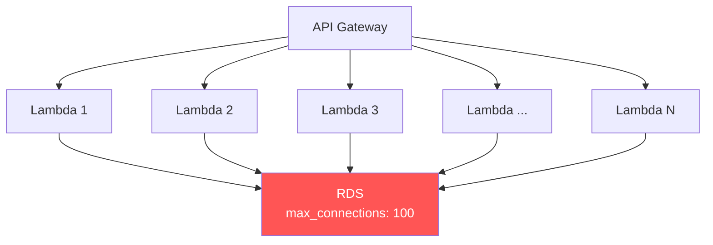

# How to Connect to an RDS Instance from a Lambda Function

Author: [nawazdhandala](https://github.com/nawazdhandala)

Tags: AWS, RDS, Lambda, Serverless, Database

Description: Learn how to connect AWS Lambda functions to RDS databases, including VPC configuration, connection management, and using RDS Proxy for production workloads.

---

Connecting Lambda to RDS is one of those things that sounds simple but has some real gotchas. Lambda functions are ephemeral and can scale to hundreds of concurrent executions in seconds. RDS databases have a fixed number of connections. If you're not careful, your Lambda functions will exhaust the database connection pool and bring everything down. Let's do this right.

## The Challenge

Here's the core problem: each Lambda invocation typically opens a database connection. If 500 Lambda invocations happen simultaneously, that's 500 connections to your database. A db.t3.medium PostgreSQL instance has a default `max_connections` of around 100. You see the issue.



There are three approaches to solve this:

1. **Connection reuse in Lambda** - Reuse connections across invocations
2. **RDS Proxy** - Let AWS manage the connection pool (recommended)
3. **Careful connection management** - Close connections properly and set limits

## Step 1: Put Lambda in a VPC

If your RDS instance is in a private subnet (and it should be), your Lambda function needs to be in the same VPC. This requires configuring VPC access for the Lambda function.

### Configure the IAM Role

Your Lambda execution role needs permissions to create network interfaces in the VPC.

This policy grants Lambda the permissions needed to attach to a VPC.

```json
{
  "Version": "2012-10-17",
  "Statement": [
    {
      "Effect": "Allow",
      "Action": [
        "ec2:CreateNetworkInterface",
        "ec2:DescribeNetworkInterfaces",
        "ec2:DeleteNetworkInterface",
        "ec2:AssignPrivateIpAddresses",
        "ec2:UnassignPrivateIpAddresses"
      ],
      "Resource": "*"
    }
  ]
}
```

### Configure VPC in Lambda

Set the VPC configuration on your Lambda function. Use private subnets - Lambda doesn't need a public IP.

This command configures a Lambda function to run inside a VPC.

```bash
aws lambda update-function-configuration \
  --function-name my-function \
  --vpc-config SubnetIds=subnet-private-1,subnet-private-2,SecurityGroupIds=sg-lambda-123
```

### Security Groups

Create a security group for Lambda and update the RDS security group to allow it.

```bash
# Lambda security group (outbound to RDS)
aws ec2 create-security-group \
  --group-name lambda-sg \
  --description "Security group for Lambda functions" \
  --vpc-id vpc-0abc123

# Allow Lambda to reach RDS
aws ec2 authorize-security-group-ingress \
  --group-id sg-rds-123 \
  --protocol tcp \
  --port 5432 \
  --source-group sg-lambda-123
```

## Step 2: Connection Reuse

Lambda keeps the execution environment alive between invocations (warm starts). You can reuse database connections by creating them outside the handler function.

### Python Example

This Python code creates the database connection outside the handler so it persists across invocations.

```python
import json
import psycopg2
import os

# Connection created outside handler - reused across invocations
connection = None

def get_connection():
    global connection
    if connection is None or connection.closed:
        connection = psycopg2.connect(
            host=os.environ['DB_HOST'],
            port=int(os.environ.get('DB_PORT', 5432)),
            database=os.environ['DB_NAME'],
            user=os.environ['DB_USER'],
            password=os.environ['DB_PASSWORD'],
            connect_timeout=5,
            options='-c statement_timeout=30000'  # 30 second query timeout
        )
        connection.autocommit = True
    return connection

def handler(event, context):
    conn = get_connection()
    try:
        with conn.cursor() as cursor:
            cursor.execute("SELECT id, name FROM users LIMIT 10")
            rows = cursor.fetchall()
            return {
                'statusCode': 200,
                'body': json.dumps([{'id': r[0], 'name': r[1]} for r in rows])
            }
    except psycopg2.OperationalError:
        # Connection was dropped - reconnect
        global connection
        connection = None
        conn = get_connection()
        with conn.cursor() as cursor:
            cursor.execute("SELECT id, name FROM users LIMIT 10")
            rows = cursor.fetchall()
            return {
                'statusCode': 200,
                'body': json.dumps([{'id': r[0], 'name': r[1]} for r in rows])
            }
```

### Node.js Example

This Node.js code reuses the database connection across Lambda invocations.

```javascript
const { Client } = require('pg');

// Connection outside handler for reuse
let client = null;

async function getClient() {
  if (!client) {
    client = new Client({
      host: process.env.DB_HOST,
      port: parseInt(process.env.DB_PORT || '5432'),
      database: process.env.DB_NAME,
      user: process.env.DB_USER,
      password: process.env.DB_PASSWORD,
      ssl: { rejectUnauthorized: true },
      connectionTimeoutMillis: 5000,
      statement_timeout: 30000
    });
    await client.connect();
  }
  return client;
}

exports.handler = async (event) => {
  const db = await getClient();
  try {
    const result = await db.query('SELECT id, name FROM users LIMIT 10');
    return {
      statusCode: 200,
      body: JSON.stringify(result.rows)
    };
  } catch (error) {
    // Reset connection on error
    if (client) {
      try { await client.end(); } catch (e) { /* ignore */ }
      client = null;
    }
    throw error;
  }
};
```

## Step 3: Use RDS Proxy (Recommended)

For production workloads, RDS Proxy is the right answer. It sits between Lambda and RDS, managing a connection pool that handles the bursty nature of Lambda traffic.

Benefits of RDS Proxy with Lambda:
- Multiplexes hundreds of Lambda connections into a smaller pool of database connections
- Handles connection draining and failover
- Supports IAM authentication (no database passwords needed)
- Reduces database CPU from connection overhead

See our detailed guide on [setting up RDS Proxy](https://oneuptime.com/blog/post/2026-02-12-setup-rds-proxy-connection-pooling/view) and [using RDS Proxy with Lambda](https://oneuptime.com/blog/post/2026-02-12-use-rds-proxy-with-lambda-functions/view).

Here's a quick setup.

This command creates an RDS Proxy for your database.

```bash
aws rds create-db-proxy \
  --db-proxy-name my-lambda-proxy \
  --engine-family POSTGRESQL \
  --auth '[{
    "AuthScheme": "SECRETS",
    "SecretArn": "arn:aws:secretsmanager:us-east-1:123456789:secret:my-db-creds",
    "IAMAuth": "REQUIRED"
  }]' \
  --role-arn arn:aws:iam::123456789:role/rds-proxy-role \
  --vpc-subnet-ids subnet-private-1 subnet-private-2 \
  --vpc-security-group-ids sg-proxy-123
```

Then point your Lambda at the proxy endpoint instead of the RDS endpoint.

```python
# Use the proxy endpoint instead of the RDS endpoint
connection = psycopg2.connect(
    host='my-lambda-proxy.proxy-abc123.us-east-1.rds.amazonaws.com',
    port=5432,
    database='myappdb',
    user='iam_user',
    password=auth_token,  # IAM auth token
    sslmode='require'
)
```

## Using IAM Authentication with Lambda

IAM authentication eliminates the need for database passwords. Lambda's execution role gets permission to generate auth tokens.

This Lambda code uses IAM authentication to connect to RDS through a proxy.

```python
import boto3
import psycopg2
import os

rds_client = boto3.client('rds')

def get_auth_token():
    return rds_client.generate_db_auth_token(
        DBHostname=os.environ['DB_HOST'],
        Port=int(os.environ.get('DB_PORT', 5432)),
        DBUsername=os.environ['DB_USER'],
        Region=os.environ.get('AWS_REGION', 'us-east-1')
    )

connection = None

def handler(event, context):
    global connection
    if connection is None or connection.closed:
        token = get_auth_token()
        connection = psycopg2.connect(
            host=os.environ['DB_HOST'],
            port=int(os.environ.get('DB_PORT', 5432)),
            database=os.environ['DB_NAME'],
            user=os.environ['DB_USER'],
            password=token,
            sslmode='require',
            connect_timeout=5
        )

    with connection.cursor() as cursor:
        cursor.execute("SELECT NOW()")
        return {'statusCode': 200, 'body': str(cursor.fetchone()[0])}
```

## Lambda Configuration Tips

### Timeout and Memory

Set your Lambda timeout higher than your database query timeout. If a query takes 30 seconds and your Lambda times out at 29 seconds, you'll have orphaned connections.

```bash
aws lambda update-function-configuration \
  --function-name my-function \
  --timeout 60 \
  --memory-size 256
```

### Reserved Concurrency

Limit Lambda concurrency to prevent overwhelming your database.

This sets a concurrency limit that matches your database's capacity.

```bash
# Limit to 50 concurrent executions
aws lambda put-function-concurrency \
  --function-name my-function \
  --reserved-concurrent-executions 50
```

If your RDS instance supports 100 connections and you have other applications connecting too, setting Lambda to 50 concurrent executions leaves room for everything else.

### Environment Variables

Store database configuration in environment variables, never in code.

```bash
aws lambda update-function-configuration \
  --function-name my-function \
  --environment '{
    "Variables": {
      "DB_HOST": "my-proxy.proxy-abc123.us-east-1.rds.amazonaws.com",
      "DB_PORT": "5432",
      "DB_NAME": "myappdb",
      "DB_USER": "iam_user"
    }
  }'
```

## Cold Start Considerations

When Lambda runs in a VPC, cold starts used to be significantly longer because AWS needed to create an ENI. This was fixed in 2019 with Hyperplane ENIs. Cold starts now add about 1-2 seconds, not the 10-30 seconds of the past. However, the database connection itself still adds latency on cold starts. RDS Proxy helps here because it keeps connections warm and ready.

## Monitoring Lambda-RDS Connections

Watch these metrics to stay healthy:

- **Lambda concurrent executions**: Should stay below your RDS max_connections
- **RDS DatabaseConnections**: Track connection usage
- **Lambda errors**: Watch for connection timeouts
- **RDS Proxy connection borrow rate**: If using proxy, monitor how quickly connections are being claimed

Set up monitoring with [OneUptime](https://oneuptime.com/blog/post/2026-02-13-aws-cloudwatch-infrastructure-monitoring/view) to get alerts before connection exhaustion becomes a problem.

## Wrapping Up

Connecting Lambda to RDS works, but it requires more thought than a traditional server-to-database connection. The key takeaways: always run Lambda in the VPC with proper security groups, reuse connections across invocations, use RDS Proxy for production workloads, and set reserved concurrency to prevent overwhelming your database. Get these right and your serverless application will run smoothly even under heavy load.
