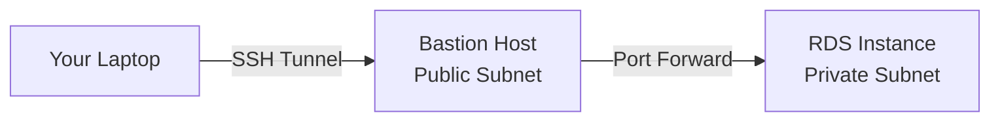

# How to Connect to an RDS Instance from a Local Machine

Author: [nawazdhandala](https://github.com/nawazdhandala)

Tags: AWS, RDS, Database, Networking

Description: Learn the different methods for connecting to an AWS RDS instance from your local development machine, including SSH tunneling and VPN options.

---

Connecting to an RDS instance from your local machine is something every developer needs to do at some point - whether for debugging, running migrations, or just poking around the data. But since production RDS instances should never be publicly accessible, you need a secure way to bridge the gap between your laptop and your private VPC. Let's go through all the options.

## The Direct Approach (Not Recommended for Production)

The simplest way is to make your RDS instance publicly accessible. During creation or modification, set "Public access" to Yes and make sure the security group allows your IP address. This works for development, but it's a security risk for anything with real data.

If you must use this approach for a dev database, lock down the security group to your specific IP.

This security group rule restricts access to only your IP address.

```bash
# Get your public IP
curl -s https://checkip.amazonaws.com

# Add a security group rule for your IP
aws ec2 authorize-security-group-ingress \
  --group-id sg-0abc123def456789 \
  --protocol tcp \
  --port 5432 \
  --cidr $(curl -s https://checkip.amazonaws.com)/32
```

Then connect directly.

```bash
# PostgreSQL
psql -h my-db.abc123.us-east-1.rds.amazonaws.com -U admin -d mydb

# MySQL
mysql -h my-db.abc123.us-east-1.rds.amazonaws.com -u admin -p

# SQL Server
sqlcmd -S my-db.abc123.us-east-1.rds.amazonaws.com,1433 -U admin
```

The problem with this approach: your database endpoint is exposed to the internet. Even with a security group, you're one misconfiguration away from trouble. Let's look at better options.

## SSH Tunnel Through a Bastion Host

This is the most common approach. You run an EC2 instance (bastion host or jump box) in a public subnet, and your RDS instance lives in a private subnet. You create an SSH tunnel through the bastion to reach the database.

Here's the architecture.



### Setting Up the Bastion

If you don't already have a bastion host, create a small EC2 instance.

This creates a minimal bastion host in a public subnet.

```bash
# Launch a bastion host
aws ec2 run-instances \
  --image-id ami-0c55b159cbfafe1f0 \
  --instance-type t3.micro \
  --key-name my-keypair \
  --security-group-ids sg-bastion-sg \
  --subnet-id subnet-public-123 \
  --associate-public-ip-address \
  --tag-specifications 'ResourceType=instance,Tags=[{Key=Name,Value=bastion-host}]'
```

The bastion's security group should allow SSH from your IP. The RDS security group should allow connections from the bastion's security group.

```
Bastion SG (inbound):
  SSH (22) from your-ip/32

RDS SG (inbound):
  PostgreSQL (5432) from bastion-sg
  MySQL (3306) from bastion-sg
```

### Creating the SSH Tunnel

This command forwards local port 5432 through the bastion to the RDS instance.

```bash
# SSH tunnel for PostgreSQL
ssh -i my-keypair.pem \
  -L 5432:my-db.abc123.us-east-1.rds.amazonaws.com:5432 \
  -N \
  ec2-user@bastion-public-ip

# SSH tunnel for MySQL (different local port to avoid conflicts)
ssh -i my-keypair.pem \
  -L 3307:my-db.abc123.us-east-1.rds.amazonaws.com:3306 \
  -N \
  ec2-user@bastion-public-ip
```

The flags:
- `-L`: Sets up local port forwarding
- `-N`: Don't execute a remote command (just forward)
- The format is `local_port:rds_endpoint:rds_port`

Now connect to localhost instead of the RDS endpoint.

```bash
# Connect through the tunnel
psql -h localhost -p 5432 -U admin -d mydb

# For MySQL (note the different local port)
mysql -h 127.0.0.1 -P 3307 -u admin -p
```

## AWS Systems Manager Session Manager (No Bastion Needed)

Session Manager lets you create port forwarding sessions without running a bastion host. The EC2 instance needs the SSM agent (installed by default on Amazon Linux) and an appropriate IAM role.

This is cleaner than SSH tunneling because:
- No SSH keys to manage
- No inbound ports needed on the EC2 instance
- All sessions are logged in CloudTrail

This command creates a port forwarding session through Session Manager.

```bash
# Start a port forwarding session
aws ssm start-session \
  --target i-0abc123def456 \
  --document-name AWS-StartPortForwardingSessionToRemoteHost \
  --parameters '{
    "host": ["my-db.abc123.us-east-1.rds.amazonaws.com"],
    "portNumber": ["5432"],
    "localPortNumber": ["5432"]
  }'
```

Then connect to localhost as before.

```bash
psql -h localhost -p 5432 -U admin -d mydb
```

You need the Session Manager plugin installed locally. Install it from the AWS documentation for your OS.

## AWS Client VPN

For teams that frequently need database access, AWS Client VPN provides a VPN connection directly into your VPC. Once connected, you can reach RDS instances as if you were inside the VPC.

Setting up Client VPN involves:

1. Create a certificate authority (ACM Private CA or mutual authentication)
2. Create a Client VPN endpoint
3. Associate it with your VPC subnets
4. Configure authorization rules
5. Download the client configuration

This is more setup than SSH tunneling, but it's much better for teams. Everyone gets VPN access with their own certificates, and you don't need to share SSH keys.

Once the VPN is connected, you use the RDS endpoint directly.

```bash
# No tunnel needed - VPN puts you in the VPC
psql -h my-db.abc123.us-east-1.rds.amazonaws.com -p 5432 -U admin -d mydb
```

## Using EC2 Instance Connect Endpoint

EC2 Instance Connect Endpoint (EIC Endpoint) is a newer option that lets you create private tunnels without a bastion host or public IP addresses.

This creates a tunnel through the EIC endpoint to your RDS instance.

```bash
# Create an EIC endpoint (one-time setup)
aws ec2 create-instance-connect-endpoint \
  --subnet-id subnet-private-123 \
  --security-group-ids sg-eic-endpoint

# Open a tunnel (requires aws cli v2)
aws ec2-instance-connect open-tunnel \
  --instance-connect-endpoint-id eice-0abc123 \
  --remote-port 5432 \
  --local-port 5432 \
  --private-ip-address 10.0.2.50
```

Note: EIC endpoints work with IP addresses, not DNS names. You'll need to know the IP address of your RDS instance.

## GUI Database Tools

Most database GUI tools support SSH tunneling natively. Here's how to configure them:

### DBeaver
1. Create a new connection
2. Go to the SSH tab
3. Enable "Use SSH Tunnel"
4. Enter bastion host details (host, port, username, key)
5. On the main tab, enter the RDS endpoint and credentials

### DataGrip
1. Create a new data source
2. Go to SSH/SSL tab
3. Check "Use SSH tunnel"
4. Configure bastion host credentials
5. The host field on the General tab should be the RDS endpoint

### pgAdmin (for PostgreSQL)
1. Create a new server
2. In the SSH Tunnel tab, enable tunneling
3. Enter bastion host details
4. On the Connection tab, use the RDS endpoint as the host

## Troubleshooting Connection Issues

If you can't connect, check these common issues in order:

1. **Security group rules**: The RDS security group must allow inbound traffic from the source (bastion, VPN, or your IP)
2. **Network ACLs**: Check that NACLs on the RDS subnet allow the traffic
3. **Route tables**: Ensure proper routing between subnets
4. **RDS status**: The instance must be in "Available" state
5. **Credentials**: Double-check username, password, and database name
6. **SSL/TLS**: Some connections require SSL. Add `--ssl-mode=require` for PostgreSQL or `--ssl` for MySQL

For persistent connectivity issues, try using [Reachability Analyzer](https://oneuptime.com/blog/post/2026-02-12-use-reachability-analyzer-diagnose-vpc-connectivity/view) to diagnose the network path.

## Wrapping Up

The right method depends on your situation. For quick one-off access, SSH tunneling through a bastion is fine. For regular team access, invest in AWS Client VPN or Session Manager. Whatever you choose, keep your RDS instances in private subnets and never expose them directly to the internet in production. The extra setup for secure access is always worth it.
