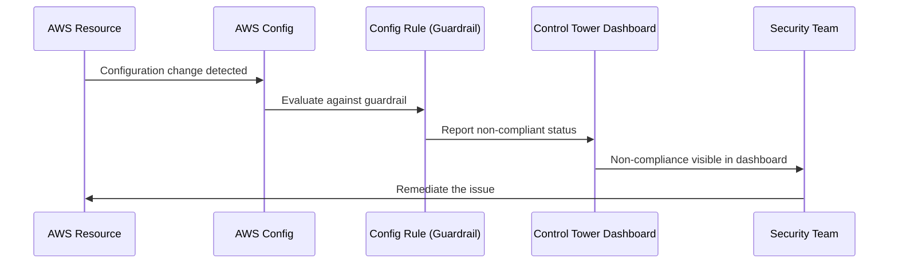

# How to Use Control Tower Guardrails for Account Governance

Author: [nawazdhandala](https://github.com/nawazdhandala)

Tags: AWS, Control Tower, Guardrails, Governance, Security

Description: A practical guide to using AWS Control Tower guardrails (now called controls) to enforce security, compliance, and operational best practices across your AWS accounts.

---

Guardrails are the real muscle behind AWS Control Tower. While Control Tower sets up the structure of your multi-account environment, guardrails enforce the rules. They make sure nobody - intentionally or accidentally - does something that violates your organization's policies.

AWS has been rebranding guardrails as "controls," but most people still call them guardrails. We'll use both terms interchangeably here.

## Types of Guardrails

There are three categories of guardrails:

**Preventive guardrails** stop actions before they happen. They're implemented as Service Control Policies (SCPs) in AWS Organizations. If a preventive guardrail says "don't delete CloudTrail logs," then nobody in that OU can delete those logs, period - not even account administrators.

**Detective guardrails** don't block anything. Instead, they monitor for violations and flag them. They're implemented as AWS Config rules. If a detective guardrail checks for encrypted S3 buckets and finds an unencrypted one, it marks it as non-compliant.

**Proactive guardrails** check resources before they're created. They use CloudFormation hooks to validate that resources in a CloudFormation template comply with your rules before deployment happens.

## Guardrail Categories

Beyond the mechanism, guardrails are also categorized by purpose:

- **Mandatory** - Always enabled, can't be turned off. These are the absolute basics.
- **Strongly recommended** - AWS strongly suggests enabling these. They cover common security best practices.
- **Elective** - Optional controls for specific use cases.

## Viewing Available Guardrails

You can list all available controls through the CLI:

```bash
# List all available controls in Control Tower
aws controltower list-baselines

# List controls enabled on a specific OU
aws controltower list-enabled-controls \
  --target-identifier "arn:aws:organizations::123456789012:ou/o-abc123/ou-abc1-23456789"
```

There are over 400 controls available, covering areas like:

- Data residency
- IAM security
- Logging and monitoring
- Network security
- Encryption
- Tagging

## Enabling Guardrails

Let's enable some commonly needed guardrails. First, find the control identifier for what you want.

This command enables a guardrail that detects whether S3 buckets have server-side encryption:

```bash
# Enable the S3 encryption detection guardrail
aws controltower enable-control \
  --control-identifier "arn:aws:controltower:us-east-1::control/AWS-GR_S3_BUCKET_DEFAULT_ENCRYPTION_ENABLED" \
  --target-identifier "arn:aws:organizations::123456789012:ou/o-abc123/ou-abc1-23456789"

# Check the operation status
aws controltower get-control-operation \
  --operation-identifier "op-abc123"
```

Here are some other high-value guardrails worth enabling:

```bash
# Detect public S3 buckets
aws controltower enable-control \
  --control-identifier "arn:aws:controltower:us-east-1::control/AWS-GR_S3_ACCOUNT_LEVEL_PUBLIC_ACCESS_BLOCKS_PERIODIC" \
  --target-identifier "arn:aws:organizations::123456789012:ou/o-abc123/ou-abc1-23456789"

# Prevent IAM users from having console access without MFA
aws controltower enable-control \
  --control-identifier "arn:aws:controltower:us-east-1::control/AWS-GR_IAM_USER_MFA_ENABLED" \
  --target-identifier "arn:aws:organizations::123456789012:ou/o-abc123/ou-abc1-23456789"

# Detect unencrypted EBS volumes
aws controltower enable-control \
  --control-identifier "arn:aws:controltower:us-east-1::control/AWS-GR_ENCRYPTED_VOLUMES" \
  --target-identifier "arn:aws:organizations::123456789012:ou/o-abc123/ou-abc1-23456789"
```

## Key Preventive Guardrails

These SCPs are the ones you should enable right away on production OUs:

### Disallow Changes to CloudTrail

This prevents anyone from stopping, deleting, or modifying CloudTrail:

```json
{
  "Version": "2012-10-17",
  "Statement": [
    {
      "Sid": "PreventCloudTrailModification",
      "Effect": "Deny",
      "Action": [
        "cloudtrail:StopLogging",
        "cloudtrail:DeleteTrail",
        "cloudtrail:UpdateTrail"
      ],
      "Resource": ["*"],
      "Condition": {
        "ArnNotLike": {
          "aws:PrincipalArn": "arn:aws:iam::*:role/AWSControlTowerExecution"
        }
      }
    }
  ]
}
```

### Disallow Changes to AWS Config

Similarly, prevent Config from being disabled:

```json
{
  "Version": "2012-10-17",
  "Statement": [
    {
      "Sid": "PreventConfigModification",
      "Effect": "Deny",
      "Action": [
        "config:DeleteConfigurationRecorder",
        "config:DeleteDeliveryChannel",
        "config:StopConfigurationRecorder"
      ],
      "Resource": ["*"],
      "Condition": {
        "ArnNotLike": {
          "aws:PrincipalArn": "arn:aws:iam::*:role/AWSControlTowerExecution"
        }
      }
    }
  ]
}
```

### Region Restriction

One of the most requested guardrails restricts which AWS regions accounts can use:

```json
{
  "Version": "2012-10-17",
  "Statement": [
    {
      "Sid": "DenyNonApprovedRegions",
      "Effect": "Deny",
      "NotAction": [
        "iam:*",
        "organizations:*",
        "sts:*",
        "support:*"
      ],
      "Resource": "*",
      "Condition": {
        "StringNotEquals": {
          "aws:RequestedRegion": [
            "us-east-1",
            "us-west-2",
            "eu-west-1"
          ]
        }
      }
    }
  ]
}
```

This prevents workloads from being deployed in unapproved regions while still allowing global services like IAM and Organizations to function.

## Detective Guardrails in Practice

Detective guardrails create AWS Config rules that continuously evaluate your resources. When something falls out of compliance, it shows up in the Control Tower dashboard.

Here's how the flow works:



You can check compliance status programmatically:

```bash
# Get compliance status for all controls on an OU
aws controltower list-enabled-controls \
  --target-identifier "arn:aws:organizations::123456789012:ou/o-abc123/ou-abc1-23456789" \
  --query "enabledControls[].{Control:controlIdentifier,Status:statusSummary.status}"
```

## Proactive Guardrails

Proactive guardrails are the newest addition. They use CloudFormation hooks to check resource compliance before the resource is created.

For example, a proactive guardrail can ensure that every RDS instance must be encrypted. If someone tries to deploy an unencrypted RDS instance through CloudFormation, the deployment fails before the resource is created.

```bash
# Enable a proactive control for RDS encryption
aws controltower enable-control \
  --control-identifier "arn:aws:controltower:us-east-1::control/CT.RDS.PR.1" \
  --target-identifier "arn:aws:organizations::123456789012:ou/o-abc123/ou-abc1-23456789"
```

The limitation is that proactive guardrails only work with CloudFormation. Resources created through the console or CLI directly won't be caught by proactive controls (though detective controls will still flag them after creation).

## Guardrail Strategy

Don't enable every guardrail at once. Here's a practical rollout strategy:

1. **Start with mandatory guardrails** - These are already enabled by default
2. **Add strongly recommended guardrails to production OUs** - Focus on encryption, logging, and access controls
3. **Test elective guardrails in sandbox first** - Some elective guardrails can break workflows if you're not prepared
4. **Roll out gradually** - Enable guardrails on one OU at a time

Also, be aware that preventive guardrails apply immediately and can break things if a team depends on the action being blocked. Always communicate before enabling preventive guardrails on existing accounts.

## Monitoring Guardrail Compliance

Set up EventBridge rules to get notified when guardrails detect non-compliance:

```json
{
  "source": ["aws.controltower"],
  "detail-type": ["AWS Control Tower Guardrail Non-Compliance"],
  "detail": {
    "guardrailBehavior": ["DETECTIVE"]
  }
}
```

Wire this to SNS or a Lambda function that posts to your team's Slack channel.

## Wrapping Up

Guardrails turn Control Tower from a nice account factory into a real governance platform. The key is being thoughtful about which guardrails you enable and where. Start with the basics - protect your logging, enforce encryption, restrict regions - and build from there.

For the foundational setup, see our guide on [setting up Control Tower](https://oneuptime.com/blog/post/2026-02-12-aws-control-tower-multi-account-governance/view). And if you need to manage firewall rules organization-wide, check out [AWS Firewall Manager](https://oneuptime.com/blog/post/2026-02-12-aws-firewall-manager-organization-wide-security/view).
