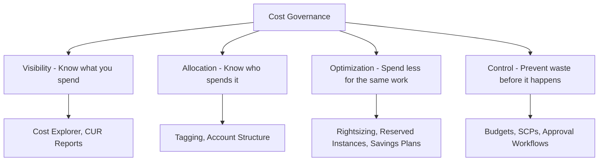

# How to Implement Cost Governance Best Practices on AWS

Author: [nawazdhandala](https://github.com/nawazdhandala)

Tags: AWS, Cost Management, FinOps, Governance, Best Practices

Description: Learn how to implement cost governance on AWS with budgets, alerts, tagging enforcement, rightsizing recommendations, and automated cost optimization.

---

AWS makes it incredibly easy to spend money. A developer spins up a "temporary" instance for testing and forgets about it. Someone launches a cluster with way more capacity than needed. Reserved instances expire without anyone noticing. Before you know it, your monthly bill has doubled and nobody can explain why.

Cost governance isn't about being cheap. It's about spending intentionally - knowing where every dollar goes and making sure it's delivering value. Let's build a cost governance framework that actually works.

## The Cost Governance Framework

Effective cost governance covers multiple areas working together.



## Tagging Strategy for Cost Allocation

Tags are how you attribute costs to teams, projects, and environments. Without consistent tagging, cost allocation is impossible.

This sets up tag policies at the organization level and enforces them via Config rules.

```hcl
# Organization-level tag policy
resource "aws_organizations_policy" "tagging" {
  name    = "cost-allocation-tags"
  type    = "TAG_POLICY"
  content = jsonencode({
    tags = {
      Environment = {
        tag_key = {
          "@@assign" = "Environment"
        }
        tag_value = {
          "@@assign" = ["production", "staging", "development", "sandbox"]
        }
        enforced_for = {
          "@@assign" = [
            "ec2:instance",
            "rds:db",
            "s3:bucket",
            "lambda:function",
            "elasticloadbalancing:loadbalancer"
          ]
        }
      }
      Team = {
        tag_key = {
          "@@assign" = "Team"
        }
      }
      CostCenter = {
        tag_key = {
          "@@assign" = "CostCenter"
        }
      }
      Project = {
        tag_key = {
          "@@assign" = "Project"
        }
      }
    }
  })
}

# Activate cost allocation tags
resource "aws_ce_cost_allocation_tag" "tags" {
  for_each = toset(["Environment", "Team", "CostCenter", "Project"])

  tag_key = each.value
  status  = "Active"
}
```

## AWS Budgets

Set up budgets that alert you before costs spiral out of control.

```hcl
# Overall account budget
resource "aws_budgets_budget" "monthly_total" {
  name         = "monthly-total-budget"
  budget_type  = "COST"
  limit_amount = "50000"
  limit_unit   = "USD"
  time_unit    = "MONTHLY"

  notification {
    comparison_operator        = "GREATER_THAN"
    threshold                  = 80
    threshold_type             = "PERCENTAGE"
    notification_type          = "FORECASTED"
    subscriber_email_addresses = ["finance@company.com", "engineering-leads@company.com"]
  }

  notification {
    comparison_operator        = "GREATER_THAN"
    threshold                  = 100
    threshold_type             = "PERCENTAGE"
    notification_type          = "ACTUAL"
    subscriber_email_addresses = ["finance@company.com", "cto@company.com"]
    subscriber_sns_topic_arns  = [aws_sns_topic.cost_alerts.arn]
  }
}

# Per-team budgets
resource "aws_budgets_budget" "team_budgets" {
  for_each = var.team_budgets

  name         = "${each.key}-team-budget"
  budget_type  = "COST"
  limit_amount = each.value.monthly_limit
  limit_unit   = "USD"
  time_unit    = "MONTHLY"

  cost_filter {
    name   = "TagKeyValue"
    values = ["user:Team$${each.key}"]
  }

  notification {
    comparison_operator        = "GREATER_THAN"
    threshold                  = 90
    threshold_type             = "PERCENTAGE"
    notification_type          = "FORECASTED"
    subscriber_email_addresses = each.value.alert_emails
  }
}

# Service-specific budget (catch runaway spending on specific services)
resource "aws_budgets_budget" "ec2_budget" {
  name         = "ec2-monthly-budget"
  budget_type  = "COST"
  limit_amount = "20000"
  limit_unit   = "USD"
  time_unit    = "MONTHLY"

  cost_filter {
    name   = "Service"
    values = ["Amazon Elastic Compute Cloud - Compute"]
  }

  notification {
    comparison_operator       = "GREATER_THAN"
    threshold                 = 80
    threshold_type            = "PERCENTAGE"
    notification_type         = "FORECASTED"
    subscriber_sns_topic_arns = [aws_sns_topic.cost_alerts.arn]
  }
}
```

## Automated Cost Optimization

This Lambda function identifies and reports on idle or underutilized resources.

```python
import boto3
from datetime import datetime, timedelta

def find_waste():
    """Identify idle and underutilized AWS resources."""
    findings = []

    # Find idle EC2 instances (low CPU usage)
    cloudwatch = boto3.client('cloudwatch')
    ec2 = boto3.client('ec2')

    instances = ec2.describe_instances(
        Filters=[{'Name': 'instance-state-name', 'Values': ['running']}]
    )

    for reservation in instances['Reservations']:
        for instance in reservation['Instances']:
            instance_id = instance['InstanceId']
            instance_type = instance['InstanceType']

            # Get average CPU over last 14 days
            metrics = cloudwatch.get_metric_statistics(
                Namespace='AWS/EC2',
                MetricName='CPUUtilization',
                Dimensions=[{'Name': 'InstanceId', 'Value': instance_id}],
                StartTime=datetime.utcnow() - timedelta(days=14),
                EndTime=datetime.utcnow(),
                Period=86400,  # Daily average
                Statistics=['Average']
            )

            if metrics['Datapoints']:
                avg_cpu = sum(d['Average'] for d in metrics['Datapoints']) / len(metrics['Datapoints'])

                if avg_cpu < 5:
                    findings.append({
                        'type': 'idle_ec2',
                        'resource': instance_id,
                        'detail': f"{instance_type} - avg CPU {avg_cpu:.1f}%",
                        'recommendation': 'Consider stopping or terminating'
                    })
                elif avg_cpu < 20:
                    findings.append({
                        'type': 'underutilized_ec2',
                        'resource': instance_id,
                        'detail': f"{instance_type} - avg CPU {avg_cpu:.1f}%",
                        'recommendation': 'Consider downsizing instance type'
                    })

    # Find unattached EBS volumes
    volumes = ec2.describe_volumes(
        Filters=[{'Name': 'status', 'Values': ['available']}]
    )

    for volume in volumes['Volumes']:
        size_gb = volume['Size']
        days_old = (datetime.now(volume['CreateTime'].tzinfo) - volume['CreateTime']).days
        monthly_cost = size_gb * 0.10  # Approximate gp3 cost

        if days_old > 7:
            findings.append({
                'type': 'unattached_ebs',
                'resource': volume['VolumeId'],
                'detail': f"{size_gb}GB, unattached for {days_old} days",
                'estimated_monthly_waste': f"${monthly_cost:.2f}",
                'recommendation': 'Delete or snapshot and delete'
            })

    # Find unused Elastic IPs
    addresses = ec2.describe_addresses()
    for addr in addresses['Addresses']:
        if 'InstanceId' not in addr and 'NetworkInterfaceId' not in addr:
            findings.append({
                'type': 'unused_eip',
                'resource': addr['PublicIp'],
                'detail': 'Elastic IP not attached to any resource',
                'estimated_monthly_waste': '$3.65',
                'recommendation': 'Release the Elastic IP'
            })

    # Find old snapshots
    snapshots = ec2.describe_snapshots(OwnerIds=['self'])
    cutoff = datetime.now(snapshots['Snapshots'][0]['StartTime'].tzinfo) - timedelta(days=90) if snapshots['Snapshots'] else None

    for snap in snapshots.get('Snapshots', []):
        if snap['StartTime'] < cutoff:
            size_gb = snap['VolumeSize']
            monthly_cost = size_gb * 0.05  # Snapshot storage cost
            findings.append({
                'type': 'old_snapshot',
                'resource': snap['SnapshotId'],
                'detail': f"{size_gb}GB, created {snap['StartTime'].strftime('%Y-%m-%d')}",
                'estimated_monthly_waste': f"${monthly_cost:.2f}",
                'recommendation': 'Review and delete if no longer needed'
            })

    # Summary
    total_waste = sum(
        float(f.get('estimated_monthly_waste', '$0').replace('$', ''))
        for f in findings
    )

    print(f"\nCost Optimization Findings: {len(findings)} issues found")
    print(f"Estimated monthly waste: ${total_waste:.2f}\n")

    for f in findings:
        print(f"  [{f['type']}] {f['resource']}: {f['detail']}")
        print(f"    Recommendation: {f['recommendation']}")
        if 'estimated_monthly_waste' in f:
            print(f"    Estimated waste: {f['estimated_monthly_waste']}/month")

    return findings

find_waste()
```

## SCPs for Cost Control

Prevent teams from launching expensive resources or resources in unauthorized regions.

```json
{
  "Version": "2012-10-17",
  "Statement": [
    {
      "Sid": "DenyExpensiveEC2",
      "Effect": "Deny",
      "Action": "ec2:RunInstances",
      "Resource": "arn:aws:ec2:*:*:instance/*",
      "Condition": {
        "ForAnyValue:StringLike": {
          "ec2:InstanceType": [
            "*.metal",
            "*.24xlarge",
            "*.16xlarge",
            "*.12xlarge",
            "p4*", "p3*",
            "x2*", "x1*"
          ]
        }
      }
    },
    {
      "Sid": "DenyUnauthorizedRegions",
      "Effect": "Deny",
      "NotAction": [
        "iam:*",
        "organizations:*",
        "sts:*",
        "support:*",
        "budgets:*"
      ],
      "Resource": "*",
      "Condition": {
        "StringNotEquals": {
          "aws:RequestedRegion": ["us-east-1", "us-west-2", "eu-west-1"]
        }
      }
    }
  ]
}
```

## Savings Plans and Reserved Instances

For predictable workloads, Savings Plans and RIs can save 30-70% compared to on-demand pricing.

```python
import boto3

def analyze_savings_opportunities():
    """Analyze spending patterns for Savings Plan recommendations."""
    ce = boto3.client('ce')

    # Get Savings Plans recommendations
    recommendations = ce.get_savings_plans_purchase_recommendation(
        SavingsPlansType='COMPUTE_SP',
        TermInYears='ONE_YEAR',
        PaymentOption='NO_UPFRONT',
        LookbackPeriodInDays='SIXTY_DAYS'
    )

    rec = recommendations['SavingsPlansPurchaseRecommendation']
    summary = rec['SavingsPlansPurchaseRecommendationSummary']

    print("Savings Plans Recommendation:")
    print(f"  Estimated monthly savings: ${float(summary['EstimatedMonthlySavingsAmount']):.2f}")
    print(f"  Estimated savings percentage: {float(summary['EstimatedSavingsPercentage']):.1f}%")
    print(f"  Recommended hourly commitment: ${float(summary['HourlyCommitmentToPurchase']):.2f}/hr")
    print(f"  Current on-demand spend: ${float(summary['CurrentOnDemandSpend']):.2f}")

    # Detailed recommendations
    for detail in rec.get('SavingsPlansPurchaseRecommendationDetails', []):
        print(f"\n  Account: {detail.get('AccountId', 'All')}")
        print(f"    Recommended commitment: ${float(detail['HourlyCommitmentToPurchase']):.2f}/hr")
        print(f"    Estimated utilization: {float(detail['EstimatedAverageUtilization']):.1f}%")

analyze_savings_opportunities()
```

## Cost Anomaly Detection

AWS Cost Anomaly Detection uses machine learning to spot unusual spending patterns.

```hcl
resource "aws_ce_anomaly_monitor" "service_monitor" {
  name              = "service-cost-anomaly-monitor"
  monitor_type      = "DIMENSIONAL"
  monitor_dimension = "SERVICE"
}

resource "aws_ce_anomaly_subscription" "alerts" {
  name      = "cost-anomaly-alerts"
  frequency = "DAILY"

  monitor_arn_list = [aws_ce_anomaly_monitor.service_monitor.arn]

  subscriber {
    type    = "SNS"
    address = aws_sns_topic.cost_alerts.arn
  }

  threshold_expression {
    dimension {
      key           = "ANOMALY_TOTAL_IMPACT_ABSOLUTE"
      values        = ["100"]
      match_options = ["GREATER_THAN_OR_EQUAL"]
    }
  }
}
```

## Key Principles

Cost governance works when it's embedded in your culture, not bolted on as an afterthought. Tag everything. Set budgets. Review spending weekly, not monthly. Automate the detection of waste. Use Savings Plans for steady-state workloads. And make cost data visible to the teams that generate the costs - when engineers can see the bill their services create, they naturally start optimizing.

The goal isn't to minimize spending. It's to maximize the value you get from every dollar spent on AWS.

For related governance topics, see [multi-account strategy on AWS](https://oneuptime.com/blog/post/multi-account-strategy-aws/view) and [compliance automation on AWS](https://oneuptime.com/blog/post/compliance-automation-aws/view).
