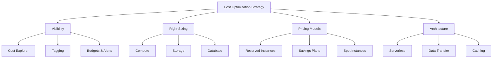

# How to Create a Cost Optimization Strategy for AWS

Author: [nawazdhandala](https://github.com/nawazdhandala)

Tags: AWS, Cost Optimization, Cloud Strategy, FinOps

Description: A comprehensive framework for building an AWS cost optimization strategy covering visibility, right-sizing, reservations, architecture decisions, and governance.

---

Most AWS cost optimization efforts start and end with "find unused resources and delete them." That's a fine first step, but it only scratches the surface. Real cost optimization requires a structured strategy that covers visibility, accountability, architectural decisions, and ongoing governance.

I've seen teams cut their AWS bills by 40-60% not through any single trick, but through a systematic approach. Here's the framework that works.

## The Four Pillars of AWS Cost Optimization

Think of cost optimization as four distinct but interconnected areas:



## Pillar 1: Visibility

You can't optimize what you can't see. Start here.

**Enable cost allocation tags.** Mandate tags on all resources so you can attribute costs to teams, projects, and environments:

```bash
# Activate cost allocation tags
aws ce update-cost-allocation-tags-status \
  --cost-allocation-tags-status '[
    {"TagKey": "Environment", "Status": "Active"},
    {"TagKey": "Team", "Status": "Active"},
    {"TagKey": "Project", "Status": "Active"},
    {"TagKey": "Owner", "Status": "Active"}
  ]'
```

**Enforce tagging with AWS Config:**

```bash
# Create an AWS Config rule that checks for required tags
aws configservice put-config-rule \
  --config-rule '{
    "ConfigRuleName": "required-tags",
    "Source": {
      "Owner": "AWS",
      "SourceIdentifier": "REQUIRED_TAGS"
    },
    "InputParameters": "{\"tag1Key\":\"Environment\",\"tag2Key\":\"Team\",\"tag3Key\":\"Owner\"}",
    "Scope": {
      "ComplianceResourceTypes": [
        "AWS::EC2::Instance",
        "AWS::RDS::DBInstance",
        "AWS::S3::Bucket",
        "AWS::ElasticLoadBalancingV2::LoadBalancer"
      ]
    }
  }'
```

**Set up budgets for every team and environment:**

```bash
# Create team-level budgets
aws budgets create-budget \
  --account-id 123456789012 \
  --budget '{
    "BudgetName": "PlatformTeamMonthly",
    "BudgetLimit": {"Amount": "15000", "Unit": "USD"},
    "TimeUnit": "MONTHLY",
    "BudgetType": "COST",
    "CostFilters": {
      "TagKeyValue": ["user:Team$Platform"]
    }
  }' \
  --notifications-with-subscribers '[
    {
      "Notification": {
        "NotificationType": "FORECASTED",
        "ComparisonOperator": "GREATER_THAN",
        "Threshold": 80
      },
      "Subscribers": [
        {"SubscriptionType": "EMAIL", "Address": "platform-lead@example.com"}
      ]
    }
  ]'
```

**Set up anomaly detection.** This catches unexpected spikes before they become budget problems. We have a detailed guide on [setting up anomaly detection for AWS costs](https://oneuptime.com/blog/post/set-up-anomaly-detection-for-aws-costs/view).

## Pillar 2: Right-Sizing

Right-sizing means matching resource allocation to actual usage. It's the highest-impact, lowest-risk optimization.

**Use AWS Compute Optimizer for EC2 recommendations:**

```bash
# Get right-sizing recommendations
aws compute-optimizer get-ec2-instance-recommendations \
  --query "instanceRecommendations[].{
    Instance: instanceArn,
    Current: currentInstanceType,
    Finding: finding,
    Recommended: recommendationOptions[0].instanceType,
    EstSavings: recommendationOptions[0].estimatedMonthlySavings.value
  }" \
  --output table
```

**Review RDS instance utilization:**

```python
import boto3
from datetime import datetime, timedelta

def check_rds_sizing():
    rds = boto3.client('rds')
    cw = boto3.client('cloudwatch')

    instances = rds.describe_db_instances()['DBInstances']

    for db in instances:
        db_id = db['DBInstanceIdentifier']

        # Check CPU over 14 days
        cpu = cw.get_metric_statistics(
            Namespace='AWS/RDS',
            MetricName='CPUUtilization',
            Dimensions=[{'Name': 'DBInstanceIdentifier', 'Value': db_id}],
            StartTime=datetime.utcnow() - timedelta(days=14),
            EndTime=datetime.utcnow(),
            Period=14 * 86400,
            Statistics=['Average', 'Maximum']
        )

        if cpu['Datapoints']:
            avg = cpu['Datapoints'][0]['Average']
            peak = cpu['Datapoints'][0]['Maximum']
            if avg < 20 and peak < 50:
                print(f"OVERSIZED: {db_id} ({db['DBInstanceClass']}) "
                      f"- avg CPU: {avg:.1f}%, peak: {peak:.1f}%")

check_rds_sizing()
```

Right-sizing also applies to:
- **EBS volumes** - Switch from io1/io2 to gp3 where possible
- **Lambda functions** - Use power tuning to find optimal memory. See our guide on [reducing Lambda costs](https://oneuptime.com/blog/post/reduce-lambda-costs-by-optimizing-memory-and-duration/view)
- **ElastiCache nodes** - Check memory utilization

## Pillar 3: Pricing Models

Once resources are right-sized, commit to discounted pricing for stable workloads.

**Savings Plans vs Reserved Instances:**

| Feature | Savings Plans | Reserved Instances |
|---|---|---|
| Flexibility | Applies across instance families | Locked to specific instance type |
| Discount | Up to 72% | Up to 72% |
| Best for | Variable workloads | Stable, predictable workloads |
| Applies to | EC2, Lambda, Fargate | EC2, RDS, ElastiCache, etc. |

Start with Compute Savings Plans for EC2 flexibility, then layer in RDS Reserved Instances for stable databases. See our detailed guide on [reducing RDS costs with Reserved Instances](https://oneuptime.com/blog/post/reduce-rds-costs-with-reserved-instances/view).

**Use Spot Instances for fault-tolerant workloads:**

```bash
# Launch a spot fleet for batch processing
aws ec2 request-spot-fleet \
  --spot-fleet-request-config '{
    "IamFleetRole": "arn:aws:iam::123456789012:role/spot-fleet-role",
    "TargetCapacity": 10,
    "SpotPrice": "0.05",
    "LaunchSpecifications": [
      {
        "ImageId": "ami-0a1b2c3d4e5f67890",
        "InstanceType": "m5.large",
        "SubnetId": "subnet-0a1b2c3d"
      },
      {
        "ImageId": "ami-0a1b2c3d4e5f67890",
        "InstanceType": "m5a.large",
        "SubnetId": "subnet-0a1b2c3d"
      }
    ],
    "AllocationStrategy": "lowestPrice"
  }'
```

Spot can save 60-90% compared to on-demand. Learn more about [using Spot Instances with ECS Fargate](https://oneuptime.com/blog/post/use-spot-instances-with-ecs-fargate/view).

## Pillar 4: Architecture

Sometimes the biggest savings come from changing how you build things, not just how you pay for them.

**Move to serverless where it fits.** A Lambda function that runs 1 million times per month at 256MB/200ms costs about $1.50. The equivalent always-on EC2 instance costs $30+.

**Reduce data transfer.** Data transfer is often 10-20% of the total bill. Key strategies:
- VPC endpoints for AWS API traffic (see our guide on [reducing NAT Gateway costs](https://oneuptime.com/blog/post/reduce-nat-gateway-data-transfer-costs/view))
- CloudFront for content delivery
- Same-AZ placement for high-traffic services
- Compression for cross-region data

**Use caching aggressively.** A well-placed ElastiCache cluster can reduce database costs by eliminating redundant queries:

```python
import redis
import boto3

cache = redis.Redis(host='my-cluster.cache.amazonaws.com')

def get_user_profile(user_id):
    # Check cache first - avoids hitting RDS
    cached = cache.get(f'user:{user_id}')
    if cached:
        return json.loads(cached)

    # Cache miss - query database
    profile = query_database(user_id)
    cache.setex(f'user:{user_id}', 3600, json.dumps(profile))
    return profile
```

## Building the Process

A strategy without process dies after the first month. Here's what sustains it:

**Weekly:** Review cost anomalies and budget alerts. 15 minutes.

**Monthly:** Pull Trusted Advisor and Compute Optimizer recommendations. Act on the top 5 findings. 2 hours. See [using Trusted Advisor for cost optimization](https://oneuptime.com/blog/post/use-trusted-advisor-for-cost-optimization-recommendations/view).

**Quarterly:** Review RI/Savings Plan coverage and utilization. Purchase new commitments for stable workloads. Evaluate architectural changes. Half day.

**Annually:** Full architecture review. Evaluate new AWS services and pricing models. Set annual cost targets. Full day.

## Quick Wins Checklist

Start with these - they typically take less than a day and deliver immediate savings:

1. Delete unattached EBS volumes and old snapshots
2. Release unassociated Elastic IPs
3. Set up S3 and DynamoDB VPC Gateway Endpoints
4. Enable S3 Intelligent-Tiering for large buckets
5. Schedule non-production resources. See our post on [scheduling non-production resources](https://oneuptime.com/blog/post/schedule-non-production-resources-to-save-costs/view)
6. Switch to Graviton instances where possible
7. Set CloudWatch Logs retention policies

## Measuring Success

Track these metrics monthly:

- **Total AWS spend** vs. budget
- **Cost per unit** (per customer, per transaction, per API call)
- **RI/SP coverage** - target 70-80% of stable workloads
- **Waste percentage** - idle resources as a percentage of total spend
- **Cost trend** - month-over-month and year-over-year

The goal isn't the lowest possible bill - it's the best value for your spending. Sometimes costs go up because usage grows, and that's fine. What matters is that cost per unit trends downward over time.

## Key Takeaways

A good AWS cost optimization strategy is systematic, not ad hoc. Start with visibility (tagging and budgets), then right-size resources, then lock in discounted pricing, and finally optimize architecture. Build a recurring process to review and act on recommendations. The teams that do this consistently save 40-60% compared to teams that just react to bill shock.
