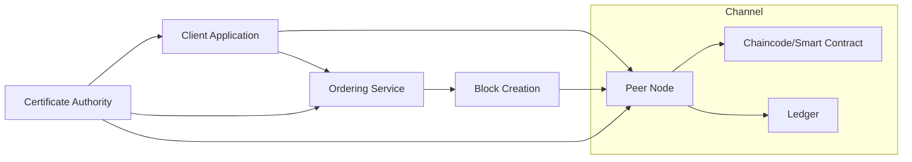

# How to Create a Hyperledger Fabric Network on AWS

Author: [nawazdhandala](https://github.com/nawazdhandala)

Tags: AWS, Hyperledger Fabric, Blockchain, Amazon Managed Blockchain, Smart Contracts, Distributed Ledger

Description: Step-by-step guide to building a production-ready Hyperledger Fabric blockchain network on AWS using Amazon Managed Blockchain and EC2 instances.

---

Hyperledger Fabric is one of the most popular enterprise blockchain frameworks out there. Unlike public blockchains like Ethereum, Fabric is permissioned - you control exactly who can participate. This makes it a great fit for business use cases like supply chain management, trade finance, and healthcare data sharing.

Running Hyperledger Fabric on AWS gives you two main paths: using Amazon Managed Blockchain (the fully managed route) or deploying Fabric yourself on EC2 instances (the DIY route). This guide covers both approaches so you can pick what fits your situation.

## Understanding Hyperledger Fabric Architecture

Before diving into the setup, let us get the architecture straight. Fabric has several key components that work together:



- **Peer Nodes** - Store the ledger and execute chaincode. Each organization runs its own peers.
- **Ordering Service** - Sequences transactions into blocks and distributes them to peers.
- **Certificate Authority (CA)** - Issues identities and manages enrollment.
- **Channels** - Isolated ledgers shared between specific organizations.
- **Chaincode** - Business logic (smart contracts) that runs on peers.

## Option 1: Using Amazon Managed Blockchain

This is the faster path. AWS handles the ordering service, certificate authorities, and infrastructure management. For a broader overview, see our post on [setting up Amazon Managed Blockchain](https://oneuptime.com/blog/post/2026-02-12-set-up-amazon-managed-blockchain/view).

### Create the Network and First Member

```bash
# Create a Hyperledger Fabric 2.2 network with your first organization
aws managedblockchain create-network \
  --name "TradeFinanceNetwork" \
  --framework HYPERLEDGER_FABRIC \
  --framework-version 2.2 \
  --voting-policy "ApprovalThresholdPolicy={ThresholdPercentage=50,ProposalDurationInHours=24,ThresholdComparator=GREATER_THAN}" \
  --member-configuration \
    "Name=BankAlpha,Description=Primary banking partner,FrameworkConfiguration={Fabric={AdminUsername=bankadmin,AdminPassword=Str0ngP@ss!}}"
```

Save the `NetworkId` and `MemberId` from the response.

### Provision Peer Nodes

Each organization needs at least one peer node. For high availability, run two:

```bash
# Create first peer node in availability zone A
aws managedblockchain create-node \
  --network-id $NETWORK_ID \
  --member-id $MEMBER_ID \
  --node-configuration \
    "InstanceType=bc.t3.medium,AvailabilityZone=us-east-1a,LogPublishingConfiguration={Fabric={ChaincodeLogs={Cloudwatch={Enabled=true}},PeerLogs={Cloudwatch={Enabled=true}}}}"

# Create second peer node in availability zone B for redundancy
aws managedblockchain create-node \
  --network-id $NETWORK_ID \
  --member-id $MEMBER_ID \
  --node-configuration \
    "InstanceType=bc.t3.medium,AvailabilityZone=us-east-1b,LogPublishingConfiguration={Fabric={ChaincodeLogs={Cloudwatch={Enabled=true}},PeerLogs={Cloudwatch={Enabled=true}}}}"
```

### Set Up Network Connectivity

Create a VPC endpoint so your applications can reach the blockchain network:

```bash
# Create interface VPC endpoint for Managed Blockchain
aws ec2 create-vpc-endpoint \
  --vpc-id $VPC_ID \
  --service-name com.amazonaws.us-east-1.managedblockchain.$NETWORK_ID \
  --vpc-endpoint-type Interface \
  --subnet-ids $SUBNET_1 $SUBNET_2 \
  --security-group-ids $SECURITY_GROUP_ID
```

Your security group needs these inbound rules:

| Port | Protocol | Purpose |
|------|----------|---------|
| 443 | TCP | Certificate Authority |
| 30001 | TCP | Ordering Service |
| 30002 | TCP | CA endpoint |
| 30003 | TCP | Peer endpoint |
| 30004 | TCP | Peer event hub |

## Option 2: Self-Managed Fabric on EC2

If you need more control over the infrastructure, or want to run a version that Managed Blockchain does not support yet, you can deploy Fabric on EC2 yourself.

### Launch EC2 Instances

You need separate instances for each component. Here is a minimal setup:

```bash
# Launch instances for Fabric components using Amazon Linux 2
aws ec2 run-instances \
  --image-id ami-0abcdef1234567890 \
  --instance-type t3.medium \
  --count 3 \
  --key-name my-fabric-key \
  --subnet-id $SUBNET_ID \
  --security-group-ids $SG_ID \
  --tag-specifications 'ResourceType=instance,Tags=[{Key=Role,Value=fabric-peer},{Key=Name,Value=Peer1}]'
```

Plan your instances like this:
- 1x t3.medium for the Orderer
- 2x t3.medium for Peer nodes (one per org minimum)
- 1x t3.small for the CA

### Install Docker and Fabric Binaries

On each EC2 instance, install the prerequisites:

```bash
# Install Docker and Docker Compose on Amazon Linux 2
sudo yum update -y
sudo yum install -y docker
sudo service docker start
sudo usermod -a -G docker ec2-user

# Install Docker Compose
sudo curl -L "https://github.com/docker/compose/releases/latest/download/docker-compose-$(uname -s)-$(uname -m)" -o /usr/local/bin/docker-compose
sudo chmod +x /usr/local/bin/docker-compose

# Download Hyperledger Fabric binaries and Docker images
curl -sSL https://bit.ly/2ysbOFE | bash -s -- 2.5.0 1.5.5
```

### Generate Cryptographic Material

Fabric uses X.509 certificates for identity. The `cryptogen` tool generates these for development. For production, use Fabric CA instead.

```yaml
# crypto-config.yaml - defines organizations and their peers
OrdererOrgs:
  - Name: OrdererOrg
    Domain: orderer.example.com
    Specs:
      - Hostname: orderer

PeerOrgs:
  - Name: Org1
    Domain: org1.example.com
    EnableNodeOUs: true
    Template:
      Count: 2
    Users:
      Count: 1
  - Name: Org2
    Domain: org2.example.com
    EnableNodeOUs: true
    Template:
      Count: 2
    Users:
      Count: 1
```

Generate the certificates:

```bash
# Generate crypto material for all organizations
./bin/cryptogen generate --config=crypto-config.yaml --output=crypto-config
```

### Create the Genesis Block and Channel Configuration

```yaml
# configtx.yaml - network and channel configuration (abbreviated)
Organizations:
  - &OrdererOrg
    Name: OrdererOrg
    ID: OrdererMSP
    MSPDir: crypto-config/ordererOrganizations/orderer.example.com/msp
  - &Org1
    Name: Org1MSP
    ID: Org1MSP
    MSPDir: crypto-config/peerOrganizations/org1.example.com/msp
    AnchorPeers:
      - Host: peer0.org1.example.com
        Port: 7051
  - &Org2
    Name: Org2MSP
    ID: Org2MSP
    MSPDir: crypto-config/peerOrganizations/org2.example.com/msp
    AnchorPeers:
      - Host: peer0.org2.example.com
        Port: 7051
```

Generate the genesis block and channel transaction:

```bash
# Create the genesis block for the orderer
./bin/configtxgen -profile TwoOrgsOrdererGenesis \
  -channelID system-channel \
  -outputBlock ./channel-artifacts/genesis.block

# Create the channel creation transaction
./bin/configtxgen -profile TwoOrgsChannel \
  -outputCreateChannelTx ./channel-artifacts/channel.tx \
  -channelID tradechannel
```

### Launch the Network with Docker Compose

```yaml
# docker-compose.yaml for the orderer node
version: '3.7'
services:
  orderer.example.com:
    image: hyperledger/fabric-orderer:2.5.0
    environment:
      - ORDERER_GENERAL_LISTENADDRESS=0.0.0.0
      - ORDERER_GENERAL_LISTENPORT=7050
      - ORDERER_GENERAL_GENESISMETHOD=file
      - ORDERER_GENERAL_GENESISFILE=/var/hyperledger/orderer/genesis.block
      - ORDERER_GENERAL_LOCALMSPID=OrdererMSP
      - ORDERER_GENERAL_LOCALMSPDIR=/var/hyperledger/orderer/msp
      - ORDERER_GENERAL_TLS_ENABLED=true
      - ORDERER_GENERAL_TLS_PRIVATEKEY=/var/hyperledger/orderer/tls/server.key
      - ORDERER_GENERAL_TLS_CERTIFICATE=/var/hyperledger/orderer/tls/server.crt
      - ORDERER_GENERAL_TLS_ROOTCAS=[/var/hyperledger/orderer/tls/ca.crt]
    ports:
      - 7050:7050
    volumes:
      - ./channel-artifacts/genesis.block:/var/hyperledger/orderer/genesis.block
      - ./crypto-config/ordererOrganizations/orderer.example.com/orderers/orderer.orderer.example.com/msp:/var/hyperledger/orderer/msp
      - ./crypto-config/ordererOrganizations/orderer.example.com/orderers/orderer.orderer.example.com/tls:/var/hyperledger/orderer/tls
```

Start it up:

```bash
# Start all Fabric containers
docker-compose -f docker-compose.yaml up -d
```

### Create and Join a Channel

```bash
# Create the channel
peer channel create -o orderer.example.com:7050 \
  -c tradechannel \
  -f ./channel-artifacts/channel.tx \
  --tls --cafile $ORDERER_CA

# Join peer0 of Org1 to the channel
peer channel join -b tradechannel.block

# Update anchor peers for Org1
peer channel update -o orderer.example.com:7050 \
  -c tradechannel \
  -f ./channel-artifacts/Org1MSPanchors.tx \
  --tls --cafile $ORDERER_CA
```

## Deploying Chaincode

Whether you used Managed Blockchain or self-managed EC2, deploying chaincode follows the same Fabric lifecycle:

```bash
# Package the chaincode
peer lifecycle chaincode package trade.tar.gz \
  --path ./chaincode/trade \
  --lang golang \
  --label trade_1.0

# Install on peer
peer lifecycle chaincode install trade.tar.gz

# Approve for your organization
peer lifecycle chaincode approveformyorg \
  --channelID tradechannel \
  --name trade \
  --version 1.0 \
  --package-id $PACKAGE_ID \
  --sequence 1 \
  --tls --cafile $ORDERER_CA \
  -o orderer.example.com:7050

# Commit the chaincode definition (after all required orgs approve)
peer lifecycle chaincode commit \
  --channelID tradechannel \
  --name trade \
  --version 1.0 \
  --sequence 1 \
  --tls --cafile $ORDERER_CA \
  -o orderer.example.com:7050
```

## Production Considerations

Running Fabric in production on AWS means thinking about:

**High Availability** - Run multiple peer nodes across availability zones. Use an orderer cluster with Raft consensus (minimum 3 nodes for fault tolerance).

**Backup Strategy** - Peer ledger data lives on EBS volumes. Use automated EBS snapshots. Also back up all crypto material to S3 with encryption.

**Monitoring** - Push Fabric metrics to CloudWatch using the CloudWatch agent. Track block commit times, endorsement latency, and chaincode execution duration. For comprehensive monitoring, consider [OneUptime](https://oneuptime.com) to correlate blockchain metrics with application performance.

**Security** - Use AWS PrivateLink for cross-account communication. Store private keys in AWS CloudHSM or KMS. Rotate certificates before they expire.

## Managed vs. Self-Managed: Which to Choose?

| Factor | Managed Blockchain | Self-Managed on EC2 |
|--------|-------------------|---------------------|
| Setup time | ~30 minutes | Several hours |
| Operational overhead | Low | High |
| Fabric version flexibility | Limited | Full |
| Cost | Higher per-node | Lower per-node |
| Customization | Limited | Unlimited |
| Ordering service control | None (AWS manages) | Full |

For most teams starting out, Managed Blockchain is the right call. Move to self-managed only if you hit specific limitations around version support or configuration flexibility.

## Wrapping Up

Getting a Hyperledger Fabric network running on AWS is achievable whether you go the managed route or build it yourself on EC2. The managed path gets you up faster with less operational work. The self-managed path gives you full control at the cost of more complexity.

Either way, start with a development network, validate your chaincode logic, then build out the production infrastructure with high availability and proper security controls. And always test your disaster recovery procedures before you actually need them.
