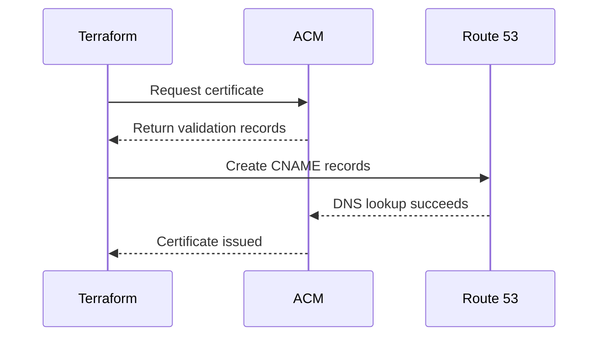

# How to Create ACM Certificates with Terraform

Author: [nawazdhandala](https://github.com/nawazdhandala)

Tags: AWS, ACM, Terraform, SSL

Description: Learn how to provision and validate AWS Certificate Manager (ACM) SSL/TLS certificates using Terraform with DNS validation via Route 53.

---

SSL/TLS certificates are one of those things you set up once and forget about - until they expire and your site goes down at 2 AM. AWS Certificate Manager (ACM) eliminates most of that pain by providing free certificates that auto-renew, but getting the initial provisioning right in Terraform takes a bit of care, especially around DNS validation.

This guide covers creating certificates, validating them with DNS through Route 53, handling wildcard certificates, and attaching them to load balancers and CloudFront distributions.

## How ACM Certificate Validation Works

When you request a certificate, ACM needs to verify that you actually own the domain. There are two validation methods:

1. **DNS validation** - ACM gives you a CNAME record to add to your DNS. Once the record exists, validation happens automatically. This is the preferred method because it enables auto-renewal.
2. **Email validation** - ACM sends an email to domain contacts. This doesn't support auto-renewal through Terraform and is generally more annoying.

We'll use DNS validation with Route 53 for everything in this guide.



## Basic Certificate with DNS Validation

Here's the standard pattern for creating a certificate and validating it through Route 53.

This creates a certificate for a single domain and automatically creates the DNS validation record:

```hcl
# Request the certificate
resource "aws_acm_certificate" "main" {
  domain_name       = "app.example.com"
  validation_method = "DNS"

  lifecycle {
    create_before_destroy = true
  }

  tags = {
    Environment = "production"
    ManagedBy   = "terraform"
  }
}

# Look up the hosted zone
data "aws_route53_zone" "main" {
  name         = "example.com"
  private_zone = false
}

# Create the DNS validation record
resource "aws_route53_record" "cert_validation" {
  for_each = {
    for dvo in aws_acm_certificate.main.domain_validation_options : dvo.domain_name => {
      name   = dvo.resource_record_name
      record = dvo.resource_record_value
      type   = dvo.resource_record_type
    }
  }

  allow_overwrite = true
  name            = each.value.name
  records         = [each.value.record]
  ttl             = 60
  type            = each.value.type
  zone_id         = data.aws_route53_zone.main.zone_id
}

# Wait for validation to complete
resource "aws_acm_certificate_validation" "main" {
  certificate_arn         = aws_acm_certificate.main.arn
  validation_record_fqdns = [for record in aws_route53_record.cert_validation : record.fqdn]
}
```

The `lifecycle { create_before_destroy = true }` block is important. Without it, Terraform would try to destroy the old certificate before creating the new one during updates, which would cause downtime for any resources using it.

The `aws_acm_certificate_validation` resource doesn't create anything in AWS - it's a Terraform waiter that blocks until ACM confirms the certificate is issued. This prevents downstream resources from trying to use a certificate that isn't ready yet.

## Wildcard Certificate

Wildcard certificates cover all subdomains at a single level. It's common to include both the wildcard and the apex domain on the same certificate.

This creates a wildcard certificate that covers both `*.example.com` and `example.com`:

```hcl
resource "aws_acm_certificate" "wildcard" {
  domain_name               = "*.example.com"
  subject_alternative_names = ["example.com"]
  validation_method         = "DNS"

  lifecycle {
    create_before_destroy = true
  }

  tags = {
    Name = "wildcard-example-com"
  }
}

# Create validation records for all domains
resource "aws_route53_record" "wildcard_validation" {
  for_each = {
    for dvo in aws_acm_certificate.wildcard.domain_validation_options : dvo.domain_name => {
      name   = dvo.resource_record_name
      record = dvo.resource_record_value
      type   = dvo.resource_record_type
    }
  }

  allow_overwrite = true
  name            = each.value.name
  records         = [each.value.record]
  ttl             = 60
  type            = each.value.type
  zone_id         = data.aws_route53_zone.main.zone_id
}

resource "aws_acm_certificate_validation" "wildcard" {
  certificate_arn         = aws_acm_certificate.wildcard.arn
  validation_record_fqdns = [for record in aws_route53_record.wildcard_validation : record.fqdn]
}
```

Fun fact: the wildcard `*.example.com` and the apex `example.com` often use the same CNAME validation record. The `for_each` with `dvo.domain_name` as the key handles deduplication automatically.

## Multi-Domain Certificate (SAN)

Sometimes you need a single certificate that covers multiple distinct domains.

This certificate covers three different domains using Subject Alternative Names:

```hcl
resource "aws_acm_certificate" "multi_domain" {
  domain_name = "app.example.com"
  subject_alternative_names = [
    "api.example.com",
    "admin.example.com"
  ]
  validation_method = "DNS"

  lifecycle {
    create_before_destroy = true
  }
}

resource "aws_route53_record" "multi_domain_validation" {
  for_each = {
    for dvo in aws_acm_certificate.multi_domain.domain_validation_options : dvo.domain_name => {
      name   = dvo.resource_record_name
      record = dvo.resource_record_value
      type   = dvo.resource_record_type
    }
  }

  allow_overwrite = true
  name            = each.value.name
  records         = [each.value.record]
  ttl             = 60
  type            = each.value.type
  zone_id         = data.aws_route53_zone.main.zone_id
}

resource "aws_acm_certificate_validation" "multi_domain" {
  certificate_arn         = aws_acm_certificate.multi_domain.arn
  validation_record_fqdns = [for record in aws_route53_record.multi_domain_validation : record.fqdn]
}
```

## Certificate for CloudFront

CloudFront has a special requirement: certificates must be created in `us-east-1`, regardless of where your CloudFront distribution is configured. You'll need an aliased provider for this.

This creates a certificate in us-east-1 specifically for use with CloudFront:

```hcl
# Provider alias for us-east-1
provider "aws" {
  alias  = "us_east_1"
  region = "us-east-1"
}

resource "aws_acm_certificate" "cloudfront" {
  provider          = aws.us_east_1
  domain_name       = "cdn.example.com"
  validation_method = "DNS"

  lifecycle {
    create_before_destroy = true
  }

  tags = {
    Name    = "cloudfront-cdn"
    Purpose = "CloudFront distribution"
  }
}

resource "aws_route53_record" "cloudfront_validation" {
  for_each = {
    for dvo in aws_acm_certificate.cloudfront.domain_validation_options : dvo.domain_name => {
      name   = dvo.resource_record_name
      record = dvo.resource_record_value
      type   = dvo.resource_record_type
    }
  }

  allow_overwrite = true
  name            = each.value.name
  records         = [each.value.record]
  ttl             = 60
  type            = each.value.type
  zone_id         = data.aws_route53_zone.main.zone_id
}

resource "aws_acm_certificate_validation" "cloudfront" {
  provider                = aws.us_east_1
  certificate_arn         = aws_acm_certificate.cloudfront.arn
  validation_record_fqdns = [for record in aws_route53_record.cloudfront_validation : record.fqdn]
}
```

## Attaching Certificates to an ALB

Once the certificate is validated, attach it to your load balancer's HTTPS listener.

This configures an ALB listener to use the ACM certificate for HTTPS termination:

```hcl
resource "aws_lb_listener" "https" {
  load_balancer_arn = aws_lb.main.arn
  port              = 443
  protocol          = "HTTPS"
  ssl_policy        = "ELBSecurityPolicy-TLS13-1-2-2021-06"
  certificate_arn   = aws_acm_certificate_validation.main.certificate_arn

  default_action {
    type             = "forward"
    target_group_arn = aws_lb_target_group.main.arn
  }
}

# Redirect HTTP to HTTPS
resource "aws_lb_listener" "http_redirect" {
  load_balancer_arn = aws_lb.main.arn
  port              = 80
  protocol          = "HTTP"

  default_action {
    type = "redirect"
    redirect {
      port        = "443"
      protocol    = "HTTPS"
      status_code = "HTTP_301"
    }
  }
}
```

Notice we reference `aws_acm_certificate_validation.main.certificate_arn` instead of `aws_acm_certificate.main.arn`. This creates an implicit dependency that ensures Terraform waits for the certificate to be fully issued before trying to attach it.

## Certificate Expiry Monitoring

ACM certificates auto-renew as long as the DNS validation records still exist. But things can go wrong - someone deletes a Route 53 record, or you move DNS providers. It's worth monitoring for upcoming expirations.

This CloudWatch alarm fires 30 days before a certificate expires:

```hcl
resource "aws_cloudwatch_metric_alarm" "cert_expiry" {
  alarm_name          = "acm-certificate-expiry-warning"
  comparison_operator = "LessThanThreshold"
  evaluation_periods  = 1
  metric_name         = "DaysToExpiry"
  namespace           = "AWS/CertificateManager"
  period              = 86400  # Check daily
  statistic           = "Minimum"
  threshold           = 30     # Alert 30 days before expiry
  alarm_description   = "ACM certificate expiring within 30 days"

  dimensions = {
    CertificateArn = aws_acm_certificate.main.arn
  }

  alarm_actions = [var.sns_topic_arn]
}
```

## Importing Existing Certificates

If you have certificates that were created outside of Terraform, you can import them:

```bash
# Import an existing ACM certificate into Terraform state
terraform import aws_acm_certificate.main arn:aws:acm:us-east-1:123456789012:certificate/abc-123-def-456
```

## Common Gotchas

**Validation timeout**: The `aws_acm_certificate_validation` resource has a default timeout of 75 minutes. DNS propagation usually takes a few minutes, but if it times out, just run `terraform apply` again.

**Certificate in use**: You can't delete a certificate that's attached to a resource. The `create_before_destroy` lifecycle rule handles this for updates, but be aware if you're manually removing certificates.

**Region matters**: ALB/NLB certificates must be in the same region as the load balancer. CloudFront certificates must be in us-east-1. API Gateway regional endpoints use the same region, while edge-optimized endpoints need us-east-1.

For more on managing multi-region AWS resources with Terraform, check out our post on [Terraform AWS provider aliases for multi-region](https://oneuptime.com/blog/post/2026-02-12-terraform-aws-provider-aliases-multi-region/view).

## Wrapping Up

ACM certificates in Terraform follow a predictable pattern: request the certificate, create DNS validation records in Route 53, and wait for validation. The trickiest parts are remembering the CloudFront us-east-1 requirement and using the validation resource's ARN (not the certificate's ARN) when attaching to other resources. Once you've got the pattern down, adding new certificates is straightforward.
