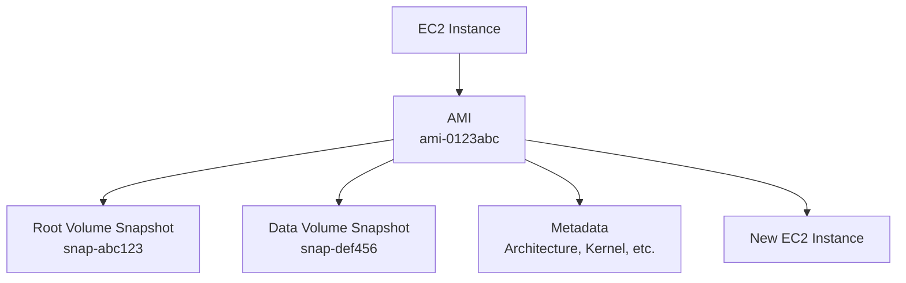

# How to Create an AMI from an Existing EC2 Instance

Author: [nawazdhandala](https://github.com/nawazdhandala)

Tags: AWS, EC2, AMI, Backup, Infrastructure

Description: Learn how to create a custom Amazon Machine Image from a running or stopped EC2 instance, including best practices for clean images and automation.

---

An Amazon Machine Image (AMI) is a template that contains the OS, application server, and applications needed to launch an EC2 instance. Creating an AMI from an existing instance lets you capture your entire server configuration - installed packages, application code, configuration files, everything - into a reusable image.

This is incredibly useful for scaling out, disaster recovery, and maintaining consistent environments. Instead of configuring each new instance from scratch, you launch from your custom AMI and it comes pre-configured.

## When to Create an AMI

There are several good reasons to create AMIs:

- **Golden image strategy**: Configure an instance exactly how you want it, create an AMI, and use it as the base for all future instances in that role.
- **Backup before changes**: Before a risky update or configuration change, snapshot the instance as an AMI so you can roll back.
- **Scaling**: Auto Scaling groups use AMIs (through launch templates) to launch new instances that are identical to each other.
- **Migration**: Move a configured instance to a different region or share it with another account.

## Creating an AMI via the Console

1. Go to the EC2 console and select your instance
2. Click "Actions" > "Image and templates" > "Create image"
3. Configure the settings:

| Setting | Recommendation |
|---------|---------------|
| Image name | Descriptive, include date: `webapp-v2.1-2026-02-12` |
| Image description | What this image contains and its purpose |
| No reboot | Unchecked (default) for data consistency |
| Tag image and snapshots | Check this to copy instance tags |

4. Click "Create image"

### The "No Reboot" Option

By default, AWS reboots the instance during AMI creation to ensure filesystem consistency. All pending writes are flushed to disk, giving you a clean image.

If you check "No reboot", the instance stays running but you risk creating an image with an inconsistent filesystem. This is fine for stateless servers where you don't care about in-flight data, but risky for databases or anything writing to disk continuously.

## Creating an AMI via the CLI

```bash
# Create an AMI from a running instance (will reboot the instance)
aws ec2 create-image \
    --instance-id i-0123456789abcdef0 \
    --name "webapp-v2.1-2026-02-12" \
    --description "Web application with Nginx and Node.js 20" \
    --tag-specifications 'ResourceType=image,Tags=[{Key=Environment,Value=production},{Key=Service,Value=webapp}]'
```

The command returns an AMI ID immediately, but the AMI isn't ready yet. It takes several minutes to create the snapshots and register the image.

```bash
# Check the status of the AMI
aws ec2 describe-images \
    --image-ids ami-0123456789abcdef0 \
    --query 'Images[0].State'

# Wait until it shows "available"
aws ec2 wait image-available --image-ids ami-0123456789abcdef0
echo "AMI is ready!"
```

To skip the reboot:

```bash
# Create an AMI without rebooting the instance
aws ec2 create-image \
    --instance-id i-0123456789abcdef0 \
    --name "webapp-no-reboot-2026-02-12" \
    --no-reboot
```

## Preparing the Instance Before Creating an AMI

For a clean, reusable AMI, do some housekeeping first:

### Clean Up Temporary Files

```bash
# Remove temporary files and caches
sudo rm -rf /tmp/*
sudo rm -rf /var/tmp/*

# Clean package manager cache
sudo yum clean all      # Amazon Linux / RHEL
# or
sudo apt clean          # Ubuntu / Debian

# Remove old log files
sudo find /var/log -type f -name "*.gz" -delete
sudo find /var/log -type f -name "*.old" -delete
```

### Remove Sensitive Data

```bash
# Remove SSH authorized keys (they'll be replaced on new launches)
# Only do this if you want the AMI to be truly generic
> ~/.ssh/authorized_keys

# Remove bash history
> ~/.bash_history
history -c

# Remove any hardcoded credentials or API keys
# Check common locations:
# /etc/environment
# ~/.aws/credentials
# Application config files
```

### Remove Instance-Specific Configuration

```bash
# Remove the machine ID so each instance gets a unique one
sudo rm -f /etc/machine-id
sudo systemd-machine-id-setup

# Remove any hostname customization (will be set per-instance)
sudo hostnamectl set-hostname ""
```

### Stop Unnecessary Services

If the instance is running a database or other service that writes to disk, stop it before creating the AMI to ensure data consistency:

```bash
# Stop services that write to disk
sudo systemctl stop postgresql
sudo systemctl stop redis

# Sync all pending disk writes
sudo sync
```

## What the AMI Contains

When you create an AMI, AWS creates:

1. **The AMI itself** - metadata describing the image (name, description, architecture, root device, etc.)
2. **EBS snapshots** - one for each EBS volume attached to the instance

The snapshots are the actual data. The AMI is really just a pointer to those snapshots plus configuration metadata.



## Costs

You're charged for the EBS snapshots that back the AMI. The AMI metadata itself is free. Snapshot pricing is about $0.05 per GB-month, so a 20 GB root volume costs about $1/month to keep as a snapshot.

If you're creating AMIs regularly (e.g., weekly builds), the snapshot costs add up. Set up a cleanup process:

```bash
# List all AMIs owned by your account, sorted by creation date
aws ec2 describe-images \
    --owners self \
    --query 'Images | sort_by(@, &CreationDate) | [*].[ImageId,Name,CreationDate]' \
    --output table
```

## Deregistering an AMI

When you no longer need an AMI:

```bash
# Step 1: Deregister the AMI
aws ec2 deregister-image --image-id ami-0123456789abcdef0

# Step 2: Delete the associated snapshots
# First, find the snapshot IDs (note them before deregistering, or check)
aws ec2 describe-snapshots \
    --owner-ids self \
    --filters "Name=description,Values=*ami-0123456789abcdef0*" \
    --query 'Snapshots[*].SnapshotId' \
    --output text

# Then delete each snapshot
aws ec2 delete-snapshot --snapshot-id snap-0123456789abcdef0
```

Deregistering the AMI doesn't automatically delete the snapshots. If you forget to clean them up, you'll keep paying for the storage.

## Automating AMI Creation

For production environments, automate AMI creation so you always have recent images:

### Using AWS Backup

AWS Backup can create AMIs on a schedule. Create a backup plan that targets your EC2 instances and set retention rules to automatically delete old AMIs.

### Using a Simple Script

```bash
#!/bin/bash
# Create a dated AMI and clean up old ones

INSTANCE_ID="i-0123456789abcdef0"
SERVICE_NAME="webapp"
DATE=$(date +%Y-%m-%d)
RETENTION_DAYS=30

# Create new AMI
AMI_ID=$(aws ec2 create-image \
    --instance-id $INSTANCE_ID \
    --name "${SERVICE_NAME}-${DATE}" \
    --description "Automated backup of ${SERVICE_NAME}" \
    --output text)

echo "Created AMI: $AMI_ID"

# Tag it
aws ec2 create-tags \
    --resources $AMI_ID \
    --tags Key=AutoBackup,Value=true Key=Service,Value=$SERVICE_NAME

# Clean up AMIs older than retention period
CUTOFF_DATE=$(date -d "-${RETENTION_DAYS} days" +%Y-%m-%d 2>/dev/null || date -v-${RETENTION_DAYS}d +%Y-%m-%d)

OLD_AMIS=$(aws ec2 describe-images \
    --owners self \
    --filters "Name=tag:AutoBackup,Values=true" "Name=tag:Service,Values=$SERVICE_NAME" \
    --query "Images[?CreationDate<'${CUTOFF_DATE}'].ImageId" \
    --output text)

for AMI in $OLD_AMIS; do
    echo "Deregistering old AMI: $AMI"

    # Get associated snapshots before deregistering
    SNAPSHOTS=$(aws ec2 describe-images \
        --image-ids $AMI \
        --query 'Images[0].BlockDeviceMappings[*].Ebs.SnapshotId' \
        --output text)

    aws ec2 deregister-image --image-id $AMI

    for SNAP in $SNAPSHOTS; do
        echo "Deleting snapshot: $SNAP"
        aws ec2 delete-snapshot --snapshot-id $SNAP
    done
done
```

## Sharing and Copying AMIs

Once you have an AMI, you can share it with other accounts or copy it to other regions. Check out our guides on [sharing AMIs across accounts](https://oneuptime.com/blog/post/share-ami-across-aws-accounts/view) and [copying AMIs to other regions](https://oneuptime.com/blog/post/copy-ami-to-another-aws-region/view) for detailed instructions.

## Best Practices

1. **Use descriptive names with dates.** `webapp-v2.1-2026-02-12` is much more useful than `my-image-3`.

2. **Tag your AMIs.** Include the service name, version, environment, and whether it's a golden image or a backup.

3. **Test your AMIs.** Launch a new instance from the AMI and verify everything works. Don't assume it's good just because the creation succeeded.

4. **Keep AMIs lean.** Remove caches, logs, and temp files before creating the image. Smaller images launch faster and cost less to store.

5. **Automate the pipeline.** Build AMIs as part of your CI/CD pipeline. Tools like Packer by HashiCorp make this straightforward.

6. **Monitor your AMI inventory.** It's easy to accumulate hundreds of AMIs over time. Set up regular cleanup and track storage costs with [monitoring tools](https://oneuptime.com).

Creating AMIs is one of those fundamental AWS skills that pays off every time you need to scale, recover from a failure, or maintain consistency across your infrastructure.
