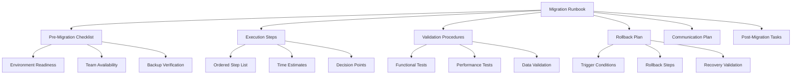

# How to Create an AWS Migration Runbook

Author: [nawazdhandala](https://github.com/nawazdhandala)

Tags: AWS, Migration, Runbook, DevOps, Documentation

Description: Step-by-step guide to building a comprehensive AWS migration runbook covering pre-migration checks, execution steps, rollback procedures, and validation.

---

A migration without a runbook is a migration with surprises. And surprises during production cutovers are never the fun kind. A well-written runbook turns a high-stress event into a series of checkboxes that anyone on the team can follow.

## What Goes Into a Migration Runbook

A migration runbook is not just a list of steps. It is a complete operational document that covers everything from pre-migration validation to post-migration cleanup. Here is the structure that works.



## Section 1: Overview and Scope

Start every runbook with context. Someone picking up this document at 2 AM needs to understand what they are looking at immediately.

```markdown
## Migration Overview
- **Application**: Order Processing System v3.2
- **Migration Type**: Rehost (lift and shift)
- **Source**: On-premises VMware (datacenter-east)
- **Target**: AWS us-east-1, VPC vpc-0abc123
- **Scheduled Window**: 2026-02-15 22:00 - 2026-02-16 06:00 EST
- **Expected Duration**: 4 hours (2 hour buffer)
- **Rollback Deadline**: 2026-02-16 04:00 EST
- **Change Ticket**: CHG-2026-0215
```

Include a clear statement of what is in scope and what is not. If only the application tier is migrating this weekend and the database follows next sprint, say so explicitly.

## Section 2: Roles and Contacts

Every person involved needs to know their role before the migration starts.

```markdown
## Team Roster
| Role | Name | Phone | Backup |
|------|------|-------|--------|
| Migration Lead | Alice Chen | 555-0101 | Bob Park |
| Infrastructure | Bob Park | 555-0102 | Carol Wu |
| Database | Carol Wu | 555-0103 | Dave Kim |
| Application | Dave Kim | 555-0104 | Alice Chen |
| Network | Eve Jones | 555-0105 | Frank Li |
| Management Escalation | Frank Li | 555-0106 | - |

## Communication Channels
- Primary: #migration-feb15 Slack channel
- Bridge Line: +1-555-0200 (PIN: 1234)
- Status Updates: Every 30 minutes to stakeholder DL
```

## Section 3: Pre-Migration Checklist

This checklist should be completed hours or days before the actual migration window. Not during it.

```markdown
## Pre-Migration Checklist (Complete by T-24h)

### Environment Readiness
- [ ] Target VPC and subnets verified
- [ ] Security groups created and rules validated
- [ ] IAM roles and policies in place
- [ ] Target EC2 instances launched and accessible
- [ ] EBS volumes provisioned with correct sizes
- [ ] Load balancer configured (health checks disabled)
- [ ] DNS TTL lowered to 60 seconds (at least 48h before)

### Data Readiness
- [ ] Final backup of source database completed
- [ ] Backup verified with restore test
- [ ] Replication lag confirmed under threshold
- [ ] Data validation queries prepared and tested

### Application Readiness
- [ ] Application artifacts uploaded to S3/CodeDeploy
- [ ] Configuration files updated for AWS environment
- [ ] SSL certificates installed on target
- [ ] Connection strings verified (pointing to new endpoints)

### Team Readiness
- [ ] All team members confirmed availability
- [ ] Runbook walkthrough completed with full team
- [ ] Rollback procedure rehearsed
- [ ] Escalation contacts verified
```

## Section 4: Execution Steps

This is the heart of the runbook. Each step needs to be specific, testable, and include time estimates.

```markdown
## Execution Steps

### Phase 1: Preparation (T+0:00 to T+0:30)
| Step | Action | Owner | Est. Time | Verify |
|------|--------|-------|-----------|--------|
| 1.1 | Open bridge call, confirm all team members | Lead | 5 min | Roll call complete |
| 1.2 | Verify source system health | App | 5 min | All health checks green |
| 1.3 | Take final application snapshot | Infra | 10 min | Snapshot ID recorded |
| 1.4 | Disable scheduled jobs/crons | App | 5 min | Crontab cleared |
| 1.5 | Post status: "Migration started" | Lead | 2 min | Stakeholders notified |

### Phase 2: Data Migration (T+0:30 to T+2:00)
| Step | Action | Owner | Est. Time | Verify |
|------|--------|-------|-----------|--------|
| 2.1 | Stop application writes to database | App | 5 min | Write queries = 0 |
| 2.2 | Verify replication caught up | DBA | 10 min | Lag = 0 seconds |
| 2.3 | Promote read replica to primary | DBA | 15 min | New primary accepting writes |
| 2.4 | Run data validation queries | DBA | 20 min | Row counts match |
| 2.5 | Update application connection strings | App | 10 min | Config deployed |

### Phase 3: Application Cutover (T+2:00 to T+3:00)
| Step | Action | Owner | Est. Time | Verify |
|------|--------|-------|-----------|--------|
| 3.1 | Deploy application to target instances | App | 15 min | Deployment successful |
| 3.2 | Run smoke tests against target | App | 15 min | All tests pass |
| 3.3 | Enable load balancer health checks | Infra | 5 min | Targets healthy |
| 3.4 | Update DNS to point to new LB | Net | 5 min | DNS propagation confirmed |
| 3.5 | Monitor traffic shift | Lead | 15 min | New env receiving requests |
```

### Writing Good Steps

Each step should answer these questions:
- What exactly needs to happen?
- Who does it?
- How long should it take?
- How do you know it worked?
- What do you do if it fails?

Bad step: "Migrate the database."
Good step: "Promote RDS read replica rds-orderdb-replica to standalone primary. Verify by connecting with psql and running SELECT pg_is_in_recovery() - should return false."

## Section 5: Validation Procedures

After cutover, you need to prove everything works. Do not skip this to save time.

```bash
# Functional validation script
#!/bin/bash

echo "=== Post-Migration Validation ==="
echo ""

# Check application endpoint
echo "1. Checking application endpoint..."
HTTP_STATUS=$(curl -s -o /dev/null -w "%{http_code}" https://app.example.com/health)
if [ "$HTTP_STATUS" = "200" ]; then
    echo "   PASS: Health endpoint returned 200"
else
    echo "   FAIL: Health endpoint returned $HTTP_STATUS"
fi

# Check database connectivity
echo "2. Checking database connectivity..."
DB_RESULT=$(psql -h new-db.cluster-abc123.us-east-1.rds.amazonaws.com -U appuser -d orderdb -c "SELECT 1" 2>&1)
if echo "$DB_RESULT" | grep -q "1 row"; then
    echo "   PASS: Database connection successful"
else
    echo "   FAIL: Database connection failed"
fi

# Check recent orders (data integrity)
echo "3. Checking recent order data..."
ORDER_COUNT=$(psql -h new-db.cluster-abc123.us-east-1.rds.amazonaws.com -U appuser -d orderdb -c "SELECT count(*) FROM orders WHERE created_at > NOW() - INTERVAL '24 hours'" -t 2>&1)
echo "   Orders in last 24h: $ORDER_COUNT"
```

For more thorough validation strategies, see our guide on [validating data integrity after AWS migration](https://oneuptime.com/blog/post/validate-data-integrity-after-aws-migration/view).

## Section 6: Rollback Plan

Every migration needs a rollback plan. Define clear triggers for when to invoke it.

```markdown
## Rollback Triggers
Initiate rollback if ANY of the following occur:
- Application health checks fail after 15 minutes of troubleshooting
- Data validation shows discrepancies greater than 0.01%
- Migration exceeds 5 hours total (T+5:00)
- Critical severity issue with no clear resolution path

## Rollback Steps
| Step | Action | Owner | Est. Time |
|------|--------|-------|-----------|
| R.1 | Announce rollback decision on bridge | Lead | 2 min |
| R.2 | Revert DNS to original endpoints | Net | 5 min |
| R.3 | Verify traffic flowing to source | Lead | 10 min |
| R.4 | Re-enable application on source | App | 10 min |
| R.5 | Restore database from pre-migration snapshot if needed | DBA | 30 min |
| R.6 | Validate source environment health | App | 15 min |
| R.7 | Post rollback status to stakeholders | Lead | 5 min |
| R.8 | Schedule post-mortem | Lead | 5 min |
```

## Section 7: Post-Migration Tasks

The migration is not done when DNS flips. There is always cleanup work.

```markdown
## Post-Migration (Next Business Day)
- [ ] Decommission source environment scheduled (30-day hold)
- [ ] Monitoring dashboards updated for new infrastructure
- [ ] Alerting rules updated with new endpoints
- [ ] Backup schedules verified on AWS
- [ ] Cost allocation tags applied to all resources
- [ ] Documentation updated (architecture diagrams, IP addresses)
- [ ] Post-migration review meeting scheduled
- [ ] Performance baseline captured for comparison
```

## Runbook Review Process

A runbook is only good if the team trusts it. Before migration day:

1. **Table-top exercise**: Walk through every step with the team. Assign times. Identify gaps.
2. **Dry run**: If possible, execute the runbook against a staging environment.
3. **Peer review**: Have someone not involved in writing the runbook read it and flag anything unclear.
4. **Version control**: Store the runbook in Git. Track changes. Tag the version used for each migration.

## Conclusion

A migration runbook is an investment that pays off many times over. The time you spend writing clear steps, defining rollback triggers, and preparing validation scripts is time you save during the actual migration - when stress is high and clear thinking is at a premium. Start with this template, customize it for your application, and rehearse it with your team before the real thing.
