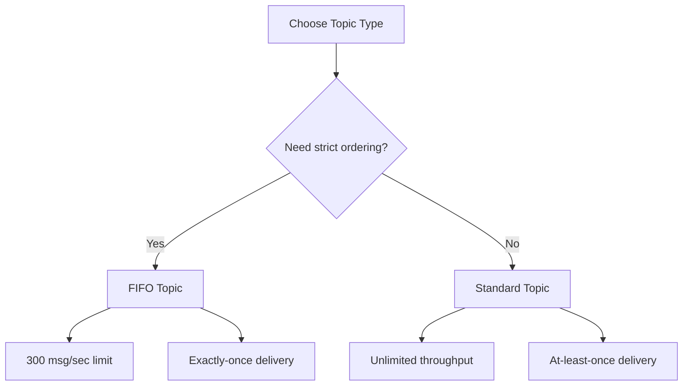

# How to Create an SNS Topic

Author: [nawazdhandala](https://github.com/nawazdhandala)

Tags: AWS, SNS, Messaging, Serverless

Description: Learn how to create Amazon SNS topics using the AWS CLI, Console, SDKs, and Infrastructure as Code tools, including standard and FIFO topic configurations.

---

Amazon SNS (Simple Notification Service) is AWS's managed pub/sub messaging service. Topics are the fundamental building block - they're the channels that publishers send messages to and subscribers receive messages from. Creating a topic takes about 10 seconds, but there are configuration choices that matter for production use.

Let's cover all the ways to create topics and the settings you should care about.

## Standard vs FIFO Topics

Before creating a topic, decide which type you need.

**Standard topics** provide best-effort ordering and at-least-once delivery. Messages might arrive out of order and could be delivered more than once. They support virtually unlimited throughput.

**FIFO topics** guarantee strict ordering and exactly-once delivery, but have a throughput limit of 300 messages per second (or 3000 with batching). FIFO topic names must end with `.fifo`.



## Creating a Standard Topic via CLI

The simplest way to create a topic.

```bash
# Create a standard SNS topic
aws sns create-topic --name order-notifications
```

The response gives you the Topic ARN, which you'll need for everything else.

```json
{
  "TopicArn": "arn:aws:sns:us-east-1:123456789012:order-notifications"
}
```

You can add attributes during creation for more control.

```bash
# Create a topic with display name and tags
aws sns create-topic \
  --name order-notifications \
  --attributes '{
    "DisplayName": "Order Notifications"
  }' \
  --tags Key=Environment,Value=production Key=Team,Value=backend
```

## Creating a FIFO Topic

FIFO topics require the `.fifo` suffix in the name.

```bash
# Create a FIFO topic
aws sns create-topic \
  --name order-processing.fifo \
  --attributes '{
    "FifoTopic": "true",
    "ContentBasedDeduplication": "true"
  }'
```

The `ContentBasedDeduplication` attribute automatically deduplicates messages based on their content hash. If you set this to false, you'll need to provide a deduplication ID with every message.

## Creating Topics with Python (Boto3)

For programmatic topic creation, use the AWS SDK.

```python
import boto3

sns = boto3.client('sns', region_name='us-east-1')

# Create a standard topic with configuration
response = sns.create_topic(
    Name='order-notifications',
    Attributes={
        'DisplayName': 'Order Notifications',
        # Enable server-side encryption with the default SNS key
        'KmsMasterKeyId': 'alias/aws/sns',
    },
    Tags=[
        {'Key': 'Environment', 'Value': 'production'},
        {'Key': 'Team', 'Value': 'backend'},
    ]
)

topic_arn = response['TopicArn']
print(f'Created topic: {topic_arn}')
```

Here's a helper function that creates a topic with sensible defaults and handles the case where the topic already exists.

```python
import boto3

sns = boto3.client('sns')

def create_or_get_topic(name, fifo=False, encrypted=True):
    """Create a topic or return it if it already exists.
    SNS create_topic is idempotent - calling it twice with the
    same name just returns the existing topic ARN."""

    topic_name = f'{name}.fifo' if fifo else name

    attributes = {}
    if fifo:
        attributes['FifoTopic'] = 'true'
        attributes['ContentBasedDeduplication'] = 'true'
    if encrypted:
        attributes['KmsMasterKeyId'] = 'alias/aws/sns'

    response = sns.create_topic(
        Name=topic_name,
        Attributes=attributes
    )

    topic_arn = response['TopicArn']
    print(f'Topic ready: {topic_arn}')
    return topic_arn

# Usage examples
order_topic = create_or_get_topic('order-notifications')
fifo_topic = create_or_get_topic('payment-processing', fifo=True)
```

## Creating Topics with CDK

CDK is the cleanest way to manage topics as code.

```typescript
import * as cdk from 'aws-cdk-lib';
import * as sns from 'aws-cdk-lib/aws-sns';
import * as kms from 'aws-cdk-lib/aws-kms';

// Standard topic with encryption
const orderTopic = new sns.Topic(this, 'OrderNotifications', {
  topicName: 'order-notifications',
  displayName: 'Order Notifications',
  // Use the default SNS encryption key
  masterKey: kms.Alias.fromAliasName(this, 'SnsKey', 'alias/aws/sns'),
});

// FIFO topic
const paymentTopic = new sns.Topic(this, 'PaymentProcessing', {
  topicName: 'payment-processing.fifo',
  fifo: true,
  contentBasedDeduplication: true,
});

// Output the topic ARN for other stacks to reference
new cdk.CfnOutput(this, 'OrderTopicArn', {
  value: orderTopic.topicArn,
  exportName: 'OrderNotificationsTopicArn',
});
```

## Creating Topics with CloudFormation

If you're using raw CloudFormation templates.

```yaml
# CloudFormation template for SNS topics
AWSTemplateFormatVersion: '2010-09-09'

Resources:
  OrderNotificationsTopic:
    Type: AWS::SNS::Topic
    Properties:
      TopicName: order-notifications
      DisplayName: Order Notifications
      KmsMasterKeyId: alias/aws/sns
      Tags:
        - Key: Environment
          Value: production

  PaymentProcessingTopic:
    Type: AWS::SNS::Topic
    Properties:
      TopicName: payment-processing.fifo
      FifoTopic: true
      ContentBasedDeduplication: true

Outputs:
  OrderTopicArn:
    Value: !Ref OrderNotificationsTopic
    Export:
      Name: OrderNotificationsTopicArn
```

## Creating Topics with Terraform

For teams using Terraform.

```hcl
# Standard SNS topic
resource "aws_sns_topic" "order_notifications" {
  name         = "order-notifications"
  display_name = "Order Notifications"

  # Enable encryption
  kms_master_key_id = "alias/aws/sns"

  tags = {
    Environment = "production"
    Team        = "backend"
  }
}

# FIFO SNS topic
resource "aws_sns_topic" "payment_processing" {
  name                        = "payment-processing.fifo"
  fifo_topic                  = true
  content_based_deduplication = true

  tags = {
    Environment = "production"
  }
}

output "order_topic_arn" {
  value = aws_sns_topic.order_notifications.arn
}
```

## Setting Up an Access Policy

By default, only the topic owner can publish and manage subscriptions. You can broaden this with a topic policy.

```bash
# Allow a specific AWS account to publish to the topic
aws sns set-topic-attributes \
  --topic-arn arn:aws:sns:us-east-1:123456789012:order-notifications \
  --attribute-name Policy \
  --attribute-value '{
    "Version": "2012-10-17",
    "Statement": [
      {
        "Sid": "AllowCrossAccountPublish",
        "Effect": "Allow",
        "Principal": {
          "AWS": "arn:aws:iam::987654321098:root"
        },
        "Action": "sns:Publish",
        "Resource": "arn:aws:sns:us-east-1:123456789012:order-notifications"
      }
    ]
  }'
```

## Listing and Managing Topics

Some useful commands for managing your topics.

```bash
# List all topics in the account
aws sns list-topics

# Get topic attributes
aws sns get-topic-attributes \
  --topic-arn arn:aws:sns:us-east-1:123456789012:order-notifications

# Delete a topic (also removes all subscriptions)
aws sns delete-topic \
  --topic-arn arn:aws:sns:us-east-1:123456789012:order-notifications

# List subscriptions for a topic
aws sns list-subscriptions-by-topic \
  --topic-arn arn:aws:sns:us-east-1:123456789012:order-notifications
```

## What's Next

Once you've created a topic, the next steps are:

1. [Publishing messages to your topic](https://oneuptime.com/blog/post/2026-02-12-publish-messages-to-sns-topics/view)
2. [Subscribing endpoints like email](https://oneuptime.com/blog/post/2026-02-12-subscribe-an-email-endpoint-to-sns/view), [Lambda functions](https://oneuptime.com/blog/post/2026-02-12-subscribe-a-lambda-function-to-sns/view), or [SQS queues](https://oneuptime.com/blog/post/2026-02-12-subscribe-an-sqs-queue-to-sns/view)
3. [Setting up encryption with KMS](https://oneuptime.com/blog/post/2026-02-12-enable-sns-message-encryption-with-kms/view)

Creating the topic is just the starting point - the real power comes from the subscriber patterns you build on top of it.
