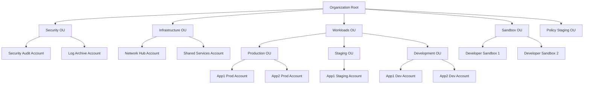

# How to Create and Manage AWS Organizations OUs

Author: [nawazdhandala](https://github.com/nawazdhandala)

Tags: AWS, Organizations, Multi-Account, Governance

Description: Learn how to design and manage organizational units in AWS Organizations for effective multi-account governance, including practical OU structures and account management.

---

AWS Organizations lets you group multiple AWS accounts under a single management structure. Organizational Units (OUs) are the folders in this structure - they let you group accounts by purpose, environment, or team and apply policies to the entire group at once. Getting your OU structure right early saves a lot of pain later, because restructuring after the fact means moving accounts, updating policies, and potentially breaking things.

Let's design an OU structure that works and walk through the mechanics of creating and managing it.

## Why OUs Matter

Without OUs, you'd have a flat list of accounts under your organization root. Every SCP would apply to every account, and you'd have no way to give production accounts stricter controls than development accounts.

OUs give you:
- **Grouped policy application** - Attach an SCP to an OU and it applies to all accounts within it
- **Hierarchical inheritance** - Policies cascade down nested OUs
- **Logical organization** - Makes it clear what each account is for
- **Automated account provisioning** - New accounts in an OU automatically inherit its policies

## A Recommended OU Structure

Here's a structure that works for most organizations:



Let me explain each OU:

**Security OU** - Holds your security audit account (for GuardDuty, Security Hub, centralized IAM Access Analyzer) and log archive account (for CloudTrail logs, VPC Flow Logs, S3 access logs). These accounts get the strictest policies.

**Infrastructure OU** - Shared networking (Transit Gateway, VPN), shared services (CI/CD, container registries, DNS).

**Workloads OU** - Nested OUs for production, staging, and development. This is where your actual applications live.

**Sandbox OU** - Experimental accounts for developers to learn and prototype. Loose policies but strict budget controls.

**Policy Staging OU** - A place to test new SCPs before applying them to production OUs.

## Creating OUs

```bash
# Get your organization root ID first
ROOT_ID=$(aws organizations list-roots --query 'Roots[0].Id' --output text)

# Create top-level OUs
aws organizations create-organizational-unit \
  --parent-id $ROOT_ID \
  --name "Security"

aws organizations create-organizational-unit \
  --parent-id $ROOT_ID \
  --name "Infrastructure"

aws organizations create-organizational-unit \
  --parent-id $ROOT_ID \
  --name "Workloads"

aws organizations create-organizational-unit \
  --parent-id $ROOT_ID \
  --name "Sandbox"

aws organizations create-organizational-unit \
  --parent-id $ROOT_ID \
  --name "PolicyStaging"
```

Now create nested OUs under Workloads:

```bash
# Get the Workloads OU ID
WORKLOADS_ID=$(aws organizations list-organizational-units-for-parent \
  --parent-id $ROOT_ID \
  --query "OrganizationalUnits[?Name=='Workloads'].Id" \
  --output text)

# Create environment OUs under Workloads
aws organizations create-organizational-unit \
  --parent-id $WORKLOADS_ID \
  --name "Production"

aws organizations create-organizational-unit \
  --parent-id $WORKLOADS_ID \
  --name "Staging"

aws organizations create-organizational-unit \
  --parent-id $WORKLOADS_ID \
  --name "Development"
```

## Creating Accounts in OUs

You can create new accounts directly in an OU:

```bash
# Create a new account in the Production OU
PROD_OU_ID=$(aws organizations list-organizational-units-for-parent \
  --parent-id $WORKLOADS_ID \
  --query "OrganizationalUnits[?Name=='Production'].Id" \
  --output text)

aws organizations create-account \
  --email app1-prod@company.com \
  --account-name "App1 Production" \
  --role-name OrganizationAccountAccessRole
```

The `--role-name` parameter creates a role in the new account that the management account can assume. This is how you bootstrap access to new accounts.

Check the status of account creation:

```bash
# Check if account creation completed
aws organizations describe-create-account-status \
  --create-account-request-id car-abc123
```

## Moving Accounts Between OUs

If an account is in the wrong OU, move it:

```bash
# Move an account from one OU to another
aws organizations move-account \
  --account-id 123456789012 \
  --source-parent-id ou-root-development \
  --destination-parent-id ou-root-production
```

When you move an account, it immediately inherits the SCPs of the new OU and loses the SCPs from the old OU. Plan moves carefully - sudden policy changes can break running applications.

## Terraform Configuration

```hcl
# Define the OU structure in Terraform
data "aws_organizations_organization" "current" {}

resource "aws_organizations_organizational_unit" "security" {
  name      = "Security"
  parent_id = data.aws_organizations_organization.current.roots[0].id
}

resource "aws_organizations_organizational_unit" "infrastructure" {
  name      = "Infrastructure"
  parent_id = data.aws_organizations_organization.current.roots[0].id
}

resource "aws_organizations_organizational_unit" "workloads" {
  name      = "Workloads"
  parent_id = data.aws_organizations_organization.current.roots[0].id
}

resource "aws_organizations_organizational_unit" "production" {
  name      = "Production"
  parent_id = aws_organizations_organizational_unit.workloads.id
}

resource "aws_organizations_organizational_unit" "staging" {
  name      = "Staging"
  parent_id = aws_organizations_organizational_unit.workloads.id
}

resource "aws_organizations_organizational_unit" "development" {
  name      = "Development"
  parent_id = aws_organizations_organizational_unit.workloads.id
}

resource "aws_organizations_organizational_unit" "sandbox" {
  name      = "Sandbox"
  parent_id = data.aws_organizations_organization.current.roots[0].id
}

# Create an account in the Production OU
resource "aws_organizations_account" "app1_prod" {
  name      = "App1 Production"
  email     = "app1-prod@company.com"
  parent_id = aws_organizations_organizational_unit.production.id
  role_name = "OrganizationAccountAccessRole"

  tags = {
    Application = "App1"
    Environment = "Production"
  }

  lifecycle {
    ignore_changes = [role_name]
  }
}
```

## Applying SCPs to OUs

Different OUs get different policies. Here's a typical pattern:

```bash
# Strict policies for Production OU
aws organizations attach-policy \
  --policy-id $REGION_RESTRICTION_POLICY \
  --target-id $PROD_OU_ID

aws organizations attach-policy \
  --policy-id $PROTECT_CLOUDTRAIL_POLICY \
  --target-id $PROD_OU_ID

aws organizations attach-policy \
  --policy-id $DENY_EXPENSIVE_INSTANCES_POLICY \
  --target-id $PROD_OU_ID

# Lighter policies for Sandbox OU
aws organizations attach-policy \
  --policy-id $REGION_RESTRICTION_POLICY \
  --target-id $SANDBOX_OU_ID
# No instance type restrictions - let people experiment
```

For more on SCP policies, see our guide on [using Service Control Policies in AWS Organizations](https://oneuptime.com/blog/post/use-service-control-policies-scps-in-aws-organizations/view).

## Listing and Inspecting OUs

Useful commands for managing your OU structure:

```bash
# List all OUs under the root
aws organizations list-organizational-units-for-parent \
  --parent-id $ROOT_ID

# List accounts in a specific OU
aws organizations list-accounts-for-parent \
  --parent-id $PROD_OU_ID

# List all accounts in the organization
aws organizations list-accounts

# Get details about a specific OU
aws organizations describe-organizational-unit \
  --organizational-unit-id ou-root-production

# List SCPs attached to an OU
aws organizations list-policies-for-target \
  --target-id $PROD_OU_ID \
  --filter SERVICE_CONTROL_POLICY
```

## Tagging OUs and Accounts

Tags help with cost allocation and automation:

```bash
# Tag an OU
aws organizations tag-resource \
  --resource-id ou-root-production \
  --tags Key=Environment,Value=production Key=CostCenter,Value=platform

# Tag an account
aws organizations tag-resource \
  --resource-id 123456789012 \
  --tags Key=Application,Value=App1 Key=Team,Value=backend
```

## OU Design Principles

**Keep it flat-ish.** You can nest OUs up to 5 levels deep, but deep hierarchies become hard to reason about. Two or three levels is usually plenty.

**Group by governance needs, not org chart.** Your OU structure should reflect how you want to apply policies, not your company's management hierarchy. Production accounts need stricter controls than dev accounts regardless of which team owns them.

**One purpose per account.** Don't put multiple unrelated applications in the same account. Accounts are a security and blast-radius boundary.

**Plan for growth.** It's easy to add accounts to an OU. It's harder to restructure OUs. Think about where things will go as your organization grows.

## Closing Down an Account

When you no longer need an account:

```bash
# Close an AWS account (this is irreversible after 90 days)
aws organizations close-account --account-id 123456789012
```

Closed accounts enter a 90-day suspension period where they can be reactivated. After that, they're permanently closed. Make sure you've migrated any data and resources out first.

## Wrapping Up

A well-designed OU structure is the foundation of your multi-account AWS architecture. It determines how policies flow, how accounts are organized, and how new teams get onboarded. Start with the recommended structure, adapt it to your needs, and manage it as code with Terraform. The key insight is that OUs are about policy application, not organizational hierarchy - group accounts by what controls they need, not by who owns them.
