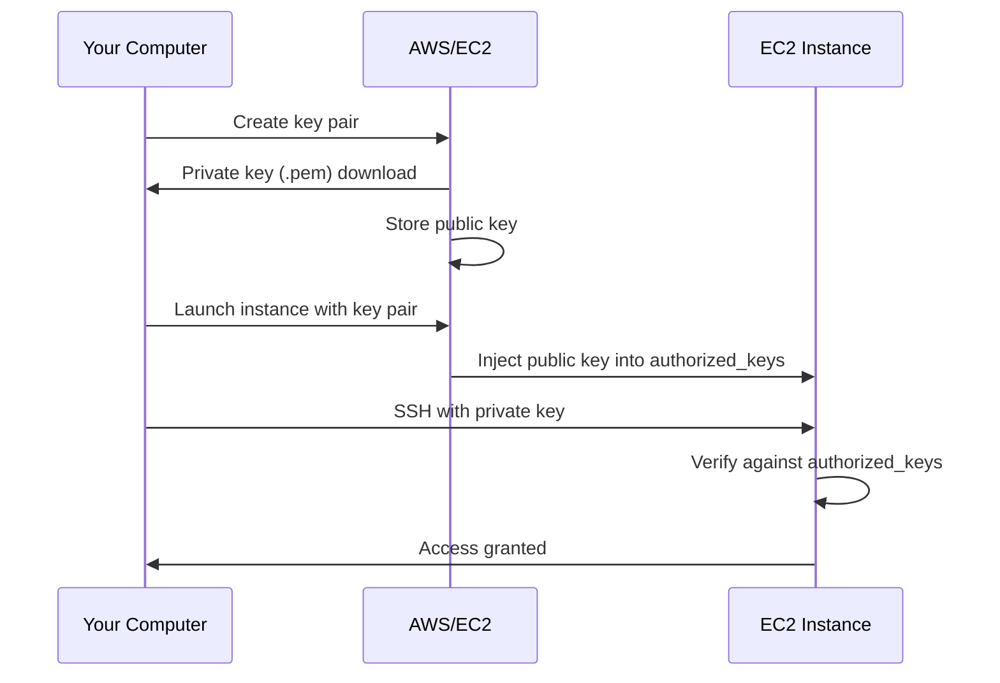

# How to Create and Use EC2 Key Pairs for SSH Access

Author: [nawazdhandala](https://github.com/nawazdhandala)

Tags: AWS, EC2, SSH, Key Pairs, Security

Description: Learn how to create, manage, and use EC2 key pairs for secure SSH access to your instances, including best practices for key rotation and team management.

---

EC2 key pairs are the primary authentication mechanism for SSH access to Linux instances on AWS. When you launch an instance, you assign a key pair, and AWS places the public key on the instance. You keep the private key and use it to prove your identity when connecting.

It's a simple concept, but key management gets more nuanced as your team and infrastructure grow. This guide covers creating key pairs, using them effectively, and avoiding common pitfalls.

## How EC2 Key Pairs Work

An EC2 key pair consists of two parts:

- **Public key** - stored by AWS and injected into instances at launch time. It goes into `~/.ssh/authorized_keys` on the instance.
- **Private key** - downloaded to your machine once during creation. AWS doesn't keep a copy.

When you SSH into an instance, your SSH client uses the private key to prove it holds the matching key for the public key on the server. No password is transmitted over the network.



## Creating a Key Pair in the AWS Console

1. Go to the EC2 dashboard
2. Click "Key Pairs" in the left navigation under "Network & Security"
3. Click "Create key pair"
4. Configure the settings:

| Setting | Recommendation |
|---------|---------------|
| Name | Something descriptive like "dev-team-2026" or "nawaz-laptop" |
| Key pair type | RSA (most compatible) or ED25519 (newer, more secure) |
| File format | .pem for Mac/Linux/modern Windows, .ppk for PuTTY |

5. Click "Create key pair"

The private key file downloads automatically. This is the only time you can download it, so don't lose it.

```bash
# Move the key to your SSH directory and set proper permissions
mv ~/Downloads/dev-team-2026.pem ~/.ssh/
chmod 400 ~/.ssh/dev-team-2026.pem
```

## Creating a Key Pair with the AWS CLI

If you prefer the command line:

```bash
# Create an RSA key pair and save the private key to a file
aws ec2 create-key-pair \
    --key-name dev-team-2026 \
    --key-type rsa \
    --query 'KeyMaterial' \
    --output text > ~/.ssh/dev-team-2026.pem

# Set the correct permissions
chmod 400 ~/.ssh/dev-team-2026.pem
```

For ED25519 keys:

```bash
# Create an ED25519 key pair (smaller, faster, more secure)
aws ec2 create-key-pair \
    --key-name dev-team-ed25519 \
    --key-type ed25519 \
    --query 'KeyMaterial' \
    --output text > ~/.ssh/dev-team-ed25519.pem

chmod 400 ~/.ssh/dev-team-ed25519.pem
```

## Importing Your Own Key Pair

Instead of letting AWS generate the key pair, you can create one locally and import just the public key. This way the private key never leaves your machine:

```bash
# Generate a key pair locally
ssh-keygen -t ed25519 -f ~/.ssh/my-aws-key -C "my-aws-key"

# Import the public key to AWS
aws ec2 import-key-pair \
    --key-name my-aws-key \
    --public-key-material fileb://~/.ssh/my-aws-key.pub
```

This is the more secure approach since the private key is generated on your machine and never transmitted to AWS. It's especially recommended for production environments.

## Using Key Pairs to Connect

Once an instance is launched with a key pair, connect using the private key:

```bash
# Connect using the key pair
ssh -i ~/.ssh/dev-team-2026.pem ec2-user@54.123.45.67
```

Or set up your SSH config for easier access:

```
# ~/.ssh/config entry
Host prod-server
    HostName 54.123.45.67
    User ec2-user
    IdentityFile ~/.ssh/dev-team-2026.pem
```

Then just run:

```bash
# Connect using the SSH config shortcut
ssh prod-server
```

For more connection details, see our guide on [connecting to EC2 instances via SSH](https://oneuptime.com/blog/post/2026-02-12-connect-to-ec2-instance-using-ssh/view).

## Managing Keys for Teams

When you're working solo, one key pair is fine. When you have a team, things get more complicated. Here are the common approaches:

### Approach 1: One Key Pair Per Person

Each team member creates their own key pair. You add each person's public key to the instance's `authorized_keys` file.

```bash
# On the instance: add a team member's public key
echo "ssh-ed25519 AAAAC3NzaC1lZDI1NTE5AAAAIGxxx... alice@company.com" >> ~/.ssh/authorized_keys
```

Pros: You can revoke access for one person without affecting others. Clear audit trail.
Cons: Manual process. Doesn't scale well beyond a small team.

### Approach 2: Use AWS Systems Manager Session Manager

Session Manager lets users connect to instances through the AWS console or CLI without managing SSH keys at all. Access is controlled through IAM policies.

```bash
# Connect via Session Manager (no SSH key needed)
aws ssm start-session --target i-0123456789abcdef0
```

Pros: No key management, IAM-based access control, full audit logging.
Cons: Requires the SSM agent on the instance and appropriate IAM setup.

### Approach 3: Use EC2 Instance Connect

For temporary access, EC2 Instance Connect pushes a temporary public key to the instance that's valid for 60 seconds:

```bash
# Push a temporary key and connect
aws ec2-instance-connect send-ssh-public-key \
    --instance-id i-0123456789abcdef0 \
    --instance-os-user ec2-user \
    --ssh-public-key file://~/.ssh/my-key.pub

# Then connect normally within 60 seconds
ssh -i ~/.ssh/my-key ec2-user@54.123.45.67
```

## Key Rotation

Keys should be rotated periodically, especially when team members leave or when you suspect a key may have been compromised.

### Rotating Keys on an Instance

Since the key pair is just an entry in `authorized_keys`, you can update it without relaunching the instance:

```bash
# On the instance: replace the authorized_keys with a new key
echo "ssh-rsa AAAAB3Nza... new-key-comment" > ~/.ssh/authorized_keys

# Or add the new key first, test it, then remove the old one
echo "ssh-rsa AAAAB3Nza... new-key" >> ~/.ssh/authorized_keys
# ... test connection with new key ...
# Then edit authorized_keys to remove the old key
```

Always test the new key before removing the old one. Getting locked out of an instance is no fun.

### Automated Key Rotation

For larger environments, automate key rotation with a script:

```bash
#!/bin/bash
# Rotate SSH keys across a fleet of instances using SSM
# This runs a command on all instances with a specific tag

INSTANCE_IDS=$(aws ec2 describe-instances \
    --filters "Name=tag:Environment,Values=production" \
    --query "Reservations[].Instances[].InstanceId" \
    --output text)

NEW_PUBLIC_KEY=$(cat ~/.ssh/new-prod-key.pub)

aws ssm send-command \
    --instance-ids $INSTANCE_IDS \
    --document-name "AWS-RunShellScript" \
    --parameters "commands=[\"echo '$NEW_PUBLIC_KEY' > /home/ec2-user/.ssh/authorized_keys\"]"
```

## Common Mistakes

**Losing the private key.** AWS doesn't keep a copy. If you lose it, you'll need to either access the instance through another method (Session Manager, serial console) to add a new key, or create a new instance.

**Sharing private keys.** Never email or Slack a private key. If multiple people need access, give each person their own key or use Session Manager.

**Leaving default keys on instances.** When you set up an instance and then add individual user keys, remove the original launch key from `authorized_keys` if nobody should be using it anymore.

**Using the same key pair for everything.** If one key is compromised, every instance that uses it is compromised. Use different keys for different environments (dev, staging, production) at minimum.

**Not setting file permissions.** SSH refuses to use a private key with overly permissive access. Always `chmod 400` your key files.

## Cleaning Up Unused Key Pairs

Over time, you accumulate key pairs in AWS that nobody uses anymore. Clean them up periodically:

```bash
# List all key pairs
aws ec2 describe-key-pairs --query 'KeyPairs[*].[KeyName,CreateTime]' --output table

# Delete a key pair you no longer need
aws ec2 delete-key-pair --key-name old-unused-key
```

Deleting a key pair from AWS doesn't affect running instances - the public key is already on the instance. It just prevents launching new instances with that key pair.

## Summary

Key pairs are the foundation of EC2 access control for SSH. For personal projects, the default workflow of creating a key pair in the console works fine. For teams and production environments, consider importing your own keys, using per-person keys, or moving to Session Manager for a more robust access management story. Whatever approach you choose, keep your private keys secure and rotate them regularly.
