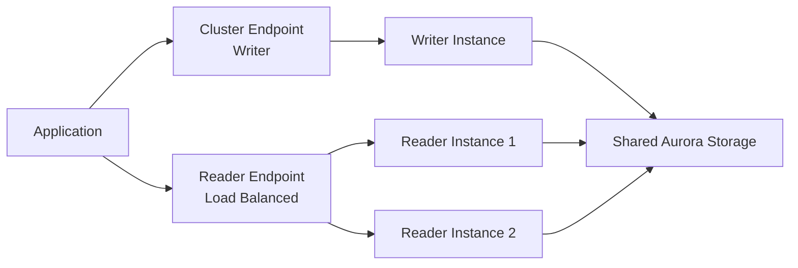

# How to Create Aurora Clusters with Terraform

Author: [nawazdhandala](https://github.com/nawazdhandala)

Tags: AWS, Terraform, Aurora, Database, RDS

Description: Learn how to create and manage Amazon Aurora database clusters using Terraform, including reader instances, serverless v2, encryption, and failover configuration.

---

Amazon Aurora is AWS's cloud-native relational database. It's compatible with MySQL and PostgreSQL but offers better performance, faster replication, and automatic storage scaling. Aurora uses a cluster architecture - you have a writer instance and one or more reader instances, all sharing the same distributed storage layer. This is fundamentally different from standard RDS.

Setting up Aurora with Terraform involves a few more resources than a regular RDS instance, but the benefits are worth it. Let's build it up step by step.

## Aurora Architecture

Before we write code, it helps to understand the pieces:

- **Cluster** - the logical database containing the shared storage and configuration
- **Cluster instances** - the compute instances (writer and readers) that access the shared storage
- **Cluster endpoint** - points to the current writer instance
- **Reader endpoint** - load balances across reader instances



## Subnet Group and Security Group

Like standard RDS, Aurora needs networking components first:

```hcl
# DB subnet group for Aurora
resource "aws_db_subnet_group" "aurora" {
  name       = "aurora-subnet-group"
  subnet_ids = var.private_subnet_ids

  tags = {
    Name      = "Aurora Subnet Group"
    ManagedBy = "terraform"
  }
}

# Security group for Aurora
resource "aws_security_group" "aurora" {
  name_prefix = "aurora-"
  vpc_id      = var.vpc_id
  description = "Security group for Aurora PostgreSQL cluster"

  ingress {
    from_port       = 5432
    to_port         = 5432
    protocol        = "tcp"
    security_groups = [var.app_security_group_id]
    description     = "PostgreSQL from application"
  }

  egress {
    from_port   = 0
    to_port     = 0
    protocol    = "-1"
    cidr_blocks = ["0.0.0.0/0"]
  }

  lifecycle {
    create_before_destroy = true
  }
}
```

## Basic Aurora Cluster

Here's the cluster configuration with a writer and one reader:

```hcl
# Aurora PostgreSQL cluster
resource "aws_rds_cluster" "main" {
  cluster_identifier = "myapp-aurora-cluster"

  # Engine configuration
  engine         = "aurora-postgresql"
  engine_version = "16.2"

  # Database configuration
  database_name          = "myapp"
  master_username        = "dbadmin"
  manage_master_user_password = true

  # Network
  db_subnet_group_name   = aws_db_subnet_group.aurora.name
  vpc_security_group_ids = [aws_security_group.aurora.id]

  # Storage encryption
  storage_encrypted = true
  kms_key_id        = var.kms_key_arn

  # Backup
  backup_retention_period   = 30
  preferred_backup_window   = "03:00-04:00"
  preferred_maintenance_window = "Mon:04:00-Mon:05:00"
  copy_tags_to_snapshot     = true
  final_snapshot_identifier = "myapp-aurora-final"

  # Protection
  deletion_protection = true

  # Enable CloudWatch logs export
  enabled_cloudwatch_logs_exports = ["postgresql"]

  tags = {
    Environment = "production"
    ManagedBy   = "terraform"
  }
}
```

Now add the instances. Aurora separates the cluster definition from the instance definitions:

```hcl
# Writer instance
resource "aws_rds_cluster_instance" "writer" {
  identifier         = "myapp-aurora-writer"
  cluster_identifier = aws_rds_cluster.main.id
  instance_class     = "db.r6g.large"
  engine             = aws_rds_cluster.main.engine
  engine_version     = aws_rds_cluster.main.engine_version

  # Monitoring
  monitoring_interval          = 60
  monitoring_role_arn          = aws_iam_role.rds_monitoring.arn
  performance_insights_enabled = true
  auto_minor_version_upgrade   = true

  tags = {
    Role = "writer"
  }
}

# Reader instance
resource "aws_rds_cluster_instance" "reader" {
  identifier         = "myapp-aurora-reader-1"
  cluster_identifier = aws_rds_cluster.main.id
  instance_class     = "db.r6g.large"
  engine             = aws_rds_cluster.main.engine
  engine_version     = aws_rds_cluster.main.engine_version

  monitoring_interval          = 60
  monitoring_role_arn          = aws_iam_role.rds_monitoring.arn
  performance_insights_enabled = true
  auto_minor_version_upgrade   = true

  tags = {
    Role = "reader"
  }
}
```

## Multiple Reader Instances with count

If you want multiple readers, use `count` or `for_each` instead of duplicating resources:

```hcl
# Multiple reader instances using count
resource "aws_rds_cluster_instance" "readers" {
  count = var.reader_count

  identifier         = "myapp-aurora-reader-${count.index + 1}"
  cluster_identifier = aws_rds_cluster.main.id
  instance_class     = "db.r6g.large"
  engine             = aws_rds_cluster.main.engine
  engine_version     = aws_rds_cluster.main.engine_version

  monitoring_interval          = 60
  monitoring_role_arn          = aws_iam_role.rds_monitoring.arn
  performance_insights_enabled = true

  tags = {
    Role = "reader"
  }
}
```

## Aurora Serverless v2

Aurora Serverless v2 automatically scales compute capacity based on demand. You define a minimum and maximum ACU (Aurora Capacity Unit) range, and Aurora handles the rest. This is perfect for workloads with variable traffic.

Configure serverless scaling on the cluster and use the `db.serverless` instance class:

```hcl
# Aurora Serverless v2 cluster
resource "aws_rds_cluster" "serverless" {
  cluster_identifier = "myapp-serverless"
  engine             = "aurora-postgresql"
  engine_version     = "16.2"
  database_name      = "myapp"
  master_username    = "dbadmin"

  manage_master_user_password = true

  db_subnet_group_name   = aws_db_subnet_group.aurora.name
  vpc_security_group_ids = [aws_security_group.aurora.id]
  storage_encrypted      = true

  # Serverless v2 scaling configuration
  serverlessv2_scaling_configuration {
    min_capacity = 0.5   # Minimum 0.5 ACU
    max_capacity = 16.0  # Maximum 16 ACU
  }

  backup_retention_period = 30
  deletion_protection     = true
}

# Serverless v2 instance
resource "aws_rds_cluster_instance" "serverless_writer" {
  identifier         = "myapp-serverless-writer"
  cluster_identifier = aws_rds_cluster.serverless.id
  instance_class     = "db.serverless"  # This is the key
  engine             = aws_rds_cluster.serverless.engine
  engine_version     = aws_rds_cluster.serverless.engine_version
}

# You can mix serverless and provisioned instances!
resource "aws_rds_cluster_instance" "serverless_reader" {
  identifier         = "myapp-serverless-reader"
  cluster_identifier = aws_rds_cluster.serverless.id
  instance_class     = "db.serverless"
  engine             = aws_rds_cluster.serverless.engine
  engine_version     = aws_rds_cluster.serverless.engine_version
}
```

The minimum of 0.5 ACU means Aurora can scale almost to zero when idle, which makes it cost-effective for development and staging environments.

## Parameter Groups

Aurora uses cluster parameter groups (applied to all instances) and instance parameter groups (per instance):

```hcl
# Cluster parameter group
resource "aws_rds_cluster_parameter_group" "aurora_pg16" {
  family = "aurora-postgresql16"
  name   = "myapp-aurora-pg16"

  parameter {
    name  = "log_min_duration_statement"
    value = "1000"
  }

  parameter {
    name  = "shared_preload_libraries"
    value = "pg_stat_statements"
  }

  lifecycle {
    create_before_destroy = true
  }
}
```

Reference it in your cluster with `db_cluster_parameter_group_name = aws_rds_cluster_parameter_group.aurora_pg16.name`.

## Global Database

For disaster recovery across regions, Aurora supports Global Databases. The primary cluster handles writes, and secondary clusters in other regions provide read access and fast failover.

This creates a global database spanning two regions:

```hcl
# Global database
resource "aws_rds_global_cluster" "main" {
  global_cluster_identifier = "myapp-global"
  engine                    = "aurora-postgresql"
  engine_version            = "16.2"
  database_name             = "myapp"
  storage_encrypted         = true
}

# Primary cluster
resource "aws_rds_cluster" "primary" {
  cluster_identifier        = "myapp-primary"
  global_cluster_identifier = aws_rds_global_cluster.main.id
  engine                    = aws_rds_global_cluster.main.engine
  engine_version            = aws_rds_global_cluster.main.engine_version
  master_username           = "dbadmin"
  manage_master_user_password = true
  db_subnet_group_name      = aws_db_subnet_group.aurora.name
  vpc_security_group_ids    = [aws_security_group.aurora.id]
  storage_encrypted         = true
}
```

For managing infrastructure across multiple regions, check out our guide on [managing multiple AWS regions in Terraform](https://oneuptime.com/blog/post/2026-02-12-manage-multiple-aws-regions-terraform/view).

## Outputs

Export the endpoints your applications need:

```hcl
output "cluster_endpoint" {
  description = "Writer endpoint"
  value       = aws_rds_cluster.main.endpoint
}

output "reader_endpoint" {
  description = "Reader endpoint (load balanced)"
  value       = aws_rds_cluster.main.reader_endpoint
}

output "cluster_port" {
  description = "Database port"
  value       = aws_rds_cluster.main.port
}
```

## Wrapping Up

Aurora with Terraform gives you a powerful, highly available database setup. The key decisions are: provisioned vs serverless, how many reader instances, and whether you need a global database for cross-region disaster recovery. Start with a simple cluster and add readers as your read traffic grows. And don't forget to enable encryption, deletion protection, and proper backup retention from day one.
