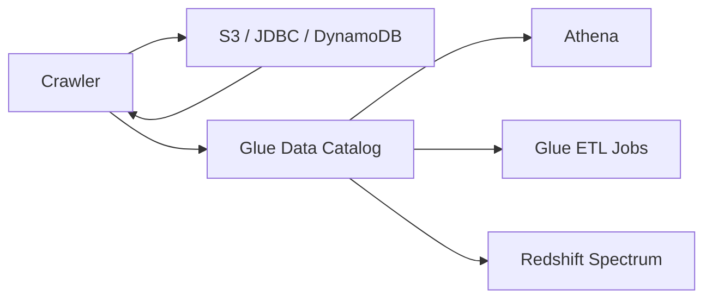

# How to Create AWS Glue Crawlers for Data Cataloging

Author: [nawazdhandala](https://github.com/nawazdhandala)

Tags: AWS, Glue, Data Catalog, ETL, Crawlers

Description: Learn how to create and configure AWS Glue Crawlers to automatically discover data schemas, build your data catalog, and keep table definitions up to date.

---

Before you can query data with Athena or transform it with Glue ETL, you need table definitions in the Glue Data Catalog. You could create these manually, writing out every column name and type by hand. Or you could let a crawler do it.

AWS Glue Crawlers scan your data sources - S3 buckets, JDBC databases, DynamoDB tables - and automatically figure out the schema. They detect column names, data types, partitions, and file formats, then create or update tables in the Data Catalog. It's like having a bot that reads your data and writes the CREATE TABLE statements for you.

## How Crawlers Work

When a crawler runs, it:

1. Connects to the data source you've configured
2. Scans a sample of the data to infer the schema
3. Creates or updates tables in the Glue Data Catalog
4. Detects and registers partitions (for partitioned data in S3)



## Creating a Crawler via Console

The quickest way to get started:

1. Open the Glue console and click "Crawlers" in the left menu
2. Click "Create crawler"
3. Give it a name
4. Add a data source (like an S3 path)
5. Choose or create an IAM role
6. Select a target database in the Data Catalog
7. Set a schedule (or leave it on-demand)
8. Create and run

## Creating a Crawler with the SDK

For infrastructure-as-code workflows, create crawlers programmatically:

```python
# Create a Glue Crawler to catalog S3 data
import boto3

glue = boto3.client('glue', region_name='us-east-1')

response = glue.create_crawler(
    Name='sales-data-crawler',
    Role='arn:aws:iam::YOUR_ACCOUNT_ID:role/GlueCrawlerRole',
    DatabaseName='analytics',
    Description='Crawls sales data in S3 to maintain table definitions',
    Targets={
        'S3Targets': [
            {
                'Path': 's3://my-data-bucket/sales/',
                'Exclusions': ['*.tmp', '_temporary/**']
            }
        ]
    },
    SchemaChangePolicy={
        'UpdateBehavior': 'UPDATE_IN_DATABASE',
        'DeleteBehavior': 'LOG'
    },
    RecrawlPolicy={
        'RecrawlBehavior': 'CRAWL_EVERYTHING'
    },
    Configuration='''{
        "Version": 1.0,
        "Grouping": {
            "TableGroupingPolicy": "CombineCompatibleSchemas"
        }
    }'''
)

print("Crawler created successfully")
```

Let's break down the key parameters.

### Targets

Crawlers can scan multiple sources:

```python
# Crawler with multiple S3 paths and a JDBC source
targets = {
    'S3Targets': [
        {'Path': 's3://bucket/events/'},
        {'Path': 's3://bucket/users/'},
        {'Path': 's3://bucket/products/'}
    ],
    'JdbcTargets': [
        {
            'ConnectionName': 'my-rds-connection',
            'Path': 'mydb/public/%',  # All tables in public schema
            'Exclusions': ['mydb/public/temp_%']
        }
    ]
}
```

Each S3 path typically becomes a separate table in the catalog. JDBC targets can discover multiple tables from a database.

### Schema Change Policy

This controls what happens when the crawler detects schema changes:

```python
# Schema change policy options
schema_policy = {
    'UpdateBehavior': 'UPDATE_IN_DATABASE',  # or 'LOG'
    'DeleteBehavior': 'LOG'  # or 'DELETE_FROM_DATABASE' or 'DEPRECATE_IN_DATABASE'
}
```

- `UPDATE_IN_DATABASE` - Automatically update the table when schemas change (add new columns, etc.)
- `LOG` - Log the change but don't modify the table
- `DELETE_FROM_DATABASE` - Remove tables when their data is gone
- `DEPRECATE_IN_DATABASE` - Mark tables as deprecated instead of deleting

For most cases, update on changes and log on deletes is the safest approach. You want new columns added automatically, but you don't want tables disappearing because someone moved a file.

### Recrawl Policy

```python
# Control what the crawler re-examines on each run
recrawl_policy = {
    'RecrawlBehavior': 'CRAWL_NEW_FOLDERS_ONLY'
    # Options: 'CRAWL_EVERYTHING', 'CRAWL_NEW_FOLDERS_ONLY', 'CRAWL_EVENT_MODE'
}
```

- `CRAWL_EVERYTHING` - Re-scans all data on every run. Thorough but slow and expensive.
- `CRAWL_NEW_FOLDERS_ONLY` - Only scans new S3 prefixes. Fast and cheap for append-only data.
- `CRAWL_EVENT_MODE` - Triggered by S3 events. Most efficient for real-time updates.

## IAM Role for Crawlers

The crawler needs permissions to access your data sources and write to the Data Catalog:

```json
{
    "Version": "2012-10-17",
    "Statement": [
        {
            "Effect": "Allow",
            "Action": [
                "s3:GetObject",
                "s3:ListBucket"
            ],
            "Resource": [
                "arn:aws:s3:::my-data-bucket",
                "arn:aws:s3:::my-data-bucket/*"
            ]
        },
        {
            "Effect": "Allow",
            "Action": [
                "glue:*"
            ],
            "Resource": "*"
        },
        {
            "Effect": "Allow",
            "Action": [
                "logs:CreateLogGroup",
                "logs:CreateLogStream",
                "logs:PutLogEvents"
            ],
            "Resource": "arn:aws:logs:*:*:*"
        }
    ]
}
```

Also attach the trust policy for Glue:

```json
{
    "Version": "2012-10-17",
    "Statement": [
        {
            "Effect": "Allow",
            "Principal": {
                "Service": "glue.amazonaws.com"
            },
            "Action": "sts:AssumeRole"
        }
    ]
}
```

## Running the Crawler

Start the crawler manually:

```python
# Run the crawler
glue.start_crawler(Name='sales-data-crawler')

# Check status
import time

while True:
    status = glue.get_crawler(Name='sales-data-crawler')
    state = status['Crawler']['State']
    print(f"State: {state}")

    if state == 'READY':
        # Check the last crawl results
        last_crawl = status['Crawler'].get('LastCrawl', {})
        print(f"Status: {last_crawl.get('Status')}")
        print(f"Tables created: {last_crawl.get('TablesCreated', 0)}")
        print(f"Tables updated: {last_crawl.get('TablesUpdated', 0)}")
        print(f"Tables deleted: {last_crawl.get('TablesDeleted', 0)}")
        break

    time.sleep(30)
```

## Scheduling Crawlers

Set a schedule to keep the catalog up to date:

```python
# Schedule the crawler to run daily at 6 AM UTC
glue.update_crawler(
    Name='sales-data-crawler',
    Schedule='cron(0 6 * * ? *)'
)
```

Common schedules:
- `cron(0 6 * * ? *)` - Daily at 6 AM
- `cron(0 */4 * * ? *)` - Every 4 hours
- `cron(0 0 ? * MON *)` - Weekly on Monday

For real-time catalog updates, use event-based crawling with S3 event notifications instead of a schedule.

## Classifiers

Crawlers use classifiers to determine the format and schema of your data. Glue includes built-in classifiers for common formats (CSV, JSON, Parquet, ORC, Avro), but you can create custom ones.

### Custom CSV Classifier

If your CSVs have non-standard delimiters or quoting:

```python
# Create a custom classifier for pipe-delimited files
glue.create_classifier(
    CsvClassifier={
        'Name': 'pipe-delimited',
        'Delimiter': '|',
        'QuoteSymbol': '"',
        'ContainsHeader': 'PRESENT',
        'Header': ['id', 'name', 'email', 'signup_date', 'status']
    }
)

# Attach it to your crawler
glue.update_crawler(
    Name='sales-data-crawler',
    Classifiers=['pipe-delimited']
)
```

### Custom Grok Classifier

For semi-structured log files:

```python
# Create a Grok classifier for Apache access logs
glue.create_classifier(
    GrokClassifier={
        'Name': 'apache-access-log',
        'Classification': 'apache-access-log',
        'GrokPattern': '%{COMMONAPACHELOG}'
    }
)
```

## Table Grouping

When a crawler scans an S3 path, it needs to decide how many tables to create. The `CombineCompatibleSchemas` setting tells the crawler to combine files with similar schemas into a single table, even if they're in different S3 prefixes:

```python
# Configuration for schema grouping
configuration = {
    "Version": 1.0,
    "Grouping": {
        "TableGroupingPolicy": "CombineCompatibleSchemas"
    },
    "CrawlerOutput": {
        "Partitions": {
            "AddOrUpdateBehavior": "InheritFromTable"
        }
    }
}
```

Without this, you might end up with dozens of tables when you expected one.

## Monitoring Crawlers

Check crawler metrics in CloudWatch:

```python
# List recent crawler runs and their results
runs = glue.get_crawler_metrics(CrawlerNameList=['sales-data-crawler'])

for metric in runs['CrawlerMetricsList']:
    print(f"Crawler: {metric['CrawlerName']}")
    print(f"  Still estimating: {metric['StillEstimating']}")
    print(f"  Last runtime (sec): {metric['LastRuntimeSeconds']}")
    print(f"  Tables created: {metric['TablesCreated']}")
    print(f"  Tables updated: {metric['TablesUpdated']}")
    print(f"  Tables deleted: {metric['TablesDeleted']}")
```

Set up CloudWatch alarms for crawler failures so you know when your catalog stops updating.

## Best Practices

**Use exclusion patterns** to skip temporary files, staging directories, and other non-data paths. This speeds up crawling and prevents junk tables.

**Set appropriate recrawl policies.** If your data is append-only (new files are added but old ones don't change), use `CRAWL_NEW_FOLDERS_ONLY`. It's dramatically faster.

**Don't over-crawl.** Running a crawler every 5 minutes on a dataset that changes daily wastes money and Glue resources.

**Use table prefixes** to organize crawler output. Set a `TablePrefix` in the crawler configuration to namespace tables by source.

**Test with a small dataset first.** Run the crawler against a small subset to verify the schema detection before pointing it at terabytes of data.

For the full picture on the Glue Data Catalog, check out our guide on [setting up the AWS Glue Data Catalog](https://oneuptime.com/blog/post/set-up-aws-glue-data-catalog/view). And once your catalog is populated, you can start [querying with Athena](https://oneuptime.com/blog/post/set-up-amazon-athena-for-querying-s3-data/view) immediately.

## Wrapping Up

Glue Crawlers automate the tedious work of creating and maintaining table definitions. Set them up once, schedule them to run periodically, and your Data Catalog stays in sync with your actual data. That means Athena queries, Glue ETL jobs, and Redshift Spectrum all have accurate, up-to-date schemas to work with.
