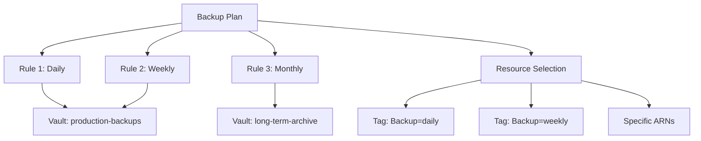

# How to Create Backup Plans with AWS Backup

Author: [nawazdhandala](https://github.com/nawazdhandala)

Tags: AWS, Backup, Backup Plans, Data Protection, Compliance

Description: Design and implement effective AWS Backup plans with multiple rules, lifecycle policies, and resource selections to protect your AWS infrastructure systematically.

---

A backup plan is the core building block of AWS Backup. It defines the schedule, retention, and lifecycle for your backups. Getting it right means your data is protected without overspending on storage. Getting it wrong means gaps in coverage or surprise costs on your monthly bill.

In this guide, we'll build backup plans for common scenarios - from simple daily backups to complex multi-tier strategies with different retention periods and cross-region copies.

## Anatomy of a Backup Plan

A backup plan consists of:
- **Rules**: When to back up, how long to keep it, where to store it
- **Resource assignments**: What to back up (by tags, ARNs, or resource types)
- **Advanced settings**: Service-specific options like Windows VSS for EC2



## Plan 1: Simple Daily Backup

Let's start with the basics. A daily backup with 30-day retention:

```bash
# Create a simple daily backup plan
aws backup create-backup-plan \
  --backup-plan '{
    "BackupPlanName": "simple-daily",
    "Rules": [
      {
        "RuleName": "DailyAt3AM",
        "TargetBackupVaultName": "default",
        "ScheduleExpression": "cron(0 3 * * ? *)",
        "StartWindowMinutes": 60,
        "CompletionWindowMinutes": 120,
        "Lifecycle": {
          "DeleteAfterDays": 30
        }
      }
    ]
  }'
```

The cron expression `cron(0 3 * * ? *)` means "every day at 3:00 AM UTC." The start window of 60 minutes means AWS Backup will initiate the backup sometime between 3:00 and 4:00 AM.

Now assign resources:

```bash
# Assign all tagged resources
aws backup create-backup-selection \
  --backup-plan-id "plan-abc123" \
  --backup-selection '{
    "SelectionName": "DailyBackupResources",
    "IamRoleArn": "arn:aws:iam::123456789012:role/AWSBackupServiceRole",
    "ListOfTags": [{
      "ConditionType": "STRINGEQUALS",
      "ConditionKey": "Backup",
      "ConditionValue": "daily"
    }]
  }'
```

## Plan 2: Tiered Retention (Daily/Weekly/Monthly)

Most organizations need different retention periods. Here's a comprehensive plan:

```bash
# Create a tiered backup plan
aws backup create-backup-plan \
  --backup-plan '{
    "BackupPlanName": "tiered-retention",
    "Rules": [
      {
        "RuleName": "Daily-30day",
        "TargetBackupVaultName": "production-backups",
        "ScheduleExpression": "cron(0 3 * * ? *)",
        "StartWindowMinutes": 60,
        "CompletionWindowMinutes": 180,
        "Lifecycle": {
          "DeleteAfterDays": 30
        }
      },
      {
        "RuleName": "Weekly-90day",
        "TargetBackupVaultName": "production-backups",
        "ScheduleExpression": "cron(0 5 ? * SUN *)",
        "StartWindowMinutes": 120,
        "CompletionWindowMinutes": 360,
        "Lifecycle": {
          "MoveToColdStorageAfterDays": 30,
          "DeleteAfterDays": 90
        }
      },
      {
        "RuleName": "Monthly-1year",
        "TargetBackupVaultName": "production-backups",
        "ScheduleExpression": "cron(0 7 1 * ? *)",
        "StartWindowMinutes": 120,
        "CompletionWindowMinutes": 720,
        "Lifecycle": {
          "MoveToColdStorageAfterDays": 14,
          "DeleteAfterDays": 365
        }
      }
    ]
  }'
```

This gives you:
- **Daily backups** kept for 30 days (warm storage)
- **Weekly backups** on Sundays, moved to cold storage after 30 days, deleted after 90 days
- **Monthly backups** on the 1st, moved to cold storage after 14 days, deleted after 1 year

Cold storage is significantly cheaper but has a minimum 90-day storage duration. Don't move backups to cold storage if you'll delete them within 90 days - you'd pay the full 90-day minimum anyway.

## Plan 3: Cross-Region Backup

For disaster recovery, copy backups to another region:

```bash
# First, create a vault in the DR region
aws backup create-backup-vault \
  --backup-vault-name "dr-backups" \
  --encryption-key-arn "arn:aws:kms:us-west-2:123456789012:key/dr-key-id" \
  --region us-west-2

# Create a plan with cross-region copy
aws backup create-backup-plan \
  --backup-plan '{
    "BackupPlanName": "cross-region-dr",
    "Rules": [
      {
        "RuleName": "DailyWithDRCopy",
        "TargetBackupVaultName": "production-backups",
        "ScheduleExpression": "cron(0 3 * * ? *)",
        "StartWindowMinutes": 60,
        "CompletionWindowMinutes": 180,
        "Lifecycle": {
          "DeleteAfterDays": 30
        },
        "CopyActions": [
          {
            "DestinationBackupVaultArn": "arn:aws:backup:us-west-2:123456789012:backup-vault:dr-backups",
            "Lifecycle": {
              "DeleteAfterDays": 30
            }
          }
        ]
      }
    ]
  }'
```

For more details on cross-region backup setup, check out our dedicated guide on [cross-region backup with AWS Backup](https://oneuptime.com/blog/post/set-up-cross-region-backup-aws-backup/view).

## Plan 4: Compliance-Focused Plan (7-Year Retention)

For regulated industries that need long-term retention:

```bash
# Create a compliance backup plan
aws backup create-backup-plan \
  --backup-plan '{
    "BackupPlanName": "compliance-7year",
    "Rules": [
      {
        "RuleName": "Daily-Operational",
        "TargetBackupVaultName": "compliance-vault",
        "ScheduleExpression": "cron(0 2 * * ? *)",
        "StartWindowMinutes": 60,
        "CompletionWindowMinutes": 240,
        "Lifecycle": {
          "DeleteAfterDays": 90
        }
      },
      {
        "RuleName": "Monthly-LongTerm",
        "TargetBackupVaultName": "compliance-vault",
        "ScheduleExpression": "cron(0 4 1 * ? *)",
        "StartWindowMinutes": 120,
        "CompletionWindowMinutes": 480,
        "Lifecycle": {
          "MoveToColdStorageAfterDays": 1,
          "DeleteAfterDays": 2555
        },
        "CopyActions": [
          {
            "DestinationBackupVaultArn": "arn:aws:backup:eu-west-1:123456789012:backup-vault:compliance-vault-eu",
            "Lifecycle": {
              "MoveToColdStorageAfterDays": 1,
              "DeleteAfterDays": 2555
            }
          }
        ]
      }
    ]
  }'
```

2555 days is roughly 7 years. Monthly backups move to cold storage immediately (after 1 day) since they won't need frequent access but must be retained for compliance.

## Plan 5: Continuous Backup for Databases

For critical databases that need point-in-time recovery:

```bash
# Create a plan with continuous backup
aws backup create-backup-plan \
  --backup-plan '{
    "BackupPlanName": "database-pitr",
    "Rules": [
      {
        "RuleName": "ContinuousBackup",
        "TargetBackupVaultName": "production-backups",
        "ScheduleExpression": "cron(0 0 * * ? *)",
        "Lifecycle": {
          "DeleteAfterDays": 35
        },
        "EnableContinuousBackup": true
      },
      {
        "RuleName": "WeeklySnapshot",
        "TargetBackupVaultName": "production-backups",
        "ScheduleExpression": "cron(0 6 ? * SUN *)",
        "StartWindowMinutes": 120,
        "CompletionWindowMinutes": 360,
        "Lifecycle": {
          "MoveToColdStorageAfterDays": 30,
          "DeleteAfterDays": 365
        }
      }
    ]
  }'
```

This combines continuous backup (for PITR within 35 days) with weekly snapshots (for long-term retention up to a year). It's the best of both worlds for databases.

## Resource Selection Strategies

Choosing the right selection strategy is just as important as the plan itself.

Tag-based selection (recommended for most cases):

```bash
# Select resources by multiple tags
aws backup create-backup-selection \
  --backup-plan-id "plan-abc123" \
  --backup-selection '{
    "SelectionName": "ProductionResources",
    "IamRoleArn": "arn:aws:iam::123456789012:role/AWSBackupServiceRole",
    "ListOfTags": [
      {
        "ConditionType": "STRINGEQUALS",
        "ConditionKey": "Environment",
        "ConditionValue": "production"
      }
    ],
    "NotResources": [
      "arn:aws:ec2:*:*:volume/vol-temp*"
    ],
    "Conditions": {
      "StringNotEquals": [
        {"ConditionKey": "aws:ResourceTag/Backup", "ConditionValue": "false"}
      ]
    }
  }'
```

This selects all resources tagged `Environment=production` except those explicitly tagged `Backup=false`. The `NotResources` field lets you exclude specific ARN patterns.

## Validating Your Backup Plan

After creating a plan, verify it's working:

```bash
# List all backup plans
aws backup list-backup-plans

# Get plan details
aws backup get-backup-plan \
  --backup-plan-id "plan-abc123"

# List selections for the plan
aws backup list-backup-selections \
  --backup-plan-id "plan-abc123"

# Check the next scheduled backup time
aws backup list-backup-jobs \
  --by-backup-plan-id "plan-abc123" \
  --max-results 5
```

## Cost Optimization Tips

1. **Use cold storage aggressively** for anything older than 30 days that you rarely need to restore.
2. **Don't over-retain**: Match retention periods to actual business requirements, not "just in case."
3. **Use incremental backups**: Most services (EBS, RDS, EFS) support incremental backups by default - you only pay for changed data.
4. **Tag wisely**: Make sure only the resources that need backup are tagged. Dev environments probably don't need 7-year retention.

A well-designed backup plan balances protection, compliance, and cost. Start with your recovery requirements (RPO and RTO), work backward to define the schedule and retention, and then let AWS Backup handle the execution reliably.
