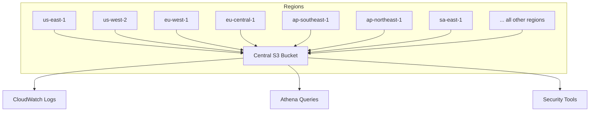
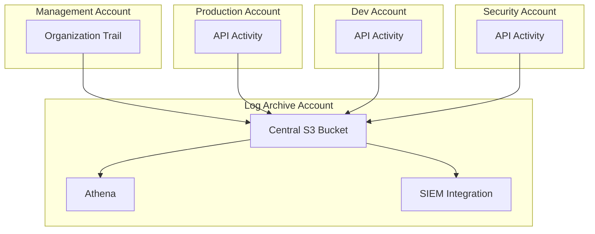

# How to Create CloudTrail Trails for Multi-Region Logging

Author: [nawazdhandala](https://github.com/nawazdhandala)

Tags: AWS, CloudTrail, Security, Auditing, Multi-Region

Description: Learn how to configure AWS CloudTrail for multi-region logging to capture API activity across all regions, with centralized storage and organization-wide trails.

---

A single-region CloudTrail trail is a half-measure. Attackers know this - they'll spin up resources in a region you're not monitoring, use them for their purposes, and clean up before you notice. Multi-region trails record API activity across every AWS region, including regions you've never used. It's the only way to get complete visibility.

This guide covers setting up multi-region trails, organization-wide trails, and the architecture patterns for centralized log collection.

## Why Multi-Region Matters

Even if your workloads only run in `us-east-1` and `eu-west-1`, API calls can happen in any region. An attacker with stolen credentials can:

- Launch EC2 instances in `ap-southeast-1` for crypto mining
- Create IAM users (these are logged in `us-east-1` regardless, but other global services aren't)
- Exfiltrate data through S3 buckets in remote regions
- Set up persistence through Lambda functions in regions you never check

Without multi-region logging, you'd miss all of this.

## Creating a Multi-Region Trail

The setup is almost identical to a single-region trail - you just add the `--is-multi-region-trail` flag:

```bash
# Create a multi-region trail
aws cloudtrail create-trail \
  --name org-multi-region-trail \
  --s3-bucket-name cloudtrail-central-logs-123456789012 \
  --is-multi-region-trail \
  --enable-log-file-validation \
  --include-global-service-events \
  --kms-key-id arn:aws:kms:us-east-1:123456789012:key/xxxxxxxx-xxxx-xxxx-xxxx-xxxxxxxxxxxx

# Start logging
aws cloudtrail start-logging --name org-multi-region-trail
```

The `--kms-key-id` parameter encrypts logs with a customer-managed KMS key. This is optional but strongly recommended for sensitive environments.

### What a Multi-Region Trail Captures

Once enabled, the trail records management events from every region:



Log files are organized by region in S3:

```
s3://cloudtrail-central-logs-123456789012/
  AWSLogs/
    123456789012/
      CloudTrail/
        us-east-1/
          2026/02/12/
            123456789012_CloudTrail_us-east-1_20260212T0000Z_xxxxx.json.gz
        eu-west-1/
          2026/02/12/
            ...
        ap-southeast-1/
          2026/02/12/
            ...
```

## Organization-Wide Trail

If you're using AWS Organizations, you can create a single trail that covers every account in the organization. This is the gold standard for enterprise logging.

```bash
# Create an organization trail (must be run from the management account)
aws cloudtrail create-trail \
  --name org-wide-trail \
  --s3-bucket-name cloudtrail-org-logs-management \
  --is-multi-region-trail \
  --is-organization-trail \
  --enable-log-file-validation \
  --include-global-service-events

aws cloudtrail start-logging --name org-wide-trail
```

The `--is-organization-trail` flag makes this trail capture events from every account in the organization. Member accounts can see the trail but can't modify or delete it.

### Bucket Policy for Organization Trail

The S3 bucket needs a policy that allows CloudTrail to write logs for all accounts:

```json
{
  "Version": "2012-10-17",
  "Statement": [
    {
      "Sid": "AWSCloudTrailAclCheck",
      "Effect": "Allow",
      "Principal": {
        "Service": "cloudtrail.amazonaws.com"
      },
      "Action": "s3:GetBucketAcl",
      "Resource": "arn:aws:s3:::cloudtrail-org-logs-management",
      "Condition": {
        "StringEquals": {
          "aws:SourceArn": "arn:aws:cloudtrail:us-east-1:111111111111:trail/org-wide-trail"
        }
      }
    },
    {
      "Sid": "AWSCloudTrailWriteManagement",
      "Effect": "Allow",
      "Principal": {
        "Service": "cloudtrail.amazonaws.com"
      },
      "Action": "s3:PutObject",
      "Resource": "arn:aws:s3:::cloudtrail-org-logs-management/AWSLogs/111111111111/*",
      "Condition": {
        "StringEquals": {
          "s3:x-amz-acl": "bucket-owner-full-control",
          "aws:SourceArn": "arn:aws:cloudtrail:us-east-1:111111111111:trail/org-wide-trail"
        }
      }
    },
    {
      "Sid": "AWSCloudTrailWriteOrg",
      "Effect": "Allow",
      "Principal": {
        "Service": "cloudtrail.amazonaws.com"
      },
      "Action": "s3:PutObject",
      "Resource": "arn:aws:s3:::cloudtrail-org-logs-management/AWSLogs/o-abc123def4/*",
      "Condition": {
        "StringEquals": {
          "s3:x-amz-acl": "bucket-owner-full-control",
          "aws:SourceArn": "arn:aws:cloudtrail:us-east-1:111111111111:trail/org-wide-trail"
        }
      }
    }
  ]
}
```

Note the organization ID (`o-abc123def4`) in the resource path. CloudTrail uses this structure for organization-wide logs:

```
s3://cloudtrail-org-logs-management/
  AWSLogs/
    o-abc123def4/
      111111111111/     (management account)
        CloudTrail/
          us-east-1/...
      222222222222/     (member account)
        CloudTrail/
          us-east-1/...
      333333333333/     (another member account)
        CloudTrail/
          us-east-1/...
```

## Centralized Logging Architecture

For larger organizations, use a dedicated logging account:



The log archive account is a separate account that only the security team can access. It stores CloudTrail logs, VPC Flow Logs, and other audit data.

## Enabling Data Events Multi-Region

For data events (S3, Lambda, DynamoDB), you can either enable them for all resources or specific ones:

```bash
# Enable S3 data events for all buckets across all regions
aws cloudtrail put-event-selectors \
  --trail-name org-multi-region-trail \
  --advanced-event-selectors '[
    {
      "Name": "Management events",
      "FieldSelectors": [
        {"Field": "eventCategory", "Equals": ["Management"]}
      ]
    },
    {
      "Name": "S3 data events for critical buckets",
      "FieldSelectors": [
        {"Field": "eventCategory", "Equals": ["Data"]},
        {"Field": "resources.type", "Equals": ["AWS::S3::Object"]},
        {"Field": "resources.ARN", "StartsWith": [
          "arn:aws:s3:::production-data/",
          "arn:aws:s3:::customer-pii/"
        ]}
      ]
    },
    {
      "Name": "Lambda invocation events",
      "FieldSelectors": [
        {"Field": "eventCategory", "Equals": ["Data"]},
        {"Field": "resources.type", "Equals": ["AWS::Lambda::Function"]}
      ]
    }
  ]'
```

Advanced event selectors give you more granular control than the older basic event selectors. You can filter by event category, resource type, and specific resource ARNs.

## CloudTrail Insights

CloudTrail Insights detects unusual API activity patterns - like a sudden spike in `RunInstances` calls or an unusual number of `DeleteObject` requests:

```bash
# Enable CloudTrail Insights on your trail
aws cloudtrail put-insight-selectors \
  --trail-name org-multi-region-trail \
  --insight-selectors '[
    {"InsightType": "ApiCallRateInsight"},
    {"InsightType": "ApiErrorRateInsight"}
  ]'
```

`ApiCallRateInsight` detects unusual volumes of API calls. `ApiErrorRateInsight` detects unusual rates of error responses (which could indicate credential stuffing or authorization probing).

## Monitoring Multi-Region Activity

### Detect Activity in Unused Regions

Set up an alarm that fires when API calls happen in regions you don't use:

```python
import boto3

# Lambda function to detect API activity in unused regions
APPROVED_REGIONS = {"us-east-1", "us-west-2", "eu-west-1"}

def lambda_handler(event, context):
    """
    Triggered by CloudWatch Events rule that matches CloudTrail events.
    Alerts when activity is detected in non-approved regions.
    """
    region = event.get("detail", {}).get("awsRegion", "unknown")
    event_name = event.get("detail", {}).get("eventName", "unknown")
    user_arn = event.get("detail", {}).get("userIdentity", {}).get("arn", "unknown")

    if region not in APPROVED_REGIONS:
        sns = boto3.client("sns", region_name="us-east-1")
        sns.publish(
            TopicArn="arn:aws:sns:us-east-1:123456789012:security-alerts",
            Subject=f"API Activity in Unauthorized Region: {region}",
            Message=(
                f"API call detected in {region} (not in approved list)\n"
                f"Event: {event_name}\n"
                f"User: {user_arn}\n"
                f"Time: {event.get('detail', {}).get('eventTime', 'unknown')}\n\n"
                f"Investigate immediately if this is unexpected."
            )
        )
        print(f"Alert sent: {event_name} in {region} by {user_arn}")
```

The EventBridge rule to trigger this:

```bash
# Create EventBridge rule to catch API calls in unauthorized regions
aws events put-rule \
  --name detect-unauthorized-region-activity \
  --event-pattern '{
    "source": ["aws.ec2", "aws.s3", "aws.lambda", "aws.rds"],
    "detail": {
      "awsRegion": [
        {"anything-but": ["us-east-1", "us-west-2", "eu-west-1"]}
      ]
    }
  }'
```

## Terraform Configuration

```hcl
# Multi-region organization trail
resource "aws_cloudtrail" "org_trail" {
  name                       = "org-multi-region-trail"
  s3_bucket_name             = aws_s3_bucket.cloudtrail_logs.id
  is_multi_region_trail      = true
  is_organization_trail      = true
  enable_log_file_validation = true
  include_global_service_events = true
  kms_key_id                 = aws_kms_key.cloudtrail.arn

  cloud_watch_logs_group_arn = "${aws_cloudwatch_log_group.cloudtrail.arn}:*"
  cloud_watch_logs_role_arn  = aws_iam_role.cloudtrail_cloudwatch.arn

  # Enable insights
  insight_selector {
    insight_type = "ApiCallRateInsight"
  }

  insight_selector {
    insight_type = "ApiErrorRateInsight"
  }

  # Data events for S3 and Lambda
  advanced_event_selector {
    name = "Log all management events"
    field_selector {
      field  = "eventCategory"
      equals = ["Management"]
    }
  }

  advanced_event_selector {
    name = "Log S3 data events for sensitive buckets"
    field_selector {
      field  = "eventCategory"
      equals = ["Data"]
    }
    field_selector {
      field  = "resources.type"
      equals = ["AWS::S3::Object"]
    }
    field_selector {
      field      = "resources.ARN"
      starts_with = [
        "arn:aws:s3:::production-data/",
        "arn:aws:s3:::customer-uploads/"
      ]
    }
  }

  tags = {
    Environment = "security"
    ManagedBy   = "terraform"
  }
}

# S3 bucket with lifecycle rules
resource "aws_s3_bucket" "cloudtrail_logs" {
  bucket = "cloudtrail-org-logs-${data.aws_caller_identity.current.account_id}"
}

resource "aws_s3_bucket_lifecycle_configuration" "cloudtrail_logs" {
  bucket = aws_s3_bucket.cloudtrail_logs.id

  rule {
    id     = "archive-old-logs"
    status = "Enabled"

    transition {
      days          = 90
      storage_class = "GLACIER"
    }

    expiration {
      days = 2555  # 7 years for compliance
    }
  }
}
```

## Verifying Multi-Region Coverage

After setting up the trail, verify it's capturing events from all regions:

```bash
# Check trail configuration
aws cloudtrail describe-trails \
  --trail-name-list org-multi-region-trail \
  --query 'trailList[0].{Name:Name,MultiRegion:IsMultiRegionTrail,OrgTrail:IsOrganizationTrail,Logging:HasCustomEventSelectors}'

# Verify events are coming from multiple regions
aws cloudtrail lookup-events \
  --max-items 50 \
  --query 'Events[*].{Region:CloudTrailEvent}' | \
  python3 -c "
import sys, json
events = json.load(sys.stdin)
regions = set()
for e in events:
    detail = json.loads(e['Region'])
    regions.add(detail.get('awsRegion', 'unknown'))
print('Regions with recent activity:')
for r in sorted(regions):
    print(f'  - {r}')
"
```

## Cost Optimization

Multi-region trails can generate significant log volume. Here are some cost management strategies:

1. **Use advanced event selectors** to filter data events to only critical resources
2. **Enable S3 Intelligent-Tiering or Glacier** for older logs
3. **Avoid duplicating trails** - one organization trail is better than 50 account-level trails
4. **Exclude read-only data events** if you only need to audit writes
5. **Set retention periods** based on your compliance requirements

```bash
# Use advanced event selectors to log only write data events
aws cloudtrail put-event-selectors \
  --trail-name org-multi-region-trail \
  --advanced-event-selectors '[
    {
      "Name": "WriteOnlyDataEvents",
      "FieldSelectors": [
        {"Field": "eventCategory", "Equals": ["Data"]},
        {"Field": "readOnly", "Equals": ["false"]},
        {"Field": "resources.type", "Equals": ["AWS::S3::Object"]}
      ]
    }
  ]'
```

Multi-region CloudTrail logging is a foundational security control. Combined with alerting, Athena queries, and proper log retention, it gives you the visibility needed to detect and investigate incidents across your entire AWS footprint. For the basics of CloudTrail setup, see our guide on [enabling CloudTrail for API auditing](https://oneuptime.com/blog/post/enable-aws-cloudtrail-api-auditing/view). And for the IAM side of security auditing, check out [auditing IAM with credential reports](https://oneuptime.com/blog/post/audit-iam-users-roles-credential-reports/view).
