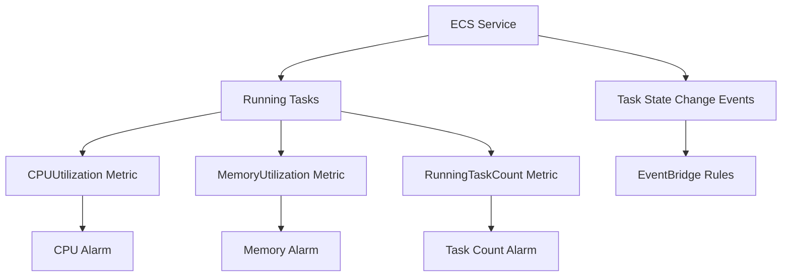

# How to Create CloudWatch Alarms for ECS Service Health

Author: [nawazdhandala](https://github.com/nawazdhandala)

Tags: AWS, CloudWatch, ECS, Alarms, Containers, Monitoring

Description: Set up CloudWatch alarms to monitor ECS service health including task failures, CPU and memory utilization, and deployment stability.

---

ECS services can degrade in many ways. Tasks crash and restart endlessly. CPU spikes cause slow responses. Memory pressure triggers OOM kills. Deployments get stuck in a rolling update. Without proper alarms, these problems fester until your users start complaining. CloudWatch alarms for ECS service health catch these issues early and give your team time to respond.

This guide covers the key metrics to alarm on, how to configure each alarm, and how to combine them into a comprehensive ECS monitoring strategy.

## Key ECS Metrics

ECS publishes metrics at both the cluster and service level. For service health, focus on these:

- **CPUUtilization**: Percentage of CPU units used by the service
- **MemoryUtilization**: Percentage of memory used by the service
- **RunningTaskCount**: Number of tasks currently running
- **DesiredTaskCount**: Number of tasks the service wants to have running (from the service definition or auto-scaling)

ECS also generates events for task state changes that you can capture through EventBridge.



## Prerequisites

- An ECS cluster with at least one service running
- Container Insights enabled on the cluster (for detailed metrics)
- An SNS topic for notifications
- AWS CLI configured

## Step 1: Enable Container Insights

Container Insights provides more granular metrics than the default ECS metrics. Enable it on your cluster if you have not already.

```bash
# Enable Container Insights on an existing cluster
aws ecs update-cluster-settings \
  --cluster my-cluster \
  --settings name=containerInsights,value=enabled
```

With Container Insights enabled, ECS publishes detailed metrics to the `ECS/ContainerInsights` namespace, including per-task and per-container metrics.

## Step 2: Create a CPU Utilization Alarm

High CPU utilization means your tasks are working hard and may start dropping requests or timing out.

```bash
# Alarm when service CPU exceeds 80% for 10 minutes
aws cloudwatch put-metric-alarm \
  --alarm-name "my-service-cpu-high" \
  --alarm-description "ECS service CPU utilization above 80%" \
  --metric-name "CPUUtilization" \
  --namespace "AWS/ECS" \
  --dimensions Name=ClusterName,Value=my-cluster Name=ServiceName,Value=my-service \
  --statistic "Average" \
  --period 300 \
  --evaluation-periods 2 \
  --threshold 80 \
  --comparison-operator "GreaterThanThreshold" \
  --alarm-actions "arn:aws:sns:us-east-1:123456789012:ecs-alerts" \
  --ok-actions "arn:aws:sns:us-east-1:123456789012:ecs-alerts" \
  --treat-missing-data "breaching"
```

Set `treat-missing-data` to `breaching` because if ECS stops reporting metrics, something is seriously wrong.

## Step 3: Create a Memory Utilization Alarm

Memory pressure leads to OOM kills, which cause tasks to restart. Catch it before it happens.

```bash
# Alarm when service memory exceeds 85%
aws cloudwatch put-metric-alarm \
  --alarm-name "my-service-memory-high" \
  --alarm-description "ECS service memory utilization above 85%" \
  --metric-name "MemoryUtilization" \
  --namespace "AWS/ECS" \
  --dimensions Name=ClusterName,Value=my-cluster Name=ServiceName,Value=my-service \
  --statistic "Average" \
  --period 300 \
  --evaluation-periods 2 \
  --threshold 85 \
  --comparison-operator "GreaterThanThreshold" \
  --alarm-actions "arn:aws:sns:us-east-1:123456789012:ecs-alerts" \
  --treat-missing-data "breaching"
```

Memory alarms should have a lower evaluation period than CPU alarms because memory issues escalate faster. Once you start swapping or hitting limits, tasks die quickly.

## Step 4: Create a Running Task Count Alarm

If the running task count drops below the desired count, tasks are crashing. This alarm catches crash loops where tasks start, fail, and restart repeatedly.

```bash
# Alarm when running tasks fall below desired count
aws cloudwatch put-metric-alarm \
  --alarm-name "my-service-tasks-low" \
  --alarm-description "Running task count below desired count" \
  --metrics '[
    {
      "Id": "running",
      "MetricStat": {
        "Metric": {
          "Namespace": "ECS/ContainerInsights",
          "MetricName": "RunningTaskCount",
          "Dimensions": [
            {"Name": "ClusterName", "Value": "my-cluster"},
            {"Name": "ServiceName", "Value": "my-service"}
          ]
        },
        "Period": 60,
        "Stat": "Average"
      },
      "ReturnData": false
    },
    {
      "Id": "desired",
      "MetricStat": {
        "Metric": {
          "Namespace": "ECS/ContainerInsights",
          "MetricName": "DesiredTaskCount",
          "Dimensions": [
            {"Name": "ClusterName", "Value": "my-cluster"},
            {"Name": "ServiceName", "Value": "my-service"}
          ]
        },
        "Period": 60,
        "Stat": "Average"
      },
      "ReturnData": false
    },
    {
      "Id": "deficit",
      "Expression": "desired - running",
      "Label": "Task Deficit",
      "ReturnData": true
    }
  ]' \
  --evaluation-periods 5 \
  --threshold 0 \
  --comparison-operator "GreaterThanThreshold" \
  --alarm-actions "arn:aws:sns:us-east-1:123456789012:ecs-alerts" \
  --treat-missing-data "breaching"
```

Five evaluation periods of 60 seconds (5 minutes) allows for normal deployment churn but catches sustained task failures.

## Step 5: Detect Task Crash Loops with EventBridge

CloudWatch metrics show aggregate health, but EventBridge rules catch individual task failures. Create a rule that detects when tasks stop with a non-zero exit code.

```bash
# Detect task failures via EventBridge
aws events put-rule \
  --name ecs-task-failures \
  --event-pattern '{
    "source": ["aws.ecs"],
    "detail-type": ["ECS Task State Change"],
    "detail": {
      "clusterArn": ["arn:aws:ecs:us-east-1:123456789012:cluster/my-cluster"],
      "lastStatus": ["STOPPED"],
      "stoppedReason": [{"anything-but": ["Scaling activity initiated by (deployment"]}]
    }
  }' \
  --description "Detect ECS task failures that are not from normal deployments"

aws events put-targets \
  --rule ecs-task-failures \
  --targets '[{
    "Id": "task-failure-alert",
    "Arn": "arn:aws:sns:us-east-1:123456789012:ecs-alerts",
    "InputTransformer": {
      "InputPathsMap": {
        "taskArn": "$.detail.taskArn",
        "reason": "$.detail.stoppedReason",
        "group": "$.detail.group",
        "exitCode": "$.detail.containers[0].exitCode"
      },
      "InputTemplate": "\"ECS Task Stopped\\nTask: <taskArn>\\nGroup: <group>\\nReason: <reason>\\nExit Code: <exitCode>\""
    }
  }]'
```

The `anything-but` filter excludes normal deployment task replacements, which would otherwise flood your alerts during every deployment.

## Step 6: Monitor Deployment Health

Stuck deployments are a common ECS problem. A new task definition fails health checks, and the deployment hangs with both old and new tasks running.

```bash
# Alarm for deployment taking too long
# If running != desired for more than 15 minutes during a deployment, alert
aws cloudwatch put-metric-alarm \
  --alarm-name "my-service-deployment-stuck" \
  --alarm-description "ECS deployment may be stuck - task count mismatch for 15 minutes" \
  --metrics '[
    {
      "Id": "running",
      "MetricStat": {
        "Metric": {
          "Namespace": "ECS/ContainerInsights",
          "MetricName": "RunningTaskCount",
          "Dimensions": [
            {"Name": "ClusterName", "Value": "my-cluster"},
            {"Name": "ServiceName", "Value": "my-service"}
          ]
        },
        "Period": 300,
        "Stat": "Minimum"
      },
      "ReturnData": false
    },
    {
      "Id": "desired",
      "MetricStat": {
        "Metric": {
          "Namespace": "ECS/ContainerInsights",
          "MetricName": "DesiredTaskCount",
          "Dimensions": [
            {"Name": "ClusterName", "Value": "my-cluster"},
            {"Name": "ServiceName", "Value": "my-service"}
          ]
        },
        "Period": 300,
        "Stat": "Maximum"
      },
      "ReturnData": false
    },
    {
      "Id": "healthy",
      "Expression": "IF(running < desired, 1, 0)",
      "Label": "Deployment Unhealthy",
      "ReturnData": true
    }
  ]' \
  --evaluation-periods 3 \
  --threshold 0 \
  --comparison-operator "GreaterThanThreshold" \
  --alarm-actions "arn:aws:sns:us-east-1:123456789012:ecs-alerts" \
  --treat-missing-data "notBreaching"
```

## Step 7: Create a Composite Service Health Alarm

Combine all the individual alarms into a single composite alarm that represents overall service health.

```bash
# Composite alarm for overall service health
aws cloudwatch put-composite-alarm \
  --alarm-name "my-service-health" \
  --alarm-description "Overall health of my-service" \
  --alarm-rule 'ALARM("my-service-cpu-high") OR ALARM("my-service-memory-high") OR ALARM("my-service-tasks-low")' \
  --alarm-actions "arn:aws:sns:us-east-1:123456789012:ecs-critical"
```

This composite alarm fires when any of the underlying alarms triggers, giving your team a single alarm to watch for the service's overall health.

## CloudFormation Template

Here is a reusable CloudFormation template for ECS service alarms:

```yaml
# CloudFormation template for comprehensive ECS service alarms
Parameters:
  ClusterName:
    Type: String
  ServiceName:
    Type: String
  AlertTopic:
    Type: String

Resources:
  CPUAlarm:
    Type: AWS::CloudWatch::Alarm
    Properties:
      AlarmName: !Sub "${ServiceName}-cpu-high"
      Namespace: AWS/ECS
      MetricName: CPUUtilization
      Dimensions:
        - Name: ClusterName
          Value: !Ref ClusterName
        - Name: ServiceName
          Value: !Ref ServiceName
      Statistic: Average
      Period: 300
      EvaluationPeriods: 2
      Threshold: 80
      ComparisonOperator: GreaterThanThreshold
      AlarmActions: [!Ref AlertTopic]
      TreatMissingData: breaching

  MemoryAlarm:
    Type: AWS::CloudWatch::Alarm
    Properties:
      AlarmName: !Sub "${ServiceName}-memory-high"
      Namespace: AWS/ECS
      MetricName: MemoryUtilization
      Dimensions:
        - Name: ClusterName
          Value: !Ref ClusterName
        - Name: ServiceName
          Value: !Ref ServiceName
      Statistic: Average
      Period: 300
      EvaluationPeriods: 2
      Threshold: 85
      ComparisonOperator: GreaterThanThreshold
      AlarmActions: [!Ref AlertTopic]
      TreatMissingData: breaching
```

## Wrapping Up

ECS service health requires monitoring at multiple levels: resource utilization (CPU, memory), task lifecycle (running count, crash loops), and deployment status. No single alarm covers everything, which is why composite alarms are valuable - they give your team one place to look.

For alarms on other services in your stack, check out our posts on [CloudWatch alarms for Lambda error rates](https://oneuptime.com/blog/post/create-cloudwatch-alarms-for-lambda-error-rates/view) and [CloudWatch alarms for SQS queue backlog](https://oneuptime.com/blog/post/create-cloudwatch-alarms-for-sqs-queue-backlog/view). For tracing ECS services, see [using X-Ray with ECS sidecar containers](https://oneuptime.com/blog/post/use-x-ray-with-ecs-sidecar-container/view).
