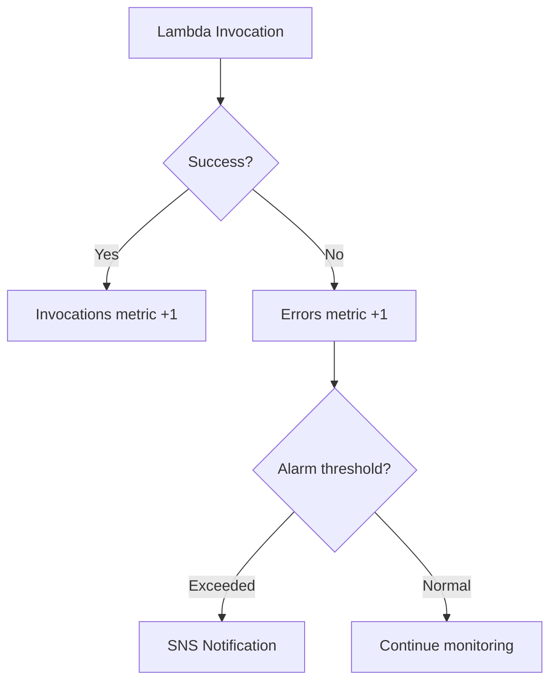

# How to Create CloudWatch Alarms for Lambda Error Rates

Author: [nawazdhandala](https://github.com/nawazdhandala)

Tags: AWS, CloudWatch, Lambda, Alarms, Serverless, Monitoring

Description: Set up CloudWatch alarms to detect Lambda function error rate spikes with proper thresholds, anomaly detection, and multi-metric alerting.

---

Lambda functions fail silently if you are not watching. A function might start throwing errors at 2 AM, and without alarms, you will not know until users complain the next morning. CloudWatch alarms on Lambda error rates are your safety net. They detect when error rates spike and alert your team before the impact spreads.

This guide covers how to create effective alarms for Lambda error rates, from simple threshold alarms to sophisticated anomaly detection and composite alarms.

## Understanding Lambda Error Metrics

Lambda publishes several error-related metrics to CloudWatch:

- **Errors**: The number of invocations that resulted in a function error (your code threw an exception or returned an error)
- **Throttles**: The number of invocations that were throttled because concurrency limits were reached
- **Duration**: How long the function ran (useful for detecting timeouts)
- **ConcurrentExecutions**: How many instances are running simultaneously

For error rate monitoring, you care most about **Errors** and the ratio of errors to total invocations.



## Prerequisites

- One or more Lambda functions deployed
- An SNS topic for notifications
- AWS CLI or Console access

## Step 1: Create a Simple Error Count Alarm

The simplest alarm triggers when the error count exceeds a threshold in a given period.

```bash
# Create an alarm that fires when errors exceed 5 in a 5-minute period
aws cloudwatch put-metric-alarm \
  --alarm-name "my-function-error-count" \
  --alarm-description "Triggers when my-function has more than 5 errors in 5 minutes" \
  --metric-name "Errors" \
  --namespace "AWS/Lambda" \
  --dimensions Name=FunctionName,Value=my-function \
  --statistic "Sum" \
  --period 300 \
  --evaluation-periods 1 \
  --threshold 5 \
  --comparison-operator "GreaterThanThreshold" \
  --alarm-actions "arn:aws:sns:us-east-1:123456789012:lambda-alerts" \
  --ok-actions "arn:aws:sns:us-east-1:123456789012:lambda-alerts" \
  --treat-missing-data "notBreaching"
```

Key configuration choices:

- **treat-missing-data: notBreaching**: If the function is not invoked during a period, treat it as healthy. This prevents false alarms for functions that run on a schedule.
- **ok-actions**: Send a notification when the alarm returns to OK, so your team knows the issue resolved.

## Step 2: Create an Error Rate Alarm Using Math Expressions

A raw error count alarm has a problem: 5 errors out of 10 invocations (50% error rate) is much worse than 5 errors out of 10,000 invocations (0.05% error rate). Use metric math to calculate the error rate as a percentage.

```bash
# Create an error rate alarm using metric math
aws cloudwatch put-metric-alarm \
  --alarm-name "my-function-error-rate" \
  --alarm-description "Triggers when error rate exceeds 5%" \
  --metrics '[
    {
      "Id": "errors",
      "MetricStat": {
        "Metric": {
          "Namespace": "AWS/Lambda",
          "MetricName": "Errors",
          "Dimensions": [{"Name": "FunctionName", "Value": "my-function"}]
        },
        "Period": 300,
        "Stat": "Sum"
      },
      "ReturnData": false
    },
    {
      "Id": "invocations",
      "MetricStat": {
        "Metric": {
          "Namespace": "AWS/Lambda",
          "MetricName": "Invocations",
          "Dimensions": [{"Name": "FunctionName", "Value": "my-function"}]
        },
        "Period": 300,
        "Stat": "Sum"
      },
      "ReturnData": false
    },
    {
      "Id": "error_rate",
      "Expression": "(errors / invocations) * 100",
      "Label": "Error Rate (%)",
      "ReturnData": true
    }
  ]' \
  --evaluation-periods 2 \
  --threshold 5 \
  --comparison-operator "GreaterThanThreshold" \
  --alarm-actions "arn:aws:sns:us-east-1:123456789012:lambda-alerts" \
  --treat-missing-data "notBreaching"
```

This alarm fires when the error rate exceeds 5% for two consecutive 5-minute periods. The two-period evaluation prevents alerting on single transient errors.

## Step 3: Add a Minimum Invocation Guard

An error rate alarm can be misleading for low-traffic functions. If your function gets 2 invocations and 1 fails, that is a 50% error rate. You probably do not want an alert for that. Add a guard that only evaluates the error rate when invocation volume is above a minimum.

```bash
# Error rate alarm with minimum invocation guard
aws cloudwatch put-metric-alarm \
  --alarm-name "my-function-error-rate-guarded" \
  --alarm-description "Error rate above 5% with at least 100 invocations" \
  --metrics '[
    {
      "Id": "errors",
      "MetricStat": {
        "Metric": {
          "Namespace": "AWS/Lambda",
          "MetricName": "Errors",
          "Dimensions": [{"Name": "FunctionName", "Value": "my-function"}]
        },
        "Period": 300,
        "Stat": "Sum"
      },
      "ReturnData": false
    },
    {
      "Id": "invocations",
      "MetricStat": {
        "Metric": {
          "Namespace": "AWS/Lambda",
          "MetricName": "Invocations",
          "Dimensions": [{"Name": "FunctionName", "Value": "my-function"}]
        },
        "Period": 300,
        "Stat": "Sum"
      },
      "ReturnData": false
    },
    {
      "Id": "error_rate",
      "Expression": "IF(invocations > 100, (errors / invocations) * 100, 0)",
      "Label": "Error Rate (guarded)",
      "ReturnData": true
    }
  ]' \
  --evaluation-periods 2 \
  --threshold 5 \
  --comparison-operator "GreaterThanThreshold" \
  --alarm-actions "arn:aws:sns:us-east-1:123456789012:lambda-alerts" \
  --treat-missing-data "notBreaching"
```

The `IF(invocations > 100, ...)` expression returns 0 when invocation count is too low, preventing the alarm from firing on small samples.

## Step 4: Create Anomaly Detection Alarms

For functions with variable traffic patterns (higher during business hours, lower at night), a fixed threshold does not work well. Use CloudWatch anomaly detection, which builds a model of normal behavior and alerts when the error count deviates.

```bash
# Create an anomaly detection alarm for Lambda errors
aws cloudwatch put-metric-alarm \
  --alarm-name "my-function-error-anomaly" \
  --alarm-description "Triggers when errors are anomalously high" \
  --metrics '[
    {
      "Id": "m1",
      "MetricStat": {
        "Metric": {
          "Namespace": "AWS/Lambda",
          "MetricName": "Errors",
          "Dimensions": [{"Name": "FunctionName", "Value": "my-function"}]
        },
        "Period": 300,
        "Stat": "Sum"
      },
      "ReturnData": true
    },
    {
      "Id": "ad1",
      "Expression": "ANOMALY_DETECTION_BAND(m1, 2)",
      "Label": "Anomaly Band",
      "ReturnData": true
    }
  ]' \
  --evaluation-periods 3 \
  --threshold-metric-id "ad1" \
  --comparison-operator "GreaterThanUpperThreshold" \
  --alarm-actions "arn:aws:sns:us-east-1:123456789012:lambda-alerts" \
  --treat-missing-data "notBreaching"
```

The `ANOMALY_DETECTION_BAND(m1, 2)` creates a band with 2 standard deviations. The alarm fires when errors exceed the upper bound of what the model considers normal.

## Step 5: Create a Throttle Alarm

Throttling means your function hit its concurrency limit. This is different from errors but equally important.

```bash
# Alarm for Lambda throttling
aws cloudwatch put-metric-alarm \
  --alarm-name "my-function-throttles" \
  --alarm-description "Triggers when function is being throttled" \
  --metric-name "Throttles" \
  --namespace "AWS/Lambda" \
  --dimensions Name=FunctionName,Value=my-function \
  --statistic "Sum" \
  --period 60 \
  --evaluation-periods 3 \
  --threshold 0 \
  --comparison-operator "GreaterThanThreshold" \
  --alarm-actions "arn:aws:sns:us-east-1:123456789012:lambda-alerts" \
  --treat-missing-data "notBreaching"
```

Any throttle is worth investigating, so the threshold is 0. Three consecutive periods of throttling triggers the alarm.

## Step 6: Create a Composite Alarm

Composite alarms combine multiple alarms into one. This reduces alert noise when multiple things fail at the same time.

```bash
# Composite alarm that fires when BOTH error rate is high AND throttling occurs
aws cloudwatch put-composite-alarm \
  --alarm-name "my-function-critical" \
  --alarm-description "Critical: function has high errors and is being throttled" \
  --alarm-rule 'ALARM("my-function-error-rate") AND ALARM("my-function-throttles")' \
  --alarm-actions "arn:aws:sns:us-east-1:123456789012:critical-alerts"
```

You can also create an OR composite alarm for a general health indicator:

```bash
# Composite alarm: any problem with the function
aws cloudwatch put-composite-alarm \
  --alarm-name "my-function-any-issue" \
  --alarm-description "Function has errors, throttles, or anomalous behavior" \
  --alarm-rule 'ALARM("my-function-error-rate") OR ALARM("my-function-throttles") OR ALARM("my-function-error-anomaly")' \
  --alarm-actions "arn:aws:sns:us-east-1:123456789012:lambda-alerts"
```

## Step 7: Deploy Alarms for All Functions with CloudFormation

If you have many Lambda functions, use CloudFormation with a macro or CDK to generate alarms for each one:

```yaml
# CloudFormation template for Lambda error alarm
Parameters:
  FunctionName:
    Type: String
  AlertTopic:
    Type: String

Resources:
  ErrorRateAlarm:
    Type: AWS::CloudWatch::Alarm
    Properties:
      AlarmName: !Sub "${FunctionName}-error-rate"
      Metrics:
        - Id: errors
          MetricStat:
            Metric:
              Namespace: AWS/Lambda
              MetricName: Errors
              Dimensions:
                - Name: FunctionName
                  Value: !Ref FunctionName
            Period: 300
            Stat: Sum
          ReturnData: false
        - Id: invocations
          MetricStat:
            Metric:
              Namespace: AWS/Lambda
              MetricName: Invocations
              Dimensions:
                - Name: FunctionName
                  Value: !Ref FunctionName
            Period: 300
            Stat: Sum
          ReturnData: false
        - Id: error_rate
          Expression: "IF(invocations > 50, (errors / invocations) * 100, 0)"
          ReturnData: true
      EvaluationPeriods: 2
      Threshold: 5
      ComparisonOperator: GreaterThanThreshold
      AlarmActions:
        - !Ref AlertTopic
      TreatMissingData: notBreaching
```

## Best Practices

**Use evaluation periods wisely**: A single period can trigger on transient blips. Two to three periods catches sustained issues.

**Set meaningful thresholds**: A 1% error rate alarm on a high-volume function fires frequently. A 10% threshold might miss problems. Start at 5% and adjust based on your function's normal behavior.

**Do not forget timeout alarms**: If your function's average duration starts approaching its timeout limit, that is a problem brewing. Create a duration alarm at 80% of the timeout.

**Tag your alarms**: Use tags to organize alarms by team, service, or criticality.

## Wrapping Up

Lambda error rate alarms are the first line of defense for your serverless applications. Start with a simple error rate alarm and evolve to anomaly detection and composite alarms as your maturity grows. For alarms on other AWS services, check out our posts on [CloudWatch alarms for SQS queue backlog](https://oneuptime.com/blog/post/2026-02-12-create-cloudwatch-alarms-for-sqs-queue-backlog/view) and [CloudWatch alarms for ECS service health](https://oneuptime.com/blog/post/2026-02-12-create-cloudwatch-alarms-for-ecs-service-health/view).
