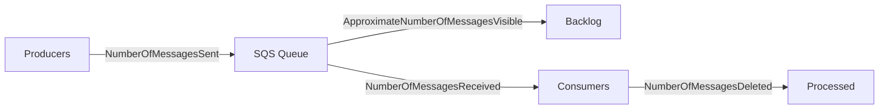

# How to Create CloudWatch Alarms for SQS Queue Backlog

Author: [nawazdhandala](https://github.com/nawazdhandala)

Tags: AWS, CloudWatch, SQS, Alarms, Queue Monitoring, Messaging

Description: Configure CloudWatch alarms to monitor SQS queue backlogs and detect when messages pile up faster than your consumers can process them.

---

An SQS queue backlog is one of those problems that starts small and snowballs. A few hundred messages sitting in the queue might be normal. Ten thousand messages that keep growing means your consumers are falling behind, and if you do not catch it early, you are looking at stale data, violated SLAs, and potentially lost messages when the retention period expires.

CloudWatch alarms on SQS queue metrics are the standard way to catch backlog problems before they become incidents. This guide covers how to set up effective alarms for queue depth, message age, and consumer health.

## Key SQS Metrics to Monitor

SQS publishes several metrics to CloudWatch:

- **ApproximateNumberOfMessagesVisible**: Messages available for consumption (your queue depth)
- **ApproximateNumberOfMessagesNotVisible**: Messages currently being processed (in-flight)
- **ApproximateAgeOfOldestMessage**: Age in seconds of the oldest message in the queue
- **NumberOfMessagesSent**: Messages produced per period
- **NumberOfMessagesReceived**: Messages consumed per period
- **NumberOfMessagesDeleted**: Messages successfully processed per period



The three most important for backlog detection are **ApproximateNumberOfMessagesVisible** (how deep is the queue), **ApproximateAgeOfOldestMessage** (how stale is the oldest message), and the ratio of sent to deleted (are consumers keeping up).

## Prerequisites

- One or more SQS queues deployed
- An SNS topic for alarm notifications
- AWS CLI access

## Step 1: Create a Queue Depth Alarm

The most straightforward alarm triggers when the number of visible messages exceeds a threshold.

```bash
# Alarm when queue depth exceeds 1000 messages
aws cloudwatch put-metric-alarm \
  --alarm-name "order-queue-backlog-high" \
  --alarm-description "Order queue has more than 1000 messages waiting" \
  --metric-name "ApproximateNumberOfMessagesVisible" \
  --namespace "AWS/SQS" \
  --dimensions Name=QueueName,Value=order-processing-queue \
  --statistic "Average" \
  --period 300 \
  --evaluation-periods 3 \
  --threshold 1000 \
  --comparison-operator "GreaterThanThreshold" \
  --alarm-actions "arn:aws:sns:us-east-1:123456789012:sqs-alerts" \
  --ok-actions "arn:aws:sns:us-east-1:123456789012:sqs-alerts" \
  --treat-missing-data "notBreaching"
```

Use three evaluation periods (15 minutes total) to avoid alerting on brief spikes. If your queue normally processes bursts, increase the evaluation periods or raise the threshold.

## Step 2: Create a Message Age Alarm

Queue depth alone does not tell the full story. A queue with 1000 messages that is draining quickly is fine. A queue with 100 messages where the oldest one has been sitting for an hour is a problem. The age metric catches stuck queues.

```bash
# Alarm when the oldest message is more than 30 minutes old
aws cloudwatch put-metric-alarm \
  --alarm-name "order-queue-message-age-high" \
  --alarm-description "Oldest message in the order queue is over 30 minutes old" \
  --metric-name "ApproximateAgeOfOldestMessage" \
  --namespace "AWS/SQS" \
  --dimensions Name=QueueName,Value=order-processing-queue \
  --statistic "Maximum" \
  --period 300 \
  --evaluation-periods 2 \
  --threshold 1800 \
  --comparison-operator "GreaterThanThreshold" \
  --alarm-actions "arn:aws:sns:us-east-1:123456789012:sqs-alerts" \
  --treat-missing-data "notBreaching"
```

The threshold of 1800 seconds (30 minutes) is a starting point. Adjust based on your SLA. If messages need to be processed within 5 minutes, set the threshold to 300.

## Step 3: Create a Consumer Health Alarm

If consumers stop processing messages entirely, both queue depth and message age will grow. But you can detect consumer failures faster by checking if messages are being deleted (deletion happens after successful processing).

```bash
# Alarm when no messages are being deleted (consumers may be down)
aws cloudwatch put-metric-alarm \
  --alarm-name "order-queue-no-consumers" \
  --alarm-description "No messages deleted from order queue - consumers may be down" \
  --metric-name "NumberOfMessagesDeleted" \
  --namespace "AWS/SQS" \
  --dimensions Name=QueueName,Value=order-processing-queue \
  --statistic "Sum" \
  --period 300 \
  --evaluation-periods 3 \
  --threshold 0 \
  --comparison-operator "LessThanOrEqualToThreshold" \
  --alarm-actions "arn:aws:sns:us-east-1:123456789012:sqs-alerts" \
  --treat-missing-data "breaching"
```

Note the `treat-missing-data: breaching` here. If no data points exist, it likely means no messages were deleted, which is exactly the problem we want to catch.

## Step 4: Create a Backlog Growth Rate Alarm

Sometimes you want to know when the backlog is growing, not just when it exceeds a fixed size. Use metric math to calculate the rate of change.

```bash
# Alarm when the queue is growing faster than it is draining
aws cloudwatch put-metric-alarm \
  --alarm-name "order-queue-growing" \
  --alarm-description "Queue backlog is growing: more messages sent than deleted" \
  --metrics '[
    {
      "Id": "sent",
      "MetricStat": {
        "Metric": {
          "Namespace": "AWS/SQS",
          "MetricName": "NumberOfMessagesSent",
          "Dimensions": [{"Name": "QueueName", "Value": "order-processing-queue"}]
        },
        "Period": 300,
        "Stat": "Sum"
      },
      "ReturnData": false
    },
    {
      "Id": "deleted",
      "MetricStat": {
        "Metric": {
          "Namespace": "AWS/SQS",
          "MetricName": "NumberOfMessagesDeleted",
          "Dimensions": [{"Name": "QueueName", "Value": "order-processing-queue"}]
        },
        "Period": 300,
        "Stat": "Sum"
      },
      "ReturnData": false
    },
    {
      "Id": "growth_rate",
      "Expression": "sent - deleted",
      "Label": "Queue Growth Rate",
      "ReturnData": true
    }
  ]' \
  --evaluation-periods 6 \
  --threshold 100 \
  --comparison-operator "GreaterThanThreshold" \
  --alarm-actions "arn:aws:sns:us-east-1:123456789012:sqs-alerts" \
  --treat-missing-data "notBreaching"
```

This alarm fires when more messages are being sent than deleted for 30 consecutive minutes (six 5-minute periods). The threshold of 100 means the net growth must be more than 100 messages per period.

## Step 5: Monitor the Dead Letter Queue

If you have a dead letter queue (DLQ) configured, any message landing there means a processing failure. Even one message in the DLQ deserves attention.

```bash
# Alarm when any message arrives in the dead letter queue
aws cloudwatch put-metric-alarm \
  --alarm-name "order-dlq-has-messages" \
  --alarm-description "Messages are landing in the order processing dead letter queue" \
  --metric-name "ApproximateNumberOfMessagesVisible" \
  --namespace "AWS/SQS" \
  --dimensions Name=QueueName,Value=order-processing-queue-dlq \
  --statistic "Sum" \
  --period 300 \
  --evaluation-periods 1 \
  --threshold 0 \
  --comparison-operator "GreaterThanThreshold" \
  --alarm-actions "arn:aws:sns:us-east-1:123456789012:sqs-alerts" \
  --treat-missing-data "notBreaching"
```

A single evaluation period with a zero threshold means you are alerted as soon as any message hits the DLQ.

## Step 6: Create Tiered Alarms

For production queues, set up multiple alarm tiers so your response matches the severity.

```bash
# Warning: queue depth above 500
aws cloudwatch put-metric-alarm \
  --alarm-name "order-queue-warning" \
  --metric-name "ApproximateNumberOfMessagesVisible" \
  --namespace "AWS/SQS" \
  --dimensions Name=QueueName,Value=order-processing-queue \
  --statistic "Average" \
  --period 300 \
  --evaluation-periods 3 \
  --threshold 500 \
  --comparison-operator "GreaterThanThreshold" \
  --alarm-actions "arn:aws:sns:us-east-1:123456789012:sqs-warnings"

# Critical: queue depth above 5000
aws cloudwatch put-metric-alarm \
  --alarm-name "order-queue-critical" \
  --metric-name "ApproximateNumberOfMessagesVisible" \
  --namespace "AWS/SQS" \
  --dimensions Name=QueueName,Value=order-processing-queue \
  --statistic "Average" \
  --period 300 \
  --evaluation-periods 2 \
  --threshold 5000 \
  --comparison-operator "GreaterThanThreshold" \
  --alarm-actions "arn:aws:sns:us-east-1:123456789012:sqs-critical"
```

The warning goes to a Slack channel. The critical pages the on-call engineer.

## Step 7: Auto-Scale Consumers Based on Queue Depth

Alarms are not just for notifications. You can use them to trigger auto-scaling actions. If your consumers run on ECS or EC2 Auto Scaling groups, scale based on the backlog.

```bash
# Create a scaling policy triggered by queue depth
aws application-autoscaling put-scaling-policy \
  --service-namespace ecs \
  --resource-id service/my-cluster/my-consumer-service \
  --scalable-dimension ecs:service:DesiredCount \
  --policy-name scale-on-queue-depth \
  --policy-type TargetTrackingScaling \
  --target-tracking-scaling-policy-configuration '{
    "TargetValue": 100,
    "CustomizedMetricSpecification": {
      "MetricName": "ApproximateNumberOfMessagesVisible",
      "Namespace": "AWS/SQS",
      "Dimensions": [{"Name": "QueueName", "Value": "order-processing-queue"}],
      "Statistic": "Average"
    },
    "ScaleInCooldown": 300,
    "ScaleOutCooldown": 60
  }'
```

This keeps the queue depth around 100 by automatically scaling consumers up or down.

## Choosing the Right Thresholds

There is no universal threshold that works for every queue. Consider these factors:

- **Normal baseline**: What does your queue depth look like on a normal day? Set the alarm above the peak of normal.
- **Processing SLA**: If messages must be processed within 10 minutes, your age alarm should trigger well before that.
- **Consumer capacity**: How many messages per second can your consumers handle? The threshold should account for burst capacity.
- **Business impact**: A payment processing queue deserves tighter thresholds than a logging queue.

## Wrapping Up

SQS queue backlog alarms are essential for any message-driven architecture. Start with queue depth and message age alarms, then add consumer health and growth rate alarms as you mature. For alarms on other AWS services, see our posts on [CloudWatch alarms for Lambda error rates](https://oneuptime.com/blog/post/2026-02-12-create-cloudwatch-alarms-for-lambda-error-rates/view) and [CloudWatch alarms for ECS service health](https://oneuptime.com/blog/post/2026-02-12-create-cloudwatch-alarms-for-ecs-service-health/view).
