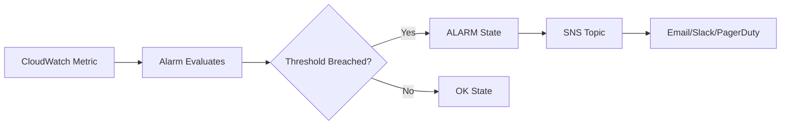

# How to Create CloudWatch Alarms with Terraform

Author: [nawazdhandala](https://github.com/nawazdhandala)

Tags: AWS, CloudWatch, Terraform, Monitoring

Description: A practical guide to creating and managing AWS CloudWatch alarms using Terraform, covering metric alarms, composite alarms, and SNS notifications.

---

CloudWatch alarms are the backbone of AWS monitoring. They watch your metrics, fire when things go sideways, and trigger notifications or automated responses. Managing them through the AWS console works fine for a handful of alarms, but once you're dealing with dozens of services across multiple environments, Terraform becomes essential.

This guide covers everything from basic metric alarms to composite alarms, SNS integrations, and patterns you'll actually use in production.

## The Basics: What CloudWatch Alarms Do

A CloudWatch alarm watches a single metric over a time period you define. When the metric crosses a threshold for a specified number of evaluation periods, the alarm transitions from `OK` to `ALARM` state. You can attach actions to state transitions - most commonly sending an SNS notification that hits a Slack channel or PagerDuty.

Here's the flow:



## Setting Up the Foundation

Before creating alarms, you need an SNS topic for notifications. Most teams have separate topics for different severity levels.

This Terraform configuration creates SNS topics for critical and warning alerts with email subscriptions:

```hcl
resource "aws_sns_topic" "critical_alerts" {
  name = "critical-alerts"

  tags = {
    Environment = "production"
    Severity    = "critical"
  }
}

resource "aws_sns_topic" "warning_alerts" {
  name = "warning-alerts"

  tags = {
    Environment = "production"
    Severity    = "warning"
  }
}

# Subscribe an email endpoint to the critical topic
resource "aws_sns_topic_subscription" "critical_email" {
  topic_arn = aws_sns_topic.critical_alerts.arn
  protocol  = "email"
  endpoint  = "oncall@example.com"
}

resource "aws_sns_topic_subscription" "warning_email" {
  topic_arn = aws_sns_topic.warning_alerts.arn
  protocol  = "email"
  endpoint  = "team@example.com"
}
```

## Creating a Basic Metric Alarm

Let's start with the most common alarm: EC2 CPU utilization. When CPU stays above 80% for 5 minutes, we want to know about it.

This alarm triggers when average CPU utilization exceeds 80% across two consecutive 5-minute evaluation periods:

```hcl
resource "aws_cloudwatch_metric_alarm" "high_cpu" {
  alarm_name          = "high-cpu-utilization"
  comparison_operator = "GreaterThanThreshold"
  evaluation_periods  = 2
  metric_name         = "CPUUtilization"
  namespace           = "AWS/EC2"
  period              = 300  # 5 minutes in seconds
  statistic           = "Average"
  threshold           = 80
  alarm_description   = "CPU utilization exceeded 80% for 10 minutes"

  # Which instance to monitor
  dimensions = {
    InstanceId = "i-0abc123def456789"
  }

  # Actions when alarm triggers
  alarm_actions = [aws_sns_topic.critical_alerts.arn]

  # Actions when alarm returns to OK
  ok_actions = [aws_sns_topic.critical_alerts.arn]

  tags = {
    Environment = "production"
  }
}
```

A few things worth noting here. The `evaluation_periods` of 2 combined with a `period` of 300 seconds means the metric needs to breach the threshold for two consecutive 5-minute windows (10 minutes total) before the alarm fires. This prevents noisy alerts from brief CPU spikes.

## RDS Alarms

Database alarms are critical. You want to catch storage issues, connection saturation, and high CPU before they cause outages.

This set of alarms monitors RDS free storage, CPU, and connection count:

```hcl
# Alert when free storage drops below 5 GB
resource "aws_cloudwatch_metric_alarm" "rds_low_storage" {
  alarm_name          = "rds-low-free-storage"
  comparison_operator = "LessThanThreshold"
  evaluation_periods  = 1
  metric_name         = "FreeStorageSpace"
  namespace           = "AWS/RDS"
  period              = 300
  statistic           = "Average"
  threshold           = 5000000000  # 5 GB in bytes
  alarm_description   = "RDS free storage is below 5 GB"

  dimensions = {
    DBInstanceIdentifier = "production-db"
  }

  alarm_actions = [aws_sns_topic.critical_alerts.arn]
  ok_actions    = [aws_sns_topic.critical_alerts.arn]
}

# Alert when CPU exceeds 90%
resource "aws_cloudwatch_metric_alarm" "rds_high_cpu" {
  alarm_name          = "rds-high-cpu"
  comparison_operator = "GreaterThanThreshold"
  evaluation_periods  = 3
  metric_name         = "CPUUtilization"
  namespace           = "AWS/RDS"
  period              = 300
  statistic           = "Average"
  threshold           = 90
  alarm_description   = "RDS CPU above 90% for 15 minutes"

  dimensions = {
    DBInstanceIdentifier = "production-db"
  }

  alarm_actions = [aws_sns_topic.critical_alerts.arn]
}

# Alert when database connections exceed 80% of max
resource "aws_cloudwatch_metric_alarm" "rds_high_connections" {
  alarm_name          = "rds-high-connections"
  comparison_operator = "GreaterThanThreshold"
  evaluation_periods  = 2
  metric_name         = "DatabaseConnections"
  namespace           = "AWS/RDS"
  period              = 300
  statistic           = "Average"
  threshold           = 400  # Adjust based on your instance class max
  alarm_description   = "RDS connections exceeding safe threshold"

  dimensions = {
    DBInstanceIdentifier = "production-db"
  }

  alarm_actions = [aws_sns_topic.warning_alerts.arn]
}
```

## ALB Alarms

Application Load Balancers generate some of the most actionable metrics. You'll want to watch for elevated error rates and high latency.

These alarms cover HTTP 5xx errors and target response time for an ALB:

```hcl
# Alert on elevated 5xx error count
resource "aws_cloudwatch_metric_alarm" "alb_5xx_errors" {
  alarm_name          = "alb-5xx-errors"
  comparison_operator = "GreaterThanThreshold"
  evaluation_periods  = 2
  metric_name         = "HTTPCode_ELB_5XX_Count"
  namespace           = "AWS/ApplicationELB"
  period              = 60  # Check every minute
  statistic           = "Sum"
  threshold           = 10
  alarm_description   = "ALB returning more than 10 5xx errors per minute"
  treat_missing_data  = "notBreaching"  # No data means no errors

  dimensions = {
    LoadBalancer = "app/my-alb/abc123def456"
  }

  alarm_actions = [aws_sns_topic.critical_alerts.arn]
}

# Alert on high target response time
resource "aws_cloudwatch_metric_alarm" "alb_latency" {
  alarm_name          = "alb-high-latency"
  comparison_operator = "GreaterThanThreshold"
  evaluation_periods  = 3
  metric_name         = "TargetResponseTime"
  namespace           = "AWS/ApplicationELB"
  period              = 60
  statistic           = "Average"
  threshold           = 2  # 2 seconds
  alarm_description   = "ALB target response time above 2 seconds for 3 minutes"
  treat_missing_data  = "notBreaching"

  dimensions = {
    LoadBalancer = "app/my-alb/abc123def456"
  }

  alarm_actions = [aws_sns_topic.warning_alerts.arn]
}
```

Notice the `treat_missing_data` setting. For error count metrics, missing data means zero errors happened, so we treat it as "notBreaching". Without this, you'd get alarms firing during low-traffic periods.

## Composite Alarms

Composite alarms let you combine multiple alarms with boolean logic. They're great for reducing noise - instead of getting paged for every individual alarm, you can create a composite that only fires when multiple things go wrong simultaneously.

This composite alarm only triggers when both CPU and memory alarms are in ALARM state:

```hcl
resource "aws_cloudwatch_composite_alarm" "service_degraded" {
  alarm_name = "service-degraded-composite"

  alarm_rule = "ALARM(${aws_cloudwatch_metric_alarm.high_cpu.alarm_name}) AND ALARM(${aws_cloudwatch_metric_alarm.rds_high_cpu.alarm_name})"

  alarm_actions = [aws_sns_topic.critical_alerts.arn]
  ok_actions    = [aws_sns_topic.critical_alerts.arn]

  alarm_description = "Both application CPU and database CPU are elevated"
}
```

## Using Dynamic Blocks for Multiple Instances

When you've got a fleet of EC2 instances or multiple RDS databases, you don't want to copy-paste alarm definitions. Terraform's `for_each` handles this nicely.

This pattern creates identical CPU alarms for every instance in a list:

```hcl
variable "monitored_instances" {
  type = map(string)
  default = {
    "web-1"    = "i-0abc123def456789a"
    "web-2"    = "i-0abc123def456789b"
    "worker-1" = "i-0abc123def456789c"
  }
}

resource "aws_cloudwatch_metric_alarm" "instance_cpu" {
  for_each = var.monitored_instances

  alarm_name          = "high-cpu-${each.key}"
  comparison_operator = "GreaterThanThreshold"
  evaluation_periods  = 2
  metric_name         = "CPUUtilization"
  namespace           = "AWS/EC2"
  period              = 300
  statistic           = "Average"
  threshold           = 80
  alarm_description   = "High CPU on ${each.key}"

  dimensions = {
    InstanceId = each.value
  }

  alarm_actions = [aws_sns_topic.warning_alerts.arn]
}
```

## Anomaly Detection Alarms

Standard threshold-based alarms work for metrics with predictable ranges (like CPU percentage), but for metrics like request counts that vary by time of day, anomaly detection is more useful.

This alarm uses CloudWatch anomaly detection to flag unusual API request patterns:

```hcl
resource "aws_cloudwatch_metric_alarm" "api_anomaly" {
  alarm_name          = "api-request-anomaly"
  comparison_operator = "GreaterThanUpperThreshold"
  evaluation_periods  = 2
  threshold_metric_id = "ad1"
  alarm_description   = "API request count is anomalously high"

  metric_query {
    id          = "ad1"
    expression  = "ANOMALY_DETECTION_BAND(m1, 2)"
    label       = "Request Count (Expected)"
    return_data = true
  }

  metric_query {
    id = "m1"
    metric {
      metric_name = "RequestCount"
      namespace   = "AWS/ApplicationELB"
      period      = 300
      stat        = "Sum"

      dimensions = {
        LoadBalancer = "app/my-alb/abc123def456"
      }
    }
    return_data = true
  }

  alarm_actions = [aws_sns_topic.warning_alerts.arn]
}
```

## Best Practices

**Don't alarm on everything.** Focus on metrics that indicate user-facing impact. CPU at 80% might not matter if response times are fine.

**Use appropriate evaluation periods.** Single-period alarms are noisy. Most alarms should require 2-3 consecutive breaches before firing.

**Set `treat_missing_data` intentionally.** The default is `missing`, which can cause confusing behavior. Use `notBreaching` for error count metrics and `breaching` for health check metrics.

**Tag your alarms consistently.** When you've got 200 alarms, you'll thank yourself for adding environment, team, and service tags.

For a broader look at monitoring strategy beyond just CloudWatch, check out our post on [AWS monitoring best practices](https://oneuptime.com/blog/post/2026-02-12-logging-monitoring-best-practices-aws/view).

## Wrapping Up

CloudWatch alarms in Terraform give you version-controlled, repeatable monitoring that scales with your infrastructure. Start with the critical metrics for each service type, use `for_each` to avoid repetition, and lean on composite alarms to reduce alert fatigue. The configurations in this guide should cover the most common scenarios, but don't hesitate to customize thresholds based on your application's actual behavior patterns.
