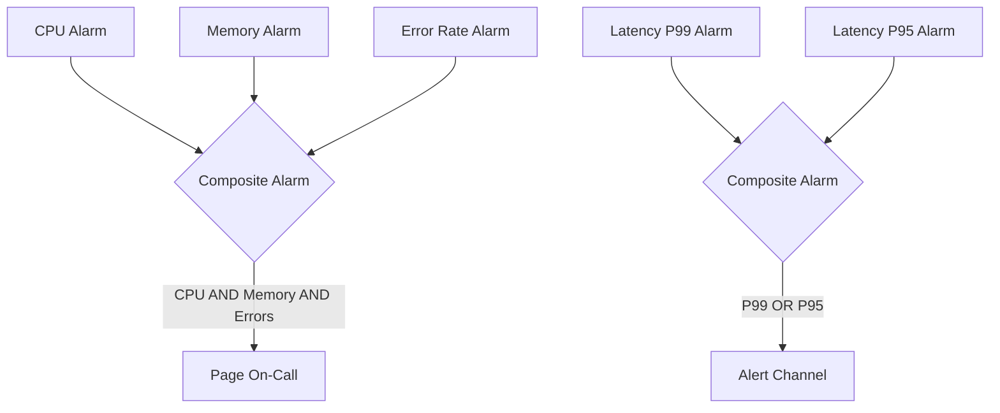

# How to Create CloudWatch Composite Alarms

Author: [nawazdhandala](https://github.com/nawazdhandala)

Tags: AWS, CloudWatch, Monitoring, Alerting, DevOps

Description: Learn how to create CloudWatch composite alarms that combine multiple metric alarms into intelligent alert conditions, reducing noise and improving incident response.

---

Individual CloudWatch alarms are great for tracking specific metrics, but they can create a lot of noise. When your database slows down, you might get separate alerts for high latency, high CPU, connection count spikes, and replica lag - all at the same time, all pointing to the same root cause. Your on-call engineer gets paged four times for one problem.

Composite alarms solve this by combining multiple alarms into a single, higher-level alarm that fires based on logical conditions. Instead of four separate alerts, you get one that says "the database is having problems" and lets the engineer investigate from there.

## How Composite Alarms Work

A composite alarm doesn't watch metrics directly. Instead, it watches other alarms and uses a rule expression (AND, OR, NOT) to determine its own state.



The composite alarm evaluates its rule expression whenever any of its child alarms change state. It then transitions to ALARM, OK, or INSUFFICIENT_DATA based on the result.

## Creating Your First Composite Alarm

Let's say you have a web service with three individual alarms:

```bash
# Alarm 1: High CPU
aws cloudwatch put-metric-alarm \
  --alarm-name "api-high-cpu" \
  --namespace "AWS/ECS" \
  --metric-name CPUUtilization \
  --dimensions Name=ClusterName,Value=production Name=ServiceName,Value=api \
  --statistic Average \
  --period 300 \
  --threshold 80 \
  --comparison-operator GreaterThanThreshold \
  --evaluation-periods 2

# Alarm 2: High Memory
aws cloudwatch put-metric-alarm \
  --alarm-name "api-high-memory" \
  --namespace "AWS/ECS" \
  --metric-name MemoryUtilization \
  --dimensions Name=ClusterName,Value=production Name=ServiceName,Value=api \
  --statistic Maximum \
  --period 300 \
  --threshold 85 \
  --comparison-operator GreaterThanThreshold \
  --evaluation-periods 2

# Alarm 3: High Error Rate
aws cloudwatch put-metric-alarm \
  --alarm-name "api-high-errors" \
  --namespace "AWS/ApplicationELB" \
  --metric-name HTTPCode_Target_5XX_Count \
  --dimensions Name=LoadBalancer,Value=app/api-alb/abc123 \
  --statistic Sum \
  --period 300 \
  --threshold 50 \
  --comparison-operator GreaterThanThreshold \
  --evaluation-periods 1
```

Now create a composite alarm that fires only when the service is both resource-constrained AND producing errors:

```bash
# Composite alarm: resource pressure + errors = real problem
aws cloudwatch put-composite-alarm \
  --alarm-name "api-service-degraded" \
  --alarm-description "API service is degraded - high resource usage combined with errors" \
  --alarm-rule 'ALARM("api-high-errors") AND (ALARM("api-high-cpu") OR ALARM("api-high-memory"))' \
  --alarm-actions "arn:aws:sns:us-east-1:123456789012:critical-alerts" \
  --ok-actions "arn:aws:sns:us-east-1:123456789012:critical-alerts"
```

The rule expression says: trigger the composite alarm when there are errors AND either CPU or memory is high. This way:

- High CPU alone? No page. It might be a traffic spike that autoscaling will handle.
- High errors alone? No page through the composite (though you might still have a separate alert for this).
- High CPU AND high errors? That's a real problem. Page the engineer.

## Rule Expression Syntax

The rule language supports these operators:

| Operator | Description | Example |
|----------|-------------|---------|
| ALARM() | True when the named alarm is in ALARM state | `ALARM("my-alarm")` |
| OK() | True when the named alarm is in OK state | `OK("my-alarm")` |
| INSUFFICIENT_DATA() | True when the alarm has insufficient data | `INSUFFICIENT_DATA("my-alarm")` |
| AND | Logical AND | `ALARM("a") AND ALARM("b")` |
| OR | Logical OR | `ALARM("a") OR ALARM("b")` |
| NOT | Logical NOT | `NOT ALARM("a")` |
| TRUE | Always true | Used for testing |
| FALSE | Always false | Used for testing |

You can build complex expressions with parentheses:

```bash
# Complex rule: either both resource alarms are firing,
# or errors are firing regardless of resources
'(ALARM("cpu") AND ALARM("memory")) OR ALARM("critical-errors")'
```

## Practical Use Cases

### Application Health Composite

Create a single "application health" alarm from multiple signals:

```bash
# Individual alarms (create these first)
# api-latency-high, api-errors-high, api-hosts-low, api-cpu-high

# Composite: Application is unhealthy
aws cloudwatch put-composite-alarm \
  --alarm-name "app-unhealthy" \
  --alarm-rule '
    ALARM("api-errors-high") OR
    ALARM("api-hosts-low") OR
    (ALARM("api-latency-high") AND ALARM("api-cpu-high"))
  ' \
  --alarm-actions "arn:aws:sns:us-east-1:123456789012:pagerduty"
```

### Database Health Composite

Combine database metrics into a single indicator:

```bash
# Individual alarms
# db-cpu-high, db-connections-high, db-replica-lag, db-storage-low

# Composite: Database needs attention
aws cloudwatch put-composite-alarm \
  --alarm-name "database-degraded" \
  --alarm-rule '
    ALARM("db-storage-low") OR
    (ALARM("db-cpu-high") AND ALARM("db-connections-high")) OR
    ALARM("db-replica-lag")
  ' \
  --alarm-actions "arn:aws:sns:us-east-1:123456789012:dba-alerts"
```

Storage running low is always critical. High CPU with high connections suggests the database is overloaded. Replica lag might indicate replication issues. Any of these conditions means someone needs to look at the database.

### Tiered Alerting

Use composites to create alert severity tiers:

```bash
# Warning: something is off but not critical
aws cloudwatch put-composite-alarm \
  --alarm-name "service-warning" \
  --alarm-rule '
    ALARM("api-latency-high") OR
    ALARM("api-cpu-high") OR
    ALARM("api-memory-high")
  ' \
  --alarm-actions "arn:aws:sns:us-east-1:123456789012:slack-warnings"

# Critical: user-facing impact, page someone
aws cloudwatch put-composite-alarm \
  --alarm-name "service-critical" \
  --alarm-rule '
    ALARM("api-errors-high") OR
    ALARM("api-hosts-low") OR
    (ALARM("api-latency-high") AND ALARM("api-errors-high"))
  ' \
  --alarm-actions "arn:aws:sns:us-east-1:123456789012:pagerduty"
```

The warning goes to Slack. The critical page goes to PagerDuty. Different signal, different response.

### Suppression During Maintenance

You can use composite alarms to suppress alerts during planned maintenance:

```bash
# Create a "maintenance mode" alarm that you manually set
aws cloudwatch put-metric-alarm \
  --alarm-name "maintenance-mode" \
  --namespace "Custom/Ops" \
  --metric-name MaintenanceMode \
  --statistic Maximum \
  --period 60 \
  --threshold 0.5 \
  --comparison-operator GreaterThanThreshold \
  --evaluation-periods 1 \
  --treat-missing-data notBreaching

# Composite: only alert if NOT in maintenance mode
aws cloudwatch put-composite-alarm \
  --alarm-name "service-alert-with-suppression" \
  --alarm-rule '
    NOT ALARM("maintenance-mode") AND ALARM("service-critical")
  ' \
  --alarm-actions "arn:aws:sns:us-east-1:123456789012:pagerduty"
```

Before starting maintenance, push a metric value of 1 to the `MaintenanceMode` metric. This suppresses the critical alerts. When maintenance is done, the metric naturally returns to 0 (or treat-missing-data handles it), and alerting resumes.

## Nesting Composite Alarms

Composite alarms can reference other composite alarms, allowing you to build hierarchical monitoring:

```bash
# Level 1: Individual service composites
aws cloudwatch put-composite-alarm \
  --alarm-name "api-service-health" \
  --alarm-rule 'ALARM("api-errors") OR ALARM("api-latency")'

aws cloudwatch put-composite-alarm \
  --alarm-name "worker-service-health" \
  --alarm-rule 'ALARM("worker-queue-depth") OR ALARM("worker-errors")'

# Level 2: Overall system health
aws cloudwatch put-composite-alarm \
  --alarm-name "system-health" \
  --alarm-rule 'ALARM("api-service-health") OR ALARM("worker-service-health") OR ALARM("database-degraded")' \
  --alarm-actions "arn:aws:sns:us-east-1:123456789012:leadership-alerts"
```

The nesting limit is 5 levels deep, which is more than enough for most architectures.

## CloudFormation Example

Here's the complete setup as CloudFormation:

```yaml
Resources:
  CPUAlarm:
    Type: AWS::CloudWatch::Alarm
    Properties:
      AlarmName: api-high-cpu
      Namespace: AWS/ECS
      MetricName: CPUUtilization
      Dimensions:
        - Name: ClusterName
          Value: production
        - Name: ServiceName
          Value: api
      Statistic: Average
      Period: 300
      Threshold: 80
      ComparisonOperator: GreaterThanThreshold
      EvaluationPeriods: 2

  ErrorAlarm:
    Type: AWS::CloudWatch::Alarm
    Properties:
      AlarmName: api-high-errors
      Namespace: AWS/ApplicationELB
      MetricName: HTTPCode_Target_5XX_Count
      Dimensions:
        - Name: LoadBalancer
          Value: app/api-alb/abc123
      Statistic: Sum
      Period: 300
      Threshold: 50
      ComparisonOperator: GreaterThanThreshold
      EvaluationPeriods: 1

  ServiceDegradedAlarm:
    Type: AWS::CloudWatch::CompositeAlarm
    Properties:
      AlarmName: api-service-degraded
      AlarmRule: !Sub 'ALARM("${CPUAlarm}") AND ALARM("${ErrorAlarm}")'
      AlarmActions:
        - !Ref AlertTopic
      OKActions:
        - !Ref AlertTopic
```

## Best Practices

1. **Don't over-nest.** Two levels of composition is usually enough. More than that becomes hard to debug when something fires.

2. **Document your alarm rules.** Use the `alarm-description` field to explain why the combination matters. When someone gets paged at 2 AM, they should understand what the composite alarm means without looking at the source.

3. **Keep individual alarms too.** Composite alarms add intelligence, but don't remove the underlying alarms. You still want to see individual metric state on your dashboards.

4. **Test the logic.** Temporarily set child alarms to ALARM state (by lowering thresholds) and verify the composite fires as expected.

5. **Use OK actions.** Getting a "resolved" notification is just as important as getting the initial alert. It confirms the problem is fixed.

## Wrapping Up

Composite alarms transform a collection of noisy metric alerts into meaningful operational signals. Instead of five separate alerts during an incident, you get one alert that tells you the system is degraded and points you in the right direction.

Start by identifying your most common alert storms - incidents where multiple alarms fire simultaneously. Those are your first candidates for composite alarms. For more on the individual metrics that feed into these alarms, see our guide on [creating CloudWatch metric alarms](https://oneuptime.com/blog/post/2026-02-12-create-cloudwatch-metric-alarms/view). And for ML-powered anomaly detection, check out [CloudWatch anomaly detection for alarms](https://oneuptime.com/blog/post/2026-02-12-cloudwatch-anomaly-detection-alarms/view).
