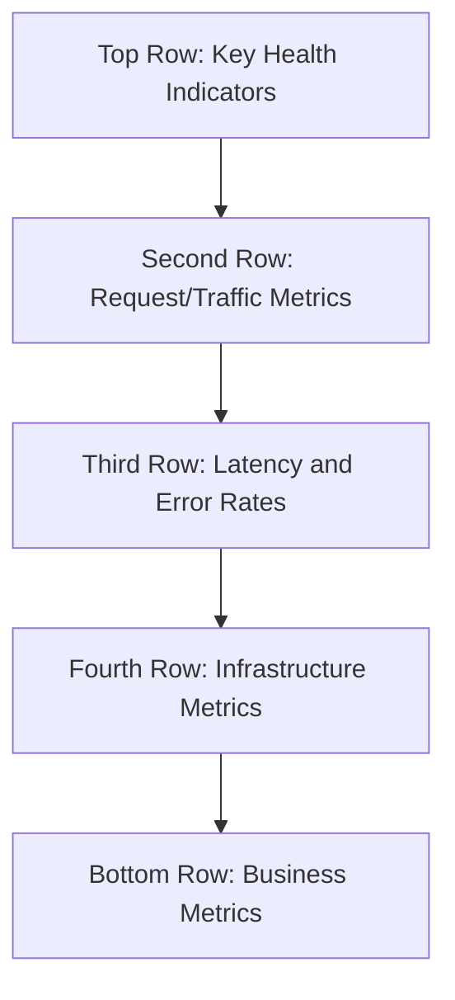

# How to Create CloudWatch Dashboards for Application Monitoring

Author: [nawazdhandala](https://github.com/nawazdhandala)

Tags: AWS, CloudWatch, Dashboards, Monitoring, Observability

Description: A practical guide to building CloudWatch dashboards that give you real-time visibility into your application health, performance, and business metrics.

---

CloudWatch dashboards are the central place where you bring all your AWS monitoring data together into a single view. Whether you're tracking Lambda invocations, EC2 instance health, RDS query performance, or custom application metrics, dashboards let you see everything at a glance without jumping between different AWS console pages.

In this guide, we'll build a real-world application monitoring dashboard from scratch. We'll cover the console approach, the CLI/infrastructure-as-code approach, and share some patterns that work well for production systems.

## Planning Your Dashboard Layout

Before you start clicking buttons, think about what story your dashboard should tell. A good monitoring dashboard answers a few core questions: Is the application healthy right now? Is it performing well? Are there any trends I should worry about?

A common layout follows this pattern:



The idea is that someone looking at the dashboard should be able to assess overall health in the first few seconds, then drill deeper as needed.

## Creating a Dashboard via the Console

The fastest way to get started is through the AWS Console.

1. Navigate to CloudWatch in the AWS Console.
2. Click "Dashboards" in the left sidebar.
3. Click "Create dashboard."
4. Give it a name like `my-app-production`.
5. You'll be prompted to add your first widget.

CloudWatch offers several widget types: line graphs, stacked area charts, numbers (single value), gauges, bar charts, pie charts, text widgets (for labels and documentation), log tables, and alarm status widgets.

For a quick health overview, start with a few number widgets showing current values, then add line charts for trends.

## Creating a Dashboard with the AWS CLI

For repeatable setups, define your dashboard as JSON and create it via the CLI. Here's an example that sets up a basic application monitoring dashboard:

```bash
# Create a dashboard with a JSON body definition
aws cloudwatch put-dashboard \
  --dashboard-name "my-app-production" \
  --dashboard-body file://dashboard.json
```

The dashboard body JSON looks like this:

```json
{
  "widgets": [
    {
      "type": "metric",
      "x": 0,
      "y": 0,
      "width": 6,
      "height": 6,
      "properties": {
        "metrics": [
          ["AWS/ApplicationELB", "RequestCount", "LoadBalancer", "app/my-alb/1234567890",
            { "stat": "Sum", "period": 300 }]
        ],
        "title": "Total Requests (5 min)",
        "view": "timeSeries",
        "region": "us-east-1"
      }
    },
    {
      "type": "metric",
      "x": 6,
      "y": 0,
      "width": 6,
      "height": 6,
      "properties": {
        "metrics": [
          ["AWS/ApplicationELB", "HTTPCode_Target_5XX_Count", "LoadBalancer", "app/my-alb/1234567890",
            { "stat": "Sum", "period": 300, "color": "#d62728" }]
        ],
        "title": "5XX Errors",
        "view": "timeSeries",
        "region": "us-east-1"
      }
    },
    {
      "type": "metric",
      "x": 12,
      "y": 0,
      "width": 6,
      "height": 6,
      "properties": {
        "metrics": [
          ["AWS/ApplicationELB", "TargetResponseTime", "LoadBalancer", "app/my-alb/1234567890",
            { "stat": "p99", "period": 300, "color": "#ff7f0e" }],
          ["AWS/ApplicationELB", "TargetResponseTime", "LoadBalancer", "app/my-alb/1234567890",
            { "stat": "p50", "period": 300, "color": "#2ca02c" }]
        ],
        "title": "Response Time (p50 vs p99)",
        "view": "timeSeries",
        "region": "us-east-1"
      }
    }
  ]
}
```

Each widget has an `x`, `y` position on a 24-column grid, along with a `width` and `height`. This grid system lets you control the layout precisely.

## Creating a Dashboard with CloudFormation

For infrastructure-as-code, use CloudFormation or Terraform. Here's a CloudFormation example:

```yaml
Resources:
  AppDashboard:
    Type: AWS::CloudWatch::Dashboard
    Properties:
      DashboardName: my-app-production
      DashboardBody: !Sub |
        {
          "widgets": [
            {
              "type": "text",
              "x": 0,
              "y": 0,
              "width": 24,
              "height": 1,
              "properties": {
                "markdown": "# My Application - Production Dashboard\nLast deployed: check CI/CD pipeline for details"
              }
            },
            {
              "type": "metric",
              "x": 0,
              "y": 1,
              "width": 8,
              "height": 6,
              "properties": {
                "metrics": [
                  ["AWS/ECS", "CPUUtilization", "ServiceName", "my-api-service", "ClusterName", "prod-cluster"]
                ],
                "title": "ECS CPU Utilization",
                "period": 300,
                "stat": "Average",
                "region": "${AWS::Region}",
                "view": "timeSeries"
              }
            },
            {
              "type": "metric",
              "x": 8,
              "y": 1,
              "width": 8,
              "height": 6,
              "properties": {
                "metrics": [
                  ["AWS/ECS", "MemoryUtilization", "ServiceName", "my-api-service", "ClusterName", "prod-cluster"]
                ],
                "title": "ECS Memory Utilization",
                "period": 300,
                "stat": "Average",
                "region": "${AWS::Region}",
                "view": "timeSeries"
              }
            },
            {
              "type": "alarm",
              "x": 16,
              "y": 1,
              "width": 8,
              "height": 6,
              "properties": {
                "title": "Alarm Status",
                "alarms": [
                  "arn:aws:cloudwatch:${AWS::Region}:${AWS::AccountId}:alarm:HighCPU",
                  "arn:aws:cloudwatch:${AWS::Region}:${AWS::AccountId}:alarm:High5xxRate",
                  "arn:aws:cloudwatch:${AWS::Region}:${AWS::AccountId}:alarm:HighLatency"
                ]
              }
            }
          ]
        }
```

## Adding Custom Metric Widgets

If you're publishing custom metrics (covered in our [custom metrics guide](https://oneuptime.com/blog/post/2026-02-12-publish-custom-cloudwatch-metrics/view)), you can add them to dashboards the same way:

```json
{
  "type": "metric",
  "x": 0,
  "y": 7,
  "width": 12,
  "height": 6,
  "properties": {
    "metrics": [
      ["MyApp/Production", "OrdersProcessed", "Environment", "prod",
        { "stat": "Sum", "period": 300 }],
      ["MyApp/Production", "OrdersFailed", "Environment", "prod",
        { "stat": "Sum", "period": 300, "color": "#d62728" }]
    ],
    "title": "Orders Processed vs Failed",
    "view": "timeSeries",
    "region": "us-east-1",
    "yAxis": { "left": { "min": 0 } }
  }
}
```

## Adding Log Widgets

You can embed CloudWatch Logs Insights queries directly in your dashboard. This is great for showing recent errors or slow requests:

```json
{
  "type": "log",
  "x": 0,
  "y": 13,
  "width": 24,
  "height": 6,
  "properties": {
    "query": "SOURCE '/aws/lambda/my-api-function'\n| filter @message like /ERROR/\n| fields @timestamp, @message\n| sort @timestamp desc\n| limit 20",
    "region": "us-east-1",
    "title": "Recent Errors",
    "view": "table"
  }
}
```

## Using Metric Math

One of the most powerful features of CloudWatch dashboards is metric math. You can create derived metrics that combine or transform raw metrics. For example, calculating an error rate percentage:

```json
{
  "type": "metric",
  "x": 0,
  "y": 19,
  "width": 12,
  "height": 6,
  "properties": {
    "metrics": [
      ["AWS/ApplicationELB", "HTTPCode_Target_5XX_Count", "LoadBalancer", "app/my-alb/1234567890",
        { "id": "errors", "stat": "Sum", "period": 300, "visible": false }],
      ["AWS/ApplicationELB", "RequestCount", "LoadBalancer", "app/my-alb/1234567890",
        { "id": "total", "stat": "Sum", "period": 300, "visible": false }],
      [{ "expression": "(errors / total) * 100", "label": "Error Rate %", "id": "errorRate", "color": "#d62728" }]
    ],
    "title": "Error Rate (%)",
    "view": "timeSeries",
    "region": "us-east-1",
    "yAxis": { "left": { "min": 0, "max": 100 } }
  }
}
```

The `visible: false` flag hides the raw metrics and only shows the computed expression.

## Dashboard Best Practices

After building many dashboards, here are patterns that consistently work well:

**Use text widgets as section headers.** A dashboard with 20+ widgets becomes confusing fast. Break it into logical sections with text widgets that explain what each section shows.

**Set appropriate time ranges.** Not every widget needs the same time window. High-level health indicators might show the last hour, while capacity planning charts might show the last 2 weeks.

**Include an alarm status widget.** Put it near the top so you can see at a glance if anything is in alarm state.

**Add annotations for deployments.** If you track deployment times, add horizontal or vertical annotations to your charts so you can correlate changes with metric behavior.

**Keep it to one screen.** The most effective dashboards fit on a single screen. If you need more space, create multiple dashboards - one for each service or layer.

## Automatic Dashboard Refresh

CloudWatch dashboards auto-refresh at configurable intervals (10 seconds, 1 minute, 2 minutes, 5 minutes, 15 minutes, or 1 hour). For an ops dashboard displayed on a wall monitor, set it to 1-minute refresh. For dashboards you check occasionally, the default is fine.

## Wrapping Up

A well-designed CloudWatch dashboard turns raw metrics into actionable information. Start with the most critical health indicators, layer in performance and business metrics, and iterate as you learn what's actually useful. For more on the widgets and variables you can use, check out our guide on [CloudWatch dashboard widgets and variables](https://oneuptime.com/blog/post/2026-02-12-cloudwatch-dashboard-widgets-variables/view). And if you need to share dashboards across teams in different accounts, take a look at [sharing CloudWatch dashboards across accounts](https://oneuptime.com/blog/post/2026-02-12-share-cloudwatch-dashboards-across-accounts/view).
